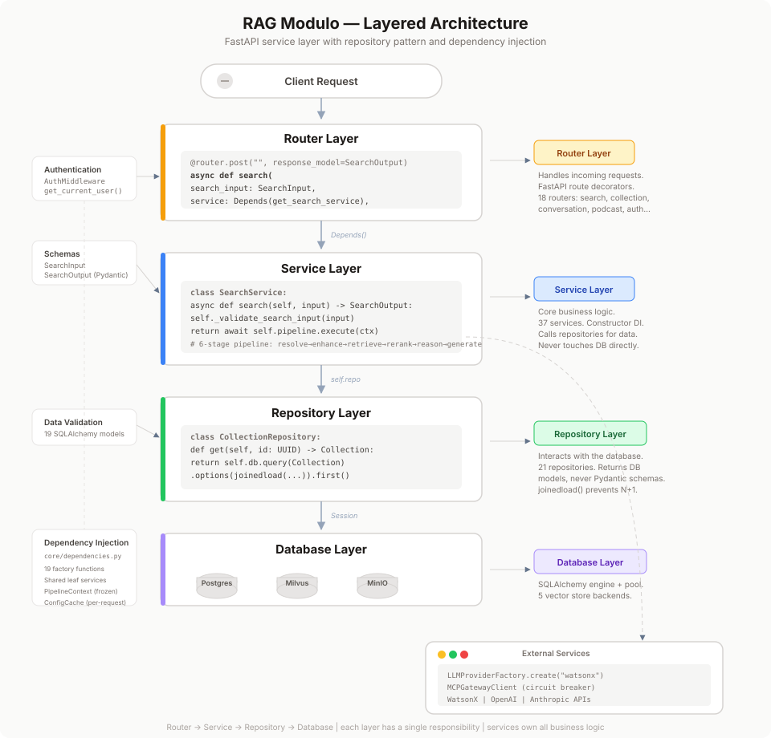
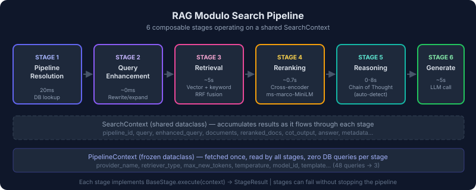
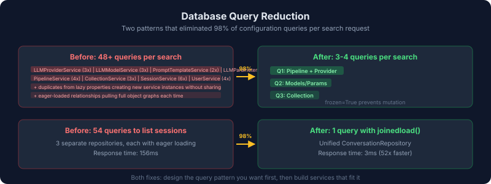

# RAG Modulo: Architecture Decisions, Performance Patterns, and What I'd Do Differently

*22 months of building a modular RAG platform (May 2024 – March 2026). 1,934 commits, 2,615 tests, 36 services, 5 vector database backends, 3 LLM providers.*



For the blog-level narrative (AI agent war stories, PR analysis, gitnapped stats), see [the archive blog article](blog-rag-modulo-learnings.md). This document focuses on architecture and engineering patterns.

---

## 1. Architecture Decisions That Paid Off

### The service/repository/router layering was worth the discipline

Every feature follows the same pattern: router (thin HTTP layer) -> service (business logic) -> repository (data access). It felt like boilerplate early on, but it made the later phases of consolidation and optimization possible. When I re-architected the search pipeline from the ground up (Phase 2, ~Nov 2024), the blast radius was contained because each layer had clear boundaries. When I optimized DI and eliminated cascading database queries in early 2026, I could change service wiring without touching routers or repositories.

**The lesson**: Layered architecture isn't exciting, but it's what lets you do exciting things later without rewriting everything.

### Multi-vector-database abstraction was the right bet

Supporting Milvus, Elasticsearch, Pinecone, Weaviate, and ChromaDB through a common `VectorStore` base class with a factory pattern meant we could swap backends without touching search logic. In practice, Milvus was the primary backend, but having the abstraction forced clean separation between "how we search" and "where we search." When Milvus needed connection reuse fixes for Kubernetes, only `milvus_store.py` changed.

**The lesson**: Abstract over infrastructure boundaries, not business logic. The vector store abstraction was worth it because vector DBs are genuinely interchangeable. Don't abstract things that aren't.

### Pipeline stages as composable units



The search pipeline evolved from a monolithic `SearchService.search()` method into a pipeline executor running discrete stages: PipelineResolution -> QueryEnhancement -> Retrieval -> Reranking -> Reasoning -> Generation. Each stage implements `BaseStage` and operates on a shared `SearchContext`. This made it trivial to add Chain of Thought reasoning as a new stage without touching retrieval or generation logic.

**The lesson**: If your system has a clear sequential flow (query -> retrieve -> rerank -> generate), model it as a pipeline. But wait until you actually have multiple stages — I did this refactor after the search flow was well-understood, not speculatively.

---

## 2. Architecture Decisions That Didn't

### Service count grew faster than complexity warranted

36 service files. Some — like `SearchService`, `ChainOfThoughtService`, `PipelineService` — carry real weight. Others emerged because I followed the pattern too rigidly. `LLMParametersService`, `LLMModelService`, `LLMProviderService`, and `PromptTemplateService` are four services that exist primarily to CRUD config tables. They could have been one `LLMConfigService` without loss of clarity, and the dependency graph would have been much simpler.

**The lesson**: Patterns are tools, not rules. A service-per-table convention sounds clean but creates a web of dependencies that makes initialization expensive and testing painful. Group by domain concept, not by database table.

### Constructor-based DI without a container

All services take their dependencies through constructors, which is good for testability. But without a proper DI container, wiring happens manually in `core/dependencies.py` and in orchestrator factories. This led to cascading lazy-init queries — constructing one service would trigger construction of three others, each hitting the database to load config. I eventually built `ConfigCache` (request-scoped) and `PipelineContext` (single composite query) to band-aid the problem.

**The lesson**: Constructor injection is the right pattern, but if you have more than ~10 services, invest in a proper DI container (like `dependency-injector` for Python) early. The manual wiring cost compounds.

### Circular import management became a tax

`SearchService` needs `ChainOfThoughtService` which needs `SearchService` (to do sub-queries during reasoning). This required `TYPE_CHECKING` guards, string annotations, and careful import ordering throughout the codebase. It's a code smell that I never fully resolved — it signals that the boundary between search and reasoning isn't clean enough.

**The lesson**: If two services need each other, one of them probably isn't a service — it's a strategy or callback. I should have had `ChainOfThoughtService` accept a search *function*, not the whole `SearchService`.

---

## 3. Things That Were Harder Than Expected

### Chain of Thought reasoning

CoT looked straightforward in theory: decompose a complex question into sub-questions, search for each, synthesize. In practice:

- **Question classification** had to distinguish "What is X?" (simple, skip CoT) from "Compare X and Y across dimensions A, B, C" (complex, use CoT). Getting this right took multiple iterations. At one point, CoT was triggering on *every* query, adding ~8 seconds of latency for no benefit.
- **Sub-question synthesis** is where quality lives or dies. Each sub-question gets its own retrieval, but the final answer needs to weave them together coherently while citing sources correctly. The `AnswerSynthesizer` went through several rewrites.
- **Structured output** from LLMs (question decomposition, classification) required XML-based parsing with retry logic, not just "ask the LLM and hope." Each provider handles this differently: OpenAI has native JSON schema mode with strict validation, Anthropic uses tool use constraints (you define a tool schema and force the model to "call" it), and WatsonX requires guided JSON parameters plus multi-strategy extraction fallbacks (direct parse, balanced braces, regex). Three implementations of the same concept.

**The lesson**: CoT is a feature that's 20% retrieval engineering and 80% prompt engineering and output parsing. Budget accordingly. And make it opt-in with good auto-detection, not always-on.

### Performance optimization was a late-stage surprise

The system worked fine in development but revealed performance issues under load:

- **N+1 query patterns**: Constructing the service graph for a single search request triggered 15+ database queries across providers, models, templates, parameters, and pipeline configs. The `PipelineContext` dataclass (a frozen, read-only config snapshot fetched in one composite query) was the breakthrough fix.
- **Session management**: SQLAlchemy sessions were being created at multiple levels. Passing the session from the router through to the orchestrator (instead of each service creating its own) was a simple fix with outsized impact.
- **Eager vs. lazy loading**: SQLAlchemy relationship loading strategy mattered more than expected. Switching Collection and Pipeline models from eager to lazy loading fixed unnecessary joins.

**The lesson**: Profile before you optimize, but also *design* for the database query pattern you want. If every service independently fetches its own config, you'll get N+1 by construction. The `PipelineContext` pattern (one fat query, frozen snapshot threaded through) should have been the design from day one.

### Multi-LLM provider support

Supporting WatsonX, OpenAI, and Anthropic through a common `LLMBase` interface was architecturally clean but operationally messy:

- Each provider has different authentication patterns (API key vs. project ID + API key vs. IAM token).
- Structured output support varies dramatically. WatsonX needed XML parsing with `json-repair`; OpenAI has native JSON mode; Anthropic has tool use.
- Token counting, rate limiting, and error shapes are all different.
- Testing required mocking three different client libraries with three different response shapes.

**The lesson**: Provider abstraction is necessary but won't save you from per-provider complexity. Budget for per-provider edge cases in testing, error handling, and structured output. The factory pattern works well here — just accept that each factory product has its own quirks.

---

## 4. What Worked in the Development Process

### Phased refactoring with numbered phases

The conversation system consolidation (Phases 1-7) and the search architecture redesign were both executed as explicitly numbered phases with their own GitHub issues. This made it possible to ship incrementally, track progress, and revert phases independently. Phase 3 (Service Consolidation) hit critical blockers that required multiple fix iterations — having it isolated as a phase prevented it from blocking the rest.

The conversation unification is the best example: three separate repositories (`ConversationSessionRepository`, `ConversationMessageRepository`, `ConversationSummaryRepository`) were consolidated into one `ConversationRepository` with SQLAlchemy `joinedload()`. The result: listing sessions went from 54 queries to 1 (98% reduction), response time from 156ms to 3ms. But this only worked because it was Phase 3 in a 7-phase plan — by the time I touched the repository, the models and schemas were already stable from Phases 1-2.

**The lesson**: Large refactors should be phased, numbered, and tracked in issues. Each phase should be independently deployable and revertable. Start with the foundation (models, schemas), then consolidate the data layer, then the services, then the API surface.

### Test-driven development for complex features

CoT reasoning, token tracking, and conversation flow were all developed with TDD "Red Phase" tests written first. This was particularly valuable for CoT, where the expected behavior is complex and easy to get wrong. The tests documented the *intent* of each feature before implementation muddied the waters.

**The lesson**: TDD is most valuable for features where the expected behavior is complex or ambiguous. For CRUD operations, it's overhead. For "decompose a question into sub-questions, search each, synthesize with citations" — it's essential.

### Docker Compose configurations per use case

Nine docker-compose files for different scenarios: dev, infra-only, fullstack, hot-reload, testing, CI, e2e, production. This sounds excessive but each one earned its existence. `docker-compose-infra.yml` (just Postgres + Milvus + MinIO) enabled containerless local development with 10x faster iteration. `docker-compose-ci.yml` was optimized for CI resource constraints. `docker-compose.test.yml` had deterministic seeds and reset hooks.

**The lesson**: Don't try to make one docker-compose file serve all purposes. Compose files are cheap. Debugging "why does my dev environment behave differently from CI" is expensive.

### The Makefile as the single entry point

Every operation — `make test-atomic`, `make test-unit-fast`, `make lint`, `make format`, `make local-dev-backend` — went through the Makefile. This meant no one had to remember `poetry run pytest tests/unit -v --tb=short -x -q -m "not integration"`. It also meant CI could use the exact same commands as developers.

**The lesson**: Invest in your Makefile (or Taskfile, or justfile). It's the cheapest form of developer documentation and the best way to ensure CI/local parity.

---

## 5. What Didn't Work in the Development Process

### Over-documenting architecture before it stabilized

I wrote extensive architecture documentation during Phase 2 and Phase 3, including detailed diagrams and design docs. Most of it was outdated within weeks as the implementation diverged from the plan. The most durable documentation turned out to be the CLAUDE.md files — terse, pattern-focused, updated alongside code changes.

**The lesson**: Document patterns and conventions (how to add a new service, how the pipeline works), not architecture snapshots. If your docs need a "last updated" date to be useful, they're the wrong kind of docs.

### Feature creep into adjacent domains

The project started as a RAG platform and gradually absorbed: podcast generation, voice preview, entity extraction, dashboard analytics, conversation summarization, and agent identity (SPIFFE/SPIRE). Each feature was individually justified but collectively they diluted focus. The podcast service, for example, is a complete audio generation pipeline that shares almost no code with the core RAG functionality.

**The lesson**: A platform needs boundaries. "It does RAG" is a clear identity. "It does RAG and podcasts and voice and dashboards" makes every new contributor wonder what this project actually is. Adjacent features should be separate services or at minimum separate packages with explicit boundaries.

### Security as a late addition

Security scanning (Trivy, Bandit, Gitleaks, TruffleHog) was added in Phase 2 of CI/CD, well after initial development. This meant a burst of vulnerability fixes rather than security-by-default. CVE patches for Starlette and AuthLib came as reactive fixes.

**The lesson**: Add security scanning to CI from day one. It's a one-time setup cost. Retrofitting is more expensive and creates bursts of "fix all the things" commits that interrupt feature work.

---

## 6. Technical Patterns Worth Stealing

### PipelineContext: the "config snapshot" pattern



```python
@dataclass(frozen=True)
class PipelineContext:
    """Read-only config snapshot for the search pipeline.
    Fetched once per request, threaded through all stages."""
    pipeline_id: UUID
    retriever_type: str
    provider_name: str
    max_new_tokens: int = 100
    temperature: float = 0.7
    # ... all config in one frozen object
```

One composite query builds this at request entry. Every pipeline stage reads from it. No stage hits the database independently. `frozen=True` prevents accidental mutation. This pattern eliminated 12+ database round-trips per search request.

### Circuit breaker for external services

The MCP Gateway client implements a circuit breaker (5 failures, 60s recovery, half-open test) with graceful degradation. When the MCP gateway is down, core RAG search still works — tool augmentation is just skipped. This pattern is right for any external dependency that isn't on your critical path.

### Request-scoped config cache

```python
class ConfigCache:
    """Per-request cache for read-mostly configuration."""
    def __init__(self, db: Session):
        self._cache: dict[str, Any] = {}

    def _get_or_set(self, key: str, loader: Any) -> Any:
        if key not in self._cache:
            self._cache[key] = loader()
        return self._cache[key]
```

Simple, no TTL complexity, no cross-request leakage. Dies with the request. Good enough for config that changes rarely but is read by multiple services in one request path.

### CoT auto-detection

Rather than forcing users to choose "simple" vs. "complex" search, auto-detect when Chain of Thought reasoning will help based on question classification. But — critically — make it possible to override. Users who know they have a simple question shouldn't pay the 8-second CoT tax.

### Five-tier test pyramid with infrastructure isolation

Tests are organized into five tiers with increasing scope and cost:

| Tier | Time | Infrastructure | Isolation method |
|---|---|---|---|
| Atomic | ~5s | None | Pure Pydantic validation |
| Unit | ~30s | Mocked | `Mock()` for all dependencies |
| Integration | ~2min | Shared Docker | Transaction rollback + collection prefixes |
| E2E | ~5min | Dedicated Docker | Separate ports (5434, 19532) + ephemeral volumes |
| Performance | ~10min | Real infrastructure | Query counters to detect N+1 regressions |

The key insight was **port offsetting** for Docker Compose isolation: dev uses port 5432, CI integration uses 5433, E2E uses 5434. Same infrastructure definitions, no port conflicts, tests read their port from environment variables. And database isolation uses **transaction rollback** (not separate test databases) — each test runs in a transaction that's rolled back after completion. Zero disk overhead, no data pollution.

### Shared instance forwarding: a subtle DI bug pattern

The most insidious performance bug I hit: shared service instances were injected into top-level services, but those services still created *internal* sub-services via lazy properties *without forwarding* the shared dependencies. So `SearchService` received a shared `LLMProviderService`, but when it lazily created `PipelineService`, that new `PipelineService` created its *own* `LLMProviderService` — defeating the entire purpose of sharing. This caused 50 duplicate database queries per search request even after the "fix."

The real fix was ensuring factory functions wire shared instances *all the way down*, including into sub-services created by properties. This is fragile with manual DI — another argument for a proper container.

---

## 7. If Starting Over

1. **Use a proper DI container** from the start. Manual wiring in `dependencies.py` doesn't scale past 10 services.

2. **Design the database query pattern first**. Decide early: "one request = one config query + one search query + one generation call." Then build services that fit that pattern, not the other way around.

3. **Fewer, fatter services**. Group by domain (LLM config, search, conversation) not by database table. Five services with clear boundaries beat twenty with tangled dependencies.

4. **Separate the platform from the features**. Core RAG pipeline as a library. Podcast generation, voice preview, dashboards as separate applications that consume the library.

5. **Security scanning on commit one**. Not commit 500.

6. **CoT as a plugin, not a service peer**. Chain of Thought reasoning should be a pipeline stage with a clean interface, not a service that needs a back-reference to SearchService.

7. **Invest in structured output earlier**. Every LLM provider handles structured output differently. Build the parsing/retry layer as a first-class concern, not an afterthought in each service.

---

## 8. By the Numbers

| Metric | Value |
|---|---|
| Duration | 22 months (May 2024 – Mar 2026) |
| Total commits (`git rev-list --all`) | 1,934 (~1,231 on `main`) |
| Total PRs | 446 (340 merged) |
| Automated tests (`pytest --collect-only`) | **2,615** |
| Backend Python files | 613 |
| Frontend TS/TSX files | 61 |
| Services | 36 |
| Repositories | 19 |
| Routers | 18 |
| Schemas | 25 |
| Models | 19 |
| LLM providers | 3 (WatsonX, OpenAI, Anthropic) |
| Vector DB backends | 5 (Milvus, Elasticsearch, Pinecone, Weaviate, ChromaDB) |
| Docker Compose configs | 9 |
| Pipeline stages | 6 |
| Major architectural phases | 7+ |


