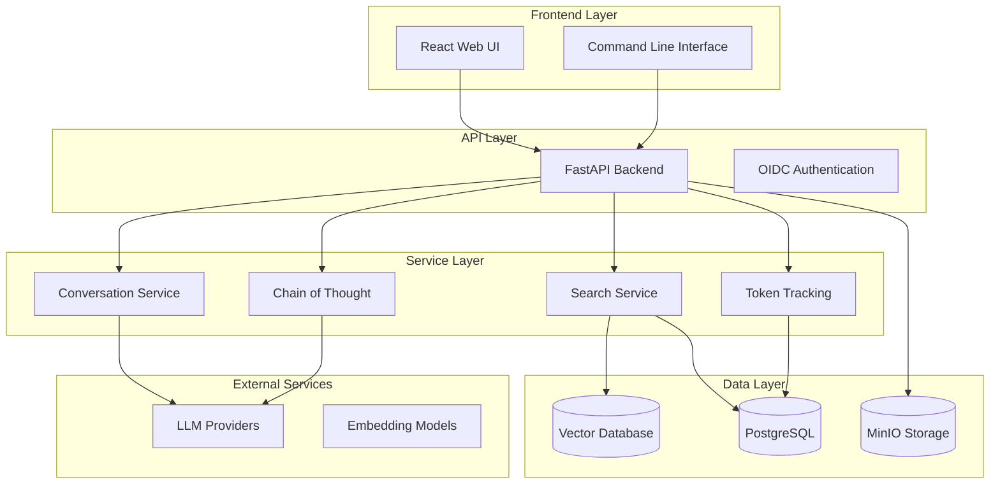

<div align="center">

# RAG Modulo

[](https://opensource.org/licenses/MIT)
[](https://www.python.org/downloads/)
[](https://www.docker.com/)
[](https://fastapi.tiangolo.com/)
[](https://reactjs.org/)

[](https://github.com/manavgup/rag_modulo/actions/workflows/01-lint.yml)
[](https://github.com/manavgup/rag_modulo/actions/workflows/02-security.yml)
[](https://github.com/manavgup/rag_modulo/actions/workflows/03-build-secure.yml)
[](https://github.com/manavgup/rag_modulo/actions/workflows/04-pytest.yml)
[](https://github.com/manavgup/rag_modulo/actions/workflows/05-ci.yml)

**A production-ready, modular Retrieval-Augmented Generation (RAG) platform with Chain of Thought reasoning, multi-LLM support, and enterprise-grade features**

[🚀 Quick Start](#-quick-start) • [📚 Documentation](https://manavgup.github.io/rag_modulo) • [🛠️ Development](#️-development-workflow) • [✨ Features](#-features--capabilities) • [🤝 Contributing](#-contributing)

</div>

---

## 🎯 What is RAG Modulo?

RAG Modulo is a production-ready Retrieval-Augmented Generation platform that provides enterprise-grade document processing, intelligent search, and AI-powered question answering with advanced Chain of Thought (CoT) reasoning. Built with modern technologies and designed for scalability, it supports multiple vector databases (Milvus, Elasticsearch, Pinecone, Weaviate, ChromaDB), LLM providers (WatsonX, OpenAI, Anthropic), and document formats including enhanced support via IBM Docling integration.

### ✨ Key Features

<div align="center">

| 🧠 **AI-Powered** | 🔍 **Advanced Search** | 💬 **Interactive UI** | 🚀 **Production Ready** |
|:---:|:---:|:---:|:---:|
| Chain of Thought reasoning<br/>Automatic pipeline resolution<br/>Multi-LLM provider support<br/>Token tracking & monitoring | Vector similarity search<br/>Hybrid search strategies<br/>Intelligent source attribution<br/>Auto-generated suggestions | Modern React interface<br/>Real-time document upload<br/>Podcast generation<br/>Voice preview features | Docker + GHCR images<br/>Multi-stage CI/CD<br/>Security scanning<br/>947 automated tests |

</div>

#### 🎨 Frontend Features

- **Modern UI**: React 18 with Tailwind CSS and Carbon Design System principles
- **Reusable Component Library**: 8 accessible, type-safe components with consistent design patterns
- **Enhanced Search**: Interactive chat interface with Chain of Thought reasoning visualization
- **Document Management**: Real-time file upload with drag-and-drop support and validation
- **Smart Display**: Document source attribution with chunk-level page references
- **Podcast Generation**: AI-powered podcast creation with voice preview
- **Question Suggestions**: Intelligent query recommendations based on collection content

### 🎉 Current Status: **Production Ready**

<div align="center">

| Component | Status | Progress |
|:---:|:---:|:---:|
| **🏗️ Infrastructure** | ✅ Production Ready | Docker + GHCR + Cloud Deployment |
| **🧪 Testing** | ✅ Comprehensive | 947 tests (atomic, unit, integration, API) |
| **🚀 Core Services** | ✅ Fully Operational | 26+ services with DI pattern |
| **📚 Documentation** | ✅ Extensive | API docs, guides, deployment |
| **🔧 Development** | ✅ Optimized | Containerless local dev workflow |
| **🔒 Security** | ✅ Hardened | Multi-layer scanning (Trivy, Bandit, Gitleaks) |

</div>

---

## 🎉 Recent Major Improvements

<div align="center">

| Feature | Description | Benefit |
|:---|:---|:---|
| **🧠 Chain of Thought** | Automatic question decomposition with step-by-step reasoning | 40%+ better answer quality on complex queries |
| **⚡ Auto Pipeline Resolution** | Zero-config search - backend handles pipeline selection | Simplified API, reduced client complexity |
| **🎨 Reusable UI Components** | 8 accessible, type-safe components (Button, Input, Modal, etc.) | 44% code reduction, consistent design system |
| **🔒 Security Hardening** | Multi-layer scanning (Trivy, Bandit, Gitleaks, Semgrep) | Production-grade security posture |
| **🚀 Containerless Dev** | Local development without containers | 10x faster iteration, instant hot-reload |
| **📄 IBM Docling** | Enhanced document processing for complex formats | Better PDF/DOCX/XLSX handling |
| **🎙️ Podcast Generation** | AI-powered podcast creation with voice preview | Interactive content from documents |
| **💡 Smart Suggestions** | Auto-generated relevant questions | Improved user experience and discovery |
| **📦 GHCR Images** | Pre-built production images | Faster deployments, consistent environments |

</div>

---

## 🚀 Quick Start

### Prerequisites

<table>
<tr>
<th>Tool</th>
<th>Version</th>
<th>Installation</th>
<th>Purpose</th>
</tr>
<tr>
<td><strong>Python</strong></td>
<td>3.12+</td>
<td><code>brew install python@3.12</code> (macOS)<br/><code>sudo add-apt-repository ppa:deadsnakes/ppa && sudo apt update && sudo apt install python3.12 python3.12-venv</code> (Ubuntu 22.04)<br/><code>apt install python3.12</code> (Ubuntu 24.04+)</td>
<td>Backend runtime</td>
</tr>
<tr>
<td><strong>Poetry</strong></td>
<td>Latest</td>
<td><code>make venv</code> (auto-installs)<br/>or <code>curl -sSL https://install.python-poetry.org | python3 -</code></td>
<td>Python dependency management</td>
</tr>
<tr>
<td><strong>Node.js</strong></td>
<td>18+</td>
<td><code>brew install node</code> (macOS)<br/><code>nvm install 18</code> (Linux/macOS)</td>
<td>Frontend development</td>
</tr>
<tr>
<td><strong>Docker</strong></td>
<td>Latest</td>
<td><a href="https://www.docker.com/products/docker-desktop">Docker Desktop</a></td>
<td>Infrastructure containers</td>
</tr>
<tr>
<td><strong>Docker Compose</strong></td>
<td>V2</td>
<td>Included with Docker Desktop<br/><code>apt install docker-compose-plugin</code> (Linux)</td>
<td>Service orchestration</td>
</tr>
</table>

> **📋 Verify Installation**: Run `make check-docker` to verify Docker requirements

### Option 1: Local Development (⚡ Fastest - Recommended)

**Best for**: Daily development, feature work, rapid iteration

<details open>
<summary><strong>🎯 Step-by-Step Setup</strong></summary>

```bash
# 1. Clone repository
git clone https://github.com/manavgup/rag-modulo.git
cd rag-modulo

# 2. Set up environment variables
cp env.example .env
# Edit .env with your API keys (WatsonX, OpenAI, Anthropic)

# 3. Install all dependencies (one command!)
make local-dev-setup
# This creates Python venv + installs backend (Poetry) + frontend (npm)

# 4. Start infrastructure only (Postgres, Milvus, MinIO, MLFlow)
make local-dev-infra

# 5a. Option A: Start backend and frontend in separate terminals
# Terminal 1:
make local-dev-backend

# Terminal 2:
make local-dev-frontend

# 5b. Option B: Start everything in background (easier!)
make local-dev-all
```

</details>

<details>
<summary><strong>🔍 What Gets Installed</strong></summary>

**Backend (Python/Poetry)**:

- FastAPI and dependencies
- LLM providers (WatsonX, OpenAI, Anthropic)
- Vector DB clients (Milvus, Elasticsearch, etc.)
- Testing frameworks (pytest, coverage)
- Code quality tools (ruff, mypy, bandit)

**Frontend (npm)**:

- React 18 + Vite
- Tailwind CSS + Carbon Design
- TypeScript dependencies
- Testing libraries

**Infrastructure (Docker)**:

- PostgreSQL (metadata)
- Milvus (vector storage)
- MinIO (object storage)
- MLFlow (model tracking)

</details>

**Access Points:**

- 🌐 **Frontend**: <http://localhost:3000>
- 🔧 **Backend API**: <http://localhost:8000/docs> (Swagger UI)
- 📊 **MLFlow**: <http://localhost:5001>
- 💾 **MinIO Console**: <http://localhost:9001>

**Benefits:**

- ⚡ **Instant reload** - Python/React changes reflected immediately (no container rebuilds)
- 🐛 **Native debugging** - Use PyCharm, VS Code debugger with breakpoints
- 📦 **Local caching** - Poetry/npm caches work natively for faster dependency installs
- 🔥 **Fastest iteration** - Pre-commit hooks optimized (fast on commit, comprehensive on push)

**When to use:**

- ✅ Daily development work
- ✅ Feature development and bug fixes
- ✅ Rapid iteration and testing
- ✅ Debugging with breakpoints

### Option 2: Production Mode (🐳 Docker)

**Best for**: Production-like testing, deployment validation

```bash
# Clone repository
git clone https://github.com/manavgup/rag-modulo.git
cd rag-modulo

# Set up environment
cp env.example .env
# Edit .env with your API keys

# Start with pre-built images from GHCR
make run-ghcr

# OR build and run locally
make build-all-local
docker compose up -d
```

**When to use:**

- ✅ Testing production configurations
- ✅ Validating Docker builds
- ✅ Deployment rehearsal
- ✅ Performance benchmarking

### Option 3: GitHub Codespaces (☁️ Cloud)

**Best for**: Quick experimentation, onboarding, cloud development

1. **Go to repository** → "Code" → "Codespaces"
2. **Click "Create codespace"** on your branch
3. **Start coding** in browser-based VS Code
4. **Run**: `make venv && make run-infra`

**When to use:**

- ✅ No local setup required
- ✅ Consistent development environment
- ✅ Work from any device
- ✅ Team onboarding

---

## 🏗️ Architecture Overview

RAG Modulo follows a modern, service-based architecture with clear separation of concerns:



---

## 🛠️ Development Workflow

### 🎯 Recommended Daily Workflow

**Philosophy**: Develop locally without containers for maximum speed, use containers only for infrastructure and production.

<details open>
<summary><strong>💻 Daily Development Routine</strong></summary>

```bash
# ============================================================
# ONE-TIME SETUP (First Day Only)
# ============================================================
make local-dev-setup    # Creates venv + installs all dependencies

# ============================================================
# DAILY ROUTINE (Every Day)
# ============================================================

# Option A: Manual Start (Recommended for debugging)
# ---------------------------------------------------
make local-dev-infra              # Start infrastructure

# Terminal 1: Backend
make local-dev-backend            # Auto-reload enabled

# Terminal 2: Frontend
make local-dev-frontend           # Hot Module Replacement (HMR)

# Option B: Background Start (Faster)
# ---------------------------------------------------
make local-dev-all                # Everything runs in background
make local-dev-status             # Check what's running

# ============================================================
# DEVELOPMENT CYCLE
# ============================================================
# 1. Make code changes in your editor
# 2. See changes instantly (auto-reload for both backend/frontend)
# 3. Test via http://localhost:3000
# 4. Run quality checks before commit
make quick-check

# ============================================================
# END OF DAY
# ============================================================
make local-dev-stop               # Stop all services
```

</details>

<details>
<summary><strong>⚡ One-Command Quick Start</strong></summary>

For the impatient developer:

```bash
# First time ever
make local-dev-setup && make local-dev-all

# Every day after
make local-dev-all
```

Done! Services running at:

- Frontend: <http://localhost:3000>
- Backend: <http://localhost:8000>
- MLFlow: <http://localhost:5001>

</details>

### 🔧 Essential Commands Reference

<table>
<tr>
<th>Command</th>
<th>What It Does</th>
<th>When to Use</th>
</tr>
<tr>
<td><code>make venv</code></td>
<td>Creates Python virtual environment (auto-installs Poetry if missing)</td>
<td>First time setup or after clean</td>
</tr>
<tr>
<td><code>make local-dev-setup</code></td>
<td>Installs ALL dependencies (backend + frontend)</td>
<td>First time setup or dependency updates</td>
</tr>
<tr>
<td><code>make local-dev-infra</code></td>
<td>Starts infrastructure only (Postgres, Milvus, MinIO, MLFlow)</td>
<td>Every day before development</td>
</tr>
<tr>
<td><code>make local-dev-all</code></td>
<td>Starts full stack in background</td>
<td>Quick startup, background development</td>
</tr>
<tr>
<td><code>make local-dev-status</code></td>
<td>Shows what's running (infrastructure + backend + frontend)</td>
<td>Verify services are up</td>
</tr>
<tr>
<td><code>make local-dev-stop</code></td>
<td>Stops ALL services (infra + backend + frontend)</td>
<td>End of day cleanup</td>
</tr>
<tr>
<td><code>make quick-check</code></td>
<td>Fast lint + format validation</td>
<td>Before every commit</td>
</tr>
</table>

### 🧪 Testing & Quality

<details>
<summary><strong>🏃 Fast Testing (No Containers)</strong></summary>

```bash
# Atomic tests (fastest - no DB, no coverage)
make test-atomic

# Unit tests (mocked dependencies)
make test-unit-fast

# All local tests
make test-atomic && make test-unit-fast
```

</details>

<details>
<summary><strong>🔗 Integration Testing (Requires Infrastructure)</strong></summary>

```bash
# Ensure infrastructure is running
make local-dev-infra

# Run integration tests
make test-integration

# Full test suite
make test-all    # atomic + unit + integration
```

</details>

<details>
<summary><strong>🎨 Code Quality Checks</strong></summary>

```bash
make quick-check       # Fast: format + lint (use before commit)
make lint              # Full linting (ruff + mypy)
make format            # Auto-fix formatting issues
make security-check    # Security scans (bandit + safety)
make coverage          # Generate coverage report (60% threshold)
```

</details>

### 🐳 Production & Container Workflows

<details>
<summary><strong>🏭 Production Deployment</strong></summary>

Only for production-like testing or deployment validation:

```bash
# Build production images locally
make build-all

# Start production environment
make prod-start

# Check status
make prod-status

# View logs
make prod-logs

# Stop production
make prod-stop
```

</details>

<details>
<summary><strong>📦 Pre-built Images (Fastest)</strong></summary>

Use pre-built images from GitHub Container Registry:

```bash
# Pull latest images and start
docker compose -f docker-compose.production.yml pull
make prod-start
```

Available images:

- `ghcr.io/manavgup/rag_modulo/backend:latest`
- `ghcr.io/manavgup/rag_modulo/frontend:latest`

</details>

---

## 📊 Features & Capabilities

### 🧠 Advanced AI Features

- **Chain of Thought Reasoning**: Automatic question decomposition with step-by-step reasoning, iterative context building, and transparent reasoning visualization
- **Automatic Pipeline Resolution**: Zero-config search experience - backend automatically selects and creates pipelines based on user context
- **Token Tracking & Monitoring**: Real-time usage tracking across all LLM interactions with detailed breakdowns
- **Multi-LLM Support**: Seamless switching between WatsonX, OpenAI, and Anthropic with provider-specific optimizations
- **IBM Docling Integration**: Enhanced document processing for complex formats (PDF, DOCX, XLSX)
- **Question Suggestions**: AI-generated relevant questions based on document collection content
- **MCP Context Forge**: Tool enrichment via
  [IBM MCP](https://github.com/IBM/mcp-context-forge) with resilience patterns

### 🔍 Search & Retrieval

- **Vector Databases**: Pluggable support for Milvus (default), Elasticsearch, Pinecone, Weaviate, ChromaDB via common interface
- **Hybrid Search**: Combines semantic vector similarity with keyword search strategies
- **Source Attribution**: Granular document source tracking with chunk-level page references across reasoning steps
- **Advanced Chunking**: Hierarchical chunking strategies with configurable size and overlap
- **Conversation History**: Context-aware search with conversation memory for multi-turn interactions

### 🏗️ Architecture & Scalability

- **Service-Based Design**: 26+ services with clean separation of concerns and dependency injection pattern
- **Repository Pattern**: Data access abstraction layer for improved testability and maintainability
- **Asynchronous Operations**: Async/await throughout for efficient concurrent request handling
- **Production Deployment**: Docker + GHCR images, multi-stage builds, cloud-ready (AWS, Azure, GCP, IBM Cloud)
- **Modular Design**: Pluggable components for vector DBs, LLM providers, embedding models

### 🧪 Testing & Quality Assurance

- **Comprehensive Test Suite**: 947 automated tests across all layers (atomic, unit, integration, API, E2E)
- **Multi-Layer Testing Strategy**:
  - Atomic tests for schemas and data structures
  - Unit tests for business logic and services
  - Integration tests for service interactions
  - API tests for endpoint validation
- **Security Scanning**: Multi-layer security with Trivy (containers), Bandit (Python), Gitleaks (secrets), Semgrep (SAST)
- **Code Quality**: Ruff linting, MyPy type checking, Pylint analysis, pre-commit hooks
- **CI/CD Pipeline**: Multi-stage GitHub Actions with test isolation, builds, and comprehensive integration testing

---

## 📚 Documentation

### 📖 Complete Documentation

- **[📚 Full Documentation](https://manavgup.github.io/rag_modulo)** - Comprehensive guides and API reference
- **[🚀 Getting Started](docs/getting-started.md)** - Quick start guide
- **[🛠️ Development Guide](docs/development/workflow.md)** - Development workflow and best practices
- **[🧪 Testing Guide](docs/testing/index.md)** - Testing strategies and execution
- **[🚀 Deployment Guide](docs/deployment/production.md)** - Production deployment instructions

### 🔧 Configuration & Tools

- **[⚙️ Configuration Guide](docs/configuration.md)** - Environment setup and configuration
- **[🔌 API Reference](docs/api/README.md)** - Complete API documentation
- **[🖥️ CLI Documentation](docs/cli/index.md)** - Command-line interface guide
- **[🔐 Secret Management](docs/development/secret-management.md)** - Comprehensive guide for safe secret handling
- **[🔗 MCP Integration](docs/features/mcp-integration.md)** - MCP Context Forge gateway setup and usage

### 🛠️ Command-Line Interface (CLI)

RAG Modulo includes a powerful CLI for interacting with the system:

```bash
# After installation, use the CLI commands:
rag-cli --help          # Main CLI help
rag-search              # Search operations
rag-admin               # Administrative tasks

# Example: Search a collection
rag-cli search query <collection-id> "your question here"

# Create a collection
rag-cli collection create --name "My Docs"

# Upload documents
rag-cli collection upload <collection-id> path/to/documents/
```

---

## 🚀 Deployment & Packaging

### Production Deployment

RAG Modulo supports multiple deployment strategies:

#### 1. Docker Compose (Recommended)

```bash
# Start production environment (all containers)
make prod-start

# Check status
make prod-status

# View logs
make prod-logs

# Stop production environment
make prod-stop
```

#### 2. Pre-built Images from GHCR

```bash
# Pull and run latest images from GitHub Container Registry
make run-ghcr
```

**Available Images:**

- `ghcr.io/manavgup/rag_modulo/backend:latest`
- `ghcr.io/manavgup/rag_modulo/frontend:latest`

#### 3. Custom Docker Deployment

```bash
# Build local images
make build-all

# Start services
make run-app
```

### Cloud Deployment Options

<details>
<summary><b>AWS Deployment</b></summary>

- **ECS (Elastic Container Service)**: Use docker-compose.production.yml
- **EKS (Kubernetes)**: Deploy with Kubernetes manifests
- **EC2**: Docker Compose or standalone containers
- **Lambda**: Serverless functions for specific services

</details>

<details>
<summary><b>Azure Deployment</b></summary>

- **Azure Container Instances**: Quick container deployment
- **AKS (Azure Kubernetes Service)**: Production-grade orchestration
- **Azure Container Apps**: Serverless container hosting

</details>

<details>
<summary><b>Google Cloud Deployment</b></summary>

- **Cloud Run**: Fully managed serverless platform
- **GKE (Google Kubernetes Engine)**: Kubernetes orchestration
- **Compute Engine**: VM-based deployment with Docker

</details>

<details>
<summary><b>IBM Cloud Deployment</b></summary>

- **Code Engine**: Serverless container platform
- **IKS (IBM Kubernetes Service)**: Enterprise Kubernetes
- **Red Hat OpenShift**: Advanced container platform

</details>

### Kubernetes Deployment

```bash
# Apply Kubernetes manifests
kubectl apply -f deployment/k8s/

# Or deploy with Helm (if charts exist)
helm install rag-modulo ./charts/rag-modulo
```

---

## 🔄 CI/CD Pipeline

### GitHub Actions Workflows

RAG Modulo uses a comprehensive CI/CD pipeline with multiple stages:

#### 1. Code Quality & Testing (`.github/workflows/ci.yml`)

**Triggers:** Push to `main`, Pull Requests

**Stages:**

1. **Lint and Unit Tests** (No infrastructure)
   - Ruff linting (120 char line length)
   - MyPy type checking
   - Unit tests with pytest
   - Fast feedback (~5-10 minutes)

2. **Build Docker Images**
   - Backend image build
   - Frontend image build
   - Push to GitHub Container Registry (GHCR)
   - Tagged with: `latest`, `sha-<commit>`, branch name

3. **Integration Tests**
   - Full stack deployment
   - PostgreSQL, Milvus, MLFlow, MinIO
   - API tests, integration tests
   - End-to-end validation

**Status Badges:**

```markdown
[](https://github.com/manavgup/rag_modulo/actions)
```

#### 2. Security Scanning (`.github/workflows/02-security.yml`)

**Triggers:** Push to `main`, Pull Requests

**Secret Detection (3-Layer Defense):**

1. **Pre-commit hooks**: detect-secrets with baseline (< 1 sec)
2. **Local testing**: Gitleaks via `make pre-commit-run` (~1-2 sec)
3. **CI/CD**: Gitleaks + TruffleHog (~45 sec)

**Scans:**

- **Gitleaks**: Pattern-based secret scanning with custom rules (`.gitleaks.toml`)
- **TruffleHog**: Entropy-based + verified secret detection
- **Trivy**: Container vulnerability scanning
- **Bandit**: Python security linting
- **Safety**: Python dependency vulnerabilities
- **Semgrep**: SAST code analysis

**⚠️ IMPORTANT:** CI now **fails on ANY secret detection** (no `continue-on-error`). This ensures no secrets make their way to the repository.

**Supported Secret Types:**

- Cloud: AWS, Azure, GCP keys
- LLM: OpenAI, Anthropic, WatsonX, Gemini API keys
- Infrastructure: PostgreSQL, MinIO, MLFlow, JWT secrets
- Version Control: GitHub/GitLab tokens
- Generic: High-entropy strings, private keys

**See:** [`docs/development/secret-management.md`](docs/development/secret-management.md) for comprehensive guide

#### 3. Documentation (`.github/workflows/docs.yml`)

**Triggers:** Push to `main`, Pull Requests to `docs/`

**Actions:**

- Build MkDocs site
- Deploy to GitHub Pages
- API documentation generation

### Local CI Validation

Test CI pipeline locally before pushing:

```bash
# Run same checks as CI
make ci-local

# Validate CI workflows
make validate-ci

# Security checks
make security-check
make scan-secrets
```

### Pre-commit Hooks

Optimized for developer velocity:

**On Commit** (fast, 5-10 sec):

- Ruff formatting
- Trailing whitespace
- YAML syntax
- File size limits

**On Push** (slow, 30-60 sec):

- MyPy type checking
- Pylint analysis
- Security scans
- Strangler pattern checks

**In CI** (comprehensive):

- All checks run regardless
- Ensures quality gates

### Container Registry

**GitHub Container Registry (GHCR)**:

- Automatic image builds on push
- Multi-architecture support (amd64, arm64)
- Image signing and verification
- Retention policies

**Image Tags:**

- `latest`: Latest main branch build
- `sha-<commit>`: Specific commit
- `<branch>`: Branch-specific builds
- `v<version>`: Release tags

---

## 🧪 Testing

### Test Categories

| Category | Count | Description | Command |
|:---:|:---:|:---|:---|
| **⚡ Atomic Tests** | 100+ | Schema validation, data structures | `pytest -m atomic` |
| **🏃 Unit Tests** | 83+ | Service logic, business rules | `make test-unit-fast` |
| **🔗 Integration Tests** | 43+ | Service interactions, DB integration | `make test-integration` |
| **🔌 API Tests** | 21+ | Endpoint validation, request/response | `pytest -m api` |
| **🌐 E2E Tests** | 22+ | Full workflow scenarios | `pytest -m e2e` |
| **📊 Total** | **947** | Complete test coverage | `make test-all` |

### Running Tests

```bash
# Fast local testing (no containers, recommended for development)
make test-unit-fast

# Specific test categories
make test-atomic       # Schema and data structure tests
make test-integration  # Service integration tests (requires infrastructure)
make test-api          # API endpoint tests

# Full test suite with coverage
make coverage

# Run specific test file
make test testfile=tests/unit/test_search_service.py
```

---

## 🤝 Contributing

We welcome contributions! Please see our [Contributing Guide](docs/development/contributing.md) for details.

### Development Guidelines

1. **Service Layer Architecture** - Follow service-based patterns
2. **Code Quality** - Use type hints, comprehensive docstrings, PEP 8
3. **Testing** - Write tests for all new features
4. **Documentation** - Update docs for any changes

### Contribution Process

1. **Fork and Clone** the repository
2. **Create Feature Branch** from main
3. **Make Changes** following our guidelines
4. **Run Tests** and ensure they pass
5. **Submit Pull Request** with clear description

---

## 📈 Roadmap

### ✅ Phase 1: Foundation (Completed)

- [x] Service-based architecture with 26+ services
- [x] Comprehensive test infrastructure (947 tests)
- [x] Multi-LLM provider support (WatsonX, OpenAI, Anthropic)
- [x] Vector database abstraction layer
- [x] CI/CD pipeline with security scanning

### ✅ Phase 2: Advanced Features (Completed)

- [x] Chain of Thought (CoT) reasoning system
- [x] Automatic pipeline resolution
- [x] Token tracking and monitoring
- [x] IBM Docling integration
- [x] Podcast generation with voice preview
- [x] Question suggestion system
- [x] Containerless local development workflow

### 🔄 Phase 3: Production Enhancement (Current)

- [x] Production deployment with GHCR images
- [x] Multi-stage Docker builds
- [x] Security hardening (Trivy, Bandit, Gitleaks, Semgrep)
- [ ] Enhanced monitoring and observability
- [ ] Performance optimization and caching
- [ ] Authentication system improvements (OIDC)

### 🚀 Phase 4: Enterprise Features (Next)

- [ ] Multi-tenant support
- [ ] Advanced analytics and dashboards
- [ ] Batch processing capabilities
- [ ] API rate limiting and quotas
- [ ] Advanced caching strategies

### 🔮 Phase 5: Innovation (Future)

- [ ] Multi-modal support (image, audio)
- [ ] Agentic AI workflows
- [ ] Real-time collaborative features
- [ ] Advanced reasoning strategies
- [ ] Federated learning support

---

## 🆘 Troubleshooting

### Quick Diagnostic Commands

Run these first to identify issues:

```bash
make check-docker          # Verify Docker installation
make local-dev-status      # Check what's running
make venv                  # Ensure Python environment is set up
docker compose -f docker-compose-infra.yml ps  # Check infrastructure
```

### Common Issues & Solutions

<details>
<summary><strong>🚨 Quick Fixes (Try These First)</strong></summary>

**Most Common Problems:**

```bash
# Problem: "Command not found" errors
make venv                    # Creates Python venv (auto-installs Poetry)
source backend/.venv/bin/activate

# Problem: Services won't start
make local-dev-stop          # Stop everything cleanly
make check-docker            # Verify Docker requirements
make local-dev-infra         # Restart infrastructure only

# Problem: Port conflicts
make local-dev-stop          # Stops all services and containers
lsof -i :8000 && kill $(lsof -t -i:8000)  # Kill backend on port 8000
lsof -i :3000 && kill $(lsof -t -i:3000)  # Kill frontend on port 3000

# Problem: Weird behavior after updates
make clean-venv              # Remove Python venv
make local-dev-setup         # Fresh install
make clean-all               # Nuclear option: clean everything
```

</details>

<details>
<summary><strong>🐍 Python & Virtual Environment Issues</strong></summary>

#### Poetry Not Installed

```bash
# Makefile auto-installs Poetry (recommended)
make venv

# OR install manually
curl -sSL https://install.python-poetry.org | python3 -
```

#### Wrong Python Version

```bash
# Check Python version
python --version    # Should be 3.12+

# macOS: Install Python 3.12
brew install python@3.12

# Ubuntu/Debian: Install Python 3.12
sudo apt update
sudo apt install python3.12 python3.12-venv
```

#### Dependencies Not Installing

```bash
# Method 1: Use Makefile (recommended)
make clean-venv
make local-dev-setup

# Method 2: Manual Poetry setup
cd backend
poetry config virtualenvs.in-project true
poetry cache clear . --all
poetry install --with dev,test --sync
source .venv/bin/activate
```

#### Wrong Tool Versions (e.g., Ruff 0.5.7 instead of 0.14.0)

```bash
# Ensure you're in Poetry venv
cd backend
source .venv/bin/activate
which python    # Should show: backend/.venv/bin/python
which ruff      # Should show: backend/.venv/bin/ruff
ruff --version  # Should be 0.14.0+

# If wrong version, reinstall
poetry install --with dev,test --sync
```

#### Import Errors

```bash
# Verify PYTHONPATH and reinstall
cd backend
source .venv/bin/activate
poetry install --with dev,test --sync
python -c "import sys; print('\n'.join(sys.path))"
```

</details>

<details>
<summary><strong>🐳 Docker & Container Issues</strong></summary>

#### Docker Not Installed

```bash
# Check if Docker is installed
docker --version
docker compose version

# If missing, install:
# macOS: brew install --cask docker
# Or download Docker Desktop: https://www.docker.com/products/docker-desktop
```

#### Docker Compose V2 Missing

```bash
# Ubuntu/Debian
sudo apt update
sudo apt install docker-compose-plugin

# Verify
docker compose version
```

#### Infrastructure Services Fail to Start

```bash
# Clean restart
make local-dev-stop
docker system prune -f
make local-dev-infra

# Check what failed
docker compose -f docker-compose-infra.yml ps
docker compose -f docker-compose-infra.yml logs

# Common fixes
docker volume prune -f        # Clear old volumes
make clean-all                # Nuclear option
```

#### Port Already in Use

```bash
# Find what's using ports
lsof -i :8000   # Backend
lsof -i :3000   # Frontend
lsof -i :5432   # PostgreSQL
lsof -i :19530  # Milvus

# Stop conflicting services
make local-dev-stop

# Kill specific port (if needed)
kill $(lsof -t -i:8000)
```

#### Container Permission Issues

```bash
# Fix volume permissions
chmod -R 777 ./volumes
docker compose -f docker-compose-infra.yml down -v
make local-dev-infra
```

</details>

<details>
<summary><strong>🧪 Testing Issues</strong></summary>

#### Tests Fail to Run

```bash
# Ensure venv is activated
source backend/.venv/bin/activate

# Install test dependencies
cd backend
poetry install --with test --sync

# Run specific test with verbose output
pytest tests/unit/test_example.py -vv -s
```

#### Database Connection Errors in Tests

```bash
# Ensure infrastructure is running
make local-dev-infra
make local-dev-status

# Wait for services to be ready
sleep 10

# Run tests
make test-integration
```

#### Import Errors in Tests

```bash
# Check PYTHONPATH
cd backend
source .venv/bin/activate
pytest tests/ --collect-only  # See what tests are collected

# If imports fail, reinstall
poetry install --with dev,test --sync
```

</details>

<details>
<summary><strong>🔐 Authentication & API Issues</strong></summary>

#### Login Fails

**Development Mode** (bypass authentication):

```bash
# Add to .env
SKIP_AUTH=true
DEVELOPMENT_MODE=true
ENABLE_MOCK_AUTH=true

# Restart backend
make local-dev-stop
make local-dev-backend
```

**Production Mode** (fix OIDC):

- Verify `.env` has correct OIDC settings
- Check IBM Cloud credentials are valid
- Ensure redirect URLs match your setup
- Check logs: `tail -f /tmp/rag-backend.log`

#### API Returns 500 Errors

```bash
# Check backend logs
tail -f /tmp/rag-backend.log

# Restart backend with debug
cd backend
source .venv/bin/activate
LOG_LEVEL=DEBUG uvicorn main:app --reload --port 8000
```

</details>

<details>
<summary><strong>📦 Frontend Issues</strong></summary>

#### npm install Fails

```bash
# Clear cache and retry
cd frontend
rm -rf node_modules package-lock.json
npm cache clean --force
npm install
```

#### Frontend Won't Start

```bash
# Check Node version
node --version    # Should be 18+

# Update Node (macOS)
brew upgrade node

# Update Node (Linux - using nvm)
nvm install 18
nvm use 18

# Reinstall and start
cd frontend
rm -rf node_modules
npm install
npm run dev
```

#### Build Errors

```bash
# Clear build cache
cd frontend
rm -rf dist .vite
npm run dev
```

</details>

<details>
<summary><strong>🔧 Performance Issues</strong></summary>

#### Slow Backend Response

```bash
# Check if infrastructure is running locally
make local-dev-status

# Monitor resource usage
docker stats

# Check logs for bottlenecks
tail -f /tmp/rag-backend.log | grep -i "slow\|timeout\|error"
```

#### High Memory Usage

```bash
# Restart services to clear memory
make local-dev-stop
docker system prune -f
make local-dev-infra
```

</details>

### 🆘 Getting Help

<table>
<tr>
<th>Resource</th>
<th>When to Use</th>
<th>Link</th>
</tr>
<tr>
<td>📚 <strong>Full Documentation</strong></td>
<td>Comprehensive guides and API reference</td>
<td><a href="https://manavgup.github.io/rag_modulo">docs site</a></td>
</tr>
<tr>
<td>🐛 <strong>GitHub Issues</strong></td>
<td>Report bugs or request features</td>
<td><a href="https://github.com/manavgup/rag_modulo/issues">issues</a></td>
</tr>
<tr>
<td>💬 <strong>Discussions</strong></td>
<td>Ask questions, share ideas</td>
<td><a href="https://github.com/manavgup/rag_modulo/discussions">discussions</a></td>
</tr>
<tr>
<td>📖 <strong>IMMEDIATE_FIX.md</strong></td>
<td>Quick fixes for common development issues</td>
<td>See project root</td>
</tr>
<tr>
<td>🔧 <strong>CLAUDE.md</strong></td>
<td>Development best practices and architecture</td>
<td>See project root</td>
</tr>
</table>

### Still Stuck?

1. **Check service status**: `make local-dev-status`
2. **View logs**: `tail -f /tmp/rag-backend.log` or `make logs`
3. **Try clean restart**: `make local-dev-stop && make clean && make local-dev-all`
4. **Nuclear option**: `make clean-all` (removes everything - be careful!)
5. **Ask for help**: [Open an issue](https://github.com/manavgup/rag_modulo/issues/new) with:
   - Error message
   - Output of `make local-dev-status`
   - OS and Docker version
   - Steps to reproduce

---

## 📄 License

This project is licensed under the **MIT License** - see the [LICENSE](LICENSE) file for details.

---

## 🙏 Acknowledgments

- **IBM Docling** - Advanced document processing and understanding
- **IBM WatsonX** - Enterprise AI foundation models
- **FastAPI** - Modern, high-performance web framework
- **React** - Powerful UI library for building interactive interfaces
- **Milvus** - High-performance vector database
- **Docker** - Containerization and deployment platform
- **All Contributors** - Thank you for your contributions!

---

<div align="center">

**[⬆ Back to Top](#rag-modulo)**

Made with ❤️ by the RAG Modulo Team

[](https://github.com/manavgup/rag_modulo)
[](https://hub.docker.com/r/ragmodulo/backend)
[](https://www.python.org/)

</div>
