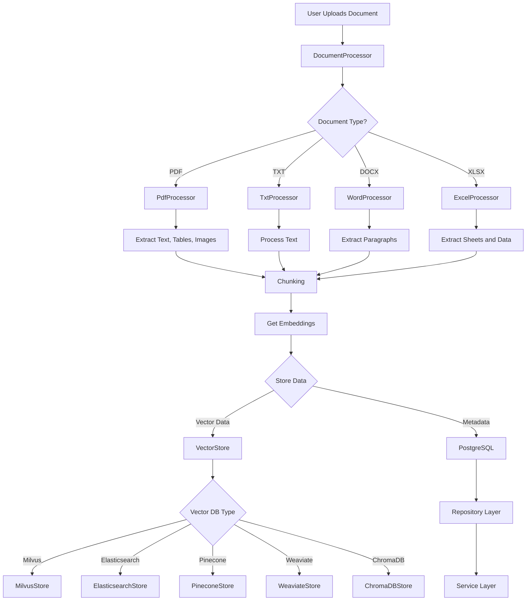
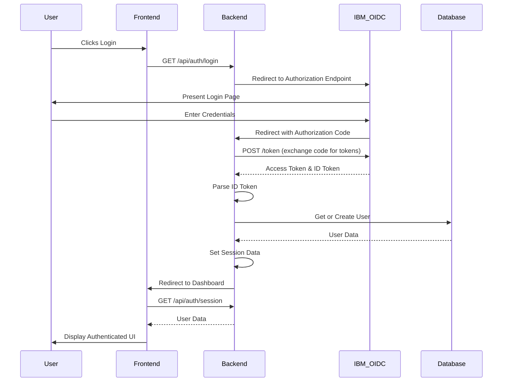

# RAG Modulo

RAG Modulo is a Retrieval-Augmented Generation (RAG) solution that integrates various vector databases for efficient information retrieval and generation.

## Table of Contents

- [Features](#features)
- [Document Processing Flow](#document-processing-flow)
- [Prerequisites](#prerequisites)
- [Installation](#installation)
- [Usage](#usage)
- [Project Structure](#project-structure)
- [Configuration](#configuration)
- [Testing](#testing)
- [CI/CD](#cicd)
- [Contributing](#contributing)
- [License](#license)

## Features

### Architecture
- Service-based architecture with clean separation of concerns
- Repository pattern for database operations
- Provider abstraction for LLM integration
- Dependency injection for better testability
- Asynchronous API for efficient operations

### Data Processing
- Support for multiple vector databases (Elasticsearch, Milvus, Pinecone, Weaviate, ChromaDB)
- Flexible document processing for various formats (PDF, TXT, DOCX, XLSX)
- Customizable chunking strategies
- Configurable embedding models
- Separation of vector storage and metadata storage

### LLM Integration
- Multiple LLM provider support (WatsonX, OpenAI, Anthropic)
- Runtime provider configuration
- Template-based prompt management
- Error handling and recovery
- Concurrent request handling

### Testing & Quality
- Comprehensive test suite with:
  - Unit tests for components
  - Integration tests for flows
  - Performance tests for scalability
  - Service-specific test suites
- Continuous Integration/Deployment
- Code quality checks
- Performance monitoring
- Security auditing

## Document Processing Flow

The following diagram illustrates how documents are processed in our RAG solution:



Explanation of the document processing flow:

1. A user uploads a document to the system.
2. The DocumentProcessor determines the type of document and routes it to the appropriate processor (PdfProcessor, TxtProcessor, WordProcessor, or ExcelProcessor).
3. Each processor extracts the relevant content from the document.
4. The extracted content goes through a chunking process to break it into manageable pieces.
5. Embeddings are generated for the chunked content.
6. The data is then stored in two places:
   - Vector data (embeddings) are stored in the VectorStore, which can be one of several types (Milvus, Elasticsearch, Pinecone, Weaviate, or ChromaDB).
   - Metadata is stored in PostgreSQL, accessed through the Repository Layer and Service Layer.

This architecture allows for flexibility in choosing vector databases and ensures efficient storage and retrieval of both vector data and metadata.

## Prerequisites

- Python 3.11+
- Docker and Docker Compose

## Installation

1. Clone the repository:
   ```sh
   git clone https://github.com/manavgup/rag-modulo.git
   cd rag-modulo
   ```
2. Set up your environment variables by copying the `.env.example` file:
   ```sh
   cp env.example .env
   ```
   Then, edit the `.env` file with your specific configuration.
3. Make sure you have container runtime installed (e.g., podman)

## Usage

1. Build app, start infra services (DBs, etc) and application containers (frontend, backend):
   ```sh
   make run-app
   ```
2. Access the API at `http://localhost:8000` and the frontend at `http://localhost:3000`.

## Project Structure

```plaintext
rag_modulo/
├── .github/workflows/ci.yml   # GitHub Actions workflow for build/test/publish
├── backend                    # Python backend application
│   ├── auth/                  # Authentication code (e.g. OIDC)
│   ├── core/                  # Config, exceptions, middleware
│   ├── rag_solution/          # Main application code
│   │   ├── data_ingestion/    # Data ingestion modules
│   │   ├── docs/             # Documentation files
│   │   ├── evaluation/       # Evaluation modules
│   │   ├── generation/       # Text generation modules
│   │   │   └── providers/    # LLM provider implementations
│   │   ├── models/          # Data models and schemas
│   │   ├── pipeline/        # RAG pipeline implementation
│   │   ├── query_rewriting/ # Query rewriting modules
│   │   ├── repository/      # Repository layer implementations
│   │   ├── retrieval/       # Data retrieval modules
│   │   ├── router/          # API route handlers
│   │   ├── schemas/         # Pydantic schemas
│   │   └── services/        # Service layer implementations
│   ├── tests/               # Test suite
│   │   ├── integration/     # Integration tests
│   │   ├── performance/     # Performance tests
│   │   ├── services/        # Service tests
│   │   └── README.md        # Testing documentation
│   └── vectordbs/           # Vector database interfaces
├── webui/                   # Frontend code
│   ├── src/
│   │   ├── components/      # React components
│   │   ├── services/        # Frontend services
│   │   └── config/         # Frontend configuration
├── .env                     # Environment variables
├── docker-compose-infra.yml # Infrastructure services configuration
├── docker-compose.yml       # Application services configuration
├── Makefile                # Project management commands
├── requirements.txt        # Project dependencies
└── README.md              # Project documentation
```

Key architectural components:

1. Service Layer:
   - Implements business logic
   - Manages transactions
   - Handles dependencies
   - Provides clean interfaces

2. Repository Layer:
   - Data access abstraction
   - Database operations
   - Query optimization
   - Transaction management

3. Provider System:
   - LLM provider abstraction
   - Multiple provider support
   - Configuration management
   - Error handling

4. Test Organization:
   - Unit tests by component
   - Integration tests
   - Performance tests
   - Service-specific tests

## OAuth flow with IBM

The following diagram illustrates the OAuth 2.0 Authorization Code flow used in our application with IBM as the identity provider:



## Configuration

The system uses a layered configuration approach with both environment variables and runtime configuration through services.

### Environment Configuration

Basic infrastructure settings:
```bash
# Database Configuration
VECTOR_DB=milvus                 # Vector database type
MILVUS_HOST=localhost           # Vector DB host
MILVUS_PORT=19530              # Vector DB port
DB_HOST=localhost              # PostgreSQL host
DB_PORT=5432                   # PostgreSQL port

# LLM Provider Settings
WATSONX_INSTANCE_ID=your-id    # WatsonX instance ID
WATSONX_APIKEY=your-key        # WatsonX API key
OPENAI_API_KEY=your-key        # OpenAI API key (optional)
ANTHROPIC_API_KEY=your-key     # Anthropic API key (optional)

# Application Settings
EMBEDDING_MODEL=all-minilm-l6-v2  # Default embedding model
DATA_DIR=/path/to/data           # Data directory
```

### Service Configuration

Runtime configuration through services:

1. Provider Configuration:
   ```python
   provider_config = ProviderConfigInput(
       provider="watsonx",
       api_key="${WATSONX_APIKEY}",
       project_id="${WATSONX_INSTANCE_ID}",
       active=True
   )
   config_service.create_provider_config(provider_config)
   ```

2. LLM Parameters:
   ```python
   parameters = LLMParametersInput(
       name="default-params",
       provider="watsonx",
       model_id="granite-13b",
       temperature=0.7,
       max_new_tokens=1000
   )
   parameters_service.create_parameters(parameters)
   ```

3. Template Configuration:
   ```python
   template = PromptTemplateInput(
       name="rag-query",
       provider="watsonx",
       template_type=PromptTemplateType.RAG_QUERY,
       template_format="Context:\n{context}\nQuestion:{question}"
   )
   template_service.create_template(template)
   ```

4. Pipeline Configuration:
   ```python
   pipeline_config = PipelineConfigInput(
       name="default-pipeline",
       provider_id=provider.id,
       llm_parameters_id=parameters.id
   )
   pipeline_service.create_pipeline_config(pipeline_config)
   ```

For detailed configuration options and examples, see:
- [Provider Configuration](backend/rag_solution/docs/provider_configuration.md)
- [Configuration Management](backend/rag_solution/docs/configuration.md)
- [Prompt Templates](backend/rag_solution/docs/prompt_templates.md)

## Testing

The project includes a comprehensive test suite with unit tests, integration tests, and performance tests. For detailed information about testing, see [Testing Documentation](backend/tests/README.md).

### Quick Start

Run all tests:
```bash
make test
```

### Test Types

1. Unit Tests:
   ```bash
   pytest backend/tests/
   ```

2. Integration Tests:
   ```bash
   pytest backend/tests/integration/
   ```

3. Performance Tests:
   ```bash
   pytest backend/tests/performance/
   ```

### Test Coverage

Generate coverage report:
```bash
pytest --cov=backend/rag_solution --cov-report=html
```

### Performance Testing

The performance test suite includes:
- Throughput testing
- Latency testing
- Resource usage monitoring
- Stability testing

For detailed performance test configuration and execution, refer to the [Testing Documentation](backend/tests/README.md#performance-tests).

## CI/CD

The project uses GitHub Actions for continuous integration and deployment, with a focus on maintaining service quality and performance.

### Pipeline Stages

1. Code Quality
   ```yaml
   quality:
     steps:
       - name: Code Formatting
         run: black backend/
       - name: Type Checking
         run: mypy backend/
       - name: Linting
         run: flake8 backend/
       - name: Import Sorting
         run: isort backend/
   ```

2. Testing
   ```yaml
   test:
     steps:
       - name: Unit Tests
         run: pytest backend/tests/services/
       - name: Integration Tests
         run: pytest backend/tests/integration/
       - name: Performance Tests
         run: |
           pytest backend/tests/performance/ \
             --html=performance-report.html
       - name: Coverage Report
         run: |
           pytest --cov=backend/rag_solution \
             --cov-report=xml \
             --cov-fail-under=80
   ```

3. Security
   ```yaml
   security:
     steps:
       - name: Dependency Scan
         run: safety check
       - name: SAST Analysis
         run: bandit -r backend/
       - name: Secret Detection
         run: detect-secrets scan
   ```

4. Build & Deploy
   ```yaml
   deploy:
     steps:
       - name: Build Images
         run: docker-compose build
       - name: Run Tests in Container
         run: docker-compose run test
       - name: Push Images
         run: docker-compose push
   ```

### Quality Gates

The pipeline enforces several quality gates:

1. Code Quality
   - No formatting errors
   - No type checking errors
   - No linting violations
   - Proper import sorting

2. Testing
   - All tests must pass
   - 80% minimum coverage
   - Performance tests within thresholds
   - No integration test failures

3. Security
   - No critical vulnerabilities
   - No exposed secrets
   - Clean SAST scan

4. Service Requirements
   - Service tests pass
   - API contracts validated
   - Configuration validated
   - Performance metrics met

For detailed CI/CD configuration, see:
- [Workflow Configuration](.github/workflows/ci.yml)
- [Docker Compose Configuration](docker-compose.yml)
- [Test Configuration](backend/pytest.ini)

## Contributing

Contributions are welcome! Please follow these guidelines when contributing to the project.

### Development Guidelines

1. Service Layer Architecture
   - Follow the service-based architecture pattern
   - Implement new features as services
   - Use dependency injection
   - Follow repository pattern for data access
   - Document service interfaces

2. Code Style
   - Use type hints
   - Write comprehensive docstrings
   - Follow PEP 8 guidelines
   - Use async/await where appropriate
   - Handle errors properly

3. Testing Requirements
   - Write unit tests for services
   - Add integration tests for flows
   - Include performance tests for critical paths
   - Maintain test coverage above 80%
   - Document test scenarios

### Contribution Process

1. Fork and Clone
   ```bash
   git clone https://github.com/yourusername/rag-modulo.git
   cd rag-modulo
   ```

2. Set Up Development Environment
   ```bash
   # Create virtual environment
   python -m venv venv
   source venv/bin/activate  # or `venv\Scripts\activate` on Windows
   
   # Install dependencies
   pip install -r requirements.txt
   pip install -r requirements-dev.txt
   ```

3. Create Feature Branch
   ```bash
   git checkout -b feature/YourFeature
   ```

4. Development Workflow
   - Write tests first (TDD)
   - Implement feature
   - Run test suite
   - Update documentation
   - Run linters

5. Testing
   ```bash
   # Run all tests
   pytest
   
   # Run specific test types
   pytest backend/tests/services/  # Service tests
   pytest backend/tests/integration/  # Integration tests
   pytest backend/tests/performance/  # Performance tests
   
   # Check coverage
   pytest --cov=backend/rag_solution
   ```

6. Submit Changes
   - Push changes to your fork
   - Create pull request
   - Fill out PR template
   - Respond to reviews

### Documentation

When adding new features:
1. Update service documentation
2. Add configuration examples
3. Update testing documentation
4. Include performance considerations
5. Document API changes

For detailed development guidelines, see:
- [Development Guide](backend/rag_solution/docs/development_prompt.md)
- [Testing Guide](backend/tests/README.md)
- [Configuration Guide](backend/rag_solution/docs/configuration.md)

## License

This project is licensed under the MIT License - see the LICENSE file for details.
