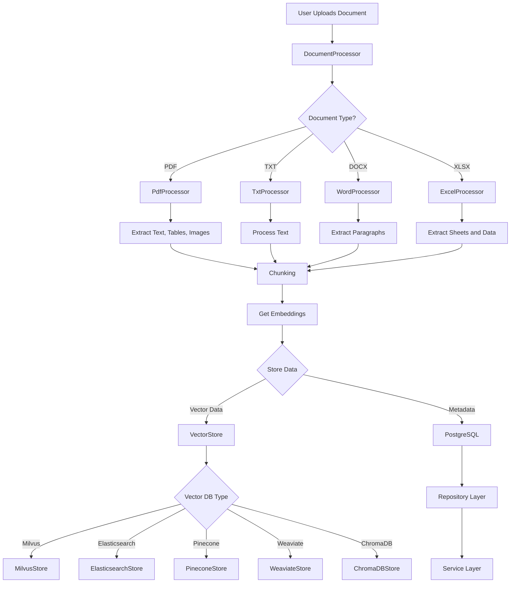

# RAG Modulo

RAG Modulo is a Retrieval-Augmented Generation (RAG) solution that integrates various vector databases for efficient information retrieval and generation.

## Table of Contents

- [Features](#features)
- [Document Processing Flow](#document-processing-flow)
- [Prerequisites](#prerequisites)
- [Installation](#installation)
- [Usage](#usage)
- [Project Structure](#project-structure)
- [Configuration](#configuration)
- [Testing](#testing)
- [CI/CD](#cicd)
- [Contributing](#contributing)
- [License](#license)

## Features

- Support for multiple vector databases (Elasticsearch, Milvus, Pinecone, Weaviate, ChromaDB)
- Flexible document processing and chunking strategies for various formats (PDF, TXT, DOCX, XLSX)
- Asynchronous API for efficient data ingestion and querying
- Customizable embedding models
- Separation of vector storage and metadata storage
- Repository pattern for database operations
- Comprehensive test suite
- CI/CD pipeline with GitHub Actions

## Document Processing Flow

The following diagram illustrates how documents are processed in our RAG solution:



Explanation of the document processing flow:

1. A user uploads a document to the system.
2. The DocumentProcessor determines the type of document and routes it to the appropriate processor (PdfProcessor, TxtProcessor, WordProcessor, or ExcelProcessor).
3. Each processor extracts the relevant content from the document.
4. The extracted content goes through a chunking process to break it into manageable pieces.
5. Embeddings are generated for the chunked content.
6. The data is then stored in two places:
   - Vector data (embeddings) are stored in the VectorStore, which can be one of several types (Milvus, Elasticsearch, Pinecone, Weaviate, or ChromaDB).
   - Metadata is stored in PostgreSQL, accessed through the Repository Layer and Service Layer.

This architecture allows for flexibility in choosing vector databases and ensures efficient storage and retrieval of both vector data and metadata.

## Prerequisites

- Python 3.11+
- Docker and Docker Compose

## Installation

1. Clone the repository:
    ```sh
    git clone https://github.com/manavgup/rag-modulo.git
    cd rag-modulo
    ```
2. Install dependencies:
    ```sh
    pip install -r requirements.txt
    ```
3. Set up your environment variables by copying the `.env.example` file:
    ```sh
    cp env.example .env
    ```
    Then, edit the `.env` file with your specific configuration.

## Usage

1. Start the required services:
    ```sh
    make run-services
    ```
2. Build and run the application:
    ```sh
    make run-app
    ```
3. Access the API at `http://localhost:8000` and the frontend at `http://localhost:3000`.

## Project Structure

```plaintext
rag_modulo/
├── rag_solution/        # Main application code
│   ├── data_ingestion/  # Data ingestion modules
│   ├── generation/      # Text generation modules
│   ├── pipeline/        # RAG pipeline
│   ├── query_rewriting/ # Query rewriting modules
│   └── retrieval/       # Data retrieval modules
├── tests/               # Test files
├── vectordbs/           # Vector database interfaces
├── webui/               # Frontend code
├── .env                 # Environment variables
├── docker-compose.yml   # Docker services configuration
├── Makefile             # Project management commands
├── requirements.txt     # Project dependencies
└── README.md            # Project documentation
```

## OAuth flow with IBM
The following diagram illustrates the OAuth 2.0 Authorization Code flow used in our application with IBM as the identity provider:

```mermaid
sequenceDiagram
    participant User
    participant Frontend
    participant Backend
    participant IBM_OIDC
    participant Database
    User->>Frontend: Clicks Login
    Frontend->>Backend: GET /api/auth/login
    Backend->>IBM_OIDC: Redirect to Authorization Endpoint
    IBM_OIDC->>User: Present Login Page
    User->>IBM_OIDC: Enter Credentials
    IBM_OIDC->>Backend: Redirect with Authorization Code
    Backend->>IBM_OIDC: POST /token (exchange code for tokens)
    IBM_OIDC-->>Backend: Access Token & ID Token
    Backend->>Backend: Parse ID Token
    Backend->>Database: Get or Create User
    Database-->>Backend: User Data
    Backend->>Backend: Set Session Data
    Backend->>Frontend: Redirect to Dashboard
    Frontend->>Backend: GET /api/auth/session
    Backend-->>Frontend: User Data
    Frontend->>User: Display Authenticated UI
```


## Configuration
Configuration is managed through environment variables. Key variables include:

- VECTOR_DB: Choose the vector database (elasticsearch, milvus, pinecone, weaviate, chroma)
- EMBEDDING_MODEL: Specify the embedding model to use
- DATA_DIR: Directory containing the data to be ingested

Refer to the env.example file for a complete list of configuration options.

## Testing
Run the test suite using:
`make test`

## CI/CD
The project uses GitHub Actions for continuous integration and deployment. The pipeline includes:

- Code formatting
- Linting
- Running tests
- Security audit
- Building Docker containers

Refer to .github/workflows/ci.yml for the complete workflow.

## Contributing
Contributions are welcome! Please feel free to submit a Pull Request.

1. Fork the repository
2. Create your feature branch (`git checkout -b feature/AmazingFeature`)
3. Commit your changes (`git commit -m 'Add some AmazingFeature'`)
4. Push to the branch (`git push origin feature/AmazingFeature`)
5. Open a Pull Request

## License
This project is licensed under the MIT License - see the LICENSE file for details.