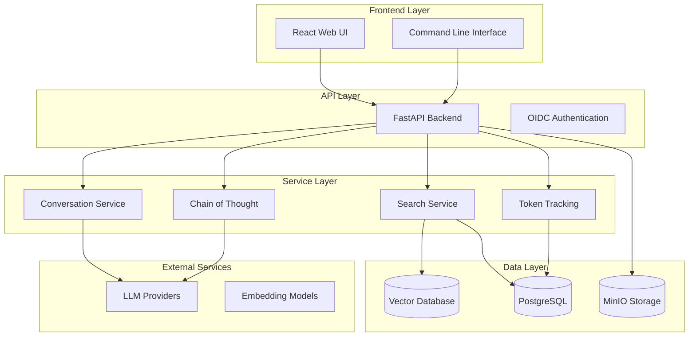

<div align="center">

# RAG Modulo

[](https://opensource.org/licenses/MIT)
[](https://www.python.org/downloads/)
[](https://www.docker.com/)
[](https://fastapi.tiangolo.com/)
[](https://reactjs.org/)

**A robust, customizable Retrieval-Augmented Generation (RAG) solution with advanced AI capabilities**

[🚀 Quick Start](#-quick-start) • [📚 Documentation](https://manavgup.github.io/rag_modulo) • [🛠️ Development](#️-development-workflow) • [🤝 Contributing](#-contributing)

</div>

---

## 🎯 What is RAG Modulo?

RAG Modulo is a production-ready Retrieval-Augmented Generation platform that provides enterprise-grade document processing, intelligent search, and AI-powered question answering. Built with modern technologies and designed for scalability, it supports multiple vector databases, LLM providers, and document formats.

### ✨ Key Features

<div align="center">

| 🧠 **AI-Powered** | 🔍 **Advanced Search** | 💬 **Interactive UI** | 🚀 **Production Ready** |
|:---:|:---:|:---:|:---:|
| Chain of Thought reasoning<br/>Token tracking & monitoring<br/>Multi-LLM provider support | Vector similarity search<br/>Hybrid search strategies<br/>Source attribution | Chat interface with accordions<br/>Real-time WebSocket support<br/>Document source visualization | Docker containerized<br/>CI/CD pipeline<br/>Comprehensive testing |

</div>

#### 🎨 Frontend Features
- **Enhanced Search Interface**: Interactive chat with document collections featuring visual accordions for sources, CoT reasoning, and token usage
- **Real-time Communication**: WebSocket integration for live updates and streaming responses
- **Smart Data Display**: Automatic document name resolution and chunk-level page attribution
- **Responsive Design**: Tailwind CSS-based responsive layout with proper text wrapping and overflow handling

### 🎉 Current Status: **Production Ready**

<div align="center">

| Component | Status | Progress |
|:---:|:---:|:---:|
| **🏗️ Infrastructure** | ✅ Complete | 95% |
| **🧪 Testing** | ✅ Excellent | 92% (847/918 tests) |
| **🚀 Core Services** | ✅ Operational | 90% |
| **📚 Documentation** | ✅ Comprehensive | 90% |
| **🔧 Development** | ✅ Streamlined | 85% |

</div>

---

## 🚀 Quick Start

### Prerequisites

| Requirement | Version | Purpose |
|:---|:---:|:---|
| **Python** | 3.12+ | Backend development |
| **Poetry** | Latest | Python dependency management |
| **Node.js** | 18+ | Frontend development |
| **Docker** | Latest | Infrastructure services |
| **Docker Compose** | V2 | Orchestration |

### Option 1: Local Development (⚡ Fastest - Recommended)

**Best for**: Daily development, feature work, rapid iteration

```bash
# 1. Clone repository
git clone https://github.com/manavgup/rag-modulo.git
cd rag-modulo

# 2. Set up environment
cp env.example .env
# Edit .env with your API keys (WatsonX, OpenAI, etc.)

# 3. Create Python virtual environment and install dependencies
make venv

# 4. Install frontend dependencies
cd frontend && npm install && cd ..

# 5. Start infrastructure services (Postgres, Milvus, MinIO, MLFlow)
make run-infra
# OR: docker compose -f docker-compose-infra.yml up -d

# 6. Activate virtual environment
source backend/.venv/bin/activate

# 7. Start backend (Terminal 1)
cd backend
uvicorn main:app --reload --host 0.0.0.0 --port 8000

# 8. Start frontend (Terminal 2)
cd frontend
npm run dev
```

**Access Points:**
- 🌐 **Frontend**: http://localhost:3000
- 🔧 **Backend API**: http://localhost:8000/docs (Swagger UI)
- 📊 **MLFlow**: http://localhost:5001
- 💾 **MinIO Console**: http://localhost:9001

**Benefits:**
- ⚡ **Instant reload** - Python/TypeScript changes reflected immediately
- 🐛 **Native debugging** - Use PyCharm, VS Code debugger directly
- 📦 **Local caching** - Poetry/npm caches work natively
- 🔥 **Fastest commits** - No container rebuilds

**When to use:**
- ✅ Daily development work
- ✅ Feature development and bug fixes
- ✅ Rapid iteration and testing
- ✅ Debugging with breakpoints

### Option 2: Production Mode (🐳 Docker)

**Best for**: Production-like testing, deployment validation

```bash
# Clone repository
git clone https://github.com/manavgup/rag-modulo.git
cd rag-modulo

# Set up environment
cp env.example .env
# Edit .env with your API keys

# Start with pre-built images from GHCR
make run-ghcr

# OR build and run locally
make build-all-local
docker compose up -d
```

**When to use:**
- ✅ Testing production configurations
- ✅ Validating Docker builds
- ✅ Deployment rehearsal
- ✅ Performance benchmarking

### Option 3: GitHub Codespaces (☁️ Cloud)

**Best for**: Quick experimentation, onboarding, cloud development

1. **Go to repository** → "Code" → "Codespaces"
2. **Click "Create codespace"** on your branch
3. **Start coding** in browser-based VS Code
4. **Run**: `make venv && make run-infra`

**When to use:**
- ✅ No local setup required
- ✅ Consistent development environment
- ✅ Work from any device
- ✅ Team onboarding

---

## 🏗️ Architecture Overview

RAG Modulo follows a modern, service-based architecture with clear separation of concerns:



---

## 🛠️ Development Workflow

### 🎯 Recommended Daily Workflow

**Philosophy**: Develop locally without containers for maximum speed, deploy with containers for production.

```bash
# Morning setup (once per day)
cd rag-modulo
source backend/.venv/bin/activate  # Activate Python environment
make run-infra                      # Start infrastructure (Postgres, Milvus, etc.)

# Terminal 1: Backend with auto-reload
cd backend
uvicorn main:app --reload --port 8000

# Terminal 2: Frontend with HMR
cd frontend
npm run dev

# Development cycle
# 1. Make code changes
# 2. See changes instantly (auto-reload)
# 3. Test manually via http://localhost:3000
# 4. Run quick checks before commit
make quick-check

# End of day cleanup
make local-dev-stop  # Stop infrastructure containers
deactivate           # Deactivate Python venv
```

### 🔧 Essential Development Commands

| Command | Description | When to Use |
|:---|:---|:---|
| `make venv` | Create Python venv + install deps | First time setup |
| `make run-infra` | Start Postgres, Milvus, MinIO | Daily (infrastructure only) |
| `make lint` | Run all linters | Before commit |
| `make format` | Auto-fix code formatting | Fix style issues |
| `make test-unit-fast` | Run unit tests (no containers) | Frequent validation |
| `make quick-check` | Lint + format check | Pre-commit check |
| `make clean` | Stop all containers | Clean slate restart |

### 🧪 Testing & Quality

```bash
# Fast local testing (no containers)
source backend/.venv/bin/activate
cd backend
pytest tests/unit/ -v              # Unit tests only
pytest tests/integration/ -v       # Integration tests

# Or use Makefile targets
make test-unit-fast                # Fast unit tests
make test-integration              # Integration tests (needs infra)

# Quality checks
make quick-check                   # Fast: format + lint
make lint                          # All linters
make format                        # Auto-fix formatting
make security-check                # Security scans
make coverage                      # Test coverage report
```

### 🐳 Container Development (When Needed)

Only for production-like testing or deployment validation:

```bash
# Build production images
make build-backend
make build-frontend

# Start production environment
make prod-start

# Or use pre-built GHCR images
make run-ghcr
```

---

## 📊 Features & Capabilities

### 🧠 Advanced AI Features

- **Chain of Thought Reasoning**: Step-by-step problem solving with token breakdown
- **Token Tracking & Monitoring**: Real-time usage tracking with intelligent warnings
- **Multi-Model Support**: Seamless switching between WatsonX, OpenAI, Anthropic
- **Context Management**: Intelligent context window optimization

### 🔍 Search & Retrieval

- **Vector Databases**: Support for Milvus, Elasticsearch, Pinecone, Weaviate, ChromaDB
- **Hybrid Search**: Combines semantic and keyword search strategies
- **Source Attribution**: Detailed source tracking for generated responses
- **Customizable Chunking**: Flexible document processing strategies

### 🏗️ Architecture & Scalability

- **Service-Based Design**: Clean separation of concerns with dependency injection
- **Repository Pattern**: Data access abstraction for better testability
- **Asynchronous Operations**: Efficient handling of concurrent requests
- **Containerized Deployment**: Docker-first approach with production readiness

### 🧪 Testing & Quality Assurance

- **Comprehensive Test Suite**: 847 tests passing (92% success rate)
- **Multi-Layer Testing**: Atomic, unit, integration, and E2E tests
- **Code Coverage**: 50% overall coverage with detailed reporting
- **CI/CD Pipeline**: Automated builds, testing, and deployment

---

## 📚 Documentation

### 📖 Complete Documentation

- **[📚 Full Documentation](https://manavgup.github.io/rag_modulo)** - Comprehensive guides and API reference
- **[🚀 Getting Started](docs/getting-started.md)** - Quick start guide
- **[🛠️ Development Guide](docs/development/workflow.md)** - Development workflow and best practices
- **[🧪 Testing Guide](docs/testing/index.md)** - Testing strategies and execution
- **[🚀 Deployment Guide](docs/deployment/production.md)** - Production deployment instructions

### 🔧 Configuration

- **[⚙️ Configuration Guide](docs/configuration.md)** - Environment setup and configuration
- **[🔌 API Reference](docs/api/README.md)** - Complete API documentation
- **[🖥️ CLI Documentation](docs/cli/index.md)** - Command-line interface guide

---

## 🚀 Deployment & Packaging

### Production Deployment

RAG Modulo supports multiple deployment strategies:

#### 1. Docker Compose (Recommended)

```bash
# Start production environment (all containers)
make prod-start

# Check status
make prod-status

# View logs
make prod-logs

# Stop production environment
make prod-stop
```

#### 2. Pre-built Images from GHCR

```bash
# Pull and run latest images from GitHub Container Registry
make run-ghcr
```

**Available Images:**
- `ghcr.io/manavgup/rag_modulo/backend:latest`
- `ghcr.io/manavgup/rag_modulo/frontend:latest`

#### 3. Custom Docker Deployment

```bash
# Build local images
make build-all

# Start services
make run-app
```

### Cloud Deployment Options

<details>
<summary><b>AWS Deployment</b></summary>

- **ECS (Elastic Container Service)**: Use docker-compose.production.yml
- **EKS (Kubernetes)**: Deploy with Kubernetes manifests
- **EC2**: Docker Compose or standalone containers
- **Lambda**: Serverless functions for specific services

</details>

<details>
<summary><b>Azure Deployment</b></summary>

- **Azure Container Instances**: Quick container deployment
- **AKS (Azure Kubernetes Service)**: Production-grade orchestration
- **Azure Container Apps**: Serverless container hosting

</details>

<details>
<summary><b>Google Cloud Deployment</b></summary>

- **Cloud Run**: Fully managed serverless platform
- **GKE (Google Kubernetes Engine)**: Kubernetes orchestration
- **Compute Engine**: VM-based deployment with Docker

</details>

<details>
<summary><b>IBM Cloud Deployment</b></summary>

- **Code Engine**: Serverless container platform
- **IKS (IBM Kubernetes Service)**: Enterprise Kubernetes
- **Red Hat OpenShift**: Advanced container platform

</details>

### Kubernetes Deployment

```bash
# Apply Kubernetes manifests
kubectl apply -f deployment/k8s/

# Or deploy with Helm (if charts exist)
helm install rag-modulo ./charts/rag-modulo
```

---

## 🔄 CI/CD Pipeline

### GitHub Actions Workflows

RAG Modulo uses a comprehensive CI/CD pipeline with multiple stages:

#### 1. Code Quality & Testing (`.github/workflows/ci.yml`)

**Triggers:** Push to `main`, Pull Requests

**Stages:**
1. **Lint and Unit Tests** (No infrastructure)
   - Ruff linting (120 char line length)
   - MyPy type checking
   - Unit tests with pytest
   - Fast feedback (~5-10 minutes)

2. **Build Docker Images**
   - Backend image build
   - Frontend image build
   - Push to GitHub Container Registry (GHCR)
   - Tagged with: `latest`, `sha-<commit>`, branch name

3. **Integration Tests**
   - Full stack deployment
   - PostgreSQL, Milvus, MLFlow, MinIO
   - API tests, integration tests
   - End-to-end validation

**Status Badges:**
```markdown
[](https://github.com/manavgup/rag_modulo/actions)
```

#### 2. Security Scanning (`.github/workflows/security.yml`)

**Triggers:** Push to `main`, Pull Requests, Weekly schedule

**Scans:**
- **Trivy**: Container vulnerability scanning
- **Bandit**: Python security linting
- **Gitleaks**: Secret detection
- **Safety**: Python dependency vulnerabilities
- **Semgrep**: SAST code analysis

#### 3. Documentation (`.github/workflows/docs.yml`)

**Triggers:** Push to `main`, Pull Requests to `docs/`

**Actions:**
- Build MkDocs site
- Deploy to GitHub Pages
- API documentation generation

### Local CI Validation

Test CI pipeline locally before pushing:

```bash
# Run same checks as CI
make ci-local

# Validate CI workflows
make validate-ci

# Security checks
make security-check
make scan-secrets
```

### Pre-commit Hooks

Optimized for developer velocity:

**On Commit** (fast, 5-10 sec):
- Ruff formatting
- Trailing whitespace
- YAML syntax
- File size limits

**On Push** (slow, 30-60 sec):
- MyPy type checking
- Pylint analysis
- Security scans
- Strangler pattern checks

**In CI** (comprehensive):
- All checks run regardless
- Ensures quality gates

### Container Registry

**GitHub Container Registry (GHCR)**:
- Automatic image builds on push
- Multi-architecture support (amd64, arm64)
- Image signing and verification
- Retention policies

**Image Tags:**
- `latest`: Latest main branch build
- `sha-<commit>`: Specific commit
- `<branch>`: Branch-specific builds
- `v<version>`: Release tags

---

## 🧪 Testing

### Test Categories

| Category | Tests | Status | Coverage |
|:---:|:---:|:---:|:---:|
| **⚡ Atomic Tests** | 100+ | ✅ Excellent | 9% |
| **🏃 Unit Tests** | 83 | ✅ Good | 5% |
| **🔗 Integration Tests** | 43 | ✅ Complete | N/A |
| **🌐 E2E Tests** | 22 | 🔄 In Progress | N/A |
| **🔌 API Tests** | 21 | 🔄 In Progress | 48% |

### Running Tests

```bash
# Run all tests
make test-all

# Run specific categories
make test-atomic    # Schema and data structure tests
make test-unit      # Business logic tests
make test-integration # Service integration tests
make test-e2e       # End-to-end workflow tests

# With coverage
make coverage
```

---

## 🤝 Contributing

We welcome contributions! Please see our [Contributing Guide](docs/development/contributing.md) for details.

### Development Guidelines

1. **Service Layer Architecture** - Follow service-based patterns
2. **Code Quality** - Use type hints, comprehensive docstrings, PEP 8
3. **Testing** - Write tests for all new features
4. **Documentation** - Update docs for any changes

### Contribution Process

1. **Fork and Clone** the repository
2. **Create Feature Branch** from main
3. **Make Changes** following our guidelines
4. **Run Tests** and ensure they pass
5. **Submit Pull Request** with clear description

---

## 📈 Roadmap

### ✅ Phase 1: Foundation (Completed)
- [x] Comprehensive test infrastructure (847 tests passing)
- [x] Core services operational
- [x] Development workflow streamlined
- [x] CI/CD pipeline automated

### 🔄 Phase 2: Optimization (Current)
- [ ] Fix remaining 71 test failures
- [ ] Performance optimization
- [ ] Code quality enhancement
- [ ] Documentation improvements

### 🚀 Phase 3: Production (Next)
- [ ] Production deployment guides
- [ ] Monitoring and observability
- [ ] Security hardening
- [ ] Performance tuning

### 🔮 Phase 4: Advanced Features (Future)
- [ ] Agentic AI enhancement
- [ ] Advanced reasoning capabilities
- [ ] Multi-modal support
- [ ] Enterprise features

---

## 🆘 Troubleshooting

### Common Issues

<details>
<summary><strong>🐍 Virtual Environment Issues</strong></summary>

**Problem**: `make venv` doesn't create virtual environment

```bash
# Manual setup
cd backend
poetry config virtualenvs.in-project true
poetry install --with dev,test

# Verify it worked
ls -la .venv/
source .venv/bin/activate
python --version  # Should show 3.12+
```

**Problem**: Wrong tool versions (e.g., Ruff 0.5.7 instead of 0.14.0)

```bash
# You're using system Python, not venv
which python  # Shows /usr/bin/python or similar

# FIX: Activate the venv
source backend/.venv/bin/activate
which python  # Should show backend/.venv/bin/python
ruff --version  # Should show 0.14.0
```

**Problem**: `poetry install` fails

```bash
# Update Poetry itself
poetry self update

# Clear cache and reinstall
poetry cache clear . --all
poetry install --with dev,test --sync
```
</details>

<details>
<summary><strong>🐳 Docker Issues</strong></summary>

**Problem**: Infrastructure services fail to start

```bash
# Check service logs
docker compose -f docker-compose-infra.yml logs

# Restart services
docker compose -f docker-compose-infra.yml down
docker compose -f docker-compose-infra.yml up -d

# Check status
docker compose -f docker-compose-infra.yml ps
```

**Problem**: Port already in use

```bash
# Find what's using the port
lsof -i :8000  # Backend
lsof -i :3000  # Frontend
lsof -i :5432  # Postgres

# Kill the process or stop containers
make stop-containers
```
</details>

<details>
<summary><strong>🔐 Authentication Issues</strong></summary>

**Problem**: Login attempts fail

- Ensure OIDC configuration is correct in `.env`
- Check IBM Cloud credentials
- Verify redirect URLs match your setup

**Development Mode**: Use mock authentication

```bash
# In .env or .env.dev
SKIP_AUTH=true
DEVELOPMENT_MODE=true
ENABLE_MOCK_AUTH=true
```
</details>

<details>
<summary><strong>🧪 Test Failures</strong></summary>

**Problem**: Tests failing locally

```bash
# Ensure you're in venv
source backend/.venv/bin/activate

# Run specific test
cd backend
pytest tests/unit/test_example.py -v

# Run with more details
pytest tests/unit/test_example.py -vv -s

# Check test dependencies
poetry install --with test --sync
```
</details>

<details>
<summary><strong>📦 Dependency Issues</strong></summary>

**Problem**: Import errors or missing modules

```bash
# Reinstall all dependencies
cd backend
poetry install --with dev,test --sync

# Check what's installed
poetry show

# Verify Python path
python -c "import sys; print(sys.path)"
```
</details>

### Getting Help

1. **📚 Check Documentation**: [Full docs](https://manavgup.github.io/rag_modulo)
2. **🐛 Report Issues**: [GitHub Issues](https://github.com/manavgup/rag_modulo/issues)
3. **💬 Discussions**: [GitHub Discussions](https://github.com/manavgup/rag_modulo/discussions)
4. **📖 See**: `IMMEDIATE_FIX.md` for common development issues

---

## 📄 License

This project is licensed under the **MIT License** - see the [LICENSE](LICENSE) file for details.

---

## 🙏 Acknowledgments

- **IBM MCP Context Forge** - Inspiration for documentation standards
- **FastAPI** - Modern, fast web framework for building APIs
- **React** - A JavaScript library for building user interfaces
- **Docker** - Containerization platform
- **All Contributors** - Thank you for your contributions!

---

<div align="center">

**[⬆ Back to Top](#rag-modulo)**

Made with ❤️ by the RAG Modulo Team

[](https://github.com/manavgup/rag_modulo)
[](https://hub.docker.com/r/ragmodulo/backend)
[](https://www.python.org/)

</div>
