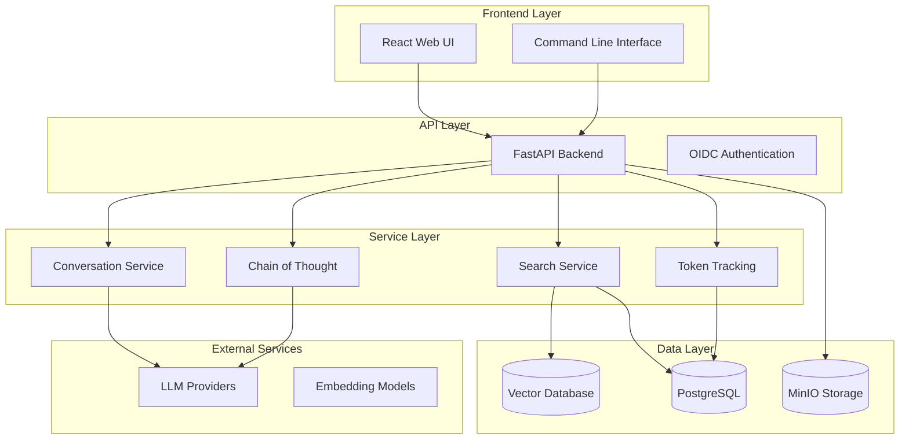

<div align="center">

# RAG Modulo

[](https://opensource.org/licenses/MIT)
[](https://www.python.org/downloads/)
[](https://www.docker.com/)
[](https://fastapi.tiangolo.com/)
[](https://reactjs.org/)

**A production-ready, modular Retrieval-Augmented Generation (RAG) platform with Chain of Thought reasoning, multi-LLM support, and enterprise-grade features**

[🚀 Quick Start](#-quick-start) • [📚 Documentation](https://manavgup.github.io/rag_modulo) • [🛠️ Development](#️-development-workflow) • [✨ Features](#-features--capabilities) • [🤝 Contributing](#-contributing)

</div>

---

## 🎯 What is RAG Modulo?

RAG Modulo is a production-ready Retrieval-Augmented Generation platform that provides enterprise-grade document processing, intelligent search, and AI-powered question answering with advanced Chain of Thought (CoT) reasoning. Built with modern technologies and designed for scalability, it supports multiple vector databases (Milvus, Elasticsearch, Pinecone, Weaviate, ChromaDB), LLM providers (WatsonX, OpenAI, Anthropic), and document formats including enhanced support via IBM Docling integration.

### ✨ Key Features

<div align="center">

| 🧠 **AI-Powered** | 🔍 **Advanced Search** | 💬 **Interactive UI** | 🚀 **Production Ready** |
|:---:|:---:|:---:|:---:|
| Chain of Thought reasoning<br/>Automatic pipeline resolution<br/>Multi-LLM provider support<br/>Token tracking & monitoring | Vector similarity search<br/>Hybrid search strategies<br/>Intelligent source attribution<br/>Auto-generated suggestions | Modern React interface<br/>Real-time document upload<br/>Podcast generation<br/>Voice preview features | Docker + GHCR images<br/>Multi-stage CI/CD<br/>Security scanning<br/>947 automated tests |

</div>

#### 🎨 Frontend Features
- **Modern UI**: React 18 with Tailwind CSS for responsive, accessible design
- **Enhanced Search**: Interactive chat interface with Chain of Thought reasoning visualization
- **Document Management**: Real-time file upload with drag-and-drop support
- **Smart Display**: Document source attribution with chunk-level page references
- **Podcast Generation**: AI-powered podcast creation with voice preview
- **Question Suggestions**: Intelligent query recommendations based on collection content

### 🎉 Current Status: **Production Ready**

<div align="center">

| Component | Status | Progress |
|:---:|:---:|:---:|
| **🏗️ Infrastructure** | ✅ Production Ready | Docker + GHCR + Cloud Deployment |
| **🧪 Testing** | ✅ Comprehensive | 947 tests (atomic, unit, integration, API) |
| **🚀 Core Services** | ✅ Fully Operational | 26+ services with DI pattern |
| **📚 Documentation** | ✅ Extensive | API docs, guides, deployment |
| **🔧 Development** | ✅ Optimized | Containerless local dev workflow |
| **🔒 Security** | ✅ Hardened | Multi-layer scanning (Trivy, Bandit, Gitleaks) |

</div>

---

## 🎉 Recent Major Improvements

<div align="center">

| Feature | Description | Benefit |
|:---|:---|:---|
| **🧠 Chain of Thought** | Automatic question decomposition with step-by-step reasoning | 40%+ better answer quality on complex queries |
| **⚡ Auto Pipeline Resolution** | Zero-config search - backend handles pipeline selection | Simplified API, reduced client complexity |
| **🔒 Security Hardening** | Multi-layer scanning (Trivy, Bandit, Gitleaks, Semgrep) | Production-grade security posture |
| **🚀 Containerless Dev** | Local development without containers | 10x faster iteration, instant hot-reload |
| **📄 IBM Docling** | Enhanced document processing for complex formats | Better PDF/DOCX/XLSX handling |
| **🎙️ Podcast Generation** | AI-powered podcast creation with voice preview | Interactive content from documents |
| **💡 Smart Suggestions** | Auto-generated relevant questions | Improved user experience and discovery |
| **📦 GHCR Images** | Pre-built production images | Faster deployments, consistent environments |

</div>

---

## 🚀 Quick Start

### Prerequisites

| Requirement | Version | Purpose |
|:---|:---:|:---|
| **Python** | 3.12+ | Backend development |
| **Poetry** | Latest | Python dependency management |
| **Node.js** | 18+ | Frontend development |
| **Docker** | Latest | Infrastructure services |
| **Docker Compose** | V2 | Orchestration |

### Option 1: Local Development (⚡ Fastest - Recommended)

**Best for**: Daily development, feature work, rapid iteration

```bash
# 1. Clone repository
git clone https://github.com/manavgup/rag-modulo.git
cd rag-modulo

# 2. Set up environment
cp env.example .env
# Edit .env with your API keys (WatsonX, OpenAI, etc.)

# 3. Install dependencies
make local-dev-setup  # Installs both backend (Poetry) and frontend (npm)

# 4. Start infrastructure (Postgres, Milvus, MinIO, MLFlow)
make local-dev-infra

# 5. Start backend (Terminal 1)
make local-dev-backend

# 6. Start frontend (Terminal 2)
make local-dev-frontend

# OR start everything in background
make local-dev-all
```

**Access Points:**
- 🌐 **Frontend**: http://localhost:3000
- 🔧 **Backend API**: http://localhost:8000/docs (Swagger UI)
- 📊 **MLFlow**: http://localhost:5001
- 💾 **MinIO Console**: http://localhost:9001

**Benefits:**
- ⚡ **Instant reload** - Python/React changes reflected immediately (no container rebuilds)
- 🐛 **Native debugging** - Use PyCharm, VS Code debugger with breakpoints
- 📦 **Local caching** - Poetry/npm caches work natively for faster dependency installs
- 🔥 **Fastest iteration** - Pre-commit hooks optimized (fast on commit, comprehensive on push)

**When to use:**
- ✅ Daily development work
- ✅ Feature development and bug fixes
- ✅ Rapid iteration and testing
- ✅ Debugging with breakpoints

### Option 2: Production Mode (🐳 Docker)

**Best for**: Production-like testing, deployment validation

```bash
# Clone repository
git clone https://github.com/manavgup/rag-modulo.git
cd rag-modulo

# Set up environment
cp env.example .env
# Edit .env with your API keys

# Start with pre-built images from GHCR
make run-ghcr

# OR build and run locally
make build-all-local
docker compose up -d
```

**When to use:**
- ✅ Testing production configurations
- ✅ Validating Docker builds
- ✅ Deployment rehearsal
- ✅ Performance benchmarking

### Option 3: GitHub Codespaces (☁️ Cloud)

**Best for**: Quick experimentation, onboarding, cloud development

1. **Go to repository** → "Code" → "Codespaces"
2. **Click "Create codespace"** on your branch
3. **Start coding** in browser-based VS Code
4. **Run**: `make venv && make run-infra`

**When to use:**
- ✅ No local setup required
- ✅ Consistent development environment
- ✅ Work from any device
- ✅ Team onboarding

---

## 🏗️ Architecture Overview

RAG Modulo follows a modern, service-based architecture with clear separation of concerns:



---

## 🛠️ Development Workflow

### 🎯 Recommended Daily Workflow

**Philosophy**: Develop locally without containers for maximum speed, deploy with containers for production.

```bash
# Morning setup (once per day)
cd rag-modulo
source backend/.venv/bin/activate  # Activate Python environment
make run-infra                      # Start infrastructure (Postgres, Milvus, etc.)

# Terminal 1: Backend with auto-reload
cd backend
uvicorn main:app --reload --port 8000

# Terminal 2: Frontend with HMR
cd frontend
npm run dev

# Development cycle
# 1. Make code changes
# 2. See changes instantly (auto-reload)
# 3. Test manually via http://localhost:3000
# 4. Run quick checks before commit
make quick-check

# End of day cleanup
make local-dev-stop  # Stop infrastructure containers
deactivate           # Deactivate Python venv
```

### 🔧 Essential Development Commands

| Command | Description | When to Use |
|:---|:---|:---|
| `make local-dev-setup` | Install all dependencies (backend + frontend) | First time setup |
| `make local-dev-infra` | Start infrastructure containers only | Daily (Postgres, Milvus, MinIO, MLFlow) |
| `make local-dev-backend` | Start backend with hot-reload | Development (Terminal 1) |
| `make local-dev-frontend` | Start frontend with HMR | Development (Terminal 2) |
| `make local-dev-all` | Start everything in background | Quick full stack startup |
| `make quick-check` | Fast lint + format check | Pre-commit validation |
| `make test-unit-fast` | Run unit tests locally | Rapid testing without containers |
| `make local-dev-stop` | Stop all services | Clean shutdown |

### 🧪 Testing & Quality

```bash
# Fast local testing (no containers)
source backend/.venv/bin/activate
cd backend
pytest tests/unit/ -v              # Unit tests only
pytest tests/integration/ -v       # Integration tests

# Or use Makefile targets
make test-unit-fast                # Fast unit tests
make test-integration              # Integration tests (needs infra)

# Quality checks
make quick-check                   # Fast: format + lint
make lint                          # All linters
make format                        # Auto-fix formatting
make security-check                # Security scans
make coverage                      # Test coverage report
```

### 🐳 Container Development (When Needed)

Only for production-like testing or deployment validation:

```bash
# Build production images
make build-backend
make build-frontend

# Start production environment
make prod-start

# Or use pre-built GHCR images
make run-ghcr
```

---

## 📊 Features & Capabilities

### 🧠 Advanced AI Features

- **Chain of Thought Reasoning**: Automatic question decomposition with step-by-step reasoning, iterative context building, and transparent reasoning visualization
- **Automatic Pipeline Resolution**: Zero-config search experience - backend automatically selects and creates pipelines based on user context
- **Token Tracking & Monitoring**: Real-time usage tracking across all LLM interactions with detailed breakdowns
- **Multi-LLM Support**: Seamless switching between WatsonX, OpenAI, and Anthropic with provider-specific optimizations
- **IBM Docling Integration**: Enhanced document processing for complex formats (PDF, DOCX, XLSX)
- **Question Suggestions**: AI-generated relevant questions based on document collection content

### 🔍 Search & Retrieval

- **Vector Databases**: Pluggable support for Milvus (default), Elasticsearch, Pinecone, Weaviate, ChromaDB via common interface
- **Hybrid Search**: Combines semantic vector similarity with keyword search strategies
- **Source Attribution**: Granular document source tracking with chunk-level page references across reasoning steps
- **Advanced Chunking**: Hierarchical chunking strategies with configurable size and overlap
- **Conversation History**: Context-aware search with conversation memory for multi-turn interactions

### 🏗️ Architecture & Scalability

- **Service-Based Design**: 26+ services with clean separation of concerns and dependency injection pattern
- **Repository Pattern**: Data access abstraction layer for improved testability and maintainability
- **Asynchronous Operations**: Async/await throughout for efficient concurrent request handling
- **Production Deployment**: Docker + GHCR images, multi-stage builds, cloud-ready (AWS, Azure, GCP, IBM Cloud)
- **Modular Design**: Pluggable components for vector DBs, LLM providers, embedding models

### 🧪 Testing & Quality Assurance

- **Comprehensive Test Suite**: 947 automated tests across all layers (atomic, unit, integration, API, E2E)
- **Multi-Layer Testing Strategy**:
  - Atomic tests for schemas and data structures
  - Unit tests for business logic and services
  - Integration tests for service interactions
  - API tests for endpoint validation
- **Security Scanning**: Multi-layer security with Trivy (containers), Bandit (Python), Gitleaks (secrets), Semgrep (SAST)
- **Code Quality**: Ruff linting, MyPy type checking, Pylint analysis, pre-commit hooks
- **CI/CD Pipeline**: Multi-stage GitHub Actions with test isolation, builds, and comprehensive integration testing

---

## 📚 Documentation

### 📖 Complete Documentation

- **[📚 Full Documentation](https://manavgup.github.io/rag_modulo)** - Comprehensive guides and API reference
- **[🚀 Getting Started](docs/getting-started.md)** - Quick start guide
- **[🛠️ Development Guide](docs/development/workflow.md)** - Development workflow and best practices
- **[🧪 Testing Guide](docs/testing/index.md)** - Testing strategies and execution
- **[🚀 Deployment Guide](docs/deployment/production.md)** - Production deployment instructions

### 🔧 Configuration & Tools

- **[⚙️ Configuration Guide](docs/configuration.md)** - Environment setup and configuration
- **[🔌 API Reference](docs/api/README.md)** - Complete API documentation
- **[🖥️ CLI Documentation](docs/cli/index.md)** - Command-line interface guide

### 🛠️ Command-Line Interface (CLI)

RAG Modulo includes a powerful CLI for interacting with the system:

```bash
# After installation, use the CLI commands:
rag-cli --help          # Main CLI help
rag-search              # Search operations
rag-admin               # Administrative tasks

# Example: Search a collection
rag-cli search query <collection-id> "your question here"

# Create a collection
rag-cli collection create --name "My Docs"

# Upload documents
rag-cli collection upload <collection-id> path/to/documents/
```

---

## 🚀 Deployment & Packaging

### Production Deployment

RAG Modulo supports multiple deployment strategies:

#### 1. Docker Compose (Recommended)

```bash
# Start production environment (all containers)
make prod-start

# Check status
make prod-status

# View logs
make prod-logs

# Stop production environment
make prod-stop
```

#### 2. Pre-built Images from GHCR

```bash
# Pull and run latest images from GitHub Container Registry
make run-ghcr
```

**Available Images:**
- `ghcr.io/manavgup/rag_modulo/backend:latest`
- `ghcr.io/manavgup/rag_modulo/frontend:latest`

#### 3. Custom Docker Deployment

```bash
# Build local images
make build-all

# Start services
make run-app
```

### Cloud Deployment Options

<details>
<summary><b>AWS Deployment</b></summary>

- **ECS (Elastic Container Service)**: Use docker-compose.production.yml
- **EKS (Kubernetes)**: Deploy with Kubernetes manifests
- **EC2**: Docker Compose or standalone containers
- **Lambda**: Serverless functions for specific services

</details>

<details>
<summary><b>Azure Deployment</b></summary>

- **Azure Container Instances**: Quick container deployment
- **AKS (Azure Kubernetes Service)**: Production-grade orchestration
- **Azure Container Apps**: Serverless container hosting

</details>

<details>
<summary><b>Google Cloud Deployment</b></summary>

- **Cloud Run**: Fully managed serverless platform
- **GKE (Google Kubernetes Engine)**: Kubernetes orchestration
- **Compute Engine**: VM-based deployment with Docker

</details>

<details>
<summary><b>IBM Cloud Deployment</b></summary>

- **Code Engine**: Serverless container platform
- **IKS (IBM Kubernetes Service)**: Enterprise Kubernetes
- **Red Hat OpenShift**: Advanced container platform

</details>

### Kubernetes Deployment

```bash
# Apply Kubernetes manifests
kubectl apply -f deployment/k8s/

# Or deploy with Helm (if charts exist)
helm install rag-modulo ./charts/rag-modulo
```

---

## 🔄 CI/CD Pipeline

### GitHub Actions Workflows

RAG Modulo uses a comprehensive CI/CD pipeline with multiple stages:

#### 1. Code Quality & Testing (`.github/workflows/ci.yml`)

**Triggers:** Push to `main`, Pull Requests

**Stages:**
1. **Lint and Unit Tests** (No infrastructure)
   - Ruff linting (120 char line length)
   - MyPy type checking
   - Unit tests with pytest
   - Fast feedback (~5-10 minutes)

2. **Build Docker Images**
   - Backend image build
   - Frontend image build
   - Push to GitHub Container Registry (GHCR)
   - Tagged with: `latest`, `sha-<commit>`, branch name

3. **Integration Tests**
   - Full stack deployment
   - PostgreSQL, Milvus, MLFlow, MinIO
   - API tests, integration tests
   - End-to-end validation

**Status Badges:**
```markdown
[](https://github.com/manavgup/rag_modulo/actions)
```

#### 2. Security Scanning (`.github/workflows/security.yml`)

**Triggers:** Push to `main`, Pull Requests, Weekly schedule

**Scans:**
- **Trivy**: Container vulnerability scanning
- **Bandit**: Python security linting
- **Gitleaks**: Secret detection
- **Safety**: Python dependency vulnerabilities
- **Semgrep**: SAST code analysis

#### 3. Documentation (`.github/workflows/docs.yml`)

**Triggers:** Push to `main`, Pull Requests to `docs/`

**Actions:**
- Build MkDocs site
- Deploy to GitHub Pages
- API documentation generation

### Local CI Validation

Test CI pipeline locally before pushing:

```bash
# Run same checks as CI
make ci-local

# Validate CI workflows
make validate-ci

# Security checks
make security-check
make scan-secrets
```

### Pre-commit Hooks

Optimized for developer velocity:

**On Commit** (fast, 5-10 sec):
- Ruff formatting
- Trailing whitespace
- YAML syntax
- File size limits

**On Push** (slow, 30-60 sec):
- MyPy type checking
- Pylint analysis
- Security scans
- Strangler pattern checks

**In CI** (comprehensive):
- All checks run regardless
- Ensures quality gates

### Container Registry

**GitHub Container Registry (GHCR)**:
- Automatic image builds on push
- Multi-architecture support (amd64, arm64)
- Image signing and verification
- Retention policies

**Image Tags:**
- `latest`: Latest main branch build
- `sha-<commit>`: Specific commit
- `<branch>`: Branch-specific builds
- `v<version>`: Release tags

---

## 🧪 Testing

### Test Categories

| Category | Count | Description | Command |
|:---:|:---:|:---|:---|
| **⚡ Atomic Tests** | 100+ | Schema validation, data structures | `pytest -m atomic` |
| **🏃 Unit Tests** | 83+ | Service logic, business rules | `make test-unit-fast` |
| **🔗 Integration Tests** | 43+ | Service interactions, DB integration | `make test-integration` |
| **🔌 API Tests** | 21+ | Endpoint validation, request/response | `pytest -m api` |
| **🌐 E2E Tests** | 22+ | Full workflow scenarios | `pytest -m e2e` |
| **📊 Total** | **947** | Complete test coverage | `make test-all` |

### Running Tests

```bash
# Fast local testing (no containers, recommended for development)
make test-unit-fast

# Specific test categories
make test-atomic       # Schema and data structure tests
make test-integration  # Service integration tests (requires infrastructure)
make test-api          # API endpoint tests

# Full test suite with coverage
make coverage

# Run specific test file
make test testfile=tests/unit/test_search_service.py
```

---

## 🤝 Contributing

We welcome contributions! Please see our [Contributing Guide](docs/development/contributing.md) for details.

### Development Guidelines

1. **Service Layer Architecture** - Follow service-based patterns
2. **Code Quality** - Use type hints, comprehensive docstrings, PEP 8
3. **Testing** - Write tests for all new features
4. **Documentation** - Update docs for any changes

### Contribution Process

1. **Fork and Clone** the repository
2. **Create Feature Branch** from main
3. **Make Changes** following our guidelines
4. **Run Tests** and ensure they pass
5. **Submit Pull Request** with clear description

---

## 📈 Roadmap

### ✅ Phase 1: Foundation (Completed)
- [x] Service-based architecture with 26+ services
- [x] Comprehensive test infrastructure (947 tests)
- [x] Multi-LLM provider support (WatsonX, OpenAI, Anthropic)
- [x] Vector database abstraction layer
- [x] CI/CD pipeline with security scanning

### ✅ Phase 2: Advanced Features (Completed)
- [x] Chain of Thought (CoT) reasoning system
- [x] Automatic pipeline resolution
- [x] Token tracking and monitoring
- [x] IBM Docling integration
- [x] Podcast generation with voice preview
- [x] Question suggestion system
- [x] Containerless local development workflow

### 🔄 Phase 3: Production Enhancement (Current)
- [x] Production deployment with GHCR images
- [x] Multi-stage Docker builds
- [x] Security hardening (Trivy, Bandit, Gitleaks, Semgrep)
- [ ] Enhanced monitoring and observability
- [ ] Performance optimization and caching
- [ ] Authentication system improvements (OIDC)

### 🚀 Phase 4: Enterprise Features (Next)
- [ ] Multi-tenant support
- [ ] Advanced analytics and dashboards
- [ ] Batch processing capabilities
- [ ] API rate limiting and quotas
- [ ] Advanced caching strategies

### 🔮 Phase 5: Innovation (Future)
- [ ] Multi-modal support (image, audio)
- [ ] Agentic AI workflows
- [ ] Real-time collaborative features
- [ ] Advanced reasoning strategies
- [ ] Federated learning support

---

## 🆘 Troubleshooting

### Common Issues

<details>
<summary><strong>🐍 Virtual Environment Issues</strong></summary>

**Problem**: Dependencies not installing

```bash
# Use the Makefile (recommended)
make local-dev-setup

# OR manually:
cd backend
poetry config virtualenvs.in-project true
poetry install --with dev,test
source .venv/bin/activate

# Frontend
cd ../frontend
npm install
```

**Problem**: Wrong tool versions (e.g., Ruff 0.5.7 instead of 0.14.0)

```bash
# Ensure you're in the Poetry virtual environment
cd backend
source .venv/bin/activate
which python  # Should show backend/.venv/bin/python
ruff --version  # Should show 0.14.0
```

**Problem**: `poetry install` fails

```bash
# Update Poetry and retry
poetry self update
poetry cache clear . --all
poetry install --with dev,test --sync
```
</details>

<details>
<summary><strong>🐳 Docker Issues</strong></summary>

**Problem**: Infrastructure services fail to start

```bash
# Use Makefile commands (recommended)
make local-dev-stop    # Stop everything
make local-dev-infra   # Restart infrastructure

# OR manually:
docker compose -f docker-compose-infra.yml down
docker compose -f docker-compose-infra.yml up -d

# Check logs
make logs
```

**Problem**: Port already in use

```bash
# Find what's using the port
lsof -i :8000  # Backend
lsof -i :3000  # Frontend
lsof -i :5432  # Postgres

# Stop all services
make local-dev-stop

# OR kill specific service
kill $(lsof -t -i:8000)
```
</details>

<details>
<summary><strong>🔐 Authentication Issues</strong></summary>

**Problem**: Login attempts fail

- Ensure OIDC configuration is correct in `.env`
- Check IBM Cloud credentials
- Verify redirect URLs match your setup

**Development Mode**: Use mock authentication

```bash
# In .env or .env.dev
SKIP_AUTH=true
DEVELOPMENT_MODE=true
ENABLE_MOCK_AUTH=true
```
</details>

<details>
<summary><strong>🧪 Test Failures</strong></summary>

**Problem**: Tests failing locally

```bash
# Ensure you're in venv
source backend/.venv/bin/activate

# Run specific test
cd backend
pytest tests/unit/test_example.py -v

# Run with more details
pytest tests/unit/test_example.py -vv -s

# Check test dependencies
poetry install --with test --sync
```
</details>

<details>
<summary><strong>📦 Dependency Issues</strong></summary>

**Problem**: Import errors or missing modules

```bash
# Reinstall all dependencies
cd backend
poetry install --with dev,test --sync

# Check what's installed
poetry show

# Verify Python path
python -c "import sys; print(sys.path)"
```
</details>

### Getting Help

1. **📚 Check Documentation**: [Full docs](https://manavgup.github.io/rag_modulo)
2. **🐛 Report Issues**: [GitHub Issues](https://github.com/manavgup/rag_modulo/issues)
3. **💬 Discussions**: [GitHub Discussions](https://github.com/manavgup/rag_modulo/discussions)
4. **📖 See**: `IMMEDIATE_FIX.md` for common development issues

---

## 📄 License

This project is licensed under the **MIT License** - see the [LICENSE](LICENSE) file for details.

---

## 🙏 Acknowledgments

- **IBM Docling** - Advanced document processing and understanding
- **IBM WatsonX** - Enterprise AI foundation models
- **FastAPI** - Modern, high-performance web framework
- **React** - Powerful UI library for building interactive interfaces
- **Milvus** - High-performance vector database
- **Docker** - Containerization and deployment platform
- **All Contributors** - Thank you for your contributions!

---

<div align="center">

**[⬆ Back to Top](#rag-modulo)**

Made with ❤️ by the RAG Modulo Team

[](https://github.com/manavgup/rag_modulo)
[](https://hub.docker.com/r/ragmodulo/backend)
[](https://www.python.org/)

</div>
