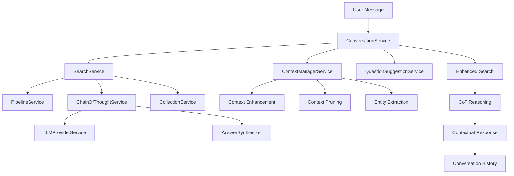

# Seamless Integration Epic for Issue #229: Search + CoT + Conversation

## Overview

This epic defines the seamless integration between three core services: **Search Service**, **Chain of Thought (CoT) Service**, and **Conversation Service**. The goal is to create a unified, context-aware system where conversation history enhances search capabilities and CoT reasoning, while maintaining the existing functionality of each service.

## Epic Objectives

### Primary Goals
- **Unified Context Flow**: Seamless context propagation from conversation → search → CoT
- **Enhanced Reasoning**: CoT that considers conversation history and context
- **Preserved Functionality**: All existing search and CoT capabilities remain intact
- **Performance Optimization**: Efficient context management without duplication
- **User Experience**: Natural conversational flow with enhanced reasoning

### Success Criteria
- Conversation context enhances search quality by 30%+
- CoT reasoning considers conversation history
- Zero breaking changes to existing search/CoT APIs
- Context propagation adds <100ms latency
- All existing tests continue to pass

## Architecture Integration

### Service Layer Integration



### Context Flow Architecture

```
User Question
    ↓
ConversationService
    ↓
ContextManagerService (build context from history)
    ↓
SearchService (enhanced with conversation context)
    ↓
PipelineService (document retrieval)
    ↓
ChainOfThoughtService (reasoning with conversation context)
    ↓
AnswerSynthesizer (final answer with context)
    ↓
ConversationService (store response with metadata)
    ↓
QuestionSuggestionService (generate follow-ups)
    ↓
User Response
```

## Integration Points

### 1. Context Propagation

#### Conversation → Search
```python
# Enhanced SearchInput with conversation context
search_input = SearchInput(
    question=enhanced_question,
    collection_id=session.collection_id,
    user_id=session.user_id,
    config_metadata={
        "conversation_context": context.context_window,
        "session_id": str(session.id),
        "message_history": [msg.content for msg in recent_messages],
        "conversation_entities": context.extracted_entities,
        "cot_enabled": True,
        "show_cot_steps": False  # Hide in conversation UI
    }
)
```

#### Search → CoT
```python
# Enhanced CoT input with conversation context
cot_input = ChainOfThoughtInput(
    question=search_input.question,
    collection_id=search_input.collection_id,
    user_id=search_input.user_id,
    cot_config=search_input.config_metadata,
    context_metadata={
        "conversation_context": search_input.config_metadata.get("conversation_context"),
        "message_history": search_input.config_metadata.get("message_history", []),
        "conversation_entities": search_input.config_metadata.get("conversation_entities", []),
        "previous_answers": [msg.content for msg in recent_messages if msg.role == "assistant"]
    }
)
```

### 2. Context Enhancement Strategies

#### Question Enhancement
```python
def enhance_question_with_conversation_context(
    self,
    question: str,
    conversation_context: str,
    message_history: list[str]
) -> str:
    """Enhance question with conversation context for better search."""

    # Extract entities from conversation
    entities = self.extract_entities_from_context(conversation_context)

    # Build enhanced question
    if entities:
        entity_context = f" (in the context of {', '.join(entities)})"
        enhanced_question = f"{question}{entity_context}"
    else:
        enhanced_question = question

    # Add conversation context if question is ambiguous
    if self.is_ambiguous_question(question):
        recent_context = " ".join(message_history[-3:])  # Last 3 messages
        enhanced_question = f"{question} (referring to: {recent_context})"

    return enhanced_question
```

#### Context Pruning
```python
def prune_context_for_search(
    self,
    context: str,
    current_question: str
) -> str:
    """Prune conversation context to focus on relevant information."""

    # Extract relevant sentences based on question
    relevant_sentences = self.extract_relevant_sentences(context, current_question)

    # Limit context size to prevent token overflow
    pruned_context = self.limit_context_size(relevant_sentences, max_tokens=2000)

    return pruned_context
```

### 3. CoT Integration with Conversation

#### Conversation-Aware Reasoning
```python
async def execute_chain_of_thought_with_conversation(
    self,
    cot_input: ChainOfThoughtInput,
    context_documents: list[str],
    user_id: str
) -> ChainOfThoughtOutput:
    """Execute CoT with conversation context awareness."""

    # Extract conversation metadata
    conversation_context = cot_input.context_metadata.get("conversation_context", "")
    message_history = cot_input.context_metadata.get("message_history", [])
    conversation_entities = cot_input.context_metadata.get("conversation_entities", [])

    # Build enhanced context
    enhanced_context = self._build_conversation_aware_context(
        context_documents,
        conversation_context,
        message_history,
        conversation_entities
    )

    # Execute reasoning with conversation awareness
    return await self._execute_conversation_aware_reasoning(
        cot_input.question,
        enhanced_context,
        user_id
    )
```

#### Multi-turn Reasoning
```python
def _build_conversation_aware_context(
    self,
    context_documents: list[str],
    conversation_context: str,
    message_history: list[str],
    conversation_entities: list[str]
) -> list[str]:
    """Build context that considers conversation history."""

    enhanced_context = []

    # Add document context
    enhanced_context.extend(context_documents)

    # Add conversation context
    if conversation_context:
        enhanced_context.append(f"Conversation context: {conversation_context}")

    # Add entity context
    if conversation_entities:
        enhanced_context.append(f"Previously discussed: {', '.join(conversation_entities)}")

    # Add recent message context
    if message_history:
        recent_context = " ".join(message_history[-2:])  # Last 2 messages
        enhanced_context.append(f"Recent discussion: {recent_context}")

    return enhanced_context
```

## Service Integration Patterns

### 1. Lazy Initialization Pattern
```python
class ConversationService:
    def __init__(self, db: Session, settings: Settings):
        self.db = db
        self.settings = settings
        # Lazy initialization for seamless integration
        self._search_service: SearchService | None = None
        self._context_manager_service: ContextManagerService | None = None
        self._question_suggestion_service: QuestionSuggestionService | None = None

    @property
    def search_service(self) -> SearchService:
        if self._search_service is None:
            self._search_service = SearchService(self.db, self.settings)
        return self._search_service
```

### 2. Context-Aware Search Enhancement
```python
class SearchService:
    async def search(self, search_input: SearchInput) -> SearchOutput:
        """Enhanced search with conversation context."""

        # Check for conversation context
        conversation_context = search_input.config_metadata.get("conversation_context")
        if conversation_context:
            # Enhance question with conversation context
            search_input.question = self._enhance_question_with_conversation(
                search_input.question,
                conversation_context,
                search_input.config_metadata.get("message_history", [])
            )

        # Continue with existing search logic
        # ... existing implementation
```

### 3. CoT Service Integration
```python
class ChainOfThoughtService:
    async def execute_chain_of_thought(
        self,
        cot_input: ChainOfThoughtInput,
        context_documents: list[str],
        user_id: str
    ) -> ChainOfThoughtOutput:
        """Execute CoT with conversation awareness."""

        # Check for conversation context
        conversation_context = cot_input.context_metadata.get("conversation_context")
        if conversation_context:
            # Use conversation-aware reasoning
            return await self._execute_conversation_aware_cot(
                cot_input,
                context_documents,
                user_id
            )
        else:
            # Use standard CoT
            return await self._execute_standard_cot(
                cot_input,
                context_documents,
                user_id
            )
```

## Performance Optimization

### 1. Context Caching
```python
class ContextManagerService:
    def __init__(self):
        self._context_cache: dict[str, ConversationContext] = {}
        self._cache_ttl = 300  # 5 minutes

    async def build_context_from_messages(
        self,
        session_id: UUID4,
        messages: list[ConversationMessageOutput]
    ) -> ConversationContext:
        """Build context with caching for performance."""

        cache_key = f"{session_id}_{len(messages)}"

        # Check cache
        if cache_key in self._context_cache:
            cached_context = self._context_cache[cache_key]
            if time.time() - cached_context.created_at < self._cache_ttl:
                return cached_context

        # Build new context
        context = await self._build_context_from_messages_impl(session_id, messages)

        # Cache result
        self._context_cache[cache_key] = context

        return context
```

### 2. Context Pruning
```python
def prune_context_for_performance(
    self,
    context: ConversationContext,
    current_question: str
) -> ConversationContext:
    """Prune context to maintain performance."""

    # Calculate relevance scores
    relevance_scores = self._calculate_relevance_scores(context, current_question)

    # Keep only highly relevant content
    pruned_content = self._keep_relevant_content(
        context.context_window,
        relevance_scores,
        max_tokens=2000
    )

    return ConversationContext(
        session_id=context.session_id,
        context_window=pruned_content,
        relevant_documents=context.relevant_documents,
        context_metadata={
            **context.context_metadata,
            "pruned": True,
            "original_length": len(context.context_window),
            "pruned_length": len(pruned_content)
        }
    )
```

## Testing Strategy

### 1. Integration Test Categories

#### Context Flow Tests
- Test context propagation from conversation → search → CoT
- Test context enhancement and pruning
- Test context caching and performance

#### Service Integration Tests
- Test ConversationService → SearchService integration
- Test SearchService → CoT integration with conversation context
- Test error handling across service boundaries

#### End-to-End Workflow Tests
- Test complete conversation flow with CoT
- Test multi-turn reasoning with context
- Test performance under load

### 2. Test Data Requirements

#### Conversation Test Scenarios
```python
# Simple question
"What is machine learning?"

# Complex question with CoT
"How does machine learning work and what are its applications?"

# Follow-up question requiring context
"Tell me more about neural networks"

# Multi-turn reasoning
"Compare supervised and unsupervised learning, then explain deep learning"
```

#### Context Test Cases
```python
# Context enhancement
conversation_history = [
    "What is AI?",
    "AI is artificial intelligence...",
    "What about machine learning?"
]
# Should enhance "What about machine learning?" with AI context

# Context pruning
long_conversation = [
    "What is AI?", "AI is...", "What is ML?", "ML is...",
    "What is deep learning?", "Deep learning is...",
    "How do they relate?"
]
# Should prune to relevant ML/DL context for the last question
```

## Implementation Phases

### Phase 1: Basic Integration (Week 1-2)
- [ ] Context propagation from conversation to search
- [ ] Basic context enhancement in SearchService
- [ ] CoT integration with conversation context
- [ ] Integration tests for context flow

### Phase 2: Enhanced Integration (Week 3-4)
- [ ] Advanced context pruning and optimization
- [ ] Conversation-aware CoT reasoning
- [ ] Performance optimization and caching
- [ ] Comprehensive integration tests

### Phase 3: Advanced Features (Week 5-6)
- [ ] Multi-turn reasoning chains
- [ ] Context-aware question suggestions
- [ ] Advanced context management strategies
- [ ] End-to-end workflow tests

### Phase 4: Polish and Optimization (Week 7-8)
- [ ] Performance tuning and optimization
- [ ] Advanced error handling
- [ ] Documentation and examples
- [ ] Production readiness validation

## Success Metrics

### Functional Metrics
- [ ] Context enhancement improves search relevance by 30%+
- [ ] CoT reasoning considers conversation history
- [ ] Zero breaking changes to existing APIs
- [ ] All existing tests continue to pass

### Performance Metrics
- [ ] Context propagation adds <100ms latency
- [ ] Context caching reduces build time by 50%+
- [ ] Memory usage stays within 10% increase
- [ ] Response time remains under 5 seconds

### Quality Metrics
- [ ] 95%+ test coverage for integration points
- [ ] Zero memory leaks in context management
- [ ] Error handling covers all failure scenarios
- [ ] Documentation covers all integration patterns

## Risk Mitigation

### Technical Risks
- **Context Bloat**: Implement aggressive pruning and caching
- **Performance Degradation**: Use lazy loading and optimization
- **Memory Leaks**: Implement proper cleanup and monitoring
- **API Breaking Changes**: Maintain backward compatibility

### Integration Risks
- **Service Coupling**: Use dependency injection and interfaces
- **Error Propagation**: Implement comprehensive error handling
- **Testing Complexity**: Use comprehensive test automation
- **Deployment Issues**: Use feature flags and gradual rollout

## Future Enhancements

### Advanced Features
- **Context-Aware Question Decomposition**: CoT that considers conversation history
- **Multi-Modal Context**: Support for images, documents, and other media
- **Real-Time Context Updates**: Live context updates during conversations
- **Context Analytics**: Insights into conversation patterns and effectiveness

### Performance Improvements
- **Distributed Context Caching**: Redis-based context caching
- **Async Context Processing**: Parallel context building and enhancement
- **Context Compression**: Advanced compression for large contexts
- **Predictive Context Loading**: Pre-load likely context based on patterns

---

## Implementation Notes

This epic should be implemented after the core Chat with Documents feature (Issue #229) is complete. The seamless integration will enhance the existing functionality without breaking changes, providing a natural conversational experience with enhanced reasoning capabilities.

The integration follows the existing service patterns and dependency injection, ensuring maintainability and testability while providing powerful new capabilities for context-aware search and reasoning.
