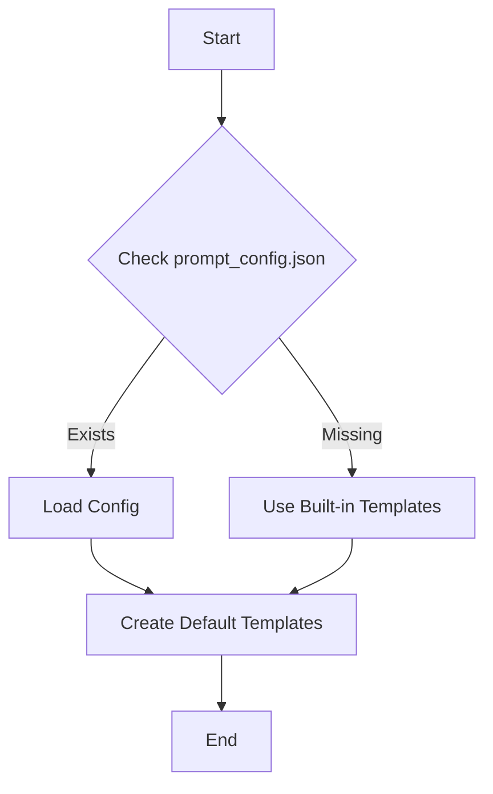

# Prompt Template System

## Overview

The prompt template system provides a flexible way to manage and customize prompts for different LLM providers. It supports default templates, custom templates, and provider-specific configurations.

## Architecture

### Template Storage Hierarchy

```
PromptTemplate (SQLAlchemy Model)
├── EXAMPLE_TEMPLATES (built-in defaults)
│   ├── watsonx_granite
│   ├── llama2
│   ├── claude
│   ├── gpt4
│   └── falcon
└── Database Records
    ├── Default templates (one per provider)
    └── Custom templates
```

### Components

1. **Model (PromptTemplate)**
   - SQLAlchemy model for database storage
   - Built-in example templates
   - Timestamp tracking
   - Default template management

2. **Schema**
   - `PromptTemplateBase`: Common fields and validation
   - `PromptTemplateCreate`: Creation schema with provider validation
   - `PromptTemplateUpdate`: Partial update support
   - `PromptTemplateResponse`: API response format

3. **Repository**
   - CRUD operations
   - Default template management
   - Provider-specific queries

4. **Service**
   - Business logic
   - Template initialization
   - Configuration management

## Configuration

### Database Setup

The prompt template system uses PostgreSQL for template storage. The SQLAlchemy model automatically creates the required table:

```sql
CREATE TABLE prompt_templates (
    id VARCHAR(36) PRIMARY KEY,
    name VARCHAR(255) NOT NULL,
    provider VARCHAR(50) NOT NULL,
    description TEXT,
    system_prompt TEXT NOT NULL,
    context_prefix VARCHAR(255) NOT NULL,
    query_prefix VARCHAR(255) NOT NULL,
    answer_prefix VARCHAR(255) NOT NULL,
    is_default BOOLEAN NOT NULL DEFAULT FALSE,
    created_at TIMESTAMP WITH TIME ZONE NOT NULL DEFAULT NOW(),
    updated_at TIMESTAMP WITH TIME ZONE,
    UNIQUE(name, provider)
);
```

### System Initialization

1. **First-Time Setup**
   - Database tables are created if they don't exist
   - Service checks for default templates
   - If no defaults exist, they are created from either:
     * prompt_config.json if available
     * Built-in EXAMPLE_TEMPLATES if no config

2. **Template Migration**
   - Existing templates are preserved during updates
   - New providers can be added without affecting existing templates
   - Default templates can be updated via prompt_config.json

### Built-in Templates

Templates are provided for common LLM providers:
- IBM Watsonx Granite
- Meta's LLaMA 2
- Anthropic's Claude
- OpenAI's GPT-4
- TII's Falcon

### External Configuration

Optional `prompt_config.json`:
```json
{
    "watsonx": {
        "system_prompt": "...",
        "context_prefix": "Context:",
        "query_prefix": "Question:",
        "answer_prefix": "Answer:"
    },
    // Other providers...
}
```

### Initialization Flow



## Usage

### Creating Templates

```python
template = PromptTemplateCreate(
    name="custom_watsonx",
    provider="watsonx",
    description="Custom template for specific use case",
    system_prompt="Custom system prompt",
    context_prefix="Context:",
    query_prefix="Question:",
    answer_prefix="Answer:",
    is_default=False
)
```

### Managing Templates

```python
# Get default template
default = service.get_default_template("watsonx")

# Create from example
example = service.create_example_template("watsonx_granite")

# Update template
update = PromptTemplateUpdate(
    name="updated_name",
    description="Updated description"
)
service.update_template(template_id, update)
```

## Best Practices

1. **Default Templates**
   - Each provider should have one default template
   - Default templates cannot be deleted
   - Use built-in examples as starting points

2. **Custom Templates**
   - Create provider-specific templates for different use cases
   - Follow provider's prompt engineering guidelines
   - Document template purposes and use cases

3. **Template Management**
   - Use meaningful names and descriptions
   - Test templates before setting as default
   - Keep system prompts focused and clear

## Error Handling

The system provides specific exceptions:
- `PromptTemplateNotFoundError`
- `DuplicatePromptTemplateError`
- `InvalidPromptTemplateError`

## Example Templates

### IBM Watsonx
```python
{
    "name": "watsonx_granite_default",
    "provider": "watsonx",
    "description": "Default template for IBM Watsonx Granite models",
    "system_prompt": "You are a helpful AI assistant powered by IBM Watsonx...",
    "context_prefix": "Context information:\n",
    "query_prefix": "Question:\n",
    "answer_prefix": "Answer:\n"
}
```

### LLaMA 2
```python
{
    "name": "llama2_default",
    "provider": "llama2",
    "description": "Default template for Meta's LLaMA 2 models",
    "system_prompt": "[INST] <<SYS>> You are a helpful AI assistant...",
    "context_prefix": "Reference information:\n",
    "query_prefix": "User question:\n",
    "answer_prefix": "[/INST]\n"
}
```

## Security Considerations

### Access Control
- Templates can contain sensitive business logic and prompting strategies
- Implement role-based access control (RBAC) for template management
- Consider separate permissions for:
  * Viewing templates
  * Creating templates
  * Modifying templates
  * Setting default templates
  * Deleting templates

### Template Validation
- Validate templates before use to prevent prompt injection
- Sanitize user inputs when used with templates
- Consider implementing template content policies
- Monitor template usage for unusual patterns

### Environment Separation
- Use different default templates per environment (dev/staging/prod)
- Consider template versioning for production deployments
- Implement audit logging for template changes
- Regular backup of template configurations

## Integration

### API Endpoints

The prompt template system exposes the following endpoints:

```
GET    /api/v1/templates           # List all templates
GET    /api/v1/templates/{id}      # Get template by ID
POST   /api/v1/templates           # Create new template
PUT    /api/v1/templates/{id}      # Update template
DELETE /api/v1/templates/{id}      # Delete template
GET    /api/v1/templates/provider/{provider}  # Get templates by provider
GET    /api/v1/templates/default/{provider}   # Get default template for provider
```

### Integration with RAG Pipeline

The prompt template system integrates with the RAG pipeline through:

1. **Generator Integration**
   ```python
   # In generation/generator.py
   template = prompt_template_service.get_default_template(provider)
   prompt = f"{template.system_prompt}\n\n"
   prompt += f"{template.context_prefix} {context}\n"
   prompt += f"{template.query_prefix} {query}\n"
   prompt += template.answer_prefix
   ```

2. **Provider Integration**
   - Each provider (watsonx, openai, etc.) uses templates for consistent prompting
   - Templates ensure proper formatting for each provider's requirements
   - Default templates maintain standard behavior

3. **Service Layer Usage**
   ```python
   # Example service integration
   class SearchService:
       def __init__(self, prompt_template_service: PromptTemplateService):
           self._template_service = prompt_template_service
           
       def search(self, query: str, provider: str):
           template = self._template_service.get_default_template(provider)
           # Use template for search...
   ```

### Testing

The system includes comprehensive tests:
- Repository operations
- Service functionality
- Template validation
- Error handling
- Default template management
- API endpoint testing
- Integration testing

## Deployment Considerations

### High Availability
- Templates are critical for RAG pipeline operation
- Consider caching frequently used templates
- Implement fallback mechanisms for template failures
- Monitor template usage and performance

### Monitoring
- Track template usage patterns
- Monitor template performance metrics
- Alert on template failures or issues
- Collect feedback on template effectiveness

### Maintenance
- Regular review of default templates
- Clean up unused templates
- Update templates based on model updates
- Document template changes and versions

## Future Improvements

Potential enhancements:
1. Template versioning
   - Track changes to templates
   - Support rollback to previous versions
   - Version comparison tools

2. Template categories/tags
   - Organize templates by use case
   - Support template discovery
   - Enable filtering and search

3. Usage statistics
   - Track template performance
   - Monitor usage patterns
   - Identify popular templates

4. A/B testing support
   - Compare template effectiveness
   - Automated performance tracking
   - Statistical analysis tools

5. Template sharing/export
   - Export templates to JSON
   - Import from other instances
   - Template marketplace support

6. Advanced validation
   - Syntax checking for prompts
   - Provider-specific validation rules
   - Template testing tools

7. Template composition
   - Reusable template components
   - Template inheritance
   - Component library
