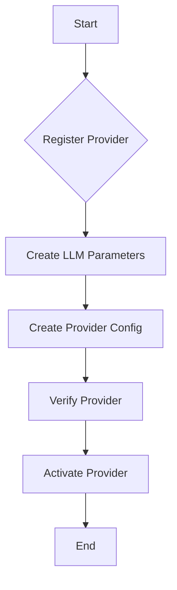

# Provider Configuration System

## Overview

The provider configuration system enables dynamic registration and management of LLM providers and their models. It provides a flexible way to configure and manage different LLM providers with their specific parameters, active status, and verification tracking.

## Architecture

### Configuration Storage Hierarchy

```
ProviderModelConfig (SQLAlchemy Model)
├── Provider Configuration
│   ├── Provider name
│   ├── Model ID
│   ├── Active status
│   └── Verification status
└── LLM Parameters (Foreign Key)
    ├── Model parameters
    ├── Token limits
    └── Temperature settings
```

### Components

1. **Model (ProviderModelConfig)**
   - SQLAlchemy model for database storage
   - Links to LLM parameters
   - Status tracking
   - Verification timestamps

2. **Schema**
   - `ProviderModelConfigBase`: Common fields and validation
   - `ProviderModelConfigCreate`: Creation schema
   - `ProviderModelConfigUpdate`: Partial update support
   - `ProviderModelConfigResponse`: API response format
   - `ProviderRegistryResponse`: Registry listing format

3. **Repository**
   - CRUD operations
   - Provider-specific queries
   - Status management
   - Verification tracking

4. **Service**
   - Business logic
   - Provider registration
   - Model verification
   - Parameter management

## Configuration

### Database Setup

The provider configuration system uses PostgreSQL for storage. The SQLAlchemy model automatically creates the required table:

```sql
CREATE TABLE provider_model_configs (
    id SERIAL PRIMARY KEY,
    model_id VARCHAR(255) NOT NULL,
    provider_name VARCHAR(255) NOT NULL,
    is_active BOOLEAN NOT NULL DEFAULT TRUE,
    last_verified TIMESTAMP WITH TIME ZONE,
    parameters_id INTEGER NOT NULL REFERENCES llm_parameters(id) ON DELETE CASCADE,
    created_at TIMESTAMP WITH TIME ZONE NOT NULL DEFAULT NOW(),
    updated_at TIMESTAMP WITH TIME ZONE NOT NULL DEFAULT NOW(),
    UNIQUE(provider_name, model_id)
);
```

### System Initialization

1. **First-Time Setup**
   - Database tables are created if they don't exist
   - Service validates provider configurations
   - Links with existing LLM parameters

2. **Provider Registration**
   - Providers are registered with their models
   - LLM parameters are created and linked
   - Active status is set
   - Initial verification is performed

### Provider Management Flow



## Usage

### Registering Providers

```python
# Create LLM parameters for the model
parameters = LLMParametersCreate(
    name="watsonx_granite_params",
    description="Parameters for Watsonx Granite model",
    max_new_tokens=100,
    temperature=0.7,
    top_k=50,
    top_p=1.0
)

# Create prompt template
template = PromptTemplateCreate(
    name="watsonx_default",
    provider="watsonx",
    description="Default template for Watsonx",
    system_prompt="You are a helpful AI assistant",
    context_prefix="Context:",
    query_prefix="Question:",
    answer_prefix="Answer:"
)

# Register provider with parameters and template
config = provider_config_service.register_provider_model(
    provider="watsonx",
    model_id="granite-13b",
    parameters=parameters,
    prompt_template=template
)
```

### Managing Providers

```python
# Get provider configuration
config = service.get_provider_model("watsonx", "granite-13b")

# Update provider status
service.update_provider_model(
    provider="watsonx",
    model_id="granite-13b",
    updates={"is_active": False}
)

# Verify provider
service.verify_provider_model("watsonx", "granite-13b")

# List providers
registry = service.list_providers(active_only=True)
```

## Integration

### Generator Integration

The provider configuration system integrates with the generation system:

```python
class Generator:
    def __init__(self, provider_config_service: ProviderConfigService):
        self._config_service = provider_config_service
        
    def generate(self, provider: str, model_id: str, prompt: str):
        # Get provider configuration
        config = self._config_service.get_provider_model(provider, model_id)
        if not config or not config.is_active:
            raise ProviderConfigError(...)
            
        # Use configuration parameters
        params = config.parameters
        # Generate response using configured parameters
```

### Factory Integration

```python
class ProviderFactory:
    def __init__(self, provider_config_service: ProviderConfigService):
        self._config_service = provider_config_service
        
    def create_provider(self, provider: str, model_id: str):
        config = self._config_service.get_provider_model(provider, model_id)
        if not config:
            raise ProviderConfigError(...)
            
        if provider == "watsonx":
            return WatsonxProvider(config)
        elif provider == "openai":
            return OpenAIProvider(config)
```

## Best Practices

1. **Provider Registration**
   - Register providers with appropriate parameters
   - Validate model IDs and provider names
   - Set meaningful parameter names

2. **Status Management**
   - Regularly verify provider availability
   - Update status based on verification
   - Monitor active providers

3. **Parameter Management**
   - Use provider-specific parameter ranges
   - Document parameter choices
   - Test parameter configurations

## Error Handling

The system provides specific exceptions:
- `ProviderConfigError`
  * Registration errors
  * Verification failures
  * Parameter validation errors
  * Status update issues

## Security Considerations

### Access Control
- Implement role-based access for provider management
- Restrict provider registration capabilities
- Control parameter modifications
- Audit provider configuration changes

### Verification
- Regular provider verification
- Automated status updates
- Connection testing
- Parameter validation

## Future Improvements

1. **Provider Versioning**
   - Track provider versions
   - Version-specific parameters
   - Migration support

2. **Health Monitoring**
   - Provider health checks
   - Usage statistics
   - Performance metrics

3. **Parameter Templates**
   - Pre-configured parameter sets
   - Use case specific configurations
   - Parameter inheritance

4. **Provider Discovery**
   - Automatic provider detection
   - Capability discovery
   - Feature detection

## Usage Examples

### Basic Provider Setup

```python
# Register IBM Watsonx provider
watsonx_params = LLMParametersCreate(
    name="watsonx_default",
    description="Default Watsonx parameters",
    max_new_tokens=100,
    temperature=0.7,
    top_k=50,
    top_p=1.0
)

watsonx_template = PromptTemplateCreate(
    name="watsonx_default",
    provider="watsonx",
    description="Default Watsonx template",
    system_prompt="You are a helpful AI assistant powered by IBM Watsonx",
    context_prefix="Context:",
    query_prefix="Question:",
    answer_prefix="Answer:"
)

watsonx_config = provider_config_service.register_provider_model(
    provider="watsonx",
    model_id="granite-13b",
    parameters=watsonx_params,
    prompt_template=watsonx_template
)

# Register OpenAI provider
openai_params = LLMParametersCreate(
    name="openai_default",
    description="Default OpenAI parameters",
    max_new_tokens=150,
    temperature=0.9,
    top_k=50,
    top_p=1.0
)

openai_template = PromptTemplateCreate(
    name="openai_default",
    provider="openai",
    description="Default OpenAI template",
    system_prompt="You are a helpful AI assistant powered by OpenAI",
    context_prefix="Context:",
    query_prefix="Question:",
    answer_prefix="Answer:"
)

openai_config = provider_config_service.register_provider_model(
    provider="openai",
    model_id="gpt-4",
    parameters=openai_params,
    prompt_template=openai_template
)
```

### Advanced Usage

```python
# Get active providers
registry = provider_config_service.list_providers(active_only=True)

# Update provider parameters
provider_config_service.update_provider_model(
    provider="watsonx",
    model_id="granite-13b",
    updates={
        "parameters_id": new_params.id,
        "is_active": True
    }
)

# Verify all providers
for provider in registry.providers:
    provider_config_service.verify_provider_model(
        provider.provider_name,
        provider.model_id
    )
