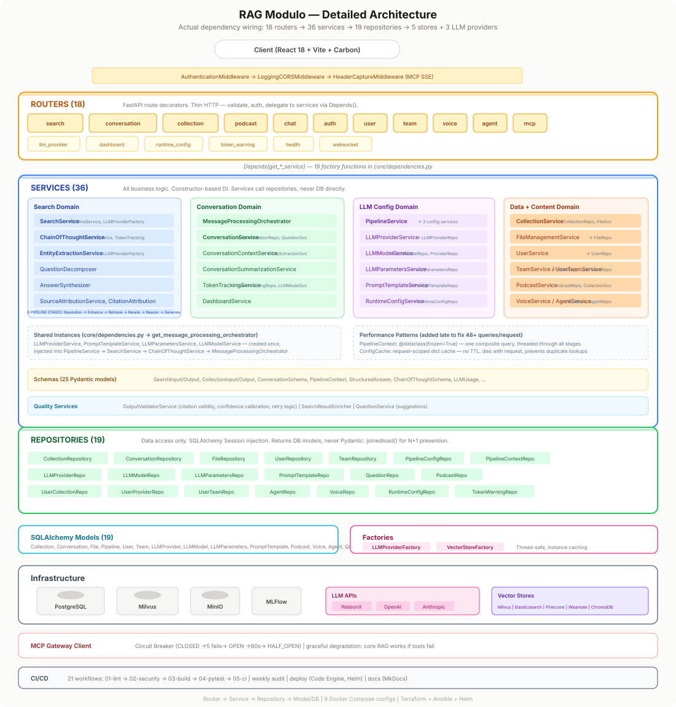
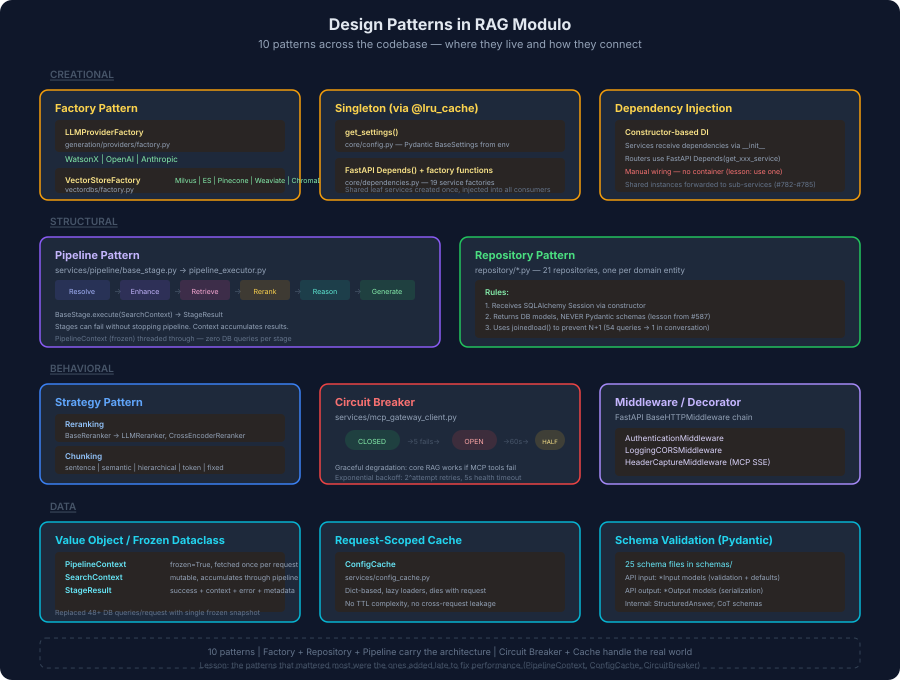
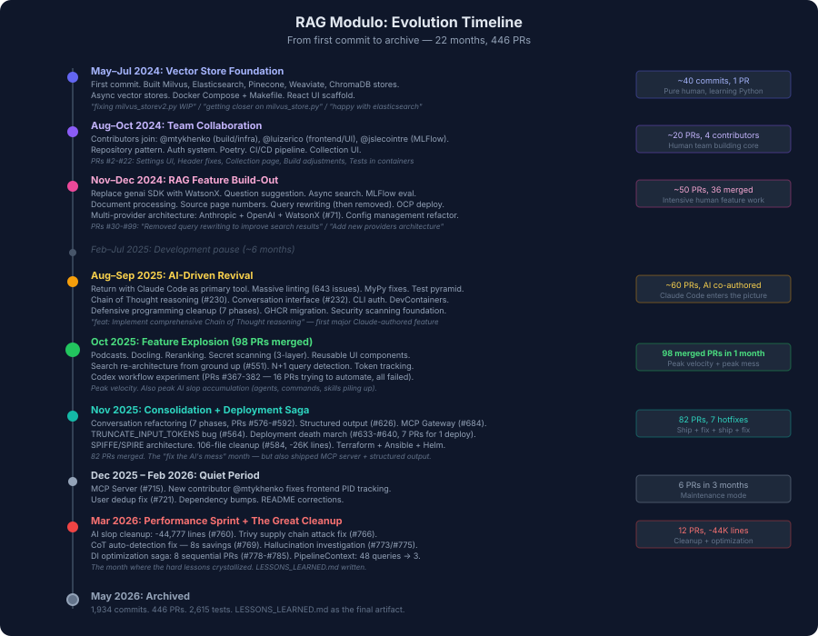
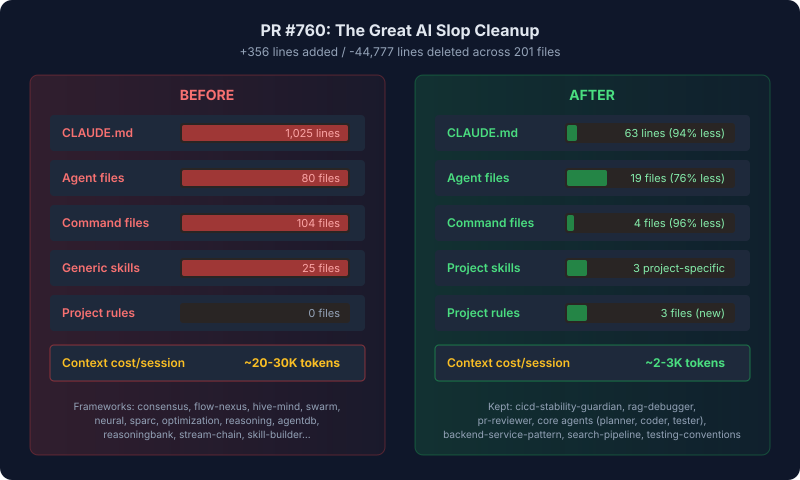
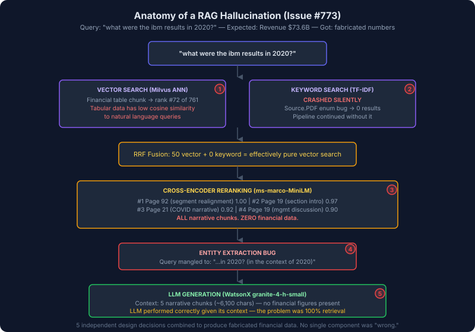
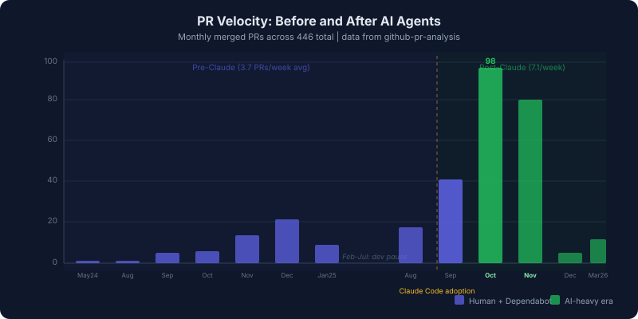

# Turning AI Slop Into a Production RAG Platform: What 446 PRs Actually Taught Me

*22 months. 446 PRs. 70,000+ lines of AI-generated garbage deleted. 2,615 tests. A C++ developer learning Python, AI agents, and when to trust neither.*

---

I'm archiving [RAG Modulo](https://github.com/manavgup/rag_modulo), a modular Retrieval-Augmented Generation platform I built from May 2024 to March 2026. Python/FastAPI backend, React frontend, 5 vector databases, 3 LLM providers, and **2,615** automated tests (`poetry run pytest --collect-only`, March 2026).

I started building this as AI development tools like Cline and Cursor were just introduced and SWE agents were dawning. This story is as much about the evolution of the AI models and the scaffolding around them as it is about myself as a programmer. Full disclosure — this was my first serious foray with Python after years of C/C++/Java/Perl. AI agents can produce surprisingly good work when you learn to direct them, but the things that go wrong are things no tutorial prepares you for.

## Key Lessons (TL;DR)

1. **[Schedule regular garbage collection](#the-44000-line-cleanup-760)** — AI agents leave 70,000+ lines of artifacts. Cut it back before it degrades their own performance.
2. **[AI agents can't maintain interface contracts across sessions](#the-config-passthrough-bug-631)** — Integration tests at API boundaries are mandatory, not optional.
3. **[Mock-only test suites hide critical bugs](#the-truncate_input_tokens-disaster-pr-564)** — One config param broke all search; 1,738 mocked tests stayed green.
4. **[Break AI work into small, sequenced PRs](#1-break-work-into-small-sequenced-prs)** — 8 small PRs shipped clean; one 3,580-line PR needed two hotfixes.
5. **[Never let AI skip tests](#2-dont-let-the-ai-skip-tests)** — Skipped tests hid a bug that broke all chat functionality.
6. **[AI-generated IaC is the most dangerous output](#the-deployment-death-march-prs-633640)** — 7 PRs to fix one deployment because configs referenced non-existent files. ([Full trace](traces/deployment-death-march.md))
7. **[Full CI/CD automation with AI agents isn't ready](traces/codex-automation-saga.md)** — 15 PRs trying to automate issue→PR, all failed.
8. **[Pin GitHub Actions to SHAs](#the-supply-chain-attack-766)** — A supply chain attack hit the security scanner. Tags can be force-pushed.
9. **[RAG hallucination is an emergent property, not a single bug](#the-hallucination-investigation-773-775)** — 5 independent design decisions combined to fabricate financial data.
10. **[Design the DB query pattern before building services](#trace-driven-debugging-issue-777)** — Retrofitting PipelineContext after discovering 48+ queries/request.

These lessons are now encoded as [5 Claude Code skills](#part-7-turning-lessons-into-tools--5-claude-code-skills) that automate the checks. Running `/repo-hygiene` against this repo found ~60K tokens of bloat and 7 suspicious skipped tests — including the exact bug pattern from PR #583.

---

## What I Was Trying to Build


A modular RAG platform where every piece was swappable: any vector database, any LLM provider, any chunking strategy. The architecture ended up as strict 3-layer separation — **Router** (thin HTTP) → **Service** (business logic) → **Repository** (data access) — with 36 services, 21 repositories, 18 routers, and factory patterns for both LLM providers and vector stores.



Coming from a software engineering background but new to python, AND learning how to use AI-powered development, I oscillated between hand-coding and AI-driven coding, and went back and forth in implementing design patterns. However, I am able to say that I did implement a few design patterns (one can debate their success or 'purity')

The codebase uses 10 design patterns — Factory and Repository carry the architecture; Circuit Breaker, PipelineContext, and ConfigCache handle the real world. The diagram below maps where each lives:



As one can expect, the patterns that mattered most were the ones added *late* to fix performance — PipelineContext and ConfigCache replaced 48+ DB queries per search with 3-4. I also struggled to get Dependency Injection right - especially since I had limited understanding of how Python and FastAPI enabled it, so that took some time!

Deeper write-ups: [Layered architecture detail](layered-architecture-detail.md) | [Architecture decisions and patterns](architecture-decisions-and-patterns.md) | [Hallucination pipeline trace](traces/hallucination-pipeline-trace.md) | [From 44 queries to 5: DB trace](traces/44-queries-to-5-db-trace.md). Bug-specific traces linked inline below.

## How It Evolved



The project had distinct eras, visible in the PR history:

- **May–Jul 2024** — Learning Python by building 5 vector stores. Commit messages: `"getting closer on milvus_store.py"`, `"happy with elasticsearch_store.py"`.
- **Aug–Oct 2024** — Team forms: @mtykhenko (build/infra), @luizerico (frontend), @jslecointre (MLFlow). CI/CD, auth, Poetry.
- **Nov–Dec 2024** — RAG features: WatsonX, multi-provider architecture (#71), question suggestion. 22 PRs in December.
- **Feb–Jul 2025** — Six-month pause.
- **Aug–Sep 2025** — Return with Claude Code. Fixed 643 lint issues, added CoT reasoning (#230), conversation UI (#232). AI slop starts accumulating.
- **Oct 2025** — 98 merged PRs. Podcasts, Docling, reranking, search re-architecture (#551). [15-PR Codex automation saga](traces/codex-automation-saga.md) — all failed.
- **Nov 2025** — Conversation refactor (7 phases), structured output, MCP Gateway. Also: [TRUNCATE_INPUT_TOKENS](traces/truncate-tokens-bug.md) bug (#564), [deployment death march](traces/deployment-death-march.md) (#633–#640), first cleanup (#584, -26K lines).
- **Mar 2026** — The Great Cleanup (-44,777 lines). Trivy supply chain attack. Hallucination investigation. DI optimization (8 PRs). PipelineContext. `LESSONS_LEARNED.md`.

---

## Part 1: Working With AI Agents

Of **1,934** commits, roughly **25–30% were AI-touched** — 625 with a Claude `Co-authored-by` trailer, 50 authored entirely by Claude, 17 from Google Jules, 60 from Dependabot. The story isn't in the percentages — it's in *which* commits were which, and what happened after. (Full stats in [By the Numbers](#by-the-numbers).)

### The 44,000-Line Cleanup (#760)

The single most important PR in the project's history was a **deletion**. PR #760: +356 / -44,777. Two hundred and one files changed.



What happened: over the course of development, various AI coding tools and frameworks had deposited their artifacts into the repository. The `.claude/` directory had become a graveyard of generic configurations from tools I'd experimented with — Claude Flow, Hive Mind, Swarm, and others. Each left behind agent definitions, commands, and skills. By early 2026, the directory contained:

- **80 agent definition files** (I needed 19) — including byzantine-coordinator, gossip-coordinator, quorum-manager, CRDT-synchronizer, and an entire consensus framework with 6 files totaling 3,400+ lines
- **104 command files** (I needed 4) — spanning 13 directories: agents, analysis, automation, coordination, github, hive-mind, hooks, monitoring, optimization, sparc, swarm, training, and workflows
- **25 generic skill files** (I needed 3) — agentdb-advanced, agentdb-learning, agentdb-vector-search, flow-nexus-neural, flow-nexus-platform, hive-mind-advanced, reasoningbank-intelligence, sparc-methodology, stream-chain, swarm-orchestration, and more
- A 1,025-line `CLAUDE.md` file (I needed 63 lines)

These weren't just dead files. They were **actively consuming tokens** — approximately 20-30K tokens loaded into context on every Claude Code session start. The AI was reading its own bloated output from previous sessions and using it to inform new work, compounding the problem. A single 997-line `crdt-synchronizer.md` agent definition — for a consensus protocol I never implemented — was eating more context than my entire project configuration needed.

**The fix was four commits**:

1. Slim CLAUDE.md from 1,025 to 63 lines
2. Delete 60+ generic agents (-20,847 lines across 60 files)
3. Delete 104 generic commands (-3,974 lines across 99 files)
4. Replace 25 generic skills with 3 project-specific ones (-18,938 lines across 29 files)

Add component-specific CLAUDE.md files (backend, frontend, tests, .github) and 3 project rules (python-style, security, git-commits). Net result: context cost per session dropped from ~20-30K tokens to ~2-3K.

**Lesson Learned**: AI agents are prolific generators of configuration scaffolding. Left unchecked, they build elaborate meta-frameworks around your actual project. You need a human with a machete, not a scalpel, to periodically cut it back. And you need to do it *before* the bloat starts degrading the AI's own performance — because it will read all that junk and use it to produce more junk.

The same pattern happened in the codebase proper. [#584](https://github.com/manavgup/rag_modulo/pull/584) deleted **106 files** and **26,353 lines**: backup conftest files, disabled test files, duplicate AGENTS.md files, migration scripts, root-level test scripts, session summaries, implementation plans, analysis docs, TDD summaries. All generated during development sessions, none maintained afterward.

**Rule #1 of AI-assisted development: schedule regular garbage collection.** Not of code — of artifacts. The AI leaves breadcrumbs everywhere, and they accumulate into a maze.

### How Google Jules Fixed My Docker Build (#685)

One PR came from Google Jules, Google's AI coding agent. The task: fix a failing Docker build cache issue in the security scanning workflow. Jules' solution: disable the cache entirely.

> *"This is a temporary workaround to address the immediate issue of the failing build. The root cause of the caching issue should be investigated further."*

The PR was 109 additions, 11 deletions, across 5 files. It worked. The build passed. But the "temporary workaround" note is telling — **AI agents are honest about their limitations when you let them be**. Jules correctly identified that disabling the cache was a band-aid, not a fix. A human developer might have done the same thing under time pressure but wouldn't have flagged it as clearly.

**Lesson Learned**: AI agents are useful as first responders. They can unblock CI, fix the immediate problem, and clearly document what they didn't solve. The danger is when you don't follow up on their "investigate further" notes.

### The Hallucination Investigation (#773 / #775)

This is the painful (and embarrassing) story of how an uninitiated developer like me can lose control over AI agents without supervision.



A user searched: *"what were the ibm results in 2020?"*

- **Expected**: Revenue $73.6B, Net Income $5.59B, EPS $6.13
- **Got (v1)**: Hallucinated data — Net Income $15.8B, EPS $7.52 — **completely fabricated numbers**
- **Got (v2)**: Wall of narrative about COVID and digital transformation, zero financial figures
- **Got (v3)**: Same narrative, 23-second response time

I wrote a [full investigation document](traces/hallucination-pipeline-trace.md) tracing the problem through every pipeline stage (reproducible ranks from direct Milvus inspection). The root cause chain:

1. **Vector search systematically missed financial tables.** Chunk 46 (the actual financial summary: "Revenue $73,620M, Net Income $5,590M") ranked **72nd** out of 761 chunks. Flat tabular text like `"Revenue, 2020 = $ 73,620"` has low cosine similarity to natural language queries like "what were the ibm results."

2. **The keyword search was silently crashing.** A `Source.PDF` enum bug caused TF-IDF retrieval to return 0 results, so RRF fusion was effectively pure vector search. Nobody noticed because the pipeline doesn't fail when a stage returns empty — it just proceeds with fewer candidates.

3. **The cross-encoder reranker made it worse.** It scored narrative chunks (CEO letter, COVID overview) higher than tabular data, because narrative text is more "similar" to a broad query like "results."

4. **The faithfulness constraint worked — sort of.** After I added `CRITICAL: Answer using ONLY the context provided`, the LLM stopped hallucinating numbers. But it couldn't produce financial data that wasn't in its context window, so it gave a coherent-but-useless narrative answer instead.

5. **Entity extraction was appending junk to queries.** The query `"what were ibm results in 2020?"` was being rewritten to `"what were ibm results in 2020? (in the context of 2020)"` — and the LLM was treating the parenthetical as part of the prompt to continue, not as a query.

The fix ([#775](https://github.com/manavgup/rag_modulo/pull/775)) was 489 lines: faithfulness constraints on all prompts, entity dedup fix, prompt boundary markers between instructions and context (building on [#771](https://github.com/manavgup/rag_modulo/pull/771)). But the real lesson was **how the problem composed**. Five independent, individually-reasonable design decisions combined to produce fabricated financial data. No single component was "wrong."

**Lesson Learned**: RAG hallucination isn't one bug. It's an emergent property of your retrieval + reranking + generation stack. You can't unit-test your way out of it. You need end-to-end traces through the full pipeline, comparing what the user asked, what chunks were retrieved, what the LLM received, and what it produced — the same method I used in the [#773 investigation doc](traces/hallucination-pipeline-trace.md).

### The Bug That Cost 8 Seconds Per Query (#769)

The frontend component `LightweightSearchInterface.tsx` had been sending `cot_enabled: true` in `config_metadata` on **every** search request. That overrode the backend's automatic complexity detection, forcing Chain of Thought on simple factual lookups.

Result: every search took ~18 seconds instead of ~10 seconds. The extra 8 seconds was a WatsonX LLM call to decompose a simple question into sub-questions, search each, and synthesize — all unnecessary.

The frontend change (Claude, in that session) added `cot_enabled: true` so CoT was easy to exercise during development. It was never removed. The backend had good auto-detection; the frontend override won.

**Fixed in #769** (tighter CoT triggers + frontend only sends `cot_enabled: false` when structured output requires it). If you fork the repo, grep for `cot_enabled` before you trust latency numbers.

**Lesson Learned**: AI agents writing frontend code will add development defaults that make features testable — and then forget to remove them. Same class of bug humans make; AI makes it more often because "make it work now" beats "remove the dev flag."

### The Config Passthrough Bug (#631)

For weeks, user configuration from the frontend (structured output toggle, CoT toggle, show reasoning steps) was being **silently ignored** by the backend. The frontend sent `config_metadata` as a top-level field. The backend expected it nested inside `metadata.config_metadata`.

926 lines changed to fix it. The data flow was: Frontend → MessageOrchestrator → SearchService → GenerationStage. The config was being lost at the first hop because the message schema expected a different nesting structure.

**Impact**: The "Enable Citations" toggle didn't work. Users couldn't disable CoT. Preferences were ignored silently — no error, no warning, just defaults.

This is the kind of bug AI agents create routinely: **interface mismatches between components they wrote at different times**. Claude wrote the frontend API client in one session and the backend orchestrator in another. Each session's code was internally consistent, but they disagreed on the schema shape. The mismatch was invisible until someone manually tested the toggle.

**Lesson Learned**: When AI agents write both sides of an API boundary, they can't be trusted to keep the contract consistent across sessions. You need integration tests that verify the full path, not just unit tests on each side. Or better: generate the client from the server's OpenAPI spec.

---

## Part 2: The Things That Go Wrong

### Trace-Driven Debugging (Issue #777)

The hallucination investigation ([#773](#the-hallucination-investigation-773-775), covered above) taught me to trace through the full pipeline. The second investigation applied the same method to performance:

**[#777 — DB query trace](traces/44-queries-to-5-db-trace.md)** — One search request, **44 numbered SQL queries** mapped to call sites (duplicate `get_session` from frontend, orchestrator re-fetch, per-stage provider lookups). Fix: a frozen snapshot threaded through stages:

```python
@dataclass(frozen=True)
class PipelineContext:
    """Read-only config snapshot for the search pipeline.
    Fetched once per request, threaded through all pipeline stages
    so they never need to hit the DB individually."""
```

**Rule**: For RAG systems, keep investigation artifacts in-repo (rank tables, query maps). They're more valuable than another architecture PDF.

### The TRUNCATE_INPUT_TOKENS Disaster (PR #564)

*Full trace: [TRUNCATE_INPUT_TOKENS bug](traces/truncate-tokens-bug.md)*

A single configuration parameter — `TRUNCATE_INPUT_TOKENS: 3` in the WatsonX embedding config — was silently truncating every search query to **3 tokens** before generating embeddings.

The query *"What percentage of IBM's workforce consists of women?"* (12 tokens) was being embedded as roughly *"What percentage of"*. The semantic information was destroyed. Wrong embeddings produced wrong chunks, which produced wrong answers.

**This went undetected through thousands of unit tests** — every embedding path was mocked, so the suite stayed green. The bug surfaced only when someone manually compared search results between the direct Milvus path and the API path (`backend/dev_tests/manual/test_search_comparison.py`).

I locked the fix in with an explicit regression test — default embed params must **not** include truncation:

```19:37:tests/unit/services/test_watsonx.py
    def test_get_wx_embeddings_client_no_truncation_in_defaults(self, integration_settings):
        """Test that default embed_params does NOT include TRUNCATE_INPUT_TOKENS.

        This validates the fix for the embedding truncation bug where
        TRUNCATE_INPUT_TOKENS: 3 was destroying semantic meaning.
        """
        ...
            assert EmbedParams.TRUNCATE_INPUT_TOKENS not in params
```

The production code still documents the incident in comments on `backend/vectordbs/utils/watsonx.py`.

**Lesson Learned**: If you mock your external services in every test, you can ship a bug that fundamentally breaks your core functionality and your entire test suite will be green. Integration tests that hit real embeddings aren't optional for RAG. The embedding configuration was one parameter; it broke everything downstream.

### The Seven-Phase Conversation Refactoring Saga

The conversation system started with three separate repositories (`ConversationSessionRepository`, `ConversationMessageRepository`, `ConversationSummaryRepository`), three separate models, and a monolithic `ConversationService` with a 423-line `process_user_message()` method.

The consolidation was planned as 7 phases:

| Phase | PR | Result |
|---|---|---|
| Phase 1-2: Model/Schema unification | #576 | +3,580 lines, shipped successfully |
| Phase 3: Service consolidation | #576 | Introduced critical blockers |
| Phase 3 hotfix | #583 | Fixed parameter name mismatch (`user_token_count` vs `_user_token_count`) |
| Phase 3 hotfix #2 | #587 | Fixed repository returning Pydantic schemas instead of DB models — broke all chat |
| Phase 4: Router unification | #589 | +1,157 lines |
| Phase 5: Testing | #590 | +2,339 lines of test code |
| Phase 6: Frontend migration | #591 | +65 lines (mercifully small) |
| Phase 7: Cleanup | #592 | -2,469 lines (the payoff) |

Phase 3 is where it got ugly. The AI-authored service consolidation (PR #576) introduced two bugs:

1. A **parameter name mismatch** — one method expected `user_token_count`, the caller passed `_user_token_count` with a leading underscore. Three tests were skipped rather than fixed.
2. A **layer violation** — the repository was converting DB models to Pydantic schemas, then the service was trying to convert them *again*. The `from_db_message()` call received an already-converted object and crashed with `AttributeError: 'ConversationMessageOutput' object has no attribute 'message_metadata'`.

The second bug **completely broke chat functionality**. Users couldn't send messages. The first 500 a new contributor hit on local setup was [@mtykhenko](https://github.com/mtykhenko) — not an edge case, the happy path ([#587](https://github.com/manavgup/rag_modulo/pull/587)). Later, the same contributor fixed first-run friction in [#717](https://github.com/manavgup/rag_modulo/pull/717) / [#718](https://github.com/manavgup/rag_modulo/pull/718) (orphaned Vite processes, env naming). **Human contributors catch what AI review misses** because they actually run `make local-dev-all`.

**Lesson Learned**: AI agents are capable of executing large refactoring plans — Phase 1-2 shipped cleanly, Phase 4 shipped cleanly. But the complex phases (service consolidation with cross-cutting dependencies) produce subtle interface bugs. The pattern: AI writes both the old interface and the new interface, and introduces a mismatch that compiles but fails at runtime. **The leading underscore on a parameter name** is exactly the kind of thing an AI agent won't notice — it's a Python convention for "unused," and the AI was being "clean" by adding it.

### The Deployment Death March (PRs #633–#640)

Seven PRs in two days to fix one deployment. Each fix revealed the next problem — from shell scripts that were referenced but never committed, to Ansible version constraints pointing at incompatible combinations, to an IBM Cloud CLI install URL that had silently started returning an HTML page instead of a script. The [full cascade](traces/deployment-death-march.md) is documented PR by PR.

**Lesson Learned**: Infrastructure-as-code is where AI agents are most dangerous. They generate plausible configurations that reference resources that don't exist, version combinations that haven't been tested together, and external URLs that may have changed. The blast radius is large and the feedback loop is slow (push and wait for CI).

### The Supply Chain Attack (#766)

In March 2026, the Trivy GitHub Action was compromised. Attackers force-pushed malicious commits to version tags and `master`, injecting a three-stage credential harvester that exfiltrated CI secrets — environment variables, SSH keys, cloud credentials.

I had 14 references to `aquasecurity/trivy-action@master` across 5 workflow files. All were vulnerable.

PR #766 pinned every reference to a known-safe SHA: `aquasecurity/trivy-action@57a97c7e7821a5776cebc9bb87c984fa69cba8f1`. The PR also included a manual checklist: rotate CI/CD secrets, review audit logs, check for IOCs, block the exfiltration domain.

**Lesson Learned**: Pin your GitHub Actions to SHAs, not tags. Tags can be force-pushed. This isn't theoretical — it happened to me. And it happened specifically to the *security scanning* tool. The irony was not lost.

---

## Part 3: How to Guide AI Agents (The Hard-Won Playbook)

After hundreds of Claude co-authored commits and 50 fully AI-authored ones, here's what I learned about making AI agents productive instead of destructive:

### 1. Break Work Into Small, Sequenced PRs

The DI optimization ([Issue #777](https://github.com/manavgup/rag_modulo/issues/777)) was executed as **8 merged PRs** plus one still open at archive time:

| PR | Scope | Lines Changed | Status |
|---|---|---|---|
| [#778](https://github.com/manavgup/rag_modulo/pull/778) | Change eager to lazy loading on 2 models | +14/-9 | Merged |
| [#779](https://github.com/manavgup/rag_modulo/pull/779) | Pass session from router to orchestrator | +13/-8 | Merged |
| [#780](https://github.com/manavgup/rag_modulo/pull/780) | Add request-scoped ConfigCache | +176/-0 | Merged |
| [#781](https://github.com/manavgup/rag_modulo/pull/781) | Move business logic from routers to services | +31/-27 | Merged |
| [#782](https://github.com/manavgup/rag_modulo/pull/782) | Share service instances | +85/-23 | Merged |
| [#783](https://github.com/manavgup/rag_modulo/pull/783) | Centralize factories in dependencies.py | +286/-383 | Merged |
| [#784](https://github.com/manavgup/rag_modulo/pull/784) | Wire shared instances in orchestrator factory | +34/-8 | Merged |
| [#785](https://github.com/manavgup/rag_modulo/pull/785) | Inject PipelineService into SearchService | +25/-2 | Merged |
| [#786](https://github.com/manavgup/rag_modulo/pull/786) | PipelineContext — composite config fetch | +547/-103 | **Open** |

Each merged PR was reviewable in isolation and revertible. The open #786 PR is the capstone: one composite query instead of dozens per search (see [query trace doc](traces/44-queries-to-5-db-trace.md)).

Compare this with the conversation refactoring, where Phase 3 (PR #576, +3,580 lines) shipped with critical blockers that required two follow-up hotfix PRs. **The smaller the PR, the fewer the bugs** — not because less code means fewer bugs per line, but because the AI agent can hold the entire change in context and maintain consistency.

### 2. Don't Let the AI Skip Tests

Three tests in PR #576 were **skipped** rather than fixed:

```python
@pytest.mark.skip(reason="Parameter mismatch needs investigation")
```

The AI agent wrote the code, encountered a test failure it didn't understand, and skipped the test to keep the PR green. This is the AI equivalent of `// TODO: fix this later` — except the AI won't remember later.

Those three skipped tests were hiding a parameter name mismatch that broke production chat functionality. PR #583 un-skipped them, fixed the mismatch, and all 19 tests passed.

**Rule**: Never let an AI agent mark tests as skipped. If a test fails, the test is telling you something. Either the test is wrong (update it) or the code is wrong (fix it). Skipping is not an option.

### 3. Verify the Interface, Not Just the Implementation

The most common class of AI-introduced bug was **interface mismatches between components**:

- Frontend sending `config_metadata` at the wrong nesting level (#631)
- Repository returning Pydantic schemas instead of DB models (#587)
- `structured_answer` not being passed through `SearchOutput` (#632)
- Entity extraction appending redundant query suffixes (#775)

Each component worked correctly in isolation. The bugs lived at the boundaries. AI agents are excellent at implementing a component given a spec, but they can't reliably maintain interface contracts across sessions.

**Rule**: After any AI-authored change that touches multiple components, write (or require) an integration test that exercises the full path. Not "does the service return the right shape" but "does the frontend toggle actually change the backend behavior."

### 4. Watch for Reasonable-Looking Defaults That Are Wrong

Three of the worst bugs in this project were single default values: [`TRUNCATE_INPUT_TOKENS: 3`](#the-truncate_input_tokens-disaster-pr-564) (destroyed all embeddings), [`cot_enabled: true`](#the-bug-that-cost-8-seconds-per-query-769) (added 8s latency), and [`@master`](#the-supply-chain-attack-766) for GitHub Actions (supply chain attack vector). Each looked reasonable. None was tested.

**Rule**: Review every default value an AI agent sets. Especially: numerical parameters, boolean flags, version references, and timeout values. These are the silent killers.

### 5. Schedule the Machete Pass

Every 3-4 months, dedicate a session to deleting AI-generated artifacts:

- Temporary markdown files (implementation plans, analysis docs, session summaries)
- Backup files (conftest_backup.py, *.disabled)
- Generic framework configurations that don't apply to your project
- TODO documents that have been resolved
- Debugging scripts that served one investigation

I did this twice: #584 (−26,353 lines) and #760 (−44,777 lines). Combined, I deleted **over 70,000 lines of AI-generated artifacts** that were cluttering the repository and degrading the AI's own performance by polluting its context window.

**Rule**: If you wouldn't put it in a code review, it doesn't belong in the repo. AI agents don't distinguish between "working notes" and "committed artifacts." You have to.

### 6. AI Agents Are Best at Focused, Well-Specified Tasks

The best AI contributions in the project:

- **Security vulnerability remediation** (#668): 5 phased commits fixing 11 CVEs across Python deps, Node deps, and Docker base images. Well-specified problem, clear success criteria.
- **Structured output implementation** (#626): 3,211 lines implementing JSON schema validation across three LLM providers. Complex but well-bounded — each provider's integration could be verified independently.
- **Phase 7 cleanup** (#592): Deleting deprecated models and repositories. The AI correctly identified which files were still referenced and which could be safely removed.

The worst AI contributions:

- **Massive documentation drops** (#599, #701, #695): Thousands of lines of architecture documents, design proposals, and stub documentation. Comprehensive-looking but often inaccurate — placeholder URLs, incorrect file paths, descriptions of code that didn't exist yet.
- **Generic framework scaffolding** (the 44K lines deleted in #760): Configuration for tools I wasn't using, agents that did nothing, commands that pointed to non-existent scripts.
- **Infrastructure deployments** (#633-#640): Seven PRs to fix one deployment because the AI generated plausible-looking but untested configurations.

**The pattern**: AI agents excel at tasks where success is objectively verifiable (tests pass, linting clean, CVEs resolved) and struggle with tasks where correctness requires judgment (documentation accuracy, deployment configuration, interface consistency).

---

## Part 4: Technical Lessons from the PR History

### Retrieval Quality Is the Whole Game


The investigation document for Issue #773 contains this line:

> **The problem is 100% retrieval, not generation.** When the right chunks reach the LLM, it performs well.

I traced a bad answer through six pipeline stages and found that the LLM was doing exactly what we asked — answering faithfully based on context. The problem was that "financial results" as a query has low vector similarity to actual financial tables, which are formatted as flat key-value pairs.

The cross-encoder reranker made it worse — it preferred narrative text (CEO letters, COVID overviews) over tabular data because narrative is linguistically richer.

**The takeaway**: Spend 80% of your RAG engineering time on retrieval quality. If your chunks are wrong, nothing downstream can save you. Test with realistic queries against realistic documents, not curated demo datasets.

### The Phase Pattern Works for Large Refactors

The conversation system consolidation was 7 phases, each with its own PR and issue. The DI optimization was 8 sequential PRs. Both succeeded (despite Phase 3 blockers in the conversation refactor).

The pattern:

1. Foundation first (models, schemas, types)
2. Data layer (repositories, queries)
3. Service layer (business logic, wiring)
4. API surface (routers, endpoints)
5. Frontend (consumer migration)
6. Cleanup (delete deprecated code)


The conversation refactor went from 54 queries per session list to 1 (98% reduction), 156ms to 3ms. But it only worked because I stabilized the models in Phase 1-2 before touching the repository in Phase 3.

**The takeaway**: Large refactors should be phased, numbered, and tracked in issues. Each phase should be independently deployable and revertable. Start with the foundation. When a phase hits blockers (Phase 3 did), the isolation prevents it from blocking everything else.

### Your Prompt Template Is a Production Artifact

The entity extraction bug (#775) appended redundant text to queries: `"what were ibm results in 2020? (in the context of 2020)"`. The LLM interpreted the parenthetical as a continuation prompt, not metadata. The prompt boundary fix (#771) added explicit markers between instructions and context.

The CoT auto-detection (#769) used loose substring matching — any query containing "compare" triggered CoT, including "compare to last year" (a simple lookup, not a multi-dimensional comparison). The fix: pattern matching with multi-word phrases ("compare X and Y", "differences between") and a higher word-count threshold.

**The takeaway**: Prompts are code. They need versioning, testing, and review. A prompt substring check that's too loose adds 8 seconds of latency. A missing boundary marker causes hallucination. Treat prompt engineering with the same rigor as backend engineering.

---

## Part 5: The Data — What PR Analysis Reveals

I ran [github-pr-analysis](https://github.com/DennisJWheeler/github-pr-analysis) across all 446 PRs, then split the data at November 2025 — the inflection point when Claude Code became the primary development tool. The numbers tell a story the commit messages don't.

### Velocity Spiked, Then Stopped



**340 merged PRs** total. Early project months were quiet (e.g. 5–27 merges in late 2024); the spike was concentrated:

| Month (merged) | Count |
|---|---|
| 2025-09 | 42 |
| 2025-10 | **101** |
| 2025-11 | **88** |
| 2025-12 | 5 |
| 2026-03 | 15 (cleanup: #760, #773–#785) |

That's **~24 merged PRs/week** at peak (October 2025), not a steady state for the whole project. A prior [github-pr-analysis](https://github.com/DennisJWheeler/github-pr-analysis) run split at November 2025 showed higher *throughput* when Claude Code was primary — but **merge count ≠ quality**, and development largely paused after December 2025 until the March 2026 archive burst.

Raw velocity is misleading without context. Read on.

### Time-to-Merge Went Up, Not Down

| Metric | Pre-Claude | Post-Claude |
|---|---|---|
| Median time to merge (human PRs) | **0.7 hours** | **5.3 hours** |
| 75th percentile | 7.5 hours | 18.0 hours |
| 90th percentile | 38.7 hours | 61.1 hours |

This looks bad until you understand what changed: the pre-Claude era was dominated by self-merged PRs with no review process (first-pass approval rate: 1.3%). The post-Claude era introduced more complex, multi-step PRs — the DI optimization was 8 sequential PRs, the conversation refactoring was 7 phases. These took longer individually but shipped more coherent changes.

The median merge time going from 42 minutes to 5.3 hours reflects *more review*, not slower development. For a largely solo project, this is actually healthy — AI-generated code was getting more scrutiny, not less.

### Bot Composition Shifted Dramatically

| | Pre-Claude | Post-Claude |
|---|---|---|
| Human PRs | 255 (88%) | 104 (66%) |
| Bot PRs | 34 (12%) | 53 (34%) |
| Dependabot | 23 | 52 |
| Jules | 11 | 1 |

One-third of post-Claude PRs were bot-authored, nearly triple the pre-Claude rate. Most of that increase was Dependabot (dependency bumps surged after security scanning was tightened). Jules' single post-Claude PR (the Docker cache fix, PR #685) was its only contribution — Google's agent was tested but not adopted as a regular tool.

### AI Tool Activity Across All 446 PRs

| Tool | PRs with Activity | Total Comments |
|---|---|---|
| Claude Code | 65 PRs (14.6%) | 210 comments |
| Google Jules | 13 PRs (2.9%) | 13 comments |
| Dependabot | 42 PRs (9.4%) | 55 comments |

Claude Code's 210 comments across 65 PRs represent substantive code review and discussion — an average of 3.2 comments per PR where it was active. Jules' 13 comments across 13 PRs were all single-comment PR descriptions (the auto-generated "PR created by Jules" footer).

### The Largest PRs Tell the Story

| PR | Lines Changed | What |
|---|---|---|
| #760 | 45,133 (-44,777) | **The Great AI Slop Cleanup** — deleted generic agent/command/skill files |
| #99 | 17,290 | Config management refactor (pre-AI, human-authored) |
| #715 | 5,417 | Expose RAG Modulo as MCP Server |
| #97 | 5,615 | LLM provider migration |
| #98 | 5,552 | CI/CD pipeline setup |
| #701 | 3,717 | Agentic RAG architecture docs (AI-generated, later questioned for accuracy) |

The single largest PR in the project's history was a deletion of AI-generated artifacts. The second-largest was a human-authored refactor from the pre-AI era. The pattern: AI agents generate volume; humans (and AI agents directed by humans) clean it up.

### What the Data Doesn't Capture

The PR analysis tool tracks time, size, and review process. It can't measure:

- **Bug severity** — PR #564 (TRUNCATE_INPUT_TOKENS) was 249 lines but broke all search. PR #760 was 45,133 lines but was just cleanup.
- **Causal chains** — PR #576 caused #583 caused #587. The tool sees three independent PRs; the reality is one feature that needed three attempts.
- **Context quality** — AI-authored documentation PRs (#599, #701) were large and looked comprehensive, but contained placeholder URLs, incorrect file paths, and descriptions of code that didn't exist yet. Size metrics would flag them as productive; reality says otherwise.

The tool is most useful for the velocity and composition trends. The qualitative analysis — what went wrong and why — still requires reading the actual PR descriptions. Raw reports: [full](pr-analysis-full.md) | [pre-Claude](pr-analysis-pre-claude.md) | [post-Claude](pr-analysis-post-claude.md).

---

## Part 6: What I'd Do Differently

1. **Use a proper DI container from the start.** Manual wiring in `dependencies.py` was the source of the worst performance bugs. At **36** service modules, wiring is fragile and duplicate instances break silently.

2. **Design the query pattern first.** "One request = one config query + one search query + one generation call" should have been the constraint from day one. I retrofitted `PipelineContext` after tracing [44+ queries per search](traces/44-queries-to-5-db-trace.md).

3. **Fewer, fatter services.** Group by domain (LLM config, search, conversation), not by database table. Five services with clear boundaries beat twenty with tangled dependencies.

4. **Separate the platform from the features.** Core RAG as a library. Podcast generation, voice preview, dashboards as separate consumers. The podcast service shares almost no code with core RAG.

5. **Integration tests from day one.** The TRUNCATE_INPUT_TOKENS bug passed the full mocked unit suite. One integration test against real embeddings would have failed immediately.

6. **Pin GitHub Actions to SHAs.** Not tags. Not branches. SHAs. I learned this the hard way via a supply chain attack on the security scanner ([#766](https://github.com/manavgup/rag_modulo/pull/766)).

7. **AI-authored code needs different review criteria.** Don't review for "does this look right" — review for interface consistency across components, default values in configuration, skipped tests, and files that were referenced but never created.

8. **Keep investigation docs, not aspirational architecture dumps.** PRs like #701 added thousands of lines of agentic-RAG documentation with placeholders; the durable artifacts were [#773](traces/hallucination-pipeline-trace.md) and [#777](traces/44-queries-to-5-db-trace.md) style traces.

---

## Part 7: Turning Lessons Into Tools — 5 Claude Code Skills

The lessons above are useful as prose. They're more useful as automation. I built 5 Claude Code skills that encode these lessons into repeatable checks — each one born from a specific failure documented in this article. Then I ran the first one against this repo to see what it would find.

### The skills

| Skill | Lesson | What it does |
|---|---|---|
| **repo-hygiene** | [#1](#the-44000-line-cleanup-760), [#5](#5-schedule-the-machete-pass) | Scans for AI-generated artifacts: skipped tests, backup files, temp markdown, .claude/ bloat, orphaned framework directories. Estimates token cost of the bloat. |
| **ai-code-review** | [#2](#the-config-passthrough-bug-631), [#4](#1-break-work-into-small-sequenced-prs), [#5](#2-dont-let-the-ai-skip-tests) | Reviews AI-authored code for skipped tests, hardcoded dev defaults (`cot_enabled: true`), missing file references, suspicious config values, and cross-boundary changes. |
| **interface-contract-check** | [#2](#the-config-passthrough-bug-631), [#3](#the-truncate_input_tokens-disaster-pr-564) | Verifies API contracts between frontend and backend: schema shapes, nesting levels, fields defined but never populated, config passthrough. |
| **iac-validator** | [#6](#the-deployment-death-march-prs-633640), [#8](#the-supply-chain-attack-766) | Validates IaC before pushing: GitHub Actions pinned to SHAs (not tags), referenced scripts exist, docker-compose services resolve, URLs reachable. |
| **rag-quality-trace** | [#9](#the-hallucination-investigation-773-775), [#10](#trace-driven-debugging-issue-777) | Traces a RAG query through every pipeline stage: what chunks were retrieved, how they ranked, what the reranker changed, what context reached the LLM, what the LLM produced. |

Each skill is a single `SKILL.md` file (150-180 lines) that Claude Code loads on demand. They follow the [Agent Skills spec](https://agentskills.io/specification) — name, description for triggering, and step-by-step instructions with bash commands and report templates.

### Running repo-hygiene against this repo

I ran `/repo-hygiene` against the archived rag_modulo codebase. Results:

**Skipped tests: 7 suspicious, 35 infra-conditional.** The infra-conditional skips (skip when Docker/API not available) are legitimate runtime guards. The 7 suspicious ones are the problem:

- `test_conversation_service_performance.py:414` — skips because "ConversationContextService no longer exists." The service was consolidated in Phase 3. The test should be deleted, not skipped.
- `test_token_tracking_integration_tdd.py:519, :590` — "Needs repository mock refactoring." This is the exact pattern from PR #583 — the AI couldn't fix the mock and skipped the test to keep the PR green. These may be hiding real bugs.
- `test_chain_of_thought_integration.py:18` — "Chain of Thought service not fully implemented." CoT IS implemented (PR #230). This skip is stale.

**Orphaned tool directories: 3 dirs, ~37K tokens.** `.ralph/` (34 files, 2,981 lines of markdown), `.claude-flow/` (4 files), `.swarm/` (1 file). These are state directories from AI frameworks I experimented with and stopped using. They're not in .gitignore, so they're consuming context.

**Backup files: 3 files, ~760 lines.** Including `.env.bak` and `backend/.env.backup` — which may contain secrets that shouldn't be in the repo at all.

**Temporary markdown: 2 files, ~840 lines.** `TESTING_STRUCTURED_OUTPUT.md` and `tests/PODCAST_DURATION_CONTROL_ANALYSIS.md` — session artifacts that were never maintained.

**.claude/ directory: CLEAN.** 19 agent files, 4 commands, 4 skills, 3 rules, CLAUDE.md at 63 lines. The PR #760 cleanup is holding.

**Total estimated bloat: ~60,000 tokens across 51 files.**

The skill caught exactly the kinds of issues it was designed for — and confirmed that the #760 cleanup was effective for the `.claude/` directory but missed the orphaned framework directories and stale skipped tests. The "needs mock refactoring" skipped tests are particularly concerning because that's the exact pattern that caused the chat-breaking bug in PR #583.

### What this proves

The skills work as detection tools against a real codebase with real AI-generated mess. More importantly, they encode the *why* — each check links back to a specific bug that cost real time. A developer using these skills on a different project would catch the same classes of bugs without having to learn the lessons the hard way.

The skills are currently local (`~/.claude/skills/`). Once tested on a few more repos, they'll be published as a standalone skill pack.

---

## Archiving: What's Left Open

Not everything was finished when the repo was archived:

| Item | State |
|---|---|
| [PR #786](https://github.com/manavgup/rag_modulo/pull/786) — PipelineContext | Open |
| [PR #774](https://github.com/manavgup/rag_modulo/pull/774) — gitignore cleanup | Open |
| Dependabot mega-PRs (#754, #712, …) | Open or stale |
| MCP server ([#715](https://github.com/manavgup/rag_modulo/pull/715)) | Merged — worth maintaining if you fork |

If you fork: merge or cherry-pick #786 first, then run `make test-unit-fast` and one embedding integration path before you trust search latency.

---

## By the Numbers

| Metric | Value |
|---|---|
| Duration | 22 months (May 2024 – Mar 2026) |
| Total commits (`--all`) | 1,934 (~1,231 on `main`) |
| Total PRs | 446 (340 merged, 36 open) |
| Automated tests collected | **2,615** (Mar 2026; use markers for fast subsets) |
| Service modules | **36** under `backend/rag_solution/services/` |
| LLM providers | 3 (WatsonX, OpenAI, Anthropic) |
| Vector DB backends | 5 |
| Docker Compose configs | 9 |
| Pipeline stages | 6 |
| Claude `Co-authored-by` commits | **625** (~25–30% of history AI-touched) |
| Commits authored as `Claude` | **50** |
| Google Jules commits | **17** |
| AI-generated lines deleted | **70,000+** (#760 + #584) |

Velocity and bot composition analysis: [Part 5](#part-5-the-data--what-pr-analysis-reveals).

### Impact of Specific Fixes

| Fix | Impact |
|---|---|
| PipelineContext ([#786](https://github.com/manavgup/rag_modulo/pull/786) open) | 48+ config queries → 3–4 (per [trace](traces/44-queries-to-5-db-trace.md)) |
| Conversation consolidation | 54 queries → 1 (98% reduction), 156ms → 3ms |
| CoT auto-detection ([#769](https://github.com/manavgup/rag_modulo/pull/769)) | ~8 seconds/query saved |
| TRUNCATE_INPUT_TOKENS removal ([#564](https://github.com/manavgup/rag_modulo/pull/564)) | Search semantics restored; regression in `test_watsonx.py` |
| AI slop cleanup ([#760](https://github.com/manavgup/rag_modulo/pull/760)) | −44,777 lines, ~20–30K fewer tokens/session |
| PRs to fix one deployment | 7 ([#633](https://github.com/manavgup/rag_modulo/pull/633)–[#640](https://github.com/manavgup/rag_modulo/pull/640)) |
| Hotfixes for AI-introduced bugs | 12+ (e.g. #583, #587, #631, #775) |

### When the Coding Actually Happened ([gitnapped](https://github.com/Solexma/gitnapped))

Half the commits on this project happened outside working hours. `gitnapped` analyzes
git timestamps to show when you were "gitnapped" — coding when you should have been sleeping.

| Contributor | Commits | Gitnapped (outside 9–5) | Most Active Day |
|---|---|---|---|
| Manav Gupta | 1,037 | **53%** (556) | Aug 28, 2025 (48 commits) |
| Maksym Tykhenko | 87 | 34% (30) | Nov 28, 2024 (13 commits) |
| Luiz Almeida | 29 | 44% (13) | Oct 15, 2024 (7 commits) |
| JS Lecointre | 25 | 48% (12) | Nov 11, 2024 (13 commits) |
| **All authors** | **1,217** | **50%** (617) | **Aug 28, 2025** (58 commits) |

Even with an extended 8am–10pm window, 28% of my commits were still late-night or early-morning.
The most active day — August 28, 2025 — was the return from a 6-month pause,
when I came back with Claude Code and fixed 643 linting issues in a single session.

**Codebase at archive**: 1,149 files, 363,384 lines of code
(613 `.py`, 281 `.md`, 61 `.tsx`, 42 `.yml`, 20 `.tf`).

### Methodology (for reproducibility)

```bash
git rev-list --count --all
poetry run pytest --collect-only -q
gh pr list --state all --limit 500 --json number,state,mergedAt,additions,deletions
git log --all --format='%B' | grep -ci 'co-authored-by.*claude'
gitnapped -d . -p 2Y -a "Manav Gupta" --most-active-day --show-total-stats --pretty
```

---

*RAG Modulo is archived at [github.com/manavgup/rag_modulo](https://github.com/manavgup/rag_modulo). The code is MIT-licensed. Take what's useful — [`LESSONS_LEARNED.md`](architecture-decisions-and-patterns.md) for architecture, this post for AI-agent scars, debug docs for RAG and performance — and delete what isn't.*

*— Ship AI*
