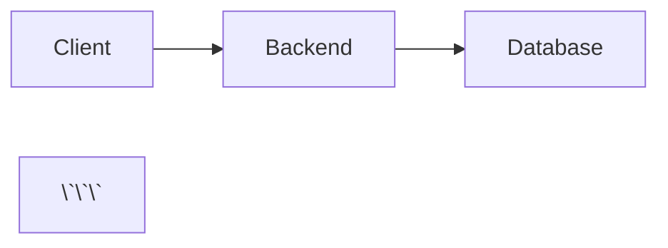

# MkDocs Documentation Setup

This document summarizes the MkDocs setup for RAG Modulo documentation.

## ✅ What Was Implemented

### 1. MkDocs Configuration (`mkdocs.yml`)

- **Material Theme** with dark/light mode support
- **Navigation Structure** organized by topic:
  - Getting Started
  - Deployment (with new Kubernetes guides)
  - Development
  - Testing
  - API Reference
  - CLI Reference
  - Features (Chain of Thought, Chat with Documents)
  - Troubleshooting
  - Additional Resources

- **Plugins Configured**:
  - `search` - Full-text search
  - `git-revision-date-localized` - Last updated dates
  - `minify` - HTML/CSS/JS minification
  - `awesome-pages` - Simplified navigation

- **Markdown Extensions**:
  - Admonitions (callout boxes)
  - Code highlighting with copy button
  - Tabbed content
  - Mermaid diagrams
  - Task lists
  - Tables
  - And more...

### 2. Documentation Files Created

#### Deployment Documentation
- `docs/deployment/QUICKSTART.md` - 5-minute deployment guide
- `docs/deployment/kubernetes.md` - Complete Kubernetes/OpenShift guide
- Updated `docs/deployment/index.md` - Overview with all deployment options

#### Support Files
- `docs/requirements.txt` - MkDocs dependencies
- `docs/stylesheets/extra.css` - Custom styles and branding
- `docs/README.md` - Comprehensive documentation guide

### 3. Makefile Targets

New documentation commands added:

```bash
make docs-install     # Install MkDocs and plugins
make docs-serve       # Serve locally at http://localhost:8000
make docs-build       # Build static site
make docs-deploy      # Deploy to GitHub Pages
make docs-validate    # Validate documentation
make docs-clean       # Clean build artifacts
```

### 4. Custom Styling

Created `docs/stylesheets/extra.css` with:
- Deployment badges (K8s, Docker, Helm)
- Enhanced code blocks
- Command output styling
- Deployment option cards
- Status indicators
- Responsive tables

## 📚 Documentation Structure

```
docs/
├── mkdocs.yml                 # MkDocs configuration
├── requirements.txt           # Python dependencies
├── README.md                  # Documentation guide
├── stylesheets/
│   └── extra.css             # Custom styles
├── index.md                   # Homepage
├── getting-started.md
├── installation.md
├── configuration.md
├── deployment/
│   ├── index.md              # Updated with K8s info
│   ├── QUICKSTART.md         # New 5-min guide
│   ├── kubernetes.md         # New K8s/OpenShift guide
│   └── production.md
├── api/
│   ├── index.md
│   ├── search_api.md
│   ├── search_schemas.md
│   └── ...
├── cli/
│   ├── index.md
│   ├── commands/
│   │   ├── index.md
│   │   ├── auth.md
│   │   ├── collections.md
│   │   ├── documents.md
│   │   ├── search.md
│   │   └── users.md
│   └── ...
├── features/
│   ├── index.md
│   ├── chain-of-thought/
│   │   ├── index.md
│   │   ├── configuration.md
│   │   ├── services.md
│   │   └── ...
│   └── chat-with-documents/
│       └── ...
├── development/
│   ├── index.md
│   ├── backend/
│   │   └── ...
│   └── ...
├── testing/
├── troubleshooting/
└── issues/
    ├── AGENTIC_RAG_EPICS_SUMMARY.md
    └── EPIC-*.md
```

## 🚀 Quick Start

### 1. Install Dependencies

```bash
# Install MkDocs and plugins
make docs-install

# Or manually
pip install -r docs/requirements.txt
```

### 2. Serve Locally

```bash
# Start local server at http://localhost:8000
make docs-serve

# Or manually
mkdocs serve
```

### 3. Build Documentation

```bash
# Build static site to site/ directory
make docs-build

# Or manually
mkdocs build
```

### 4. Deploy to GitHub Pages

```bash
# Deploy to gh-pages branch
make docs-deploy

# Or manually
mkdocs gh-deploy
```

## 📖 Writing Documentation

### File Format

Use Markdown with MkDocs extensions:

```markdown
# Page Title

## Section

Use **bold** and *italic* text.

!!! note "Important Information"
    This is an admonition/callout box.

### Code Examples

```bash
# Deploy to Kubernetes
make k8s-deploy-prod
\`\`\`

### Tabs for Multi-Platform

=== "Helm"
    ```bash
    helm install rag-modulo ./deployment/helm/rag-modulo
    ```

=== "Kubernetes"
    ```bash
    kubectl apply -f deployment/k8s/base/
    ```
```

### Admonition Types

- `!!! note` - General information
- `!!! tip` - Helpful tips
- `!!! warning` - Warnings
- `!!! danger` - Critical warnings
- `!!! info` - Informational
- `!!! success` - Success messages
- `!!! example` - Examples

### Mermaid Diagrams

```markdown


## 🎨 Customization

### Theme Colors

Edit `mkdocs.yml`:

```yaml
theme:
  palette:
    primary: indigo
    accent: indigo
```

### Navigation

Edit `mkdocs.yml` nav section:

```yaml
nav:
  - Home: index.md
  - Deployment:
    - deployment/index.md
    - Quick Start: deployment/QUICKSTART.md
    - Kubernetes: deployment/kubernetes.md
```

### Custom CSS

Add to `docs/stylesheets/extra.css`:

```css
/* Your custom styles */
.custom-class {
  /* styles */
}
```

## 🔧 Configuration Files

### mkdocs.yml

Main configuration file with:
- Site metadata
- Theme configuration
- Plugin settings
- Navigation structure
- Markdown extensions

### requirements.txt

MkDocs dependencies:
- mkdocs
- mkdocs-material (theme)
- mkdocs-git-revision-date-localized-plugin
- mkdocs-minify-plugin
- mkdocs-awesome-pages-plugin
- pymdown-extensions

## 📝 Content Organization

### Existing Documentation Integrated

All existing documentation has been integrated into the MkDocs structure:

✅ API Reference (search_api.md, schemas, etc.)
✅ CLI Documentation (commands, config, etc.)
✅ Features (Chain of Thought, Chat with Documents)
✅ Development Guides
✅ Testing Documentation
✅ Epics & Architecture (AGENTIC_RAG_EPICS_SUMMARY.md)
✅ Troubleshooting Guides

### New Documentation Added

✅ Deployment Quick Start (QUICKSTART.md)
✅ Kubernetes/OpenShift Guide (kubernetes.md)
✅ Updated Deployment Overview
✅ Documentation Writing Guide (docs/README.md)

## 🚀 Deployment Options

### Local Preview

```bash
mkdocs serve
# Access at http://localhost:8000
```

### GitHub Pages

```bash
mkdocs gh-deploy
# Deploys to gh-pages branch
```

### Custom Hosting

```bash
mkdocs build
# Upload site/ directory to your host
```

## 🧪 Testing

### Validate Documentation

```bash
# Strict build (fails on warnings)
make docs-validate

# Or manually
mkdocs build --strict
```

### Check Links

```bash
# Install linkchecker
pip install linkchecker

# Build and check
mkdocs build
linkchecker site/
```

## 📊 Features Enabled

### Material Theme Features

- ✅ Navigation tabs
- ✅ Navigation sections
- ✅ Table of contents integration
- ✅ Search with suggestions
- ✅ Code copy button
- ✅ Dark/light mode toggle
- ✅ Git revision dates
- ✅ Social links
- ✅ Footer navigation

### Markdown Features

- ✅ Admonitions (callout boxes)
- ✅ Code highlighting
- ✅ Tabbed content
- ✅ Mermaid diagrams
- ✅ Task lists
- ✅ Tables
- ✅ Footnotes
- ✅ Abbreviations
- ✅ Icons and emojis

## 🎯 Next Steps

1. **Review Documentation**: Check all pages render correctly
2. **Add Screenshots**: Add diagrams and architecture images
3. **Update Content**: Keep deployment guides current
4. **Deploy**: Deploy to GitHub Pages or custom host
5. **Maintain**: Update docs with new features

## 📚 Resources

- [MkDocs Documentation](https://www.mkdocs.org/)
- [Material for MkDocs](https://squidfunk.github.io/mkdocs-material/)
- [PyMdown Extensions](https://facelessuser.github.io/pymdown-extensions/)
- [Mermaid Diagrams](https://mermaid-js.github.io/)

## 🤝 Contributing

To contribute to documentation:

1. Install dependencies: `make docs-install`
2. Make changes to Markdown files in `docs/`
3. Preview locally: `make docs-serve`
4. Validate: `make docs-validate`
5. Submit PR with documentation changes

## 💡 Tips

- Always preview locally before committing
- Use admonitions for important information
- Include code examples for all features
- Keep navigation structure logical
- Add cross-references between related pages
- Use consistent terminology
- Test all links before deploying
