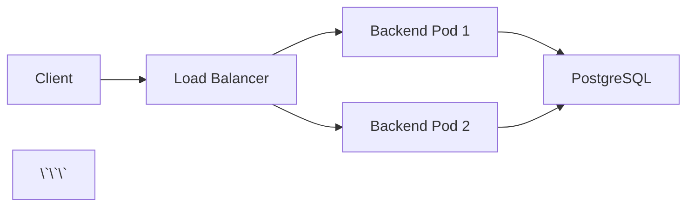

# RAG Modulo Documentation

This directory contains the complete documentation for RAG Modulo, built with [MkDocs](https://www.mkdocs.org/) and the [Material for MkDocs](https://squidfunk.github.io/mkdocs-material/) theme.

## 📚 Documentation Structure

```
docs/
├── index.md                    # Homepage
├── getting-started.md          # Quick start guide
├── installation.md             # Installation instructions
├── configuration.md            # Configuration guide
├── deployment/                 # Deployment guides
│   ├── index.md               # Deployment overview
│   ├── QUICKSTART.md          # 5-minute quick start
│   ├── kubernetes.md          # Kubernetes/OpenShift guide
│   └── production.md          # Production setup
├── api/                       # API reference
├── cli/                       # CLI reference
├── features/                  # Feature documentation
├── development/               # Development guides
├── testing/                   # Testing guides
└── troubleshooting/          # Troubleshooting guides
```

## 🚀 Quick Start

### Install Dependencies

```bash
# Install MkDocs and plugins
pip install -r docs/requirements.txt

# Or using the project's make command
make docs-install
```

### Serve Locally

```bash
# Serve documentation locally at http://localhost:8000
mkdocs serve

# Or using make
make docs-serve
```

### Build Documentation

```bash
# Build static site to site/ directory
mkdocs build

# Or using make
make docs-build
```

## 📖 Writing Documentation

### File Format

All documentation is written in Markdown with MkDocs extensions:

```markdown
# Page Title

## Section

Regular text with **bold** and *italic*.

!!! note "Admonition Title"
    Important information in a callout box.

### Code Examples

```bash
# Command with syntax highlighting
make deploy-prod
\`\`\`

### Tables

| Column 1 | Column 2 |
|----------|----------|
| Value 1  | Value 2  |
```

### Admonitions

Use admonitions for important information:

```markdown
!!! note "Note Title"
    This is a note.

!!! warning "Warning"
    This is a warning.

!!! tip "Pro Tip"
    This is a helpful tip.

!!! danger "Danger"
    This is a critical warning.

!!! info "Information"
    This is informational content.

!!! success "Success"
    This indicates success.

!!! example "Example"
    This shows an example.
```

### Code Blocks

Use fenced code blocks with language specification:

````markdown
```python
def hello_world():
    print("Hello, World!")
```

```bash
kubectl get pods -n rag-modulo
```

```yaml
apiVersion: v1
kind: Service
metadata:
  name: backend-service
```
````

### Tabs

Create tabbed content for multi-platform instructions:

```markdown
=== "Helm"

    ```bash
    helm install rag-modulo ./deployment/helm/rag-modulo
    ```

=== "Kubernetes"

    ```bash
    kubectl apply -f deployment/k8s/base/
    ```

=== "Docker Compose"

    ```bash
    docker-compose up -d
    ```
```

### Links

```markdown
# Internal links
[Deployment Guide](deployment/index.md)

# External links
[MkDocs](https://www.mkdocs.org/)

# Anchor links
[Prerequisites](#prerequisites)
```

### Images

```markdown


# With caption
<figure markdown>
  
  <figcaption>System Architecture</figcaption>
</figure>
```

### Mermaid Diagrams

```markdown


## 🎨 Customization

### Theme Configuration

Edit `mkdocs.yml` to customize:

```yaml
theme:
  name: material
  palette:
    primary: indigo
    accent: indigo
  features:
    - navigation.tabs
    - navigation.sections
    - toc.integrate
```

### Custom CSS

Add custom styles in `docs/stylesheets/extra.css`:

```css
/* Custom deployment badge */
.deployment-badge {
  background-color: #326ce5;
  color: white;
  padding: 0.2rem 0.5rem;
  border-radius: 0.2rem;
}
```

### Navigation

Edit navigation in `mkdocs.yml`:

```yaml
nav:
  - Home: index.md
  - Getting Started:
    - Installation: installation.md
    - Configuration: configuration.md
  - Deployment:
    - deployment/index.md
    - Kubernetes: deployment/kubernetes.md
```

## 📝 Content Guidelines

### Writing Style

1. **Be Clear and Concise**: Use simple language
2. **Use Active Voice**: "Deploy the application" vs "The application is deployed"
3. **Provide Examples**: Include code examples for every concept
4. **Use Consistent Terminology**: Backend, Frontend, K8s (not Kubernetes)
5. **Add Context**: Explain why, not just how

### Structure

1. **Start with Overview**: Brief introduction
2. **Prerequisites**: What's needed before starting
3. **Step-by-Step Instructions**: Clear, numbered steps
4. **Examples**: Real-world usage examples
5. **Troubleshooting**: Common issues and solutions
6. **Next Steps**: Links to related content

### Code Examples

- Always include language specification
- Add comments to explain complex code
- Show both input and expected output
- Use realistic examples

```bash
# Good example with context
# Deploy to production with custom values
helm install rag-modulo ./deployment/helm/rag-modulo \
  --namespace rag-modulo \
  --values values-prod.yaml

# Bad example - no context
helm install rag-modulo .
```

## 🧪 Testing Documentation

### Check for Broken Links

```bash
# Install linkchecker
pip install linkchecker

# Check for broken links
mkdocs build
linkchecker site/
```

### Validate Markdown

```bash
# Install markdownlint
npm install -g markdownlint-cli

# Check markdown files
markdownlint docs/**/*.md
```

### Preview Before Committing

```bash
# Always preview locally
mkdocs serve

# Check at http://localhost:8000
# Verify all links work
# Check code blocks render correctly
```

## 🚀 Deployment

### GitHub Pages

```bash
# Deploy to GitHub Pages
mkdocs gh-deploy

# Or using make
make docs-deploy
```

### Manual Deployment

```bash
# Build static site
mkdocs build

# Site is generated in site/ directory
# Upload site/ to your hosting service
```

## 🔧 Makefile Commands

Add these to the main Makefile:

```makefile
# Documentation targets
docs-install:
	pip install -r docs/requirements.txt

docs-serve:
	mkdocs serve

docs-build:
	mkdocs build

docs-deploy:
	mkdocs gh-deploy

docs-validate:
	mkdocs build --strict
	linkchecker site/
```

## 📦 Required Plugins

All required plugins are in `docs/requirements.txt`:

- `mkdocs-material` - Material theme
- `mkdocs-git-revision-date-localized-plugin` - Last updated dates
- `mkdocs-minify-plugin` - Minify HTML/CSS/JS
- `mkdocs-awesome-pages-plugin` - Simplified navigation
- `pymdown-extensions` - Enhanced Markdown features

## 🐛 Troubleshooting

### MkDocs Won't Start

```bash
# Reinstall dependencies
pip install --force-reinstall -r docs/requirements.txt

# Clear cache
rm -rf site/
mkdocs build
```

### Theme Not Loading

```bash
# Verify material theme is installed
pip show mkdocs-material

# Reinstall if needed
pip install --upgrade mkdocs-material
```

### Plugins Not Working

```bash
# Check plugin installation
pip list | grep mkdocs

# Install missing plugins
pip install -r docs/requirements.txt
```

## 📚 Resources

- [MkDocs Documentation](https://www.mkdocs.org/)
- [Material for MkDocs](https://squidfunk.github.io/mkdocs-material/)
- [Markdown Guide](https://www.markdownguide.org/)
- [PyMdown Extensions](https://facelessuser.github.io/pymdown-extensions/)

## 🤝 Contributing

1. Follow the [writing guidelines](#writing-style)
2. Test locally with `mkdocs serve`
3. Check for broken links
4. Submit PR with documentation changes

## 📄 License

Documentation is part of the RAG Modulo project and follows the same license.
