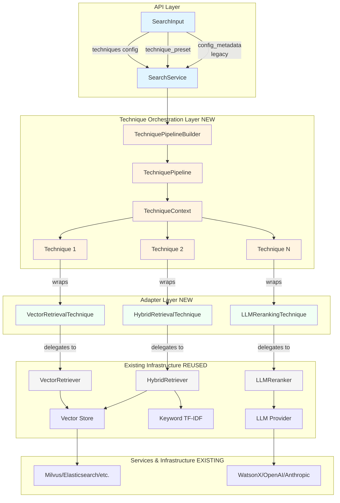
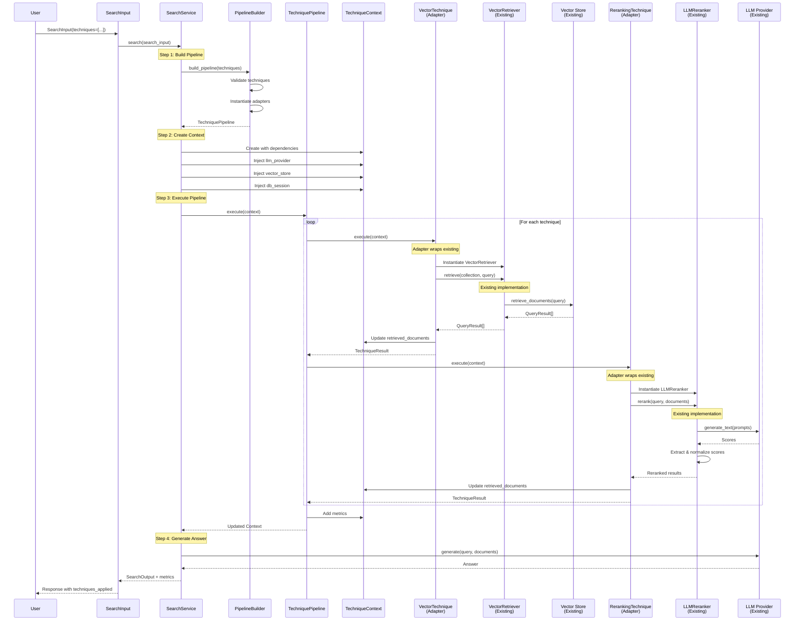
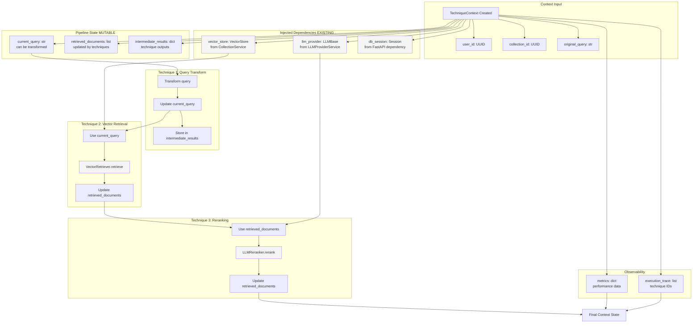
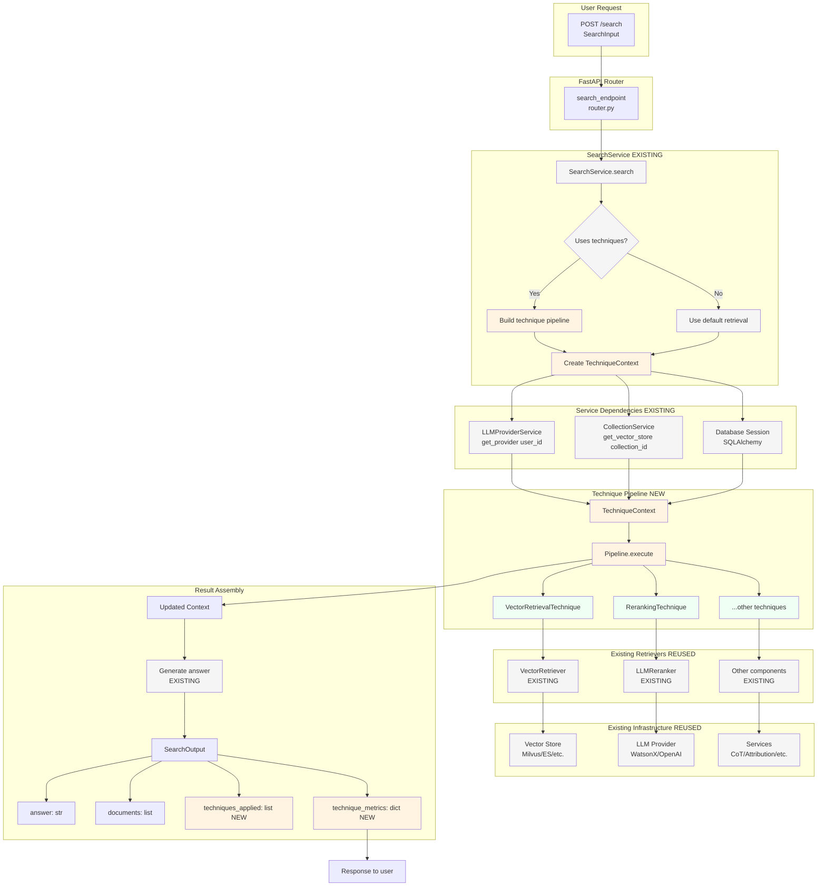
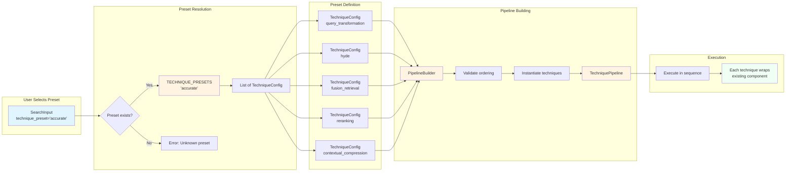
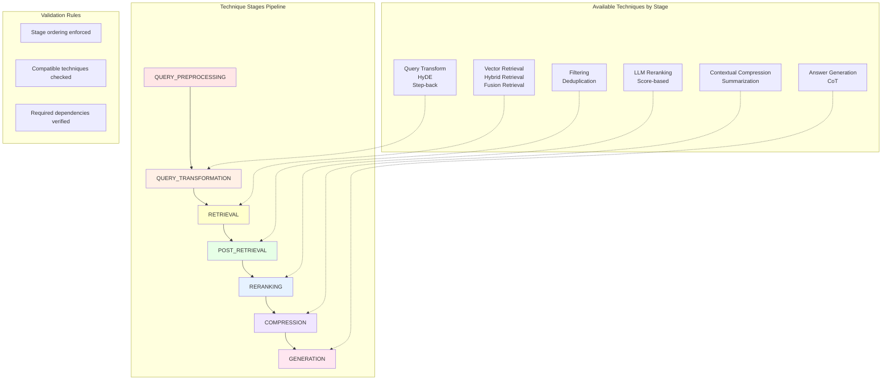
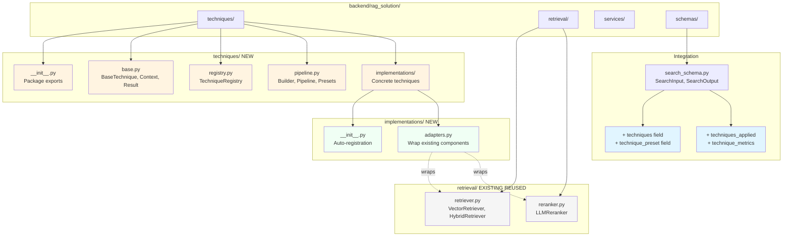

# RAG Technique System - Architecture Diagrams

## Overview Architecture



**Legend:**
- 🔵 Blue: API Layer (Entry Point)
- 🟡 Yellow: NEW - Technique Orchestration
- 🟢 Green: NEW - Adapter Techniques
- ⚪ Gray: EXISTING - Reused Infrastructure

---

## Detailed Execution Flow



---

## Adapter Pattern Detail

```mermaid
graph LR
    subgraph "Technique Adapter NEW"
        A[VectorRetrievalTechnique<br/>BaseTechnique]
        A --> |implements| B[execute method]
    end

    subgraph "Adapter Implementation"
        B --> C{Has retriever?}
        C -->|No| D[Create VectorRetriever<br/>from context.vector_store]
        C -->|Yes| E[Reuse existing instance]
        D --> F[Call retriever.retrieve]
        E --> F
    end

    subgraph "Existing Component REUSED"
        F --> G[VectorRetriever.retrieve<br/>EXISTING CODE]
        G --> H[document_store.vector_store<br/>EXISTING CODE]
        H --> I[Milvus/Elasticsearch/etc.<br/>EXISTING INFRASTRUCTURE]
    end

    subgraph "Result Wrapping"
        I --> J[QueryResult EXISTING]
        J --> K[Wrap in TechniqueResult<br/>NEW]
        K --> L[Update Context<br/>NEW]
    end

    style A fill:#f0fff4
    style B fill:#f0fff4
    style C fill:#f0fff4
    style D fill:#f0fff4
    style E fill:#f0fff4
    style F fill:#f0fff4
    style G fill:#f5f5f5
    style H fill:#f5f5f5
    style I fill:#f5f5f5
    style J fill:#f5f5f5
    style K fill:#fff4e1
    style L fill:#fff4e1
```



---

## Technique Context Data Flow



---

## Technique Registry & Discovery

```mermaid
graph TB
    subgraph "Technique Registration"
        A[@register_technique decorator]
        A --> B[VectorRetrievalTechnique]
        A --> C[HybridRetrievalTechnique]
        A --> D[LLMRerankingTechnique]

        B --> E[TechniqueRegistry.register]
        C --> E
        D --> E
    end

    subgraph "Registry Storage"
        E --> F[_techniques: dict<br/>technique_id -> class]
        E --> G[_metadata_cache: dict<br/>technique_id -> metadata]
        E --> H[_instances: dict<br/>technique_id -> singleton]
    end

    subgraph "Discovery & Validation"
        I[User Request] --> J[technique_ids: list]
        J --> K{Registered?}
        K -->|Yes| L[Get metadata]
        K -->|No| M[Error: Unknown technique]

        L --> N[Validate pipeline]
        N --> O{Valid stages?}
        O -->|Yes| P{Compatible?}
        O -->|No| Q[Error: Invalid ordering]

        P -->|Yes| R[Build pipeline]
        P -->|No| S[Error: Incompatible]
    end

    subgraph "Instantiation"
        R --> T{Singleton?}
        T -->|Yes| U[Return cached instance]
        T -->|No| V[Create new instance]

        U --> W[TechniquePipeline]
        V --> W
    end

    style A fill:#fff4e1
    style E fill:#fff4e1
    style F fill:#fff4e1
    style G fill:#fff4e1
    style H fill:#fff4e1
```

---

## Complete System Integration



---

## Preset Configuration Flow



---

## Technique Compatibility Matrix



---

## Code Structure Overview



---

## Legend

### Colors
- 🔵 **Blue** (#e1f5ff): API Layer / User-facing
- 🟡 **Yellow** (#fff4e1): NEW - Orchestration & Framework
- 🟢 **Green** (#f0fff4): NEW - Adapter Implementations
- ⚪ **Gray** (#f5f5f5): EXISTING - Reused Components

### Arrows
- **Solid arrows** (→): Direct dependency or data flow
- **Dashed arrows** (-.->): Conceptual relationship or wrapping

### Key Principles
1. **Thin orchestration layer**: Pipeline & context management
2. **Adapter pattern**: Techniques wrap existing components
3. **100% reuse**: No duplicate retrieval/reranking logic
4. **Dependency injection**: Services provided via context
5. **Backward compatible**: Legacy API still works

---

**Document Version**: 1.0
**Last Updated**: 2025-10-23
**Status**: Architecture Visualization ✅
