# RAG Technique System - Architecture Diagrams (Mermaid)

## Overview

This document contains mermaid diagrams visualizing the RAG technique system architecture, organized by priority and complexity similar to the RAG techniques analysis.

---

## 1. High-Level System Architecture


**Color Legend:**
- 🟡 Yellow: NEW orchestration framework
- 🟢 Green: NEW adapter implementations
- ⚪ Gray: EXISTING reused components

---

## 2. Adapter Pattern - How Techniques Wrap Existing Components


---

## 3. Technique Execution Sequence


---

## 4. Technique Context Data Flow


---

## 5. Technique Registry & Validation

```mermaid
flowchart TD
    subgraph Registration["Technique Registration"]
        A[@register_technique<br/>decorator]
        A --> B[VectorRetrievalTechnique]
        A --> C[HybridRetrievalTechnique]
        A --> D[LLMRerankingTechnique]
    end

    B & C & D --> E[TechniqueRegistry.register]

    subgraph Storage["Registry Storage"]
        E --> F[techniques dict<br/>id -> class]
        E --> G[metadata_cache dict<br/>id -> metadata]
        E --> H[instances dict<br/>id -> singleton]
    end

    subgraph Discovery["Pipeline Validation"]
        I[User Request] --> J[technique_ids list]
        J --> K{All<br/>registered?}
        K -->|No| L[Error: Unknown]
        K -->|Yes| M[Get metadata]
        M --> N{Valid<br/>stage order?}
        N -->|No| O[Error: Invalid order]
        N -->|Yes| P{Compatible?}
        P -->|No| Q[Error: Incompatible]
        P -->|Yes| R[Valid Pipeline]
    end

    R --> S{Singleton?}
    S -->|Yes| T[Return cached]
    S -->|No| U[Create new]
    T & U --> V[Technique Pipeline]

    classDef reg fill:#fff4e1,stroke:#ffa500,stroke-width:2px
    classDef validate fill:#f0fff4,stroke:#00aa00,stroke-width:2px
    classDef error fill:#ffe6e6,stroke:#ff0000,stroke-width:2px

    class A,E,F,G,H reg
    class I,J,K,M,N,P,R,S,T,U,V validate
    class L,O,Q error
```

---

## 6. Complete System Integration


---

## 7. Technique Preset Configuration


---

## 8. Technique Pipeline Stages


---

## 9. Technique Priority Roadmap

```mermaid
flowchart TD
    subgraph HIGH["🔥 HIGH Priority - Quick Wins 2-3 weeks"]
        A1[HyDE<br/>2-3 days]
        A2[Contextual Compression<br/>2-3 days]
        A3[Query Transformations<br/>3-5 days]
        A4[Fusion Retrieval<br/>3-4 days]
    end

    subgraph MEDIUM["⚡ MEDIUM Priority - Core Enhancements 3-4 weeks"]
        B1[Semantic Chunking<br/>4-6 days]
        B2[Adaptive Retrieval<br/>4-5 days]
        B3[Multi-faceted Filtering<br/>3-4 days]
        B4[Contextual Headers<br/>2-3 days]
    end

    subgraph ADVANCED["💡 ADVANCED Priority - Advanced Features 3-4 weeks"]
        C1[Proposition Chunking<br/>5-7 days]
        C2[HyPE<br/>4-5 days]
        C3[RSE<br/>3-4 days]
        C4[Explainable Retrieval<br/>2-3 days]
    end

    subgraph FEEDBACK["🔁 FEEDBACK Priority - Iteration 2-3 weeks"]
        D1[Feedback Loops<br/>6-8 days]
        D2[Document Augmentation<br/>3-4 days]
    end

    HIGH --> MEDIUM
    MEDIUM --> ADVANCED
    ADVANCED --> FEEDBACK

    classDef high fill:#ffe6e6,stroke:#ff0000,stroke-width:3px
    classDef med fill:#fff4e1,stroke:#ffa500,stroke-width:2px
    classDef adv fill:#e6f2ff,stroke:#0080ff,stroke-width:2px
    classDef feed fill:#f0fff4,stroke:#00aa00,stroke-width:2px

    class A1,A2,A3,A4 high
    class B1,B2,B3,B4 med
    class C1,C2,C3,C4 adv
    class D1,D2 feed
```



---

## 10. Code Structure & File Organization


---

## Testing on mermaid.live

To test these diagrams:

1. Go to https://mermaid.live
2. Copy any diagram code block (between the ```mermaid markers)
3. Paste into the editor
4. The diagram should render instantly

**All diagrams above have been validated for mermaid.live compatibility.**

---

## Diagram Index

| # | Diagram | Purpose | Complexity |
|---|---------|---------|------------|
| 1 | High-Level System Architecture | Overall system flow | Simple |
| 2 | Adapter Pattern | How techniques wrap existing code | Medium |
| 3 | Execution Sequence | Step-by-step execution flow | Medium |
| 4 | Context Data Flow | State management | Medium |
| 5 | Registry & Validation | Registration and validation | Complex |
| 6 | Complete Integration | Full system integration | Complex |
| 7 | Preset Configuration | How presets work | Simple |
| 8 | Pipeline Stages | Seven pipeline stages | Simple |
| 9 | Priority Roadmap | Implementation timeline | Simple |
| 10 | Code Structure | File organization | Medium |

---

## Color Legend

### By Layer
- 🔵 **Blue** (#e1f5ff): API Layer / User Input
- 🟡 **Yellow** (#fff4e1): NEW - Orchestration Framework
- 🟢 **Green** (#f0fff4): NEW - Adapter Implementations
- ⚪ **Gray** (#f5f5f5): EXISTING - Reused Components

### By Priority
- 🔴 **Red** (#ffe6e6): HIGH Priority (Quick Wins)
- 🟠 **Orange** (#fff4e1): MEDIUM Priority (Core Enhancements)
- 🔵 **Blue** (#e6f2ff): ADVANCED Priority (Advanced Features)
- 🟢 **Green** (#f0fff4): FEEDBACK Priority (Iteration)

---

**Document Version**: 2.0
**Last Updated**: 2025-10-23
**Status**: Mermaid.live Validated ✅
**Renders on**: GitHub, GitLab, mermaid.live, VS Code, MkDocs
