# RAG Modulo Backend Architecture

This document provides a comprehensive architecture diagram and description of the RAG Modulo
backend system.

## Architecture Overview

The RAG Modulo backend is a FastAPI-based application that implements a Retrieval-Augmented
Generation (RAG) system with a modular, stage-based pipeline architecture. The system supports
multiple LLM providers, vector databases, and document processing strategies.

## Component Architecture Diagram

```mermaid
graph TB
    subgraph "Client Layer"
        WEB[Web Frontend]
        CLI[CLI Client]
        API_CLIENT[API Clients]
    end

    subgraph "API Gateway Layer"
        FASTAPI[FastAPI Application<br/>main.py]

        subgraph "Middleware Stack"
            CORS[LoggingCORSMiddleware]
            SESSION[SessionMiddleware]
            AUTH[AuthenticationMiddleware<br/>SPIFFE/OIDC Support]
        end
    end

    subgraph "Router Layer"
        AUTH_R[Auth Router]
        SEARCH_R[Search Router]
        COLLECTION_R[Collection Router]
        CHAT_R[Chat Router]
        CONV_R[Conversation Router]
        PODCAST_R[Podcast Router]
        VOICE_R[Voice Router]
        AGENT_R[Agent Router]
        USER_R[User Router]
        TEAM_R[Team Router]
        DASH_R[Dashboard Router]
        HEALTH_R[Health Router]
        WS_R[WebSocket Router]
    end

    subgraph "Service Layer"
        SEARCH_SVC[SearchService]
        CONV_SVC[ConversationService]
        MSG_ORCH[MessageProcessingOrchestrator]
        COLLECTION_SVC[CollectionService]
        FILE_SVC[FileManagementService]
        PODCAST_SVC[PodcastService]
        VOICE_SVC[VoiceService]
        AGENT_SVC[AgentService]
        USER_SVC[UserService]
        TEAM_SVC[TeamService]
        DASH_SVC[DashboardService]
        PIPELINE_SVC[PipelineService]
        COT_SVC[ChainOfThoughtService]
        ANSWER_SYNTH[AnswerSynthesizer]
        CITATION_SVC[CitationAttributionService]
    end

    subgraph "Pipeline Architecture"
        PIPELINE_EXEC[PipelineExecutor]

        subgraph "Pipeline Stages"
            STAGE1[PipelineResolutionStage]
            STAGE2[QueryEnhancementStage]
            STAGE3[RetrievalStage]
            STAGE4[RerankingStage]
            STAGE5[ReasoningStage]
            STAGE6[GenerationStage]
        end

        SEARCH_CTX[SearchContext]
    end

    subgraph "Data Ingestion Pipeline"
        DOC_STORE[DocumentStore]
        DOC_PROC[DocumentProcessor]

        subgraph "Document Processors"
            PDF_PROC[PdfProcessor]
            DOCLING_PROC[DoclingProcessor]
            WORD_PROC[WordProcessor]
            EXCEL_PROC[ExcelProcessor]
            TXT_PROC[TxtProcessor]
        end

        CHUNKING[Chunking Strategies<br/>Sentence/Semantic/Hierarchical]
    end

    subgraph "Retrieval Layer"
        RETRIEVER[Retriever]
        RERANKER[Reranker]
        QUERY_REWRITER[QueryRewriter]
    end

    subgraph "Generation Layer"
        LLM_FACTORY[LLMProviderFactory]

        subgraph "LLM Providers"
            WATSONX[WatsonX Provider]
            OPENAI[OpenAI Provider]
            ANTHROPIC[Anthropic Provider]
        end

        AUDIO_FACTORY[AudioFactory]

        subgraph "Audio Providers"
            ELEVENLABS[ElevenLabs Audio]
            OPENAI_AUDIO[OpenAI Audio]
            OLLAMA_AUDIO[Ollama Audio]
        end
    end

    subgraph "Repository Layer"
        USER_REPO[UserRepository]
        COLLECTION_REPO[CollectionRepository]
        FILE_REPO[FileRepository]
        CONV_REPO[ConversationRepository]
        AGENT_REPO[AgentRepository]
        PODCAST_REPO[PodcastRepository]
        VOICE_REPO[VoiceRepository]
        TEAM_REPO[TeamRepository]
        PIPELINE_REPO[PipelineRepository]
        LLM_REPO[LLMProviderRepository]
    end

    subgraph "Data Persistence"
        POSTGRES[(PostgreSQL<br/>Metadata & Config)]
        VECTOR_DB[(Vector Database)]

        subgraph "Vector DB Implementations"
            MILVUS[Milvus]
            PINECONE[Pinecone]
            WEAVIATE[Weaviate]
            ELASTICSEARCH[Elasticsearch]
            CHROMA[Chroma]
        end
    end

    subgraph "External Services"
        SPIRE[SPIRE Server<br/>SPIFFE Identity]
        OIDC[OIDC Provider<br/>IBM AppID]
        MINIO[MinIO<br/>Object Storage]
    end

    subgraph "Core Infrastructure"
        CONFIG[Settings/Config]
        LOGGING[Logging Utils]
        IDENTITY[Identity Service]
        EXCEPTIONS[Custom Exceptions]
    end

    %% Client to API Gateway
    WEB --> FASTAPI
    CLI --> FASTAPI
    API_CLIENT --> FASTAPI

    %% Middleware Flow
    FASTAPI --> CORS
    CORS --> SESSION
    SESSION --> AUTH

    %% Router Registration
    AUTH --> AUTH_R
    AUTH --> SEARCH_R
    AUTH --> COLLECTION_R
    AUTH --> CHAT_R
    AUTH --> CONV_R
    AUTH --> PODCAST_R
    AUTH --> VOICE_R
    AUTH --> AGENT_R
    AUTH --> USER_R
    AUTH --> TEAM_R
    AUTH --> DASH_R
    AUTH --> HEALTH_R
    AUTH --> WS_R

    %% Router to Service
    SEARCH_R --> SEARCH_SVC
    CHAT_R --> CONV_SVC
    CONV_R --> CONV_SVC
    CONV_SVC --> MSG_ORCH
    MSG_ORCH --> SEARCH_SVC
    COLLECTION_R --> COLLECTION_SVC
    COLLECTION_SVC --> FILE_SVC
    PODCAST_R --> PODCAST_SVC
    VOICE_R --> VOICE_SVC
    AGENT_R --> AGENT_SVC
    USER_R --> USER_SVC
    TEAM_R --> TEAM_SVC
    DASH_R --> DASH_SVC

    %% Search Service to Pipeline
    SEARCH_SVC --> PIPELINE_EXEC
    PIPELINE_EXEC --> STAGE1
    STAGE1 --> STAGE2
    STAGE2 --> STAGE3
    STAGE3 --> STAGE4
    STAGE4 --> STAGE5
    STAGE5 --> STAGE6
    PIPELINE_EXEC --> SEARCH_CTX

    %% Pipeline Stages to Services
    STAGE1 --> PIPELINE_SVC
    STAGE2 --> PIPELINE_SVC
    STAGE3 --> PIPELINE_SVC
    STAGE4 --> PIPELINE_SVC
    STAGE5 --> COT_SVC
    STAGE6 --> ANSWER_SYNTH

    %% Pipeline Service to Retrieval
    PIPELINE_SVC --> RETRIEVER
    PIPELINE_SVC --> RERANKER
    PIPELINE_SVC --> QUERY_REWRITER

    %% Retrieval to Vector DB
    RETRIEVER --> VECTOR_DB
    VECTOR_DB --> MILVUS
    VECTOR_DB --> PINECONE
    VECTOR_DB --> WEAVIATE
    VECTOR_DB --> ELASTICSEARCH
    VECTOR_DB --> CHROMA

    %% Generation Layer
    ANSWER_SYNTH --> LLM_FACTORY
    LLM_FACTORY --> WATSONX
    LLM_FACTORY --> OPENAI
    LLM_FACTORY --> ANTHROPIC
    PODCAST_SVC --> LLM_FACTORY
    VOICE_SVC --> AUDIO_FACTORY
    AUDIO_FACTORY --> ELEVENLABS
    AUDIO_FACTORY --> OPENAI_AUDIO
    AUDIO_FACTORY --> OLLAMA_AUDIO

    %% Data Ingestion
    FILE_SVC --> DOC_STORE
    DOC_STORE --> DOC_PROC
    DOC_PROC --> PDF_PROC
    DOC_PROC --> DOCLING_PROC
    DOC_PROC --> WORD_PROC
    DOC_PROC --> EXCEL_PROC
    DOC_PROC --> TXT_PROC
    DOC_PROC --> CHUNKING
    DOC_STORE --> VECTOR_DB

    %% Service to Repository
    USER_SVC --> USER_REPO
    COLLECTION_SVC --> COLLECTION_REPO
    FILE_SVC --> FILE_REPO
    CONV_SVC --> CONV_REPO
    AGENT_SVC --> AGENT_REPO
    PODCAST_SVC --> PODCAST_REPO
    VOICE_SVC --> VOICE_REPO
    TEAM_SVC --> TEAM_REPO
    PIPELINE_SVC --> PIPELINE_REPO
    PIPELINE_SVC --> LLM_REPO

    %% Repository to Database
    USER_REPO --> POSTGRES
    COLLECTION_REPO --> POSTGRES
    FILE_REPO --> POSTGRES
    CONV_REPO --> POSTGRES
    AGENT_REPO --> POSTGRES
    PODCAST_REPO --> POSTGRES
    VOICE_REPO --> POSTGRES
    TEAM_REPO --> POSTGRES
    PIPELINE_REPO --> POSTGRES
    LLM_REPO --> POSTGRES

    %% Authentication
    AUTH --> SPIRE
    AUTH --> OIDC
    AGENT_SVC --> SPIRE

    %% Storage
    FILE_SVC --> MINIO
    PODCAST_SVC --> MINIO
    VOICE_SVC --> MINIO

    %% Core Infrastructure
    FASTAPI --> CONFIG
    FASTAPI --> LOGGING
    AUTH --> IDENTITY
    SEARCH_SVC --> EXCEPTIONS
    CONV_SVC --> EXCEPTIONS

    style FASTAPI fill:#4A90E2
    style PIPELINE_EXEC fill:#50C878
    style VECTOR_DB fill:#FF6B6B
    style POSTGRES fill:#4ECDC4
    style LLM_FACTORY fill:#FFD93D
    style DOC_STORE fill:#9B59B6
```

## Architecture Layers

### 1. API Gateway Layer

**FastAPI Application (`main.py`)**

- Entry point for all HTTP requests
- Manages application lifespan (startup/shutdown)
- Configures middleware stack
- Registers all routers
- Initializes database and LLM providers

**Middleware Stack:**

- **LoggingCORSMiddleware**: Handles CORS and request/response logging
- **SessionMiddleware**: Manages user sessions
- **AuthenticationMiddleware**: Validates user authentication via SPIFFE/OIDC

### 2. Router Layer

The router layer provides RESTful API endpoints organized by domain:

- **Auth Router**: User authentication and authorization
- **Search Router**: RAG search operations
- **Collection Router**: Document collection management
- **Chat Router**: Conversational interface
- **Conversation Router**: Conversation history and context
- **Podcast Router**: AI-powered podcast generation
- **Voice Router**: Voice synthesis operations
- **Agent Router**: SPIFFE-based agent management
- **User Router**: User profile management
- **Team Router**: Team collaboration features
- **Dashboard Router**: Analytics and metrics
- **Health Router**: System health checks
- **WebSocket Router**: Real-time updates

### 3. Service Layer

Business logic services that orchestrate operations:

- **SearchService**: Coordinates RAG search operations
- **ConversationService**: Manages conversation sessions and messages
- **MessageProcessingOrchestrator**: Orchestrates message processing with context
- **CollectionService**: Manages document collections
- **FileManagementService**: Handles file uploads and processing
- **PodcastService**: Generates podcasts from documents
- **VoiceService**: Manages voice synthesis
- **AgentService**: Manages AI agents with SPIFFE identity
- **PipelineService**: Executes RAG pipeline stages
- **ChainOfThoughtService**: Implements reasoning capabilities
- **AnswerSynthesizer**: Generates final answers from retrieved context
- **CitationAttributionService**: Attributes sources to answers

### 4. Pipeline Architecture

**Stage-Based RAG Pipeline:**

The system uses a modular, stage-based pipeline architecture:

1. **PipelineResolutionStage**: Resolves user's default pipeline configuration
2. **QueryEnhancementStage**: Rewrites/enhances queries for better retrieval
3. **RetrievalStage**: Retrieves documents from vector database
4. **RerankingStage**: Reranks results for relevance
5. **ReasoningStage**: Applies Chain of Thought reasoning if needed
6. **GenerationStage**: Generates final answer using LLM

**PipelineExecutor**: Orchestrates stage execution with context passing

**SearchContext**: Maintains state across pipeline stages

### 5. Data Ingestion Pipeline

**DocumentStore**: Manages document ingestion workflow

**DocumentProcessor**: Routes documents to appropriate processors:

- **PdfProcessor**: PDF extraction with OCR support
- **DoclingProcessor**: Advanced document processing (tables, images)
- **WordProcessor**: Microsoft Word documents
- **ExcelProcessor**: Spreadsheet processing
- **TxtProcessor**: Plain text files

**Chunking Strategies**:

- Sentence-based (recommended)
- Semantic chunking
- Hierarchical chunking
- Token-based chunking
- Fixed-size chunking

### 6. Retrieval Layer

- **Retriever**: Performs vector similarity search
- **Reranker**: Reranks results for better relevance
- **QueryRewriter**: Enhances queries for better retrieval

### 7. Generation Layer

**LLMProviderFactory**: Factory for creating LLM provider instances

- **WatsonX Provider**: IBM WatsonX integration
- **OpenAI Provider**: OpenAI API integration
- **Anthropic Provider**: Claude API integration

**AudioFactory**: Factory for audio generation

- **ElevenLabs Audio**: Voice synthesis
- **OpenAI Audio**: TTS integration
- **Ollama Audio**: Local TTS

### 8. Repository Layer

Data access layer using Repository pattern:

- **UserRepository**: User data operations
- **CollectionRepository**: Collection management
- **FileRepository**: File metadata operations
- **ConversationRepository**: Conversation data (unified, optimized)
- **AgentRepository**: Agent management
- **PodcastRepository**: Podcast metadata
- **VoiceRepository**: Voice configuration
- **TeamRepository**: Team operations
- **PipelineRepository**: Pipeline configuration
- **LLMProviderRepository**: LLM provider settings

### 9. Data Persistence

**PostgreSQL**:

- Stores metadata (users, collections, files, conversations)
- Manages configuration (pipelines, LLM settings)
- Handles relationships and transactions

**Vector Database** (Abstracted via VectorStore interface):

- **Milvus**: Primary vector database
- **Pinecone**: Cloud vector database
- **Weaviate**: GraphQL vector database
- **Elasticsearch**: Search engine with vector support
- **Chroma**: Lightweight vector database

### 10. External Services

- **SPIRE Server**: SPIFFE workload identity for agent authentication
- **OIDC Provider**: IBM AppID for user authentication
- **MinIO**: Object storage for files and audio

### 11. Core Infrastructure

- **Settings/Config**: Centralized configuration management
- **Logging Utils**: Structured logging with context
- **Identity Service**: User/agent identity management
- **Custom Exceptions**: Domain-specific error handling

## Data Flow

### Search Request Flow

1. **Client** → FastAPI → **Search Router**
2. **Search Router** → **SearchService**
3. **SearchService** → **PipelineExecutor**
4. **PipelineExecutor** executes stages:
   - Pipeline Resolution → Query Enhancement → Retrieval → Reranking → Reasoning → Generation
5. **RetrievalStage** → **Retriever** → **Vector Database**
6. **GenerationStage** → **AnswerSynthesizer** → **LLM Provider**
7. Response flows back through layers to client

### Document Ingestion Flow

1. **Client** → **Collection Router** → **CollectionService** → **FileManagementService**
2. **FileManagementService** → **DocumentStore**
3. **DocumentStore** → **DocumentProcessor** → **Specific Processor** (PDF/Word/etc.)
4. **Processor** → **Chunking Strategy** → **Document Chunks**
5. **DocumentStore** → **Vector Database** (embeddings + metadata)
6. **FileManagementService** → **FileRepository** → **PostgreSQL** (metadata)

### Conversation Flow

1. **Client** → **Conversation Router** → **ConversationService**
2. **ConversationService** → **MessageProcessingOrchestrator**
3. **MessageProcessingOrchestrator** → **SearchService** (with context)
4. **SearchService** executes pipeline with conversation context
5. Response saved via **ConversationRepository** → **PostgreSQL**

## Key Design Patterns

1. **Repository Pattern**: Data access abstraction
2. **Factory Pattern**: LLM and Vector DB instantiation
3. **Strategy Pattern**: Chunking strategies, LLM providers
4. **Pipeline Pattern**: Stage-based RAG processing
5. **Dependency Injection**: Services and repositories
6. **Middleware Pattern**: Cross-cutting concerns (auth, logging, CORS)

## Scalability Considerations

- **Stateless Services**: Services are stateless for horizontal scaling
- **Database Connection Pooling**: SQLAlchemy connection management
- **Async/Await**: Asynchronous operations for I/O-bound tasks
- **Vector DB Abstraction**: Easy switching between vector databases
- **LLM Provider Abstraction**: Support for multiple LLM providers
- **Modular Pipeline**: Stages can be optimized independently

## Security Features

- **SPIFFE/SPIRE**: Machine-to-machine authentication for agents
- **OIDC**: User authentication via IBM AppID
- **Session Management**: Secure session handling
- **CORS**: Controlled cross-origin access
- **Input Validation**: Pydantic schemas for request validation
- **Error Handling**: Secure error messages without information leakage

## Configuration Management

- **Environment Variables**: `.env` file support
- **Pydantic Settings**: Type-safe configuration
- **Runtime Configuration**: Dynamic configuration updates
- **User-Specific Settings**: Per-user LLM and pipeline configuration
