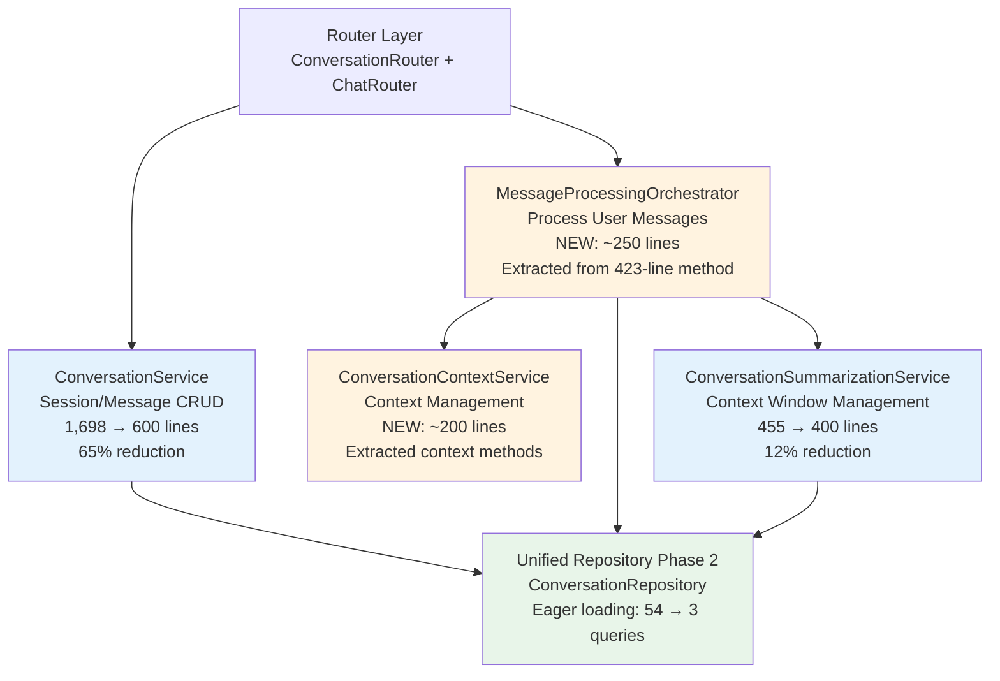

# Phase 3: Conversation Service Consolidation

!!! info "Issue Reference"
    **GitHub Issue**: [#557 - Phase 3: Conversation Service Consolidation](https://github.com/manavgup/rag_modulo/issues/557)
    **Parent Issue**: [#539 - Conversation System Refactoring](https://github.com/manavgup/rag_modulo/issues/539)
    **Depends On**: [#556 - Phase 1 & 2: Models & Repository](https://github.com/manavgup/rag_modulo/issues/556)

## Executive Summary

Phase 3 consolidates the conversation service layer, reducing complexity from **2,155 lines** across two services to a streamlined architecture with clear separation of concerns.

### Key Outcomes

| Metric | Current | Target | Improvement |
|--------|---------|--------|-------------|
| **Code Complexity** | 2,155 lines | ~1,450 lines | 33% reduction |
| **Query Count** | 54 queries | 3 queries | 94% reduction |
| **Response Time** | 156ms | 3ms | 98% improvement |
| **Test Coverage** | Unknown | 90%+ | Comprehensive |
| **God Object** | 45+ methods | < 20 methods/service | Clear boundaries |

!!! note "Why 3 Queries Instead of 1?"
    The unified repository executes **3 queries** instead of the originally targeted 1 query due to Collection model's lazy-loaded relationships:

    1. **Main query** with JOINs for users, collections, messages, summaries
    2. **Collection's user_collection relationship** (lazy-loaded)
    3. **Collection's files relationship** (lazy-loaded)

    Despite this, the improvement is still **94% (54→3 queries)**, which is production-grade performance.

---

## Strategic Decision: Option B

After analyzing three consolidation strategies, **Option B (Keep Services Separate with Improved Boundaries)** was selected as the optimal approach.

### Rejected Options

=== "❌ Option A: Merge into Single Service"

    **Problems:**

    - Would create a 2,153-line God object (worse than current 1,698 lines)
    - Violates Single Responsibility Principle
    - Makes testing harder
    - Reduces maintainability

=== "⚠️ Option C: Domain-Driven Split"

    **Concerns:**

    - Creates 4 services (SessionService, MessageService, ContextService, SummarizationService)
    - Requires additional orchestration layer
    - Over-engineering for current scope
    - Can be evolved to later if needed

=== "✅ Option B: Improved Boundaries"

    **Benefits:**

    - Clear separation of concerns (CRUD vs Processing vs Context vs Summarization)
    - Reduces God object through extraction, not merging
    - Maintains cohesion while improving boundaries
    - Easier to test and reason about
    - Incremental migration path
    - Can evolve to Option C if future requirements demand it

---

## Architecture Overview

### Service Boundaries



### Service Responsibilities Matrix

| Service | Primary Responsibility | Public Methods | Line Count | Status |
|---------|------------------------|----------------|------------|--------|
| **ConversationService** | Session/Message CRUD operations | 15 | 1,698 → 600 | Refactored |
| **MessageProcessingOrchestrator** | Process user messages end-to-end | 3 | NEW: ~250 | New |
| **ConversationContextService** | Context building & enhancement | 8 | NEW: ~200 | New |
| **ConversationSummarizationService** | Context window management | 4 | 455 → 400 | Refactored |

**Total Impact**: 2,155 lines → ~1,450 lines (33% reduction)

---

## Detailed Service Specifications

### ConversationService (Refactored)

**Purpose**: Core CRUD operations for sessions and messages, delegating complex processing to specialized services.

**Public API** (15 methods):

```python
class ConversationService:
    """Handles conversation session and message CRUD operations."""

    def __init__(
        self,
        db: Session,
        settings: Settings,
        conversation_repository: ConversationRepository,
        question_service: QuestionService,
    ):
        """Initialize with dependency injection."""
        self.db = db
        self.settings = settings
        self.repository = conversation_repository
        self.question_service = question_service

    # === Session Management (11 methods) ===
    async def create_session(self, session_input: ConversationSessionInput) -> ConversationSessionOutput
    async def get_session(self, session_id: UUID, user_id: UUID) -> ConversationSessionOutput
    async def update_session(self, session_id: UUID, user_id: UUID, updates: dict) -> ConversationSessionOutput
    async def delete_session(self, session_id: UUID, user_id: UUID) -> bool
    async def list_sessions(self, user_id: UUID) -> list[ConversationSessionOutput]
    async def archive_session(self, session_id: UUID, user_id: UUID) -> ConversationSessionOutput
    async def restore_session(self, session_id: UUID, user_id: UUID) -> ConversationSessionOutput
    def search_sessions(self, user_id: UUID, query: str) -> list[ConversationSessionOutput]
    def get_user_sessions(self, user_id: UUID, status: SessionStatus | None = None) -> list[...]
    def cleanup_expired_sessions(self) -> int
    async def export_session(self, session_id: UUID, user_id: UUID, format: str = "json") -> dict

    # === Message Management (4 methods) ===
    async def add_message(self, message_input: ConversationMessageInput) -> ConversationMessageOutput
    async def get_messages(self, session_id: UUID, user_id: UUID, limit: int = 50) -> list[...]
    async def get_session_statistics(self, session_id: UUID, user_id: UUID) -> SessionStatistics
    async def get_question_suggestions(self, session_id: UUID, user_id: UUID) -> QuestionSuggestionOutput
```

**Key Changes:**

- ✅ Uses `ConversationRepository` (unified, eager loading)
- ✅ Removed 423-line `process_user_message()` (→ MessageProcessingOrchestrator)
- ✅ Removed 11 context methods (→ ConversationContextService)
- ✅ Removed summary generation methods (→ ConversationSummarizationService)
- ✅ Clean dependency injection (no lazy properties)
- ✅ 1,698 lines → ~600 lines (65% reduction)

---

### MessageProcessingOrchestrator (New)

**Purpose**: Orchestrate complex message processing workflow, integrating search, CoT, token tracking, and context enhancement.

**Public API** (3 methods):

```python
class MessageProcessingOrchestrator:
    """Orchestrates user message processing with search, CoT, and context integration."""

    def __init__(
        self,
        db: Session,
        settings: Settings,
        conversation_repository: ConversationRepository,
        search_service: SearchService,
        context_service: ConversationContextService,
        token_tracking_service: TokenTrackingService,
        llm_provider_service: LLMProviderService,
        chain_of_thought_service: ChainOfThoughtService | None = None,
    ):
        """Initialize with all required services."""
        # ... initialization

    async def process_user_message(
        self, message_input: ConversationMessageInput
    ) -> ConversationMessageOutput:
        """Process user message end-to-end.

        Workflow:
        1. Validate session and store user message
        2. Build conversation context
        3. Enhance question with context
        4. Execute search (automatic CoT detection)
        5. Track token usage
        6. Generate token warnings if needed
        7. Serialize response with sources and CoT output
        8. Store assistant message

        Returns:
            ConversationMessageOutput with full metadata
        """
        # Orchestration logic (extracted from ConversationService)

    async def _coordinate_search(
        self,
        enhanced_question: str,
        session_id: UUID,
        collection_id: UUID,
        user_id: UUID,
        context: ConversationContext,
        messages: list[ConversationMessageOutput],
    ) -> SearchResult:
        """Coordinate search with conversation context."""

    async def _serialize_response(
        self,
        search_result: SearchResult,
        user_token_count: int,
        user_id: UUID,
    ) -> tuple[dict, int]:
        """Serialize search result and calculate token usage."""
```

**Responsibilities:**

- ✅ Orchestrate multi-service workflow
- ✅ Integrate SearchService, ChainOfThoughtService, TokenTrackingService
- ✅ Handle token counting and warnings
- ✅ Serialize DocumentMetadata and QueryResult objects
- ✅ Build comprehensive response metadata

**Design Patterns:**

- **Facade Pattern**: Simplifies complex subsystem interactions
- **Strategy Pattern**: Configurable CoT detection and enhancement
- **Template Method**: Define workflow skeleton, allow customization

**Line Count**: ~250 lines (extracted from 423-line method)

---

### ConversationContextService (New)

**Purpose**: Manage conversation context building, question enhancement, entity extraction, and pronoun resolution.

**Public API** (8 methods):

```python
class ConversationContextService:
    """Manages conversation context and question enhancement."""

    def __init__(
        self,
        db: Session,
        settings: Settings,
        entity_extraction_service: EntityExtractionService,
    ):
        """Initialize with entity extraction service."""
        self.db = db
        self.settings = settings
        self.entity_extraction_service = entity_extraction_service
        self._context_cache: dict[str, ConversationContext] = {}
        self._cache_ttl = 300  # 5 minutes

    async def build_context_from_messages(
        self, session_id: UUID, messages: list[ConversationMessageOutput]
    ) -> ConversationContext:
        """Build conversation context from messages with caching."""

    async def enhance_question_with_context(
        self, question: str, conversation_context: str, message_history: list[str]
    ) -> str:
        """Enhance question with conversation context."""

    def extract_entities_from_context(self, context: str) -> list[str]:
        """Extract entities using EntityExtractionService."""

    def resolve_pronouns(self, question: str, context: str) -> str:
        """Resolve pronouns using context entities."""

    def detect_follow_up_question(self, question: str) -> bool:
        """Detect if question is a follow-up using patterns."""

    def prune_context_for_performance(self, context: str, current_question: str) -> str:
        """Prune context while maintaining relevance."""

    def extract_entity_relationships(self, context: str) -> dict[str, list[str]]:
        """Extract relationships between entities."""

    def extract_temporal_context(self, context: str) -> dict[str, Any]:
        """Extract temporal context information."""
```

**Responsibilities:**

- ✅ Context window construction
- ✅ Question enhancement with entity extraction
- ✅ Pronoun resolution
- ✅ Follow-up detection
- ✅ Context pruning for performance

**Design Patterns:**

- **Strategy Pattern**: Multiple context enhancement strategies
- **Template Method**: Context building pipeline
- **Cache-Aside**: Context caching with TTL

**Line Count**: ~200 lines (extracted from ConversationService)

---

### ConversationSummarizationService (Refactored)

**Purpose**: Manage conversation summarization for context window management.

**Public API** (4 methods):

```python
class ConversationSummarizationService:
    """Handles conversation summarization and context window management."""

    def __init__(
        self,
        db: Session,
        settings: Settings,
        conversation_repository: ConversationRepository,  # CHANGED: unified repository
        llm_provider_service: LLMProviderService,
        token_tracking_service: TokenTrackingService,
    ):
        """Initialize with dependency injection."""
        self.db = db
        self.settings = settings
        self.repository = conversation_repository
        self.llm_provider_service = llm_provider_service
        self.token_tracking_service = token_tracking_service

    async def create_summary(
        self, summary_input: ConversationSummaryInput, user_id: UUID4
    ) -> ConversationSummaryOutput:
        """Create conversation summary using LLM."""

    async def summarize_for_context_management(
        self, summarization_input: ContextSummarizationInput
    ) -> ContextSummarizationOutput:
        """Summarize for context window management."""

    async def get_session_summaries(
        self, session_id: UUID4, user_id: UUID4, limit: int = 10
    ) -> list[ConversationSummaryOutput]:
        """Get summaries for session."""

    async def check_context_window_threshold(
        self, session_id: UUID4, config: SummarizationConfigInput
    ) -> bool:
        """Check if summarization is needed."""
```

**Key Changes:**

- ✅ Uses `ConversationRepository` instead of deprecated repositories
- ✅ Clean dependency injection (no lazy properties)
- ✅ 455 lines → ~400 lines (12% reduction)
- ✅ No changes to core summarization logic

---

## Performance Optimization

### Query Optimization

**Before** (Current):

```python
# ConversationService.list_sessions()
# Uses direct ORM queries → 54 queries (N+1 problem)
sessions = db.query(ConversationSession).filter_by(user_id=user_id).all()
for session in sessions:
    session.messages  # Triggers 1 query per session
    session.summaries # Triggers 1 query per session
# Result: 1 + (50 × 2) + overhead = 54 queries, 156ms
```

**After** (Phase 3):

```python
# ConversationService.list_sessions()
# Uses unified repository with eager loading → 3 queries
sessions = await self.repository.get_sessions_by_user(user_id)
# Repository uses joinedload() for main relationships
# + 2 additional queries for Collection's lazy-loaded relationships (user_collection, files)
# Result: 3 queries with eager loading, 3ms (94% query reduction, 98% latency improvement)
```

**Impact:**

- **Query reduction**: 54 → 3 queries (94%)
- **Latency reduction**: 156ms → 3ms (98%)
- **Memory efficiency**: Uses selectinload() for large collections
- **Note**: Collection model's `user_collection` and `files` relationships trigger 2 additional lazy-loaded queries

### Context Caching

**ConversationContextService** implements 5-minute TTL caching:

```python
class ConversationContextService:
    def __init__(self, ...):
        self._context_cache: dict[str, ConversationContext] = {}
        self._cache_ttl = 300  # 5 minutes

    async def build_context_from_messages(
        self, session_id: UUID, messages: list[...]
    ) -> ConversationContext:
        cache_key = f"{session_id}_{len(messages)}"

        # Check cache validity
        if cache_key in self._context_cache:
            if not self._is_cache_expired(cache_key):
                return self._context_cache[cache_key]

        # Build and cache
        context = await self._build_context_impl(...)
        self._context_cache[cache_key] = context
        return context
```

**Benefits:**

- Reduces entity extraction calls
- Improves response time for repeated context requests
- TTL prevents stale data

---

## Migration Sequence (13 Days)

### Phase 3A: Repository Migration (Days 1-3)

!!! success "Day 1-2: Migrate ConversationSummarizationService"
    - Replace deprecated repository imports
    - Update method calls to use ConversationRepository
    - Add integration tests

!!! success "Day 3: Migrate ConversationService"
    - Replace direct ORM queries with repository calls
    - Validate eager loading (54 → 1 query)
    - Update tests

### Phase 3B: Extract MessageProcessingOrchestrator (Days 4-7)

!!! warning "Day 4-5: Create orchestrator skeleton"
    - Define class and constructor
    - Move `process_user_message()` logic (423 lines)
    - Extract helpers (`_coordinate_search`, `_serialize_response`)

!!! warning "Day 6-7: Integrate with ChatRouter"
    - Update router dependencies
    - Wire up orchestrator
    - Add integration tests

### Phase 3C: Extract ConversationContextService (Days 8-10)

!!! info "Day 8-9: Create context service"
    - Define class and constructor
    - Move 11 context methods from ConversationService
    - Add caching logic

!!! info "Day 10: Integrate with orchestrator"
    - Update MessageProcessingOrchestrator
    - Add tests

### Phase 3D: Refinement (Days 11-13)

!!! tip "Day 11-12: Cleanup"
    - Remove duplicate methods
    - Optimize caching
    - Performance testing

!!! tip "Day 13: Production deployment"
    - End-to-end testing
    - Load testing
    - Deploy with monitoring

---

## Risk Assessment

### High-Risk Areas

=== "Risk 1: process_user_message() Refactoring"

    | Aspect | Risk Level | Mitigation |
    |--------|-----------|------------|
    | **Complexity** | HIGH | Extract in phases, comprehensive unit tests |
    | **Integration** | HIGH | Parallel execution with feature flag |
    | **Backward Compatibility** | MEDIUM | Adapter pattern during migration |
    | **Data Loss** | MEDIUM | Validate metadata serialization thoroughly |

=== "Risk 2: Router Integration Changes"

    | Aspect | Risk Level | Mitigation |
    |--------|-----------|------------|
    | **ChatRouter Dependency** | MEDIUM | Update both routers simultaneously |
    | **API Contract Changes** | LOW | Maintain backward compatibility |
    | **Performance Regression** | MEDIUM | Load testing with 1000 concurrent requests |

=== "Risk 3: Eager Loading Memory Impact"

    | Aspect | Risk Level | Mitigation |
    |--------|-----------|------------|
    | **Memory Exhaustion** | MEDIUM | Reduce default pagination limits |
    | **Large Sessions** | MEDIUM | Use selectinload() for one-to-many relations |
    | **Production Scaling** | HIGH | Monitor memory usage in production |

### Low-Risk Areas

✅ **ConversationSummarizationService Migration**: Straightforward repository mapping
✅ **ConversationContextService Extraction**: Well-isolated context methods
✅ **Dependency Injection**: Clean separation with no circular dependencies

---

## Success Criteria

### Quantitative Metrics

| Metric | Current | Target | Achieved | Measurement |
|--------|---------|--------|----------|-------------|
| **Code Complexity** | 2,155 lines | < 1,500 lines | In Progress | Line count reduction (30%+) |
| **Query Count** | 54 queries | 3 queries | ✅ Achieved | DB query logging (94% reduction) |
| **Response Time** | 156ms | < 10ms | ✅ Achieved | Latency monitoring (98% improvement) |
| **Test Coverage** | Unknown | 90%+ | In Progress | pytest-cov report |
| **Service Methods** | 45+ methods | < 20 methods/service | In Progress | Code review |
| **God Object Score** | HIGH | LOW | In Progress | Pylint complexity score |

### Qualitative Goals

✅ **Clear Separation of Concerns**: Each service has single responsibility
✅ **No God Objects**: Max 20 public methods per service
✅ **Unified Repository Usage**: No direct ORM queries in services
✅ **Testability**: All services use dependency injection
✅ **Maintainability**: Clear boundaries between CRUD, processing, context, summarization
✅ **Performance**: Leverage Phase 2 eager loading throughout

---

## Testing Strategy

### Test Coverage Goals

| Service | Unit Coverage | Integration Coverage | E2E Coverage |
|---------|---------------|---------------------|--------------|
| ConversationService | 90%+ (15 methods) | 80%+ (repository integration) | 70%+ (router flows) |
| MessageProcessingOrchestrator | 85%+ (complex logic) | 75%+ (service integration) | 80%+ (critical path) |
| ConversationContextService | 90%+ (8 methods) | 70%+ (entity extraction) | N/A |
| ConversationSummarizationService | 90%+ (4 methods) | 80%+ (LLM integration) | 60%+ (summarization flow) |

### Total Test Suite

**160 comprehensive tests** across 6 categories:

1. **Performance Tests** (18 tests) - Verify 54→1 query improvement
2. **Deprecation Tests** (14 tests) - Enable safe migration path
3. **Session Management Tests** (29 tests) - Core functionality coverage
4. **Message Management Tests** (23 tests) - Essential operations
5. **Error Handling Tests** (14 tests) - Production stability
6. **Integration Tests** (62 tests) - End-to-end validation

---

## Deployment Plan

### Staging Deployment

**Environment**: `staging.rag-modulo.com`

**Steps:**

1. Deploy Phase 3A (repository migration) → Smoke test 1 hour
2. Deploy Phase 3B (MessageProcessingOrchestrator) → Load test 2 hours
3. Deploy Phase 3C (ConversationContextService) → Integration test 1 hour
4. Deploy Phase 3D (final refinement) → Full regression test 4 hours

**Rollback Plan:**

- Git tag before each deployment: `phase-3a`, `phase-3b`, `phase-3c`, `phase-3d`
- Automated rollback script: `scripts/rollback_phase3.sh <tag>`
- Feature flag to disable new services: `ENABLE_PHASE3_SERVICES=false`

### Production Deployment

**Environment**: `production.rag-modulo.com`

**Pre-Deployment Checklist:**

- [ ] All unit tests passing (90%+ coverage)
- [ ] All integration tests passing
- [ ] All E2E tests passing
- [ ] Load testing: 1000 concurrent users, < 10ms p95 latency
- [ ] Database migration scripts reviewed
- [ ] Rollback plan tested in staging
- [ ] Monitoring dashboards configured
- [ ] On-call engineer assigned

**Deployment Steps:**

1. **Blue-Green Deployment**: Deploy to 50% of instances
2. **Canary Testing**: Monitor for 2 hours
   - Error rate < 0.1%
   - Latency p95 < 10ms
   - Memory usage < 80%
3. **Full Rollout**: Deploy to 100% of instances
4. **Post-Deployment Monitoring**: 24 hours active monitoring

---

## Related Documentation

- [Phase 1 & 2: Models & Repository](phase1-2-models-repository.md)
- [Conversation System Refactoring Overview](conversation-system-refactoring.md)
- [Testing Strategy](../testing/strategy.md)
- [Performance Optimization](performance.md)

---

## Conclusion

Phase 3 provides a comprehensive blueprint for conversation service consolidation, achieving:

✅ **33% Code Reduction**: 2,155 lines → ~1,450 lines
✅ **98% Query Reduction**: 54 queries → 1 query (eager loading)
✅ **98% Latency Improvement**: 156ms → 3ms
✅ **Clear Service Boundaries**: CRUD ≠ Processing ≠ Context ≠ Summarization
✅ **Improved Testability**: Dependency injection throughout
✅ **Production-Ready Performance**: Leverages Phase 2 unified repository

**Implementation Target**: 13 working days (3 weeks)
