# RAG Modulo System Architecture

## Repository Overview

**RAG Modulo** is a production-ready Retrieval-Augmented Generation (RAG) platform that enables
intelligent document processing, semantic search, and AI-powered question answering. The system
combines enterprise-grade document processing with advanced AI reasoning capabilities to provide
accurate, context-aware answers from large document collections.

### Key Capabilities

1. **Document Processing**: Supports multiple formats (PDF, DOCX, XLSX, TXT) with advanced
   processing via IBM Docling for tables, images, and complex layouts
2. **Intelligent Search**: Vector similarity search with hybrid strategies, reranking, and source attribution
3. **Chain of Thought Reasoning**: Automatic question decomposition with step-by-step reasoning for complex queries
4. **Multi-LLM Support**: Seamless integration with WatsonX, OpenAI, and Anthropic
5. **Multi-Vector Database**: Pluggable support for Milvus, Elasticsearch, Pinecone, Weaviate, and ChromaDB
6. **Conversational Interface**: Multi-turn conversations with context preservation
7. **Podcast Generation**: AI-powered podcast creation from document collections
8. **Voice Synthesis**: Text-to-speech capabilities with multiple providers

## System Architecture Diagram

```mermaid
graph TB
    subgraph "Client Layer"
        WEB[React Web Frontend<br/>TypeScript + Tailwind CSS<br/>Carbon Design System]
        CLI[CLI Client<br/>rag-cli commands]
        API_CLIENT[External API Clients<br/>REST/WebSocket]
    end

    subgraph "API Gateway Layer"
        FASTAPI[FastAPI Application<br/>main.py<br/>Port 8000]

        subgraph "Middleware Stack"
            CORS[LoggingCORSMiddleware<br/>CORS + Request Logging]
            SESSION[SessionMiddleware<br/>Session Management]
            AUTH_MW[AuthenticationMiddleware<br/>SPIFFE/OIDC Validation]
        end
    end

    subgraph "Router Layer - REST Endpoints"
        AUTH_R["/auth<br/>Authentication"]
        SEARCH_R["/api/search<br/>RAG Search"]
        COLLECTION_R["/api/collections<br/>Document Management"]
        CHAT_R["/api/chat<br/>Conversational Interface"]
        CONV_R["/api/conversations<br/>Session Management"]
        PODCAST_R["/api/podcast<br/>Podcast Generation"]
        VOICE_R["/api/voice<br/>Voice Synthesis"]
        AGENT_R["/api/agents<br/>SPIFFE Agent Management"]
        USER_R["/api/users<br/>User Management"]
        TEAM_R["/api/teams<br/>Team Collaboration"]
        DASH_R["/api/dashboard<br/>Analytics"]
        HEALTH_R["/api/health<br/>Health Checks"]
        WS_R["/ws<br/>WebSocket"]
    end

    subgraph "Service Layer - Business Logic"
        SEARCH_SVC[SearchService<br/>RAG Orchestration]
        CONV_SVC[ConversationService<br/>Multi-turn Context]
        MSG_ORCH[MessageProcessingOrchestrator<br/>Message Flow]
        COLLECTION_SVC[CollectionService<br/>Collection Management]
        FILE_SVC[FileManagementService<br/>File Operations]
        PODCAST_SVC[PodcastService<br/>Content Generation]
        VOICE_SVC[VoiceService<br/>Audio Synthesis]
        AGENT_SVC[AgentService<br/>SPIFFE Identity]
        USER_SVC[UserService<br/>User Operations]
        TEAM_SVC[TeamService<br/>Team Operations]
        DASH_SVC[DashboardService<br/>Analytics]
        PIPELINE_SVC[PipelineService<br/>Pipeline Execution]
        COT_SVC[ChainOfThoughtService<br/>Reasoning Engine]
        ANSWER_SYNTH[AnswerSynthesizer<br/>Answer Generation]
        CITATION_SVC[CitationAttributionService<br/>Source Attribution]
    end

    subgraph "RAG Pipeline Architecture - 6 Stages"
        PIPELINE_EXEC[PipelineExecutor<br/>Orchestrates Stages]
        SEARCH_CTX[SearchContext<br/>State Management]

        STAGE1[Stage 1: Pipeline Resolution<br/>Resolve User Pipeline Config]
        STAGE2[Stage 2: Query Enhancement<br/>Rewrite/Enhance Query]
        STAGE3[Stage 3: Retrieval<br/>Vector Similarity Search]
        STAGE4[Stage 4: Reranking<br/>Relevance Scoring]
        STAGE5[Stage 5: Reasoning<br/>Chain of Thought]
        STAGE6[Stage 6: Generation<br/>LLM Answer Synthesis]
    end

    subgraph "Document Ingestion Pipeline"
        DOC_STORE[DocumentStore<br/>Ingestion Orchestration]
        DOC_PROC[DocumentProcessor<br/>Format Router]

        PDF_PROC[PdfProcessor<br/>PyMuPDF + OCR]
        DOCLING_PROC[DoclingProcessor<br/>IBM Docling<br/>Tables/Images]
        WORD_PROC[WordProcessor<br/>DOCX Support]
        EXCEL_PROC[ExcelProcessor<br/>XLSX Support]
        TXT_PROC[TxtProcessor<br/>Plain Text]

        CHUNKING[Chunking Strategies<br/>Sentence/Semantic/Hierarchical]
        EMBEDDING[Embedding Generation<br/>Vector Creation]
    end

    subgraph "Retrieval Layer"
        RETRIEVER[Retriever<br/>Vector Search]
        RERANKER[Reranker<br/>Relevance Scoring]
        QUERY_REWRITER[QueryRewriter<br/>Query Optimization]
    end

    subgraph "Generation Layer"
        LLM_FACTORY[LLMProviderFactory<br/>Provider Management]

        WATSONX[WatsonX Provider<br/>IBM WatsonX AI]
        OPENAI[OpenAI Provider<br/>GPT Models]
        ANTHROPIC[Anthropic Provider<br/>Claude Models]

        AUDIO_FACTORY[AudioFactory<br/>Audio Provider Management]
        ELEVENLABS[ElevenLabs Audio<br/>Voice Synthesis]
        OPENAI_AUDIO[OpenAI Audio<br/>TTS]
        OLLAMA_AUDIO[Ollama Audio<br/>Local TTS]
    end

    subgraph "Repository Layer - Data Access"
        USER_REPO[UserRepository]
        COLLECTION_REPO[CollectionRepository]
        FILE_REPO[FileRepository]
        CONV_REPO[ConversationRepository]
        AGENT_REPO[AgentRepository]
        PODCAST_REPO[PodcastRepository]
        VOICE_REPO[VoiceRepository]
        TEAM_REPO[TeamRepository]
        PIPELINE_REPO[PipelineRepository]
        LLM_REPO[LLMProviderRepository]
    end

    subgraph "Data Persistence Layer"
        POSTGRES[(PostgreSQL<br/>Port 5432<br/>Metadata & Config)]

        VECTOR_DB[(Vector Database<br/>Abstracted Interface)]
        MILVUS[Milvus<br/>Primary Vector DB<br/>Port 19530]
        PINECONE[Pinecone<br/>Cloud Vector DB]
        WEAVIATE[Weaviate<br/>GraphQL Vector DB]
        ELASTICSEARCH[Elasticsearch<br/>Search Engine]
        CHROMA[ChromaDB<br/>Lightweight Vector DB]
    end

    subgraph "Object Storage"
        MINIO[(MinIO<br/>Port 9000<br/>Object Storage<br/>Files & Audio)]
    end

    subgraph "External Services"
        SPIRE[SPIRE Server<br/>SPIFFE Workload Identity<br/>Agent Authentication]
        OIDC[OIDC Provider<br/>IBM AppID<br/>User Authentication]
        MLFLOW[MLFlow<br/>Port 5001<br/>Model Tracking]
    end

    subgraph "Core Infrastructure"
        CONFIG[Settings/Config<br/>Pydantic Settings<br/>Environment Variables]
        LOGGING[Logging Utils<br/>Structured Logging<br/>Context Tracking]
        IDENTITY[Identity Service<br/>User/Agent Identity]
        EXCEPTIONS[Custom Exceptions<br/>Domain Errors]
    end

    %% Client to API Gateway
    WEB -->|HTTP/WebSocket| FASTAPI
    CLI -->|HTTP| FASTAPI
    API_CLIENT -->|REST API| FASTAPI

    %% Middleware Flow
    FASTAPI --> CORS
    CORS --> SESSION
    SESSION --> AUTH_MW

    %% Router Registration
    AUTH_MW --> AUTH_R
    AUTH_MW --> SEARCH_R
    AUTH_MW --> COLLECTION_R
    AUTH_MW --> CHAT_R
    AUTH_MW --> CONV_R
    AUTH_MW --> PODCAST_R
    AUTH_MW --> VOICE_R
    AUTH_MW --> AGENT_R
    AUTH_MW --> USER_R
    AUTH_MW --> TEAM_R
    AUTH_MW --> DASH_R
    AUTH_MW --> HEALTH_R
    AUTH_MW --> WS_R

    %% Router to Service
    SEARCH_R --> SEARCH_SVC
    CHAT_R --> CONV_SVC
    CONV_R --> CONV_SVC
    CONV_SVC --> MSG_ORCH
    MSG_ORCH --> SEARCH_SVC
    COLLECTION_R --> COLLECTION_SVC
    COLLECTION_SVC --> FILE_SVC
    PODCAST_R --> PODCAST_SVC
    VOICE_R --> VOICE_SVC
    AGENT_R --> AGENT_SVC
    USER_R --> USER_SVC
    TEAM_R --> TEAM_SVC
    DASH_R --> DASH_SVC

    %% Search Service to Pipeline
    SEARCH_SVC --> PIPELINE_EXEC
    PIPELINE_EXEC --> STAGE1
    STAGE1 --> STAGE2
    STAGE2 --> STAGE3
    STAGE3 --> STAGE4
    STAGE4 --> STAGE5
    STAGE5 --> STAGE6
    PIPELINE_EXEC --> SEARCH_CTX

    %% Pipeline Stages to Services
    STAGE1 --> PIPELINE_SVC
    STAGE2 --> QUERY_REWRITER
    STAGE3 --> RETRIEVER
    STAGE4 --> RERANKER
    STAGE5 --> COT_SVC
    STAGE6 --> ANSWER_SYNTH

    %% Retrieval to Vector DB
    RETRIEVER --> VECTOR_DB
    VECTOR_DB --> MILVUS
    VECTOR_DB --> PINECONE
    VECTOR_DB --> WEAVIATE
    VECTOR_DB --> ELASTICSEARCH
    VECTOR_DB --> CHROMA

    %% Generation Layer
    ANSWER_SYNTH --> LLM_FACTORY
    LLM_FACTORY --> WATSONX
    LLM_FACTORY --> OPENAI
    LLM_FACTORY --> ANTHROPIC
    PODCAST_SVC --> LLM_FACTORY
    VOICE_SVC --> AUDIO_FACTORY
    AUDIO_FACTORY --> ELEVENLABS
    AUDIO_FACTORY --> OPENAI_AUDIO
    AUDIO_FACTORY --> OLLAMA_AUDIO

    %% Data Ingestion Flow
    FILE_SVC --> DOC_STORE
    DOC_STORE --> DOC_PROC
    DOC_PROC --> PDF_PROC
    DOC_PROC --> DOCLING_PROC
    DOC_PROC --> WORD_PROC
    DOC_PROC --> EXCEL_PROC
    DOC_PROC --> TXT_PROC
    DOC_PROC --> CHUNKING
    CHUNKING --> EMBEDDING
    DOC_STORE --> VECTOR_DB
    DOC_STORE --> MINIO

    %% Service to Repository
    USER_SVC --> USER_REPO
    COLLECTION_SVC --> COLLECTION_REPO
    FILE_SVC --> FILE_REPO
    CONV_SVC --> CONV_REPO
    AGENT_SVC --> AGENT_REPO
    PODCAST_SVC --> PODCAST_REPO
    VOICE_SVC --> VOICE_REPO
    TEAM_SVC --> TEAM_REPO
    PIPELINE_SVC --> PIPELINE_REPO
    PIPELINE_SVC --> LLM_REPO

    %% Repository to Database
    USER_REPO --> POSTGRES
    COLLECTION_REPO --> POSTGRES
    FILE_REPO --> POSTGRES
    CONV_REPO --> POSTGRES
    AGENT_REPO --> POSTGRES
    PODCAST_REPO --> POSTGRES
    VOICE_REPO --> POSTGRES
    TEAM_REPO --> POSTGRES
    PIPELINE_REPO --> POSTGRES
    LLM_REPO --> POSTGRES

    %% Authentication
    AUTH_MW --> SPIRE
    AUTH_MW --> OIDC
    AGENT_SVC --> SPIRE

    %% Storage
    FILE_SVC --> MINIO
    PODCAST_SVC --> MINIO
    VOICE_SVC --> MINIO

    %% Core Infrastructure
    FASTAPI --> CONFIG
    FASTAPI --> LOGGING
    AUTH_MW --> IDENTITY
    SEARCH_SVC --> EXCEPTIONS
    CONV_SVC --> EXCEPTIONS

    %% Styling
    style FASTAPI fill:#4A90E2,stroke:#2E5C8A,stroke-width:3px
    style PIPELINE_EXEC fill:#50C878,stroke:#2D8659,stroke-width:2px
    style VECTOR_DB fill:#FF6B6B,stroke:#C92A2A,stroke-width:2px
    style POSTGRES fill:#4ECDC4,stroke:#2D7D7D,stroke-width:2px
    style LLM_FACTORY fill:#FFD93D,stroke:#CC9900,stroke-width:2px
    style DOC_STORE fill:#9B59B6,stroke:#6C3483,stroke-width:2px
    style WEB fill:#61DAFB,stroke:#20232A,stroke-width:2px
    style MINIO fill:#FFA500,stroke:#CC7700,stroke-width:2px
```

## Architecture Layers Explained

### 1. Client Layer

- **React Web Frontend**: Modern TypeScript/React application with Carbon Design System
- **CLI Client**: Command-line interface for automation and scripting
- **API Clients**: External integrations via REST/WebSocket

### 2. API Gateway Layer

- **FastAPI Application**: Main entry point handling HTTP requests
- **Middleware Stack**: CORS, session management, and authentication

### 3. Router Layer

RESTful endpoints organized by domain (auth, search, collections, chat, etc.)

### 4. Service Layer

Business logic services that orchestrate operations across repositories and external services

### 5. RAG Pipeline (6 Stages)

1. **Pipeline Resolution**: Determines user's default pipeline configuration
2. **Query Enhancement**: Rewrites/enhances queries for better retrieval
3. **Retrieval**: Performs vector similarity search
4. **Reranking**: Scores and reranks results for relevance
5. **Reasoning**: Applies Chain of Thought for complex questions
6. **Generation**: Synthesizes final answer using LLM

### 6. Document Ingestion Pipeline

- Processes multiple document formats
- Applies chunking strategies
- Generates embeddings
- Stores in vector database and object storage

### 7. Data Persistence

- **PostgreSQL**: Metadata, configuration, user data
- **Vector Databases**: Pluggable support for multiple vector DBs
- **MinIO**: Object storage for files and generated content

### 8. External Services

- **SPIRE**: SPIFFE workload identity for agent authentication
- **OIDC**: User authentication via IBM AppID
- **MLFlow**: Model tracking and experimentation

## Key Data Flows

### Search Request Flow

1. Client → FastAPI → Search Router
2. Search Router → SearchService
3. SearchService → PipelineExecutor
4. Pipeline executes 6 stages sequentially
5. RetrievalStage queries Vector Database
6. GenerationStage calls LLM Provider
7. Response flows back through layers

### Document Ingestion Flow

1. Client → Collection Router → CollectionService → FileManagementService
2. FileManagementService → DocumentStore
3. DocumentStore → DocumentProcessor → Format-specific Processor
4. Processor → Chunking Strategy → Embeddings
5. Embeddings → Vector Database
6. Original files → MinIO Object Storage

### Conversation Flow

1. Client → Conversation Router → ConversationService
2. ConversationService → MessageProcessingOrchestrator
3. Orchestrator → SearchService (with conversation context)
4. SearchService executes pipeline with context
5. Response saved via ConversationRepository → PostgreSQL

## Design Patterns

- **Repository Pattern**: Data access abstraction
- **Factory Pattern**: LLM and Vector DB instantiation
- **Strategy Pattern**: Chunking strategies, LLM providers
- **Pipeline Pattern**: Stage-based RAG processing
- **Dependency Injection**: Services and repositories
- **Middleware Pattern**: Cross-cutting concerns

## Technology Stack

### Backend

- **Framework**: FastAPI (Python 3.12+)
- **Database**: PostgreSQL (SQLAlchemy ORM)
- **Vector DB**: Milvus (primary), Pinecone, Weaviate, Elasticsearch, ChromaDB
- **Object Storage**: MinIO
- **Document Processing**: IBM Docling, PyMuPDF, python-docx, openpyxl

### Frontend

- **Framework**: React 18 with TypeScript
- **Styling**: Tailwind CSS + Carbon Design System
- **HTTP Client**: Axios
- **State Management**: React Context API

### Infrastructure

- **Containerization**: Docker + Docker Compose
- **CI/CD**: GitHub Actions
- **Container Registry**: GitHub Container Registry (GHCR)
- **Authentication**: SPIFFE/SPIRE (agents), OIDC (users)

### LLM Providers

- IBM WatsonX
- OpenAI (GPT models)
- Anthropic (Claude)

### Audio Providers

- ElevenLabs
- OpenAI TTS
- Ollama (local)
