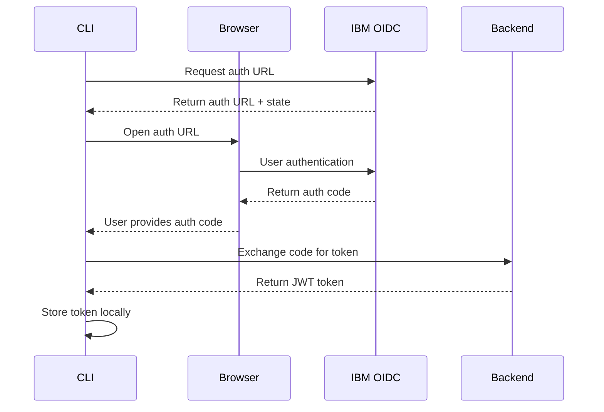

# Authentication

The RAG CLI uses IBM OIDC (OpenID Connect) for secure authentication. This guide covers the complete authentication setup process, from configuration to troubleshooting.

## Overview

The CLI authentication system provides:
- **IBM OIDC Integration**: Secure authentication with IBM Cloud identity providers
- **Token Management**: Automatic token refresh and secure local storage
- **Multi-Environment Support**: Different profiles for dev, staging, and production
- **Browser-based Flow**: Secure OAuth 2.0 authorization code flow

## Authentication Flow



## Quick Setup

### 1. Start Authentication Process
```bash
./rag-cli auth login
```

This command will:
1. Contact the backend to initiate OIDC flow
2. Open your default browser to IBM authentication page
3. Display instructions to complete the process

### 2. Complete Browser Authentication
- Authenticate with your IBM credentials
- Copy the authorization code from the redirect URL
- Return to the CLI and paste the code when prompted

### 3. Verify Authentication
```bash
./rag-cli auth status
```

Expected output for successful authentication:
```
✅ Authenticated
User: your-email@company.com
Expires: 2024-01-15 14:30:00 UTC
Profile: default
```

## Configuration

### Environment Variables

Set these environment variables for authentication configuration:

```bash
# Required: IBM OIDC configuration
export IBM_OIDC_CLIENT_ID="your-client-id"
export IBM_OIDC_CLIENT_SECRET="your-client-secret"  # If required
export IBM_OIDC_ISSUER="https://your-issuer.com"

# Optional: Custom redirect URI
export IBM_OIDC_REDIRECT_URI="http://localhost:8080/callback"

# Optional: Custom scopes
export IBM_OIDC_SCOPE="openid profile email"
```

### CLI Configuration

Configure authentication settings directly through the CLI:

```bash
# Set OIDC client ID
./rag-cli config set auth.client_id "your-client-id"

# Set OIDC issuer
./rag-cli config set auth.issuer "https://your-issuer.com"

# Set custom scopes
./rag-cli config set auth.scope "openid profile email groups"

# View current auth configuration
./rag-cli config show auth
```

## Advanced Configuration

### Multi-Profile Authentication

Configure different authentication settings for different environments:

```bash
# Development environment
./rag-cli config set-profile dev
./rag-cli config set auth.client_id "dev-client-id" --profile dev
./rag-cli config set auth.issuer "https://dev-issuer.com" --profile dev

# Production environment
./rag-cli config set-profile prod
./rag-cli config set auth.client_id "prod-client-id" --profile prod
./rag-cli config set auth.issuer "https://prod-issuer.com" --profile prod

# Switch between profiles
./rag-cli config use-profile dev
./rag-cli config use-profile prod
```

### Custom Authentication Providers

While IBM OIDC is the primary supported provider, the CLI can be extended for other OIDC providers:

```bash
# Configure custom provider
./rag-cli config set auth.provider "custom"
./rag-cli config set auth.issuer "https://custom-provider.com"
./rag-cli config set auth.client_id "custom-client-id"
```

### Token Storage Configuration

Customize how authentication tokens are stored:

```bash
# Set custom configuration directory
export RAG_CONFIG_DIR="$HOME/.custom-rag"

# Set token expiration buffer (seconds before expiry to refresh)
./rag-cli config set auth.token_refresh_buffer 300

# Enable/disable automatic token refresh
./rag-cli config set auth.auto_refresh true
```

## Commands Reference

### `rag-cli auth login`

Initiates the authentication flow.

```bash
# Basic login
./rag-cli auth login

# Login with custom client ID
./rag-cli auth login --client-id "custom-client-id"

# Login with custom scopes
./rag-cli auth login --scope "openid profile email groups"

# Login with specific profile
./rag-cli auth login --profile prod
```

**Options:**
- `--client-id`: Override configured client ID
- `--scope`: Override configured scopes
- `--profile`: Use specific profile configuration
- `--browser`: Specify browser to open (`chrome`, `firefox`, `safari`)
- `--no-browser`: Don't open browser automatically

### `rag-cli auth status`

Check current authentication status.

```bash
# Basic status check
./rag-cli auth status

# Detailed status with token info
./rag-cli auth status --verbose

# Check specific profile
./rag-cli auth status --profile prod
```

**Output fields:**
- Authentication status (✅ Authenticated / ❌ Not authenticated)
- User email/ID
- Token expiration time
- Active profile
- Scopes granted

### `rag-cli auth logout`

Log out and clear stored tokens.

```bash
# Logout current profile
./rag-cli auth logout

# Logout specific profile
./rag-cli auth logout --profile prod

# Logout all profiles
./rag-cli auth logout --all

# Logout and clear all configuration
./rag-cli auth logout --clear-config
```

### `rag-cli auth refresh`

Manually refresh authentication token.

```bash
# Refresh current token
./rag-cli auth refresh

# Force refresh even if not expired
./rag-cli auth refresh --force

# Refresh specific profile
./rag-cli auth refresh --profile prod
```

### `rag-cli auth whoami`

Display current user information.

```bash
# Basic user info
./rag-cli auth whoami

# Detailed user info including groups/roles
./rag-cli auth whoami --verbose
```

## Troubleshooting

### Common Issues

#### "Not authenticated" Error
```bash
# Check current status
./rag-cli auth status

# If expired, re-authenticate
./rag-cli auth login
```

#### Browser Won't Open
```bash
# Try with specific browser
./rag-cli auth login --browser chrome

# Or use no-browser mode and open manually
./rag-cli auth login --no-browser
# Then manually open the displayed URL
```

#### Token Expired Issues
```bash
# Check token status
./rag-cli auth status --verbose

# Refresh token
./rag-cli auth refresh

# If refresh fails, re-authenticate
./rag-cli auth login
```

#### Invalid Client ID/Secret
```bash
# Verify configuration
./rag-cli config show auth

# Update client credentials
./rag-cli config set auth.client_id "correct-client-id"
./rag-cli config set auth.client_secret "correct-client-secret"
```

### Network Issues

#### Connection to OIDC Provider Failed
```bash
# Test network connectivity
curl -I https://your-issuer.com/.well-known/openid_configuration

# Check proxy settings
./rag-cli config set http.proxy "http://proxy:8080"

# Disable SSL verification (development only)
./rag-cli config set http.verify_ssl false
```

#### Backend Authentication Endpoint Unavailable
```bash
# Test backend connectivity
curl -I http://localhost:8000/api/auth/cli/start

# Check backend URL configuration
./rag-cli config show api_url

# Update backend URL if needed
./rag-cli config set api_url "http://correct-backend:8000"
```

### Debug Mode

Enable debug logging for authentication troubleshooting:

```bash
# Enable debug mode
./rag-cli config set debug true

# Run authentication with verbose output
./rag-cli auth login --verbose

# Check logs
tail -f ~/.rag/logs/cli.log
```

### Configuration Issues

#### Reset Authentication Configuration
```bash
# Clear all auth configuration
./rag-cli config unset auth

# Reset to defaults
./rag-cli config reset auth

# Remove stored tokens
rm -rf ~/.rag/tokens/
```

#### Backup and Restore Configuration
```bash
# Backup configuration
cp ~/.rag/config.json ~/.rag/config.json.backup

# Restore configuration
cp ~/.rag/config.json.backup ~/.rag/config.json
```

## Security Best Practices

### Token Security
- Tokens are stored securely in `~/.rag/tokens/` with restricted permissions (600)
- Never share or commit token files
- Use separate profiles for different environments
- Regularly rotate client credentials

### Network Security
- Always use HTTPS in production environments
- Validate SSL certificates (don't disable in production)
- Use secure networks for authentication
- Consider using a VPN for sensitive environments

### Access Control
- Use principle of least privilege for OIDC scopes
- Regularly audit user permissions
- Set appropriate token expiration times
- Monitor authentication logs for suspicious activity

## Integration Examples

### CI/CD Pipeline Authentication
```bash
# Use service account credentials
export IBM_OIDC_CLIENT_ID="$SERVICE_ACCOUNT_ID"
export IBM_OIDC_CLIENT_SECRET="$SERVICE_ACCOUNT_SECRET"

# Non-interactive authentication
./rag-cli auth login --non-interactive
```

### Automated Scripts
```bash
#!/bin/bash
# Check if authenticated
if ! ./rag-cli auth status --quiet; then
    echo "Authentication required"
    ./rag-cli auth login
fi

# Continue with authenticated operations
./rag-cli collections list
```

## Next Steps

After setting up authentication:
1. **[Commands Overview](commands/index.md)** - Learn available CLI commands
2. **[Collection Management](commands/collections.md)** - Start managing document collections
3. **[Configuration Guide](configuration.md)** - Advanced CLI configuration
4. **[Troubleshooting](troubleshooting.md)** - Additional troubleshooting resources
