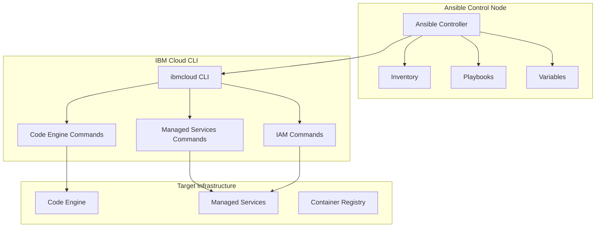

# Ansible Automation Guide

This guide covers using Ansible for automated deployment and configuration management of RAG Modulo on IBM Cloud.

## Overview

Ansible provides configuration management and application deployment capabilities for RAG Modulo, working in conjunction with Terraform for infrastructure provisioning. This hybrid approach ensures reliable, repeatable deployments across different environments.

## Architecture



## Prerequisites

### 1. Ansible Installation

```bash
# Install Ansible
pip install ansible>=6.0

# Verify installation
ansible --version
```

### 2. IBM Cloud CLI

```bash
# Install IBM Cloud CLI
curl -fsSL https://clis.cloud.ibm.com/install | bash

# Login to IBM Cloud
ibmcloud login

# Install Code Engine plugin
ibmcloud plugin install code-engine
```

### 3. Required Collections

```bash
# Install Ansible collections
ansible-galaxy collection install -r requirements.yml
```

## Directory Structure

```
deployment/ansible/
├── playbooks/
│   └── deploy-rag-modulo.yml
├── inventories/
│   └── ibm/
│       └── hosts.yml
├── group_vars/
│   ├── all/
│   │   └── main.yml
│   ├── development/
│   │   └── main.yml
│   └── production/
│       └── main.yml
├── requirements.yml
└── tests/
    └── test_deploy.yml
```

## Configuration

### Inventory Configuration

```yaml
# inventories/ibm/hosts.yml
---
all:
  children:
    ibm_cloud:
      hosts:
        localhost:
          ansible_connection: local
          ansible_python_interpreter: "{{ ansible_playbook_python }}"

    development:
      hosts:
        localhost:
          ansible_connection: local
          ansible_python_interpreter: "{{ ansible_playbook_python }}"

    production:
      hosts:
        localhost:
          ansible_connection: local
          ansible_python_interpreter: "{{ ansible_playbook_python }}"

  vars:
    ansible_connection: local
    ansible_python_interpreter: "{{ ansible_playbook_python }}"

    # IBM Cloud default settings
    region: "us-south"
    container_registry_url: "us.icr.io"
    container_registry_username: "iamapikey"
```

### Global Variables

```yaml
# group_vars/all/main.yml
---
# Project configuration
project_name: "rag-modulo"
environment: "{{ env | default('dev') }}"
region: "{{ region | default('us-south') }}"

# IBM Cloud configuration
ibmcloud_api_key: "{{ lookup('env', 'IBMCLOUD_API_KEY') }}"
resource_group_id: "{{ lookup('env', 'RESOURCE_GROUP_ID') }}"

# Container registry configuration
container_registry_url: "{{ lookup('env', 'CONTAINER_REGISTRY_URL') | default('us.icr.io') }}"
container_registry_username: "{{ lookup('env', 'CONTAINER_REGISTRY_USERNAME') | default('iamapikey') }}"
container_registry_password: "{{ lookup('env', 'CONTAINER_REGISTRY_PASSWORD') }}"

# Image tags
backend_image_tag: "{{ lookup('env', 'BACKEND_IMAGE_TAG') | default('latest') }}"
frontend_image_tag: "{{ lookup('env', 'FRONTEND_IMAGE_TAG') | default('latest') }}"

# Scaling configuration
backend_min_scale: "{{ lookup('env', 'BACKEND_MIN_SCALE') | default('1') | int }}"
backend_max_scale: "{{ lookup('env', 'BACKEND_MAX_SCALE') | default('3') | int }}"
frontend_min_scale: "{{ lookup('env', 'FRONTEND_MIN_SCALE') | default('1') | int }}"
frontend_max_scale: "{{ lookup('env', 'FRONTEND_MAX_SCALE') | default('2') | int }}"

# Production safeguards
enable_production_safeguards: "{{ lookup('env', 'ENABLE_PRODUCTION_SAFEGUARDS') | default('false') | bool }}"
```

### Development Variables

```yaml
# group_vars/development/main.yml
---
# Development-specific settings
environment: "dev"
debug: true
log_level: "DEBUG"

# Scaling (development)
backend_min_scale: 1
backend_max_scale: 3
frontend_min_scale: 1
frontend_max_scale: 2

# Resource limits (development)
backend_cpu: "0.5"
backend_memory: "1Gi"
frontend_cpu: "0.25"
frontend_memory: "512Mi"

# Security (development)
skip_auth: true
enable_cors: true
```

### Production Variables

```yaml
# group_vars/production/main.yml
---
# Production-specific settings
environment: "production"
debug: false
log_level: "INFO"

# Scaling (production)
backend_min_scale: 3
backend_max_scale: 20
frontend_min_scale: 2
frontend_max_scale: 10

# Resource limits (production)
backend_cpu: "2"
backend_memory: "4Gi"
frontend_cpu: "1"
frontend_memory: "2Gi"

# Security (production)
skip_auth: false
enable_cors: false
enable_production_safeguards: true
```

## Playbook Structure

### Main Deployment Playbook

```yaml
# playbooks/deploy-rag-modulo.yml
---
- name: Deploy RAG Modulo to IBM Cloud Code Engine
  hosts: localhost
  gather_facts: false
  vars:
    project_name: "{{ project_name | default('rag-modulo') }}"
    environment: "{{ environment | default('dev') }}"
    region: "{{ region | default('us-south') }}"
    # ... other variables

  tasks:
    - name: Validate required variables
      ansible.builtin.assert:
        that:
          - ibmcloud_api_key is defined
          - resource_group_id is defined
          - container_registry_password is defined
        fail_msg: "Required variables are not defined"

    - name: Install IBM Cloud CLI
      ansible.builtin.package:
        name: "{{ item }}"
        state: present
      loop:
        - curl
        - jq
      when: ansible_os_family == "RedHat"

    - name: Download IBM Cloud CLI
      ansible.builtin.get_url:
        url: "https://clis.cloud.ibm.com/install"
        dest: "/tmp/install_ibmcloud.sh"
        mode: '0755'
      when: ansible_os_family == "Debian"

    - name: Install IBM Cloud CLI
      ansible.builtin.shell: |
        curl -fsSL https://clis.cloud.ibm.com/install | bash
      args:
        creates: /usr/local/bin/ibmcloud
      when: ansible_os_family == "Debian"

    - name: Login to IBM Cloud
      ansible.builtin.shell: |
        ibmcloud login --apikey "{{ ibmcloud_api_key }}" --no-region
      environment:
        IBMCLOUD_API_KEY: "{{ ibmcloud_api_key }}"

    - name: Set target resource group
      ansible.builtin.shell: |
        ibmcloud target -g "{{ resource_group_id }}"
      environment:
        IBMCLOUD_API_KEY: "{{ ibmcloud_api_key }}"

    - name: Set target region
      ansible.builtin.shell: |
        ibmcloud target -r "{{ region }}"
      environment:
        IBMCLOUD_API_KEY: "{{ ibmcloud_api_key }}"

    - name: Install Code Engine plugin
      ansible.builtin.shell: |
        ibmcloud plugin install code-engine
      environment:
        IBMCLOUD_API_KEY: "{{ ibmcloud_api_key }}"

    - name: Create Code Engine project
      ansible.builtin.shell: |
        ibmcloud ce project create --name "{{ project_name }}-{{ environment }}" --select
      environment:
        IBMCLOUD_API_KEY: "{{ ibmcloud_api_key }}"
      register: project_create_result
      failed_when: project_create_result.rc != 0 and "already exists" not in project_create_result.stderr

    - name: Get project details
      ansible.builtin.shell: |
        ibmcloud ce project get --name "{{ project_name }}-{{ environment }}" --output json
      environment:
        IBMCLOUD_API_KEY: "{{ ibmcloud_api_key }}"
      register: project_details
      changed_when: false

    - name: Set project context
      ansible.builtin.set_fact:
        project_id: "{{ (project_details.stdout | from_json).metadata.uid }}"

    - name: Create backend application
      ansible.builtin.shell: |
        ibmcloud ce app create \
          --name "{{ project_name }}-backend" \
          --image "{{ container_registry_url }}/{{ project_name }}-backend:{{ backend_image_tag }}" \
          --registry-secret "{{ project_name }}-registry-secret" \
          --cpu "{{ backend_cpu }}" \
          --memory "{{ backend_memory }}" \
          --min-scale "{{ backend_min_scale }}" \
          --max-scale "{{ backend_max_scale }}" \
          --port 8000 \
          --env "ENVIRONMENT={{ environment }}" \
          --env "DEBUG={{ debug | lower }}" \
          --env "LOG_LEVEL={{ log_level }}" \
          --env "SKIP_AUTH={{ skip_auth | lower }}" \
          --env "ENABLE_CORS={{ enable_cors | lower }}"
      environment:
        IBMCLOUD_API_KEY: "{{ ibmcloud_api_key }}"
      register: backend_create_result
      failed_when: backend_create_result.rc != 0 and "already exists" not in backend_create_result.stderr

    - name: Create frontend application
      ansible.builtin.shell: |
        ibmcloud ce app create \
          --name "{{ project_name }}-frontend" \
          --image "{{ container_registry_url }}/{{ project_name }}-frontend:{{ frontend_image_tag }}" \
          --registry-secret "{{ project_name }}-registry-secret" \
          --cpu "{{ frontend_cpu }}" \
          --memory "{{ frontend_memory }}" \
          --min-scale "{{ frontend_min_scale }}" \
          --max-scale "{{ frontend_max_scale }}" \
          --port 3000 \
          --env "REACT_APP_API_URL=https://{{ project_name }}-backend.{{ project_id }}.us-south.codeengine.appdomain.cloud" \
          --env "REACT_APP_ENVIRONMENT={{ environment }}" \
          --env "REACT_APP_DEBUG={{ debug | lower }}"
      environment:
        IBMCLOUD_API_KEY: "{{ ibmcloud_api_key }}"
      register: frontend_create_result
      failed_when: frontend_create_result.rc != 0 and "already exists" not in frontend_create_result.stderr

    - name: Create registry secret
      ansible.builtin.shell: |
        ibmcloud ce registry create \
          --name "{{ project_name }}-registry-secret" \
          --server "{{ container_registry_url }}" \
          --username "{{ container_registry_username }}" \
          --password "{{ container_registry_password }}"
      environment:
        IBMCLOUD_API_KEY: "{{ ibmcloud_api_key }}"
      register: registry_secret_result
      failed_when: registry_secret_result.rc != 0 and "already exists" not in registry_secret_result.stderr

    - name: Wait for applications to be ready
      ansible.builtin.shell: |
        ibmcloud ce app get "{{ project_name }}-backend" --output json | jq -r '.status.latestReadyRevisionName'
      environment:
        IBMCLOUD_API_KEY: "{{ ibmcloud_api_key }}"
      register: backend_status
      until: backend_status.stdout != "null"
      retries: 30
      delay: 10

    - name: Wait for frontend to be ready
      ansible.builtin.shell: |
        ibmcloud ce app get "{{ project_name }}-frontend" --output json | jq -r '.status.latestReadyRevisionName'
      environment:
        IBMCLOUD_API_KEY: "{{ ibmcloud_api_key }}"
      register: frontend_status
      until: frontend_status.stdout != "null"
      retries: 30
      delay: 10

    - name: Get application URLs
      ansible.builtin.shell: |
        ibmcloud ce app get "{{ project_name }}-backend" --output json | jq -r '.status.url'
      environment:
        IBMCLOUD_API_KEY: "{{ ibmcloud_api_key }}"
      register: backend_url
      changed_when: false

    - name: Get frontend URL
      ansible.builtin.shell: |
        ibmcloud ce app get "{{ project_name }}-frontend" --output json | jq -r '.status.url'
      environment:
        IBMCLOUD_API_KEY: "{{ ibmcloud_api_key }}"
      register: frontend_url
      changed_when: false

    - name: Display deployment information
      ansible.builtin.debug:
        msg: |
          Deployment completed successfully!

          Backend URL: {{ backend_url.stdout }}
          Frontend URL: {{ frontend_url.stdout }}

          Project: {{ project_name }}-{{ environment }}
          Region: {{ region }}
          Environment: {{ environment }}
```

## Running Playbooks

### Basic Deployment

```bash
# Deploy to development
ansible-playbook -i inventories/ibm/hosts.yml playbooks/deploy-rag-modulo.yml -e "environment=dev"

# Deploy to production
ansible-playbook -i inventories/ibm/hosts.yml playbooks/deploy-rag-modulo.yml -e "environment=production"
```

### Dry Run

```bash
# Check what would be changed
ansible-playbook -i inventories/ibm/hosts.yml playbooks/deploy-rag-modulo.yml --check --diff
```

### Verbose Output

```bash
# Run with verbose output
ansible-playbook -i inventories/ibm/hosts.yml playbooks/deploy-rag-modulo.yml -vvv
```

### Specific Tasks

```bash
# Run specific tasks
ansible-playbook -i inventories/ibm/hosts.yml playbooks/deploy-rag-modulo.yml --tags "deploy-backend"
```

## Idempotency

### IBM Cloud CLI Commands

All IBM Cloud CLI commands are designed to be idempotent:

```bash
# Create project (idempotent)
ibmcloud ce project create --name "rag-modulo-dev" --select

# Create application (idempotent)
ibmcloud ce app create --name "rag-modulo-backend" --image "..."

# Create registry secret (idempotent)
ibmcloud ce registry create --name "rag-modulo-registry-secret" --server "..."
```

### Ansible Tasks

Ansible tasks use appropriate modules for idempotency:

```yaml
- name: Install package (idempotent)
  ansible.builtin.package:
    name: "{{ item }}"
    state: present
  loop:
    - curl
    - jq

- name: Create file (idempotent)
  ansible.builtin.copy:
    content: "{{ content }}"
    dest: "{{ path }}"
    mode: '0644'
```

## Error Handling

### Retry Logic

```yaml
- name: Wait for application to be ready
  ansible.builtin.shell: |
    ibmcloud ce app get "{{ project_name }}-backend" --output json | jq -r '.status.latestReadyRevisionName'
  register: app_status
  until: app_status.stdout != "null"
  retries: 30
  delay: 10
  failed_when: false
```

### Error Recovery

```yaml
- name: Create application
  ansible.builtin.shell: |
    ibmcloud ce app create --name "{{ project_name }}-backend" --image "..."
  register: create_result
  failed_when: create_result.rc != 0 and "already exists" not in create_result.stderr

- name: Handle application already exists
  ansible.builtin.debug:
    msg: "Application already exists, continuing..."
  when: create_result.rc != 0 and "already exists" in create_result.stderr
```

## Testing

### Syntax Check

```bash
# Check playbook syntax
ansible-playbook -i inventories/ibm/hosts.yml playbooks/deploy-rag-modulo.yml --syntax-check
```

### Dry Run

```bash
# Test without making changes
ansible-playbook -i inventories/ibm/hosts.yml playbooks/deploy-rag-modulo.yml --check --diff
```

### Integration Tests

```bash
# Run integration tests
ansible-playbook -i inventories/ibm/hosts.yml tests/test_deploy.yml
```

## Best Practices

### 1. Variable Management

- Use group_vars for environment-specific settings
- Use lookup() for environment variables
- Validate required variables at playbook start

### 2. Error Handling

- Implement retry logic for transient failures
- Use appropriate failed_when conditions
- Provide meaningful error messages

### 3. Idempotency

- Use idempotent IBM Cloud CLI commands
- Implement proper change detection
- Test idempotency with multiple runs

### 4. Security

- Use environment variables for sensitive data
- Implement proper credential management
- Follow least privilege principles

### 5. Monitoring

- Add logging for all operations
- Implement health checks
- Monitor deployment success/failure

## Troubleshooting

### Common Issues

1. **Authentication Failures**
   - Verify IBM Cloud API key
   - Check resource group permissions
   - Ensure proper login

2. **Resource Creation Failures**
   - Check resource limits
   - Verify service availability
   - Review error messages

3. **Application Deployment Issues**
   - Check container image availability
   - Verify registry credentials
   - Review application logs

### Debug Commands

```bash
# Check IBM Cloud login status
ibmcloud target

# List Code Engine projects
ibmcloud ce project list

# Check application status
ibmcloud ce app get rag-modulo-backend

# View application logs
ibmcloud ce app logs rag-modulo-backend
```

## Related Documentation

- [Terraform + Ansible Architecture](terraform-ansible-architecture.md)
- [IBM Cloud Code Engine Deployment](ibm-cloud-code-engine.md)
- [Managed Services Strategy](managed-services.md)
- [Monitoring and Observability](monitoring-observability.md)
- [Security Hardening](security-hardening.md)
