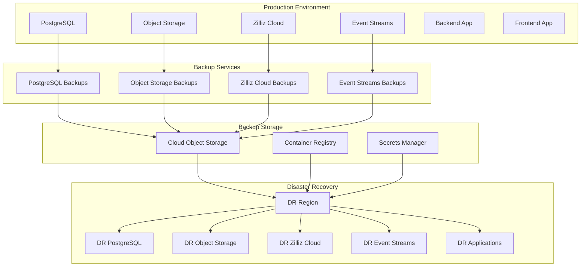

# Backup and Disaster Recovery

This guide covers backup and disaster recovery strategies for RAG Modulo deployment on IBM Cloud, ensuring data protection and business continuity.

## Overview

The backup and disaster recovery strategy provides:

- **Data Protection**: Automated backups of all critical data
- **Business Continuity**: Rapid recovery from disasters
- **Compliance**: Meet regulatory requirements for data retention
- **Testing**: Regular validation of backup and recovery procedures
- **Documentation**: Clear procedures for disaster response

## Architecture



## Backup Strategy

### 1. PostgreSQL Database Backups

#### Automated Backups

```yaml
# PostgreSQL backup configuration
postgresql_backup:
  enabled: true
  service: "ibm-cloud-databases-for-postgresql"
  plan: "standard"
  
  # Backup settings
  backup_settings:
    frequency: "daily"
    retention_days: 30
    point_in_time_recovery: true
    cross_region_replication: true
  
  # Backup schedule
  schedule:
    time: "02:00"
    timezone: "UTC"
    days: ["monday", "tuesday", "wednesday", "thursday", "friday", "saturday", "sunday"]
  
  # Backup storage
  storage:
    location: "us-south"
    bucket: "rag-modulo-postgresql-backups"
    encryption: "AES256"
    compression: true
```

#### Manual Backup Script

```bash
#!/bin/bash
# PostgreSQL backup script

set -e

# Configuration
BACKUP_DIR="/backups/postgresql"
DATE=$(date +%Y%m%d_%H%M%S)
BACKUP_FILE="postgresql_backup_${DATE}.sql"
S3_BUCKET="rag-modulo-postgresql-backups"
S3_PREFIX="postgresql/"

# Create backup directory
mkdir -p "$BACKUP_DIR"

# Create database backup
echo "Creating PostgreSQL backup..."
pg_dump "$DATABASE_URL" > "$BACKUP_DIR/$BACKUP_FILE"

# Compress backup
echo "Compressing backup..."
gzip "$BACKUP_DIR/$BACKUP_FILE"
BACKUP_FILE="${BACKUP_FILE}.gz"

# Upload to S3
echo "Uploading backup to S3..."
aws s3 cp "$BACKUP_DIR/$BACKUP_FILE" "s3://$S3_BUCKET/$S3_PREFIX$BACKUP_FILE"

# Verify upload
echo "Verifying backup upload..."
aws s3 ls "s3://$S3_BUCKET/$S3_PREFIX$BACKUP_FILE"

# Clean up local backup
echo "Cleaning up local backup..."
rm "$BACKUP_DIR/$BACKUP_FILE"

echo "Backup completed successfully: $BACKUP_FILE"
```

### 2. Object Storage Backups

#### Cross-Region Replication

```yaml
# Object Storage backup configuration
object_storage_backup:
  enabled: true
  service: "ibm-cloud-object-storage"
  
  # Replication settings
  replication:
    enabled: true
    source_region: "us-south"
    target_region: "us-east"
    target_bucket: "rag-modulo-backups-us-east"
  
  # Lifecycle policies
  lifecycle_policies:
    - name: "standard_to_ia"
      rule_id: "standard_to_ia"
      status: "Enabled"
      transitions:
        - days: 30
          storage_class: "STANDARD_IA"
    - name: "ia_to_glacier"
      rule_id: "ia_to_glacier"
      status: "Enabled"
      transitions:
        - days: 90
          storage_class: "GLACIER"
    - name: "glacier_to_deep_archive"
      rule_id: "glacier_to_deep_archive"
      status: "Enabled"
      transitions:
        - days: 365
          storage_class: "DEEP_ARCHIVE"
```

#### Backup Script

```bash
#!/bin/bash
# Object Storage backup script

set -e

# Configuration
SOURCE_BUCKET="rag-modulo-app-data"
BACKUP_BUCKET="rag-modulo-backups"
DATE=$(date +%Y%m%d_%H%M%S)
BACKUP_PREFIX="object-storage-backup-$DATE/"

# Create backup
echo "Creating Object Storage backup..."
aws s3 sync "s3://$SOURCE_BUCKET" "s3://$BACKUP_BUCKET/$BACKUP_PREFIX" \
  --storage-class STANDARD_IA \
  --metadata "backup-date=$DATE,backup-type=object-storage"

# Verify backup
echo "Verifying backup..."
aws s3 ls "s3://$BACKUP_BUCKET/$BACKUP_PREFIX" --recursive | wc -l

echo "Object Storage backup completed successfully"
```

### 3. Vector Database Backups

#### Zilliz Cloud Backups

```yaml
# Zilliz Cloud backup configuration
zilliz_backup:
  enabled: true
  service: "zilliz-cloud"
  
  # Backup settings
  backup_settings:
    frequency: "daily"
    retention_days: 30
    cross_region_replication: true
  
  # Backup collections
  collections:
    - name: "documents"
      backup_enabled: true
    - name: "embeddings"
      backup_enabled: true
    - name: "metadata"
      backup_enabled: true
  
  # Backup storage
  storage:
    location: "us-south"
    bucket: "rag-modulo-zilliz-backups"
    encryption: "AES256"
```

#### Backup Script

```python
#!/usr/bin/env python3
# Zilliz Cloud backup script

import os
import json
import boto3
from datetime import datetime
from zilliz import MilvusClient

def backup_zilliz_collections():
    """Backup Zilliz Cloud collections"""
    
    # Configuration
    zilliz_endpoint = os.getenv('MILVUS_HOST')
    zilliz_api_key = os.getenv('MILVUS_API_KEY')
    s3_bucket = os.getenv('BACKUP_BUCKET', 'rag-modulo-zilliz-backups')
    backup_prefix = f"zilliz-backup-{datetime.now().strftime('%Y%m%d_%H%M%S')}/"
    
    # Initialize clients
    milvus_client = MilvusClient(uri=zilliz_endpoint, token=zilliz_api_key)
    s3_client = boto3.client('s3')
    
    # Get all collections
    collections = milvus_client.list_collections()
    
    for collection_name in collections:
        print(f"Backing up collection: {collection_name}")
        
        # Export collection data
        export_result = milvus_client.export_collection(
            collection_name=collection_name,
            output_path=f"/tmp/{collection_name}_backup.json"
        )
        
        # Upload to S3
        s3_key = f"{backup_prefix}{collection_name}_backup.json"
        s3_client.upload_file(
            f"/tmp/{collection_name}_backup.json",
            s3_bucket,
            s3_key,
            ExtraArgs={'ServerSideEncryption': 'AES256'}
        )
        
        # Clean up local file
        os.remove(f"/tmp/{collection_name}_backup.json")
        
        print(f"Collection {collection_name} backed up successfully")
    
    print("Zilliz Cloud backup completed successfully")

if __name__ == "__main__":
    backup_zilliz_collections()
```

### 4. Application Configuration Backups

#### Configuration Backup

```bash
#!/bin/bash
# Application configuration backup script

set -e

# Configuration
BACKUP_DIR="/backups/config"
DATE=$(date +%Y%m%d_%H%M%S)
BACKUP_FILE="config_backup_${DATE}.tar.gz"
S3_BUCKET="rag-modulo-config-backups"

# Create backup directory
mkdir -p "$BACKUP_DIR"

# Backup configuration files
echo "Creating configuration backup..."
tar -czf "$BACKUP_DIR/$BACKUP_FILE" \
  deployment/terraform/ \
  deployment/ansible/ \
  .github/workflows/ \
  docker-compose*.yml \
  env.example

# Upload to S3
echo "Uploading configuration backup to S3..."
aws s3 cp "$BACKUP_DIR/$BACKUP_FILE" "s3://$S3_BUCKET/$BACKUP_FILE"

# Verify upload
echo "Verifying backup upload..."
aws s3 ls "s3://$S3_BUCKET/$BACKUP_FILE"

# Clean up local backup
echo "Cleaning up local backup..."
rm "$BACKUP_DIR/$BACKUP_FILE"

echo "Configuration backup completed successfully: $BACKUP_FILE"
```

## Disaster Recovery

### 1. Recovery Time Objectives (RTO)

| Component | RTO | RPO |
|-----------|-----|-----|
| PostgreSQL | 60 minutes | 15 minutes |
| Object Storage | 30 minutes | 5 minutes |
| Vector Database | 90 minutes | 30 minutes |
| Applications | 30 minutes | 0 minutes |
| Overall System | 60 minutes | 15 minutes |

### 2. Recovery Procedures

#### PostgreSQL Recovery

```bash
#!/bin/bash
# PostgreSQL disaster recovery script

set -e

# Configuration
RESTORE_DATABASE_URL="$1"
BACKUP_FILE="$2"
S3_BUCKET="rag-modulo-postgresql-backups"

if [ -z "$RESTORE_DATABASE_URL" ] || [ -z "$BACKUP_FILE" ]; then
    echo "Usage: $0 <database_url> <backup_file>"
    exit 1
fi

# Download backup from S3
echo "Downloading backup from S3..."
aws s3 cp "s3://$S3_BUCKET/$BACKUP_FILE" "/tmp/$BACKUP_FILE"

# Decompress backup
echo "Decompressing backup..."
gunzip "/tmp/$BACKUP_FILE"
RESTORE_FILE="/tmp/${BACKUP_FILE%.gz}"

# Restore database
echo "Restoring PostgreSQL database..."
psql "$RESTORE_DATABASE_URL" < "$RESTORE_FILE"

# Verify restoration
echo "Verifying database restoration..."
psql "$RESTORE_DATABASE_URL" -c "SELECT COUNT(*) FROM information_schema.tables;"

# Clean up
echo "Cleaning up temporary files..."
rm "/tmp/$RESTORE_FILE"

echo "PostgreSQL recovery completed successfully"
```

#### Object Storage Recovery

```bash
#!/bin/bash
# Object Storage disaster recovery script

set -e

# Configuration
RESTORE_BUCKET="$1"
BACKUP_PREFIX="$2"
S3_BUCKET="rag-modulo-backups"

if [ -z "$RESTORE_BUCKET" ] || [ -z "$BACKUP_PREFIX" ]; then
    echo "Usage: $0 <restore_bucket> <backup_prefix>"
    exit 1
fi

# Restore from backup
echo "Restoring Object Storage from backup..."
aws s3 sync "s3://$S3_BUCKET/$BACKUP_PREFIX" "s3://$RESTORE_BUCKET/"

# Verify restoration
echo "Verifying Object Storage restoration..."
aws s3 ls "s3://$RESTORE_BUCKET/" --recursive | wc -l

echo "Object Storage recovery completed successfully"
```

#### Vector Database Recovery

```python
#!/usr/bin/env python3
# Zilliz Cloud disaster recovery script

import os
import json
import boto3
from zilliz import MilvusClient

def restore_zilliz_collections(restore_endpoint, restore_api_key, backup_prefix):
    """Restore Zilliz Cloud collections from backup"""
    
    # Configuration
    s3_bucket = os.getenv('BACKUP_BUCKET', 'rag-modulo-zilliz-backups')
    
    # Initialize clients
    milvus_client = MilvusClient(uri=restore_endpoint, token=restore_api_key)
    s3_client = boto3.client('s3')
    
    # List backup files
    response = s3_client.list_objects_v2(
        Bucket=s3_bucket,
        Prefix=backup_prefix
    )
    
    for obj in response.get('Contents', []):
        collection_name = obj['Key'].split('/')[-1].replace('_backup.json', '')
        print(f"Restoring collection: {collection_name}")
        
        # Download backup file
        s3_client.download_file(
            s3_bucket,
            obj['Key'],
            f"/tmp/{collection_name}_restore.json"
        )
        
        # Import collection data
        milvus_client.import_collection(
            collection_name=collection_name,
            data_path=f"/tmp/{collection_name}_restore.json"
        )
        
        # Clean up local file
        os.remove(f"/tmp/{collection_name}_restore.json")
        
        print(f"Collection {collection_name} restored successfully")
    
    print("Zilliz Cloud recovery completed successfully")

if __name__ == "__main__":
    import sys
    if len(sys.argv) != 4:
        print("Usage: python restore_zilliz.py <endpoint> <api_key> <backup_prefix>")
        sys.exit(1)
    
    restore_zilliz_collections(sys.argv[1], sys.argv[2], sys.argv[3])
```

### 3. Full System Recovery

#### Recovery Orchestration

```yaml
# Full system recovery playbook
---
- name: RAG Modulo Disaster Recovery
  hosts: localhost
  gather_facts: false
  vars:
    recovery_region: "{{ recovery_region | default('us-east') }}"
    backup_date: "{{ backup_date | default('latest') }}"
    recovery_environment: "{{ recovery_environment | default('production') }}"
  
  tasks:
    - name: Validate recovery parameters
      ansible.builtin.assert:
        that:
          - recovery_region is defined
          - backup_date is defined
          - recovery_environment is defined
        fail_msg: "Recovery parameters are not defined"
    
    - name: Set up recovery environment
      ansible.builtin.shell: |
        ibmcloud target -r "{{ recovery_region }}"
        ibmcloud target -g "{{ resource_group_id }}"
      environment:
        IBMCLOUD_API_KEY: "{{ ibmcloud_api_key }}"
    
    - name: Provision recovery infrastructure
      ansible.builtin.shell: |
        cd deployment/terraform/environments/ibm
        terraform init
        terraform plan -var-file="recovery.tfvars"
        terraform apply -var-file="recovery.tfvars" -auto-approve
      environment:
        IBMCLOUD_API_KEY: "{{ ibmcloud_api_key }}"
    
    - name: Restore PostgreSQL database
      ansible.builtin.shell: |
        ./scripts/restore_postgresql.sh "{{ postgresql_url }}" "{{ backup_date }}"
    
    - name: Restore Object Storage
      ansible.builtin.shell: |
        ./scripts/restore_object_storage.sh "{{ object_storage_bucket }}" "{{ backup_date }}"
    
    - name: Restore Vector Database
      ansible.builtin.shell: |
        python scripts/restore_zilliz.py "{{ zilliz_endpoint }}" "{{ zilliz_api_key }}" "{{ backup_date }}"
    
    - name: Deploy applications
      ansible.builtin.shell: |
        ansible-playbook -i inventories/ibm/hosts.yml playbooks/deploy-rag-modulo.yml -e "environment={{ recovery_environment }}"
    
    - name: Verify recovery
      ansible.builtin.shell: |
        curl -f "https://{{ frontend_url }}/health" || exit 1
        curl -f "https://{{ backend_url }}/health" || exit 1
```

## Testing

### 1. Backup Testing

#### Automated Backup Testing

```bash
#!/bin/bash
# Automated backup testing script

set -e

# Configuration
TEST_DATABASE_URL="$1"
BACKUP_FILE="$2"
S3_BUCKET="rag-modulo-postgresql-backups"

if [ -z "$TEST_DATABASE_URL" ] || [ -z "$BACKUP_FILE" ]; then
    echo "Usage: $0 <test_database_url> <backup_file>"
    exit 1
fi

# Create test database
echo "Creating test database..."
createdb "$TEST_DATABASE_URL"

# Download and restore backup
echo "Testing backup restoration..."
aws s3 cp "s3://$S3_BUCKET/$BACKUP_FILE" "/tmp/$BACKUP_FILE"
gunzip "/tmp/$BACKUP_FILE"
RESTORE_FILE="/tmp/${BACKUP_FILE%.gz}"

psql "$TEST_DATABASE_URL" < "$RESTORE_FILE"

# Verify backup integrity
echo "Verifying backup integrity..."
TABLE_COUNT=$(psql "$TEST_DATABASE_URL" -t -c "SELECT COUNT(*) FROM information_schema.tables;")
echo "Tables found: $TABLE_COUNT"

if [ "$TABLE_COUNT" -gt 0 ]; then
    echo "✅ Backup test passed"
else
    echo "❌ Backup test failed"
    exit 1
fi

# Clean up
echo "Cleaning up test database..."
dropdb "$TEST_DATABASE_URL"
rm "/tmp/$RESTORE_FILE"

echo "Backup testing completed successfully"
```

#### Weekly Backup Testing

```yaml
# Weekly backup testing schedule
backup_testing:
  schedule: "0 3 * * 0"  # Every Sunday at 3 AM
  tests:
    - name: "postgresql_backup_test"
      script: "scripts/test_postgresql_backup.sh"
      timeout: "30m"
    - name: "object_storage_backup_test"
      script: "scripts/test_object_storage_backup.sh"
      timeout: "15m"
    - name: "zilliz_backup_test"
      script: "scripts/test_zilliz_backup.sh"
      timeout: "45m"
```

### 2. Disaster Recovery Testing

#### Quarterly DR Drills

```yaml
# Quarterly disaster recovery testing
dr_testing:
  schedule: "0 2 1 */3 *"  # First day of every quarter at 2 AM
  tests:
    - name: "full_system_recovery"
      script: "scripts/test_full_system_recovery.sh"
      timeout: "2h"
    - name: "database_recovery"
      script: "scripts/test_database_recovery.sh"
      timeout: "1h"
    - name: "application_recovery"
      script: "scripts/test_application_recovery.sh"
      timeout: "30m"
```

#### DR Test Script

```bash
#!/bin/bash
# Disaster recovery test script

set -e

# Configuration
TEST_ENVIRONMENT="dr-test"
TEST_REGION="us-east"
BACKUP_DATE="latest"

echo "Starting disaster recovery test..."

# Create test environment
echo "Creating test environment..."
ibmcloud target -r "$TEST_REGION"
ibmcloud target -g "$RESOURCE_GROUP_ID"

# Run recovery playbook
echo "Running disaster recovery playbook..."
ansible-playbook -i inventories/ibm/hosts.yml playbooks/disaster-recovery.yml \
  -e "recovery_region=$TEST_REGION" \
  -e "backup_date=$BACKUP_DATE" \
  -e "recovery_environment=$TEST_ENVIRONMENT"

# Test application functionality
echo "Testing application functionality..."
curl -f "https://$TEST_ENVIRONMENT-frontend.example.com/health" || exit 1
curl -f "https://$TEST_ENVIRONMENT-backend.example.com/health" || exit 1

# Test data integrity
echo "Testing data integrity..."
python scripts/test_data_integrity.py "$TEST_ENVIRONMENT"

# Clean up test environment
echo "Cleaning up test environment..."
ibmcloud ce project delete "$TEST_ENVIRONMENT" --force

echo "✅ Disaster recovery test completed successfully"
```

## Monitoring and Alerting

### 1. Backup Monitoring

#### Backup Status Alerts

```yaml
# Backup monitoring alerts
backup_alerts:
  - name: "backup_failed"
    condition: "backup_status == 'failed'"
    severity: "critical"
    description: "Backup process failed"
  
  - name: "backup_delayed"
    condition: "backup_delay > 2h"
    severity: "warning"
    description: "Backup is delayed by more than 2 hours"
  
  - name: "backup_size_anomaly"
    condition: "backup_size < 0.5 * avg_backup_size OR backup_size > 2 * avg_backup_size"
    severity: "warning"
    description: "Backup size is significantly different from average"
```

#### Backup Health Checks

```bash
#!/bin/bash
# Backup health check script

set -e

# Configuration
S3_BUCKET="rag-modulo-postgresql-backups"
EXPECTED_BACKUPS=7  # 7 days of backups

# Check backup count
echo "Checking backup count..."
BACKUP_COUNT=$(aws s3 ls "s3://$S3_BUCKET/" --recursive | wc -l)

if [ "$BACKUP_COUNT" -lt "$EXPECTED_BACKUPS" ]; then
    echo "❌ Insufficient backups found: $BACKUP_COUNT (expected: $EXPECTED_BACKUPS)"
    exit 1
fi

# Check latest backup
echo "Checking latest backup..."
LATEST_BACKUP=$(aws s3 ls "s3://$S3_BUCKET/" --recursive | sort | tail -1 | awk '{print $1, $2}')
echo "Latest backup: $LATEST_BACKUP"

# Check backup age
echo "Checking backup age..."
BACKUP_AGE=$(aws s3 ls "s3://$S3_BUCKET/" --recursive | sort | tail -1 | awk '{print $1, $2}' | xargs -I {} date -d {} +%s)
CURRENT_TIME=$(date +%s)
AGE_HOURS=$(( (CURRENT_TIME - BACKUP_AGE) / 3600 ))

if [ "$AGE_HOURS" -gt 25 ]; then
    echo "❌ Latest backup is too old: $AGE_HOURS hours"
    exit 1
fi

echo "✅ Backup health check passed"
```

### 2. Recovery Monitoring

#### Recovery Time Monitoring

```yaml
# Recovery time monitoring
recovery_monitoring:
  - name: "recovery_time_exceeded"
    condition: "recovery_time > 60m"
    severity: "critical"
    description: "Recovery time exceeded RTO of 60 minutes"
  
  - name: "data_loss_detected"
    condition: "data_loss > 15m"
    severity: "critical"
    description: "Data loss exceeds RPO of 15 minutes"
```

## Documentation

### 1. Recovery Procedures

#### Emergency Contact List

```yaml
# Emergency contact list
emergency_contacts:
  primary:
    - name: "DevOps Team"
      phone: "+1-555-0123"
      email: "devops@company.com"
      slack: "#devops-alerts"
  
  secondary:
    - name: "Engineering Manager"
      phone: "+1-555-0124"
      email: "eng-manager@company.com"
      slack: "#engineering"
  
  escalation:
    - name: "CTO"
      phone: "+1-555-0125"
      email: "cto@company.com"
      slack: "#executive"
```

#### Recovery Checklist

```markdown
# Disaster Recovery Checklist

## Immediate Response (0-15 minutes)
- [ ] Assess the scope of the disaster
- [ ] Notify emergency contacts
- [ ] Activate incident response team
- [ ] Document initial assessment

## Assessment Phase (15-30 minutes)
- [ ] Identify affected systems
- [ ] Determine root cause
- [ ] Estimate recovery time
- [ ] Communicate status to stakeholders

## Recovery Phase (30-60 minutes)
- [ ] Activate disaster recovery environment
- [ ] Restore database from latest backup
- [ ] Restore object storage data
- [ ] Restore vector database
- [ ] Deploy applications
- [ ] Verify system functionality

## Validation Phase (60-90 minutes)
- [ ] Test critical functionality
- [ ] Verify data integrity
- [ ] Monitor system performance
- [ ] Document recovery process

## Post-Recovery (90+ minutes)
- [ ] Conduct post-incident review
- [ ] Update recovery procedures
- [ ] Communicate resolution to stakeholders
- [ ] Schedule follow-up actions
```

### 2. Runbooks

#### Database Recovery Runbook

```markdown
# PostgreSQL Database Recovery Runbook

## Prerequisites
- Access to IBM Cloud console
- Database backup files in S3
- Recovery environment provisioned

## Recovery Steps

### 1. Access Recovery Environment
```bash
ibmcloud target -r us-east
ibmcloud target -g production-resource-group
```

### 2. Provision Database
```bash
cd deployment/terraform/environments/ibm
terraform apply -var-file="recovery.tfvars"
```

### 3. Restore Database
```bash
./scripts/restore_postgresql.sh "$DATABASE_URL" "latest"
```

### 4. Verify Restoration
```bash
psql "$DATABASE_URL" -c "SELECT COUNT(*) FROM information_schema.tables;"
```

### 5. Test Connectivity
```bash
curl -f "https://backend-app.example.com/health"
```

## Troubleshooting
- If restoration fails, try previous backup
- Check database logs for errors
- Verify network connectivity
- Contact database team if needed
```

## Best Practices

### 1. Backup Strategy

- **3-2-1 Rule**: 3 copies, 2 different media, 1 off-site
- **Regular Testing**: Test backups weekly
- **Automation**: Automate all backup processes
- **Monitoring**: Monitor backup success/failure

### 2. Recovery Planning

- **Documentation**: Maintain up-to-date procedures
- **Training**: Regular team training on procedures
- **Testing**: Quarterly disaster recovery drills
- **Communication**: Clear communication protocols

### 3. Data Protection

- **Encryption**: Encrypt all backups
- **Access Control**: Limit backup access
- **Retention**: Appropriate retention policies
- **Compliance**: Meet regulatory requirements

### 4. Continuous Improvement

- **Post-Incident Reviews**: Learn from incidents
- **Procedure Updates**: Regular procedure updates
- **Technology Updates**: Stay current with technology
- **Team Training**: Ongoing team education

## Related Documentation

- [Terraform + Ansible Architecture](terraform-ansible-architecture.md)
- [IBM Cloud Code Engine Deployment](ibm-cloud-code-engine.md)
- [Managed Services Strategy](managed-services.md)
- [Monitoring and Observability](monitoring-observability.md)
- [Security Hardening](security-hardening.md)
