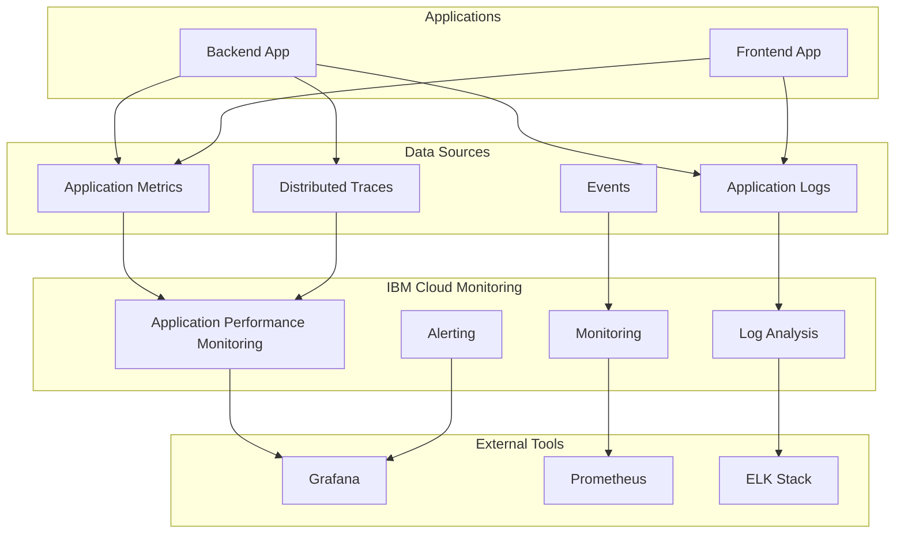

# Monitoring and Observability

This guide covers monitoring and observability strategies for RAG Modulo deployment on IBM Cloud, ensuring comprehensive visibility into application performance, infrastructure health, and operational metrics.

## Overview

The monitoring and observability strategy provides:

- **Application Performance Monitoring (APM)**: Real-time application metrics and traces
- **Infrastructure Monitoring**: Resource utilization and health status
- **Log Management**: Centralized logging and analysis
- **Alerting**: Proactive notification of issues
- **Dashboards**: Visual representation of system health

## Architecture



## IBM Cloud Monitoring Services

### 1. Application Performance Monitoring

#### Features

- **Real-time Metrics**: CPU, memory, response time, throughput
- **Distributed Tracing**: Request flow across services
- **Error Tracking**: Exception monitoring and alerting
- **Custom Metrics**: Application-specific metrics
- **Alerting**: Threshold-based notifications

#### Configuration

```yaml
# Application monitoring configuration
monitoring:
  enabled: true
  service: "ibm-cloud-monitoring"
  plan: "lite"
  region: "us-south"
  
  # Custom metrics
  custom_metrics:
    - name: "rag_queries_total"
      type: "counter"
      description: "Total number of RAG queries"
    - name: "rag_query_duration_seconds"
      type: "histogram"
      description: "RAG query processing time"
    - name: "vector_search_duration_seconds"
      type: "histogram"
      description: "Vector search processing time"
  
  # Alerting rules
  alerts:
    - name: "high_error_rate"
      condition: "error_rate > 0.05"
      duration: "5m"
      severity: "critical"
    - name: "high_response_time"
      condition: "response_time_p95 > 2.0"
      duration: "10m"
      severity: "warning"
```

### 2. Log Analysis

#### Features

- **Centralized Logging**: All application logs in one place
- **Log Search**: Full-text search and filtering
- **Log Analytics**: AI-powered log analysis
- **Retention**: Configurable log retention periods
- **Export**: Log export for external analysis

#### Configuration

```yaml
# Log analysis configuration
log_analysis:
  enabled: true
  service: "ibm-cloud-log-analysis"
  plan: "lite"
  region: "us-south"
  
  # Log sources
  sources:
    - name: "backend-logs"
      type: "application"
      app: "rag-modulo-backend"
    - name: "frontend-logs"
      type: "application"
      app: "rag-modulo-frontend"
    - name: "system-logs"
      type: "system"
      level: "info"
  
  # Retention policies
  retention:
    default: "30d"
    critical: "90d"
    debug: "7d"
  
  # Log parsing rules
  parsing:
    - name: "error_logs"
      pattern: "ERROR.*"
      fields: ["timestamp", "level", "message", "stack_trace"]
    - name: "access_logs"
      pattern: "GET|POST|PUT|DELETE.*"
      fields: ["timestamp", "method", "path", "status", "duration"]
```

### 3. Infrastructure Monitoring

#### Features

- **Resource Metrics**: CPU, memory, storage, network
- **Service Health**: Health checks and status monitoring
- **Capacity Planning**: Resource usage trends
- **Cost Monitoring**: Resource cost tracking
- **Automated Scaling**: Trigger scaling based on metrics

#### Configuration

```yaml
# Infrastructure monitoring configuration
infrastructure_monitoring:
  enabled: true
  service: "ibm-cloud-monitoring"
  plan: "lite"
  region: "us-south"
  
  # Monitored resources
  resources:
    - name: "code-engine-project"
      type: "code_engine"
      metrics: ["cpu_usage", "memory_usage", "request_count"]
    - name: "postgresql-database"
      type: "database"
      metrics: ["connection_count", "query_duration", "storage_usage"]
    - name: "object-storage"
      type: "storage"
      metrics: ["storage_usage", "request_count", "data_transfer"]
  
  # Alerting thresholds
  thresholds:
    cpu_usage: 80
    memory_usage: 85
    storage_usage: 90
    error_rate: 5
```

## Application Metrics

### 1. Backend Metrics

#### Custom Metrics

```python
# Backend metrics implementation
from prometheus_client import Counter, Histogram, Gauge
import time

# Request metrics
request_count = Counter('rag_requests_total', 'Total RAG requests', ['method', 'endpoint'])
request_duration = Histogram('rag_request_duration_seconds', 'Request duration', ['method', 'endpoint'])

# RAG-specific metrics
rag_queries_total = Counter('rag_queries_total', 'Total RAG queries', ['collection', 'status'])
rag_query_duration = Histogram('rag_query_duration_seconds', 'RAG query duration', ['collection'])
vector_search_duration = Histogram('vector_search_duration_seconds', 'Vector search duration', ['collection'])
embedding_duration = Histogram('embedding_duration_seconds', 'Embedding generation duration')

# Resource metrics
active_connections = Gauge('active_connections', 'Active database connections')
cache_hit_rate = Gauge('cache_hit_rate', 'Cache hit rate')
memory_usage = Gauge('memory_usage_bytes', 'Memory usage in bytes')

# Error metrics
error_count = Counter('errors_total', 'Total errors', ['error_type', 'endpoint'])
```

#### Health Check Endpoint

```python
# Health check implementation
@app.get("/health")
async def health_check():
    """Health check endpoint for monitoring"""
    try:
        # Check database connectivity
        db_status = await check_database_connection()
        
        # Check vector database connectivity
        vector_status = await check_vector_database_connection()
        
        # Check object storage connectivity
        storage_status = await check_object_storage_connection()
        
        # Overall health status
        overall_status = "healthy" if all([db_status, vector_status, storage_status]) else "unhealthy"
        
        return {
            "status": overall_status,
            "timestamp": datetime.utcnow().isoformat(),
            "checks": {
                "database": db_status,
                "vector_database": vector_status,
                "object_storage": storage_status
            }
        }
    except Exception as e:
        return {
            "status": "unhealthy",
            "timestamp": datetime.utcnow().isoformat(),
            "error": str(e)
        }
```

### 2. Frontend Metrics

#### Performance Metrics

```javascript
// Frontend metrics implementation
class MetricsCollector {
  constructor() {
    this.metrics = {
      pageLoadTime: new Map(),
      apiCallDuration: new Map(),
      errorCount: 0,
      userInteractions: 0
    };
  }

  // Track page load time
  trackPageLoad(pageName, loadTime) {
    this.metrics.pageLoadTime.set(pageName, loadTime);
    this.sendMetric('page_load_time', { page: pageName }, loadTime);
  }

  // Track API call duration
  trackApiCall(endpoint, duration, status) {
    this.metrics.apiCallDuration.set(endpoint, { duration, status });
    this.sendMetric('api_call_duration', { endpoint, status }, duration);
  }

  // Track errors
  trackError(error, context) {
    this.metrics.errorCount++;
    this.sendMetric('error_count', { error: error.message, context }, 1);
  }

  // Track user interactions
  trackUserInteraction(action, element) {
    this.metrics.userInteractions++;
    this.sendMetric('user_interaction', { action, element }, 1);
  }

  // Send metric to backend
  async sendMetric(name, labels, value) {
    try {
      await fetch('/api/metrics', {
        method: 'POST',
        headers: { 'Content-Type': 'application/json' },
        body: JSON.stringify({ name, labels, value, timestamp: Date.now() })
      });
    } catch (error) {
      console.error('Failed to send metric:', error);
    }
  }
}

// Initialize metrics collector
const metrics = new MetricsCollector();

// Track page load time
window.addEventListener('load', () => {
  const loadTime = performance.timing.loadEventEnd - performance.timing.navigationStart;
  metrics.trackPageLoad(window.location.pathname, loadTime);
});

// Track API calls
const originalFetch = window.fetch;
window.fetch = async (...args) => {
  const start = performance.now();
  try {
    const response = await originalFetch(...args);
    const duration = performance.now() - start;
    metrics.trackApiCall(args[0], duration, response.status);
    return response;
  } catch (error) {
    const duration = performance.now() - start;
    metrics.trackApiCall(args[0], duration, 'error');
    throw error;
  }
};
```

## Dashboards

### 1. Application Dashboard

#### Key Metrics

- **Request Rate**: Requests per second
- **Response Time**: Average and 95th percentile response time
- **Error Rate**: Percentage of failed requests
- **Active Users**: Concurrent active users
- **Resource Usage**: CPU and memory utilization

#### Grafana Configuration

```json
{
  "dashboard": {
    "title": "RAG Modulo Application Dashboard",
    "panels": [
      {
        "title": "Request Rate",
        "type": "graph",
        "targets": [
          {
            "expr": "rate(rag_requests_total[5m])",
            "legendFormat": "{{method}} {{endpoint}}"
          }
        ]
      },
      {
        "title": "Response Time",
        "type": "graph",
        "targets": [
          {
            "expr": "histogram_quantile(0.95, rate(rag_request_duration_seconds_bucket[5m]))",
            "legendFormat": "95th percentile"
          },
          {
            "expr": "histogram_quantile(0.50, rate(rag_request_duration_seconds_bucket[5m]))",
            "legendFormat": "50th percentile"
          }
        ]
      },
      {
        "title": "Error Rate",
        "type": "graph",
        "targets": [
          {
            "expr": "rate(errors_total[5m]) / rate(rag_requests_total[5m]) * 100",
            "legendFormat": "Error Rate %"
          }
        ]
      }
    ]
  }
}
```

### 2. Infrastructure Dashboard

#### Key Metrics

- **Resource Utilization**: CPU, memory, storage usage
- **Service Health**: Health check status
- **Cost Tracking**: Resource costs over time
- **Scaling Events**: Auto-scaling activities

#### Grafana Configuration

```json
{
  "dashboard": {
    "title": "RAG Modulo Infrastructure Dashboard",
    "panels": [
      {
        "title": "CPU Usage",
        "type": "graph",
        "targets": [
          {
            "expr": "rate(container_cpu_usage_seconds_total[5m]) * 100",
            "legendFormat": "{{container}}"
          }
        ]
      },
      {
        "title": "Memory Usage",
        "type": "graph",
        "targets": [
          {
            "expr": "container_memory_usage_bytes / container_spec_memory_limit_bytes * 100",
            "legendFormat": "{{container}}"
          }
        ]
      },
      {
        "title": "Service Health",
        "type": "stat",
        "targets": [
          {
            "expr": "up{job=\"rag-modulo-backend\"}",
            "legendFormat": "Backend"
          },
          {
            "expr": "up{job=\"rag-modulo-frontend\"}",
            "legendFormat": "Frontend"
          }
        ]
      }
    ]
  }
}
```

## Alerting

### 1. Alert Rules

#### Critical Alerts

```yaml
# Critical alert rules
critical_alerts:
  - name: "high_error_rate"
    condition: "rate(errors_total[5m]) / rate(rag_requests_total[5m]) > 0.05"
    duration: "5m"
    severity: "critical"
    description: "Error rate is above 5%"
    
  - name: "high_response_time"
    condition: "histogram_quantile(0.95, rate(rag_request_duration_seconds_bucket[5m])) > 2.0"
    duration: "10m"
    severity: "critical"
    description: "95th percentile response time is above 2 seconds"
    
  - name: "service_down"
    condition: "up{job=\"rag-modulo-backend\"} == 0"
    duration: "1m"
    severity: "critical"
    description: "Backend service is down"
    
  - name: "high_cpu_usage"
    condition: "rate(container_cpu_usage_seconds_total[5m]) * 100 > 80"
    duration: "5m"
    severity: "critical"
    description: "CPU usage is above 80%"
```

#### Warning Alerts

```yaml
# Warning alert rules
warning_alerts:
  - name: "high_memory_usage"
    condition: "container_memory_usage_bytes / container_spec_memory_limit_bytes * 100 > 85"
    duration: "10m"
    severity: "warning"
    description: "Memory usage is above 85%"
    
  - name: "low_cache_hit_rate"
    condition: "cache_hit_rate < 0.8"
    duration: "15m"
    severity: "warning"
    description: "Cache hit rate is below 80%"
    
  - name: "high_database_connections"
    condition: "active_connections > 80"
    duration: "5m"
    severity: "warning"
    description: "Database connection count is high"
```

### 2. Notification Channels

#### Email Notifications

```yaml
# Email notification configuration
email_notifications:
  enabled: true
  smtp_server: "smtp.gmail.com"
  smtp_port: 587
  username: "alerts@company.com"
  password: "{{ email_password }}"
  recipients:
    - "devops@company.com"
    - "oncall@company.com"
```

#### Slack Notifications

```yaml
# Slack notification configuration
slack_notifications:
  enabled: true
  webhook_url: "{{ slack_webhook_url }}"
  channel: "#alerts"
  username: "RAG Modulo Monitor"
  icon_emoji: ":warning:"
```

#### PagerDuty Integration

```yaml
# PagerDuty integration
pagerduty:
  enabled: true
  integration_key: "{{ pagerduty_integration_key }}"
  escalation_policy: "rag-modulo-escalation"
  severity_mapping:
    critical: "P1"
    warning: "P2"
    info: "P3"
```

## Log Management

### 1. Log Collection

#### Application Logs

```python
# Structured logging configuration
import logging
import json
from datetime import datetime

class StructuredLogger:
    def __init__(self, name):
        self.logger = logging.getLogger(name)
        self.logger.setLevel(logging.INFO)
        
        # Create formatter
        formatter = logging.Formatter('%(message)s')
        
        # Create handler
        handler = logging.StreamHandler()
        handler.setFormatter(formatter)
        self.logger.addHandler(handler)
    
    def log(self, level, message, **kwargs):
        log_entry = {
            "timestamp": datetime.utcnow().isoformat(),
            "level": level.upper(),
            "message": message,
            "service": "rag-modulo-backend",
            **kwargs
        }
        self.logger.info(json.dumps(log_entry))

# Usage
logger = StructuredLogger(__name__)

# Log request
logger.log("info", "Request received", 
          method="GET", 
          path="/api/search", 
          user_id="12345",
          request_id="req-123")

# Log error
logger.log("error", "Database connection failed",
          error="Connection timeout",
          database="postgresql",
          retry_count=3)
```

#### Access Logs

```python
# Access log middleware
@app.middleware("http")
async def access_log_middleware(request: Request, call_next):
    start_time = time.time()
    
    # Process request
    response = await call_next(request)
    
    # Calculate duration
    duration = time.time() - start_time
    
    # Log access
    logger.log("info", "Request completed",
              method=request.method,
              path=request.url.path,
              status_code=response.status_code,
              duration=duration,
              user_agent=request.headers.get("user-agent"),
              ip_address=request.client.host)
    
    return response
```

### 2. Log Analysis

#### Error Analysis

```python
# Error analysis queries
error_analysis_queries = {
    "error_rate_by_endpoint": """
        SELECT 
            endpoint,
            COUNT(*) as error_count,
            COUNT(*) * 100.0 / SUM(COUNT(*)) OVER() as error_percentage
        FROM logs 
        WHERE level = 'ERROR' 
        AND timestamp >= NOW() - INTERVAL '1 hour'
        GROUP BY endpoint
        ORDER BY error_count DESC
    """,
    
    "error_trends": """
        SELECT 
            DATE_TRUNC('hour', timestamp) as hour,
            COUNT(*) as error_count
        FROM logs 
        WHERE level = 'ERROR' 
        AND timestamp >= NOW() - INTERVAL '24 hours'
        GROUP BY hour
        ORDER BY hour
    """,
    
    "top_errors": """
        SELECT 
            message,
            COUNT(*) as count,
            MAX(timestamp) as last_occurrence
        FROM logs 
        WHERE level = 'ERROR' 
        AND timestamp >= NOW() - INTERVAL '1 hour'
        GROUP BY message
        ORDER BY count DESC
        LIMIT 10
    """
}
```

#### Performance Analysis

```python
# Performance analysis queries
performance_analysis_queries = {
    "slow_queries": """
        SELECT 
            endpoint,
            AVG(duration) as avg_duration,
            MAX(duration) as max_duration,
            COUNT(*) as request_count
        FROM logs 
        WHERE duration > 1.0 
        AND timestamp >= NOW() - INTERVAL '1 hour'
        GROUP BY endpoint
        ORDER BY avg_duration DESC
    """,
    
    "response_time_trends": """
        SELECT 
            DATE_TRUNC('minute', timestamp) as minute,
            AVG(duration) as avg_duration,
            PERCENTILE_CONT(0.95) WITHIN GROUP (ORDER BY duration) as p95_duration
        FROM logs 
        WHERE timestamp >= NOW() - INTERVAL '1 hour'
        GROUP BY minute
        ORDER BY minute
    """
}
```

## Troubleshooting

### Common Issues

#### 1. High Error Rate

**Symptoms:**
- Error rate above 5%
- Increased user complaints
- Service degradation

**Investigation:**
```bash
# Check error logs
ibmcloud ce app logs rag-modulo-backend --tail 100 | grep ERROR

# Check error trends
curl "https://monitoring-endpoint/api/query?query=rate(errors_total[5m])"

# Check specific errors
curl "https://monitoring-endpoint/api/query?query=topk(10, count by (error_type) (errors_total))"
```

**Solutions:**
- Check application logs for specific errors
- Verify database connectivity
- Check resource utilization
- Review recent deployments

#### 2. High Response Time

**Symptoms:**
- Response time above 2 seconds
- User experience degradation
- Timeout errors

**Investigation:**
```bash
# Check response time metrics
curl "https://monitoring-endpoint/api/query?query=histogram_quantile(0.95, rate(rag_request_duration_seconds_bucket[5m]))"

# Check resource utilization
curl "https://monitoring-endpoint/api/query?query=rate(container_cpu_usage_seconds_total[5m])"

# Check database performance
curl "https://monitoring-endpoint/api/query?query=rate(database_query_duration_seconds[5m])"
```

**Solutions:**
- Scale up application resources
- Optimize database queries
- Check for resource bottlenecks
- Review application performance

#### 3. Service Unavailable

**Symptoms:**
- Service returns 503 errors
- Health checks failing
- Complete service outage

**Investigation:**
```bash
# Check service status
ibmcloud ce app get rag-modulo-backend

# Check health endpoint
curl "https://backend-app.example.com/health"

# Check application logs
ibmcloud ce app logs rag-modulo-backend --tail 100
```

**Solutions:**
- Restart application
- Check resource limits
- Verify service bindings
- Review error logs

### Debug Commands

```bash
# Check application status
ibmcloud ce app get rag-modulo-backend --output json

# View application logs
ibmcloud ce app logs rag-modulo-backend --follow

# Check resource utilization
ibmcloud ce app get rag-modulo-backend --output json | jq '.spec.template.spec.containers[0].resources'

# Check environment variables
ibmcloud ce app get rag-modulo-backend --output json | jq '.spec.template.spec.containers[0].env'

# Check service bindings
ibmcloud ce app get rag-modulo-backend --output json | jq '.spec.template.spec.serviceBindings'
```

## Best Practices

### 1. Monitoring

- Set up comprehensive monitoring from day one
- Use appropriate alert thresholds
- Implement proper escalation procedures
- Regular review of monitoring effectiveness

### 2. Logging

- Use structured logging with consistent format
- Include relevant context in log messages
- Implement proper log levels
- Regular log analysis and cleanup

### 3. Alerting

- Set up alerts for critical issues
- Avoid alert fatigue with appropriate thresholds
- Test alerting procedures regularly
- Document alert response procedures

### 4. Dashboards

- Create meaningful dashboards for different audiences
- Keep dashboards up to date
- Use appropriate visualization types
- Regular dashboard review and optimization

## Related Documentation

- [Terraform + Ansible Architecture](terraform-ansible-architecture.md)
- [IBM Cloud Code Engine Deployment](ibm-cloud-code-engine.md)
- [Managed Services Strategy](managed-services.md)
- [Ansible Automation Guide](ansible-automation.md)
- [Security Hardening](security-hardening.md)
