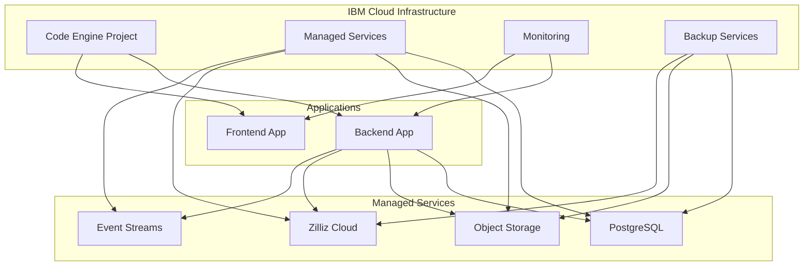
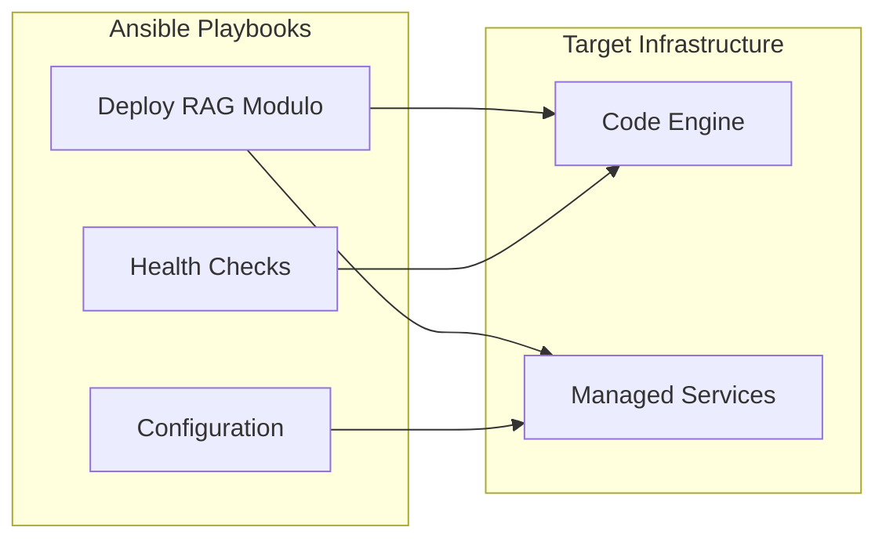

# Hybrid Terraform + Ansible Multi-Cloud Deployment Architecture

This document describes the comprehensive hybrid Infrastructure as Code (IaC) solution for RAG Modulo, combining Terraform for infrastructure provisioning and Ansible for application deployment on IBM Cloud.

## Overview

The RAG Modulo deployment architecture uses a hybrid approach that leverages the strengths of both Terraform and Ansible:

- **Terraform**: Infrastructure provisioning, managed services, and resource lifecycle management
- **Ansible**: Application deployment, configuration management, and operational tasks

## Architecture Principles

### 1. Separation of Concerns

- **Infrastructure Layer (Terraform)**: Provisions managed services, networking, and compute resources
- **Application Layer (Ansible)**: Deploys and configures applications on the provisioned infrastructure

### 2. Managed Services Strategy

Instead of self-hosted containers, the architecture uses IBM Cloud managed services for data persistence:

- **IBM Cloud Databases for PostgreSQL**: Fully managed PostgreSQL with automated backups and scaling
- **IBM Cloud Object Storage**: Scalable object storage replacing MinIO
- **Zilliz Cloud**: Managed vector database for Milvus functionality
- **IBM Cloud Event Streams**: Managed messaging service replacing etcd

### 3. Multi-Cloud Ready

The architecture is designed to support multiple cloud providers:

- **IBM Cloud**: Primary deployment target
- **AWS**: Alternative deployment option
- **Azure**: Alternative deployment option
- **Google Cloud Platform**: Alternative deployment option

## Architecture Components

### Infrastructure Components (Terraform)



### Application Components (Ansible)



## Directory Structure

```
deployment/
├── terraform/
│   ├── modules/
│   │   └── ibm-cloud/
│   │       ├── managed-services/
│   │       ├── code-engine/
│   │       ├── monitoring/
│   │       └── backup/
│   ├── environments/
│   │   └── ibm/
│   │       ├── main.tf
│   │       ├── variables.tf
│   │       ├── outputs.tf
│   │       ├── dev.tfvars
│   │       └── prod.tfvars
│   └── backend.tf
├── ansible/
│   ├── playbooks/
│   │   └── deploy-rag-modulo.yml
│   ├── inventories/
│   │   └── ibm/
│   │       └── hosts.yml
│   ├── group_vars/
│   │   ├── all/
│   │   ├── development/
│   │   └── production/
│   └── requirements.yml
└── tests/
    ├── terraform_test.go
    ├── test_deploy.yml
    └── integration_test.sh
```

## Security Features

### 1. Production Safeguards

- **Environment Validation**: Prevents insecure settings in production
- **Image Tag Security**: Enforces specific image versions, prohibits `:latest`
- **Secret Management**: Uses IBM Cloud Secrets Manager for sensitive data

### 2. Network Security

- **Private Endpoints**: All managed services use private endpoints
- **SSL/TLS**: All communications encrypted in transit
- **VPC Integration**: Applications deployed in secure VPC

### 3. Access Control

- **IAM Roles**: Least privilege access for all services
- **Resource Groups**: Logical separation of resources
- **Service Bindings**: Secure service-to-service communication

## Deployment Workflow

### 1. Infrastructure Provisioning

```bash
# Initialize Terraform
cd deployment/terraform/environments/ibm
terraform init

# Plan infrastructure
terraform plan -var-file="dev.tfvars"

# Apply infrastructure
terraform apply -var-file="dev.tfvars"
```

### 2. Application Deployment

```bash
# Install Ansible collections
cd deployment/ansible
ansible-galaxy collection install -r requirements.yml

# Deploy applications
ansible-playbook -i inventories/ibm/hosts.yml playbooks/deploy-rag-modulo.yml
```

### 3. Validation

```bash
# Run integration tests
cd deployment/tests
./integration_test.sh
```

## Environment Configurations

### Development Environment

- **Scaling**: Minimal resources (1-3 instances)
- **Security**: Relaxed settings for development
- **Monitoring**: Basic monitoring enabled
- **Backups**: Disabled for cost optimization

### Production Environment

- **Scaling**: High availability (3-20 instances)
- **Security**: Strict security controls enabled
- **Monitoring**: Comprehensive monitoring and alerting
- **Backups**: Automated daily backups with retention

## Monitoring and Observability

### 1. Application Monitoring

- **IBM Cloud Monitoring**: Application performance monitoring
- **Log Analysis**: Centralized logging with IBM Cloud Log Analysis
- **APM**: Application Performance Monitoring for detailed insights

### 2. Infrastructure Monitoring

- **Resource Usage**: CPU, memory, and storage monitoring
- **Service Health**: Health checks for all managed services
- **Cost Tracking**: Resource usage and cost optimization

### 3. Alerting

- **Threshold-based Alerts**: CPU, memory, and error rate alerts
- **Webhook Integration**: Custom alert handling
- **Escalation Policies**: Automated incident response

## Backup and Disaster Recovery

### 1. Backup Strategy

- **Automated Backups**: Daily backups of all data
- **Cross-Region Replication**: Optional cross-region backup replication
- **Retention Policies**: Configurable retention periods

### 2. Disaster Recovery

- **RTO**: 60 minutes (Recovery Time Objective)
- **RPO**: 15 minutes (Recovery Point Objective)
- **Recovery Procedures**: Automated recovery workflows

### 3. Testing

- **Backup Testing**: Weekly automated backup testing
- **DR Drills**: Quarterly disaster recovery testing
- **Recovery Validation**: Automated recovery verification

## Cost Optimization

### 1. Resource Optimization

- **Auto-scaling**: Dynamic resource allocation based on demand
- **Right-sizing**: Optimal resource allocation for workloads
- **Scheduled Scaling**: Pre-planned scaling for known patterns

### 2. Storage Optimization

- **Lifecycle Policies**: Automatic transition to cheaper storage tiers
- **Compression**: Data compression to reduce storage costs
- **Deduplication**: Eliminate duplicate data storage

### 3. Monitoring

- **Cost Tracking**: Real-time cost monitoring and alerts
- **Budget Alerts**: Automated budget threshold notifications
- **Optimization Recommendations**: AI-powered cost optimization suggestions

## Troubleshooting

### Common Issues

1. **Terraform State Issues**
   - Solution: Use remote state backend with locking
   - Prevention: Regular state backups

2. **Ansible Connection Issues**
   - Solution: Verify inventory and credentials
   - Prevention: Test connectivity before deployment

3. **Service Binding Failures**
   - Solution: Check service instance IDs and permissions
   - Prevention: Validate service configurations

### Debug Commands

```bash
# Terraform debugging
terraform plan -detailed-exitcode
terraform show

# Ansible debugging
ansible-playbook --check --diff -vvv playbook.yml
ansible-inventory --list -i inventory.yml
```

## Best Practices

### 1. Infrastructure

- Use managed services for data persistence
- Implement proper tagging and resource organization
- Enable monitoring and alerting from day one
- Use infrastructure as code for all resources

### 2. Application Deployment

- Use specific image tags, never `:latest`
- Implement proper health checks
- Use configuration management for all settings
- Test deployments in staging before production

### 3. Security

- Enable production safeguards
- Use least privilege access
- Encrypt all data at rest and in transit
- Regular security scanning and updates

### 4. Operations

- Implement comprehensive monitoring
- Use automated backups and disaster recovery
- Regular testing of backup and recovery procedures
- Document all procedures and runbooks

## Next Steps

1. **Review Configuration**: Customize variables for your environment
2. **Deploy Infrastructure**: Use Terraform to provision resources
3. **Deploy Applications**: Use Ansible to deploy applications
4. **Configure Monitoring**: Set up monitoring and alerting
5. **Test Backup/DR**: Validate backup and disaster recovery procedures

## Related Documentation

- [IBM Cloud Code Engine Deployment](ibm-cloud-code-engine.md)
- [Managed Services Strategy](managed-services.md)
- [Ansible Automation Guide](ansible-automation.md)
- [Backup and Disaster Recovery](backup-disaster-recovery.md)
- [Monitoring and Observability](monitoring-observability.md)
- [Security Hardening](security-hardening.md)
