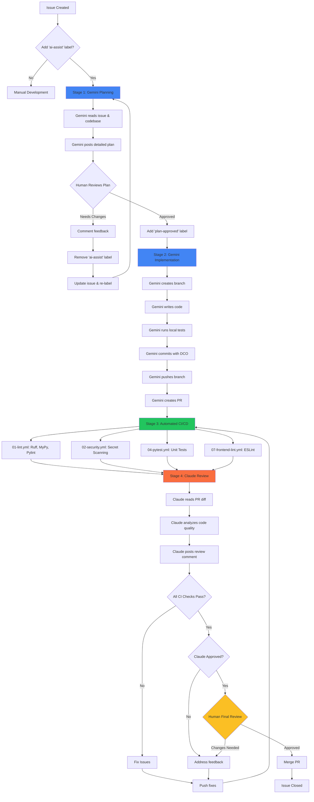

# AI-Assisted Development Workflow

## Overview

This repository uses a **multi-agent AI workflow** where:
- **Google Gemini**: Writes code implementations
- **Claude Code**: Reviews PRs and provides feedback
- **GitHub Actions CI/CD**: Runs automated tests and quality checks

This creates a fully automated but **safe** development pipeline with human checkpoints at critical decision points.

## Workflow Architecture



## Stage-by-Stage Breakdown

### Stage 1: Planning (Gemini)

**Trigger**: Add `ai-assist` label to an issue

**Workflow**: `.github/workflows/gemini-issue-planner.yml`

**What Happens**:
1. Gemini reads the issue description
2. Analyzes relevant codebase files
3. Develops a detailed implementation plan including:
   - Root cause analysis
   - Proposed solution approach
   - Files to change
   - Testing strategy
   - Risk assessment
   - Complexity estimate
4. Posts plan as an issue comment

**Human Action Required**:
- Review the plan
- If approved: Add `plan-approved` label
- If changes needed: Comment feedback and remove `ai-assist` label

**Safety**: Read-only operations, no code changes

---

### Stage 2: Implementation (Claude Code Action)

**Trigger**: Add `plan-approved` label

**Workflow**: `.github/workflows/claude-issue-implementer.yml`

**What Happens**:
1. Creates branch `fix/issue-{number}`
2. Implements changes according to approved plan
3. Writes/updates tests
4. Runs local quality checks (optional)
5. Commits with DCO sign-off
6. Pushes branch
7. Creates PR with:
   - Descriptive title
   - Links to original issue
   - Summary of changes
   - Testing checklist
   - `ai-generated` label

**Human Action Required**: None (fully automated implementation)

**Safety**:
- No `--yolo` mode (confirmations for risky operations)
- Follows approved plan
- DCO compliance
- Limited tool access

---

### Stage 3: Automated Testing (GitHub Actions)

**Trigger**: PR creation

**Workflows**:
- `01-lint.yml`: Code quality (Ruff, MyPy, Pylint, Pydocstyle)
- `02-security.yml`: Secret scanning (Gitleaks, TruffleHog)
- `04-pytest.yml`: Unit tests with coverage
- `07-frontend-lint.yml`: Frontend linting (ESLint)

**What Happens**:
- All CI checks run in parallel
- Tests must pass before merge
- Security scans must be clean
- Linting enforces code standards

**Human Action Required**: None (automated)

**Safety**: Catches bugs, security issues, and style violations

---

### Stage 4: Code Review (Claude)

**Trigger**: PR opened/updated

**Workflow**: `.github/workflows/claude-code-review.yml`

**What Happens**:
1. Claude reads PR diff
2. Analyzes code against:
   - Code quality and best practices
   - Potential bugs or issues
   - Performance considerations
   - Security concerns
   - Test coverage
   - Project conventions (CLAUDE.md)
3. Posts review comment on PR

**Human Action Required**:
- Review Claude's feedback
- Address any issues raised
- Make final approval decision

**Safety**: Expert-level code review catches issues CI can't detect

---

### Stage 5: Final Approval & Merge (Human)

**Trigger**: All checks pass + Claude review complete

**What Happens**:
- Human reviews:
  - Code changes
  - Test results
  - Claude's feedback
  - Overall approach
- Makes final merge decision

**Human Action Required**: **MERGE PR** (critical decision point)

**Safety**: Human final approval prevents automated mistakes

---

## Usage Examples

### Example 1: Simple Bug Fix

```bash
# 1. Create issue describing the bug
# 2. Add "ai-assist" label
# 3. Wait 2-3 minutes for Gemini plan
# 4. Review plan, add "plan-approved" label
# 5. Wait 5-10 minutes for implementation
# 6. Review PR and Claude's feedback
# 7. Merge if approved
```

**Total Time**: ~15-20 minutes (vs 1-2 hours manual)

### Example 2: Feature Implementation

```bash
# 1. Create detailed feature request issue
# 2. Add "ai-assist" label
# 3. Review Gemini's plan (may need iterations)
# 4. Once plan is solid, add "plan-approved"
# 5. Gemini implements feature
# 6. Claude reviews for quality/security
# 7. Run integration tests manually if needed
# 8. Merge after thorough review
```

**Total Time**: ~30-60 minutes (vs 4-8 hours manual)

### Example 3: Complex Refactoring

```bash
# 1. Create issue with refactoring goals
# 2. Add "ai-assist" label
# 3. Review plan carefully - may need human adjustments
# 4. Consider manual implementation for critical changes
# 5. Or approve plan if comfortable
# 6. Monitor CI/CD closely
# 7. Extra careful review of Claude's feedback
# 8. Merge only after full confidence
```

**Recommendation**: Complex changes may still need human implementation

---

## Configuration

### Required Secrets

Add these to GitHub Settings → Secrets and variables → Actions:

1. **`GEMINI_API_KEY`**: Google AI Studio API key
   - Get from: https://aistudio.google.com/app/apikey
   - Required for: Gemini planning & implementation

2. **`CLAUDE_CODE_OAUTH_TOKEN`**: Claude Code OAuth token
   - Get from: Claude Code settings
   - Required for: Claude code review

3. **`GITHUB_TOKEN`**: Automatically provided by GitHub
   - No setup needed
   - Used for: Git operations, PR creation

### Required Labels

Create these labels in your repository:

| Label | Color | Description |
|-------|-------|-------------|
| `ai-assist` | `#4285f4` | Triggers AI planning |
| `plan-ready` | `#22c55e` | Plan posted, awaiting review |
| `plan-approved` | `#10b981` | Human approved plan, triggers implementation |
| `ai-generated` | `#a855f7` | PR created by AI |

### Workflow Files

```
.github/workflows/
├── gemini-issue-planner.yml      # Stage 1: Planning
├── claude-issue-implementer.yml  # Stage 2: Implementation (Claude Code Action)
├── claude-code-review.yml        # Stage 4: Review
├── 01-lint.yml                   # Stage 3: Linting
├── 02-security.yml               # Stage 3: Security
├── 04-pytest.yml                 # Stage 3: Tests
└── 07-frontend-lint.yml          # Stage 3: Frontend
```

---

## Safety Features

### Human Checkpoints

1. **Plan Approval**: Humans must approve the plan before implementation
2. **PR Review**: Humans make final merge decision
3. **CI Validation**: All tests must pass
4. **Claude Review**: Expert AI review catches issues

### Technical Safeguards

1. **No --yolo Mode**: Gemini asks for confirmation on risky operations
2. **Limited Tool Access**: Workflows restrict which tools Gemini can use
3. **Read-Only Planning**: Stage 1 can't modify code
4. **DCO Compliance**: All commits signed with Developer Certificate of Origin
5. **Branch Protection**: PRs require passing CI before merge

### Cost Controls

1. **Label-Based Triggering**: Only runs when explicitly requested
2. **Single Issue Focus**: One issue at a time
3. **Plan Before Code**: Planning is cheap, implementation is expensive
4. **Human Approval Gate**: Prevents wasted API calls on bad plans

---

## Best Practices

### When to Use AI-Assist

**✅ Good Candidates:**
- Well-defined bug fixes
- Adding missing tests
- Implementing documented features
- Refactoring with clear goals
- Updating dependencies

**❌ Not Recommended:**
- Vague or poorly described issues
- Breaking changes requiring architecture decisions
- Security-critical code (review extra carefully)
- Changes requiring domain expertise
- Highly complex algorithms

### Writing AI-Friendly Issues

**Good Issue Template:**

```markdown
## Problem
[Clear description of what's wrong]

## Expected Behavior
[What should happen instead]

## Current Behavior
[What actually happens]

## Steps to Reproduce
1. Step one
2. Step two
3. ...

## Relevant Code/Files
- `path/to/file1.py` - [why relevant]
- `path/to/file2.py` - [why relevant]

## Proposed Solution (Optional)
[Your ideas, if any]

## Additional Context
[Any other helpful info]
```

**Labels**: Add `ai-assist` when ready for AI planning

### Reviewing AI-Generated Code

1. **Trust, but Verify**: AI is good but not perfect
2. **Check Edge Cases**: AI might miss corner cases
3. **Security First**: Extra scrutiny for security-sensitive code
4. **Test Thoroughly**: Don't rely solely on generated tests
5. **Documentation**: Ensure docstrings/comments are clear
6. **Performance**: Check for inefficient patterns

---

## Troubleshooting

### Planning Failed

**Symptom**: Workflow fails in Stage 1

**Solutions**:
1. Check Gemini API quota
2. Verify `GEMINI_API_KEY` is set correctly
3. Ensure issue has enough context
4. Review workflow logs for specific errors

### Implementation Failed

**Symptom**: Workflow fails in Stage 2

**Solutions**:
1. Check if plan was too ambitious
2. Verify all required dependencies are in repo
3. Check for merge conflicts
4. Review if branch already exists
5. Ensure proper permissions are set

### CI Checks Failing

**Symptom**: Tests/linting fail after implementation

**Solutions**:
1. Review CI logs for specific failures
2. Push fixes manually to the PR branch
3. Run `make quick-check` locally
4. If persistent, close PR and implement manually

### Claude Review Missing

**Symptom**: No Claude review comment on PR

**Solutions**:
1. Verify `CLAUDE_CODE_OAUTH_TOKEN` is set
2. Check if PR has `ai-generated` label
3. Wait a few minutes (Claude may be processing)
4. Check claude-code-review.yml workflow logs

---

## Metrics & Monitoring

### Success Metrics

Track these to measure AI workflow effectiveness:

1. **Time Savings**: Compare AI vs manual implementation time
2. **Success Rate**: % of AI-generated PRs that merge
3. **Iteration Count**: How many review cycles needed
4. **Bug Rate**: Bugs introduced by AI vs manual code
5. **Cost**: Gemini API costs vs developer time saved

### Monitoring Dashboard

Suggested metrics to track:

```
AI-Assisted Issues (Last 30 Days)
- Total: X
- Successful: Y (Z%)
- Failed: A (B%)
- In Progress: C

Average Time to Merge
- AI-Assisted: X hours
- Manual: Y hours
- Time Saved: Z hours

Code Quality
- AI Code Pass Rate: X%
- Human Code Pass Rate: Y%
- Claude Review Score: Z/10

Cost Analysis
- Gemini API Cost: $X
- Developer Hours Saved: Y hrs
- Net Savings: $Z
```

---

## Advanced Configurations

### Customizing Implementation Behavior

Edit `claude-issue-implementer.yml` prompt to:
- Enforce specific code patterns
- Add custom testing requirements
- Include security checklists
- Reference internal documentation

### Filtering Issues for AI

Add to `gemini-issue-planner.yml`:

```yaml
jobs:
  analyze-and-plan:
    # Only run for specific labels or authors
    if: |
      github.event.label.name == 'ai-assist' &&
      contains(github.event.issue.labels.*.name, 'bug') &&
      !contains(github.event.issue.labels.*.name, 'security')
```

### Customizing Claude Review

Edit `claude-code-review.yml` prompt to focus on:
- Specific security patterns
- Performance requirements
- Documentation standards
- Testing coverage thresholds

---

## Comparison: AI-Assisted vs Manual

| Aspect | Manual Dev | AI-Assisted | Winner |
|--------|-----------|-------------|--------|
| **Speed** | 2-8 hours | 15-60 min | 🤖 AI |
| **Quality** | Varies | Consistent | 🤝 Tie |
| **Cost** | High (dev time) | Low (API costs) | 🤖 AI |
| **Complexity Limit** | No limit | Medium issues | 👤 Human |
| **Learning** | Builds expertise | May reduce learning | 👤 Human |
| **Context** | Deep understanding | Surface-level | 👤 Human |
| **Availability** | Business hours | 24/7 | 🤖 AI |
| **Creativity** | High | Moderate | 👤 Human |

**Verdict**: AI-assisted workflow excels at routine tasks, humans excel at complex decisions.

---

## Future Enhancements

### Planned Improvements

1. **Self-Healing PRs**: Gemini automatically fixes failing CI checks
2. **Multi-Issue Planning**: Group related issues into epics
3. **Performance Testing**: Automated benchmark comparisons
4. **Documentation Generation**: Auto-update docs with code changes
5. **Rollback on Failure**: Auto-revert if PR causes production issues

### Experimental Features

- **Claude as Planner**: Use Claude for planning too
- **Multi-Agent Debate**: Gemini proposes, Claude critiques, Gemini refines
- **Gradual Rollout**: Deploy AI changes to canary environments first
- **A/B Testing**: AI vs human implementations compared

---

## Contributing

To improve this workflow:

1. Test with various issue types
2. Document edge cases and failures
3. Propose prompt improvements
4. Share metrics and success stories
5. Report bugs in workflow logic

---

## References

- [Google Gemini CLI Documentation](https://github.com/google-github-actions/run-gemini-cli)
- [Claude Code Action](https://github.com/anthropics/claude-code-action)
- [GitHub Actions Workflow Syntax](https://docs.github.com/en/actions/reference/workflow-syntax-for-github-actions)
- [RAG Modulo CLAUDE.md](../../CLAUDE.md)

---

**Last Updated**: 2025-10-10
**Version**: 1.0.0
**Maintainer**: DevOps Team
