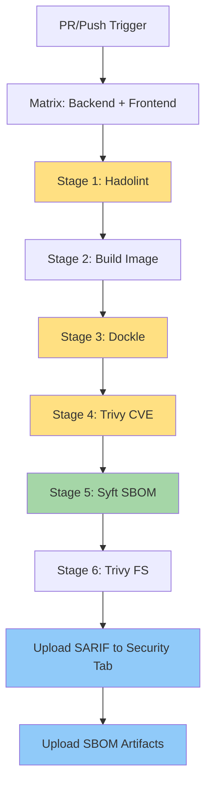

# 🔒 CI/CD Security Pipeline

## Overview

The security pipeline (`03-build-secure.yml`) implements comprehensive security scanning for all Docker images, following defense-in-depth principles. This workflow ensures production-grade security posture through multiple layers of validation.

## Architecture



## Security Scanning Layers

### Layer 1: Dockerfile Security (Hadolint)

**Purpose**: Validate Dockerfile best practices and security

**Tool**: [Hadolint](https://github.com/hadolint/hadolint)

**Checks**:
- Dockerfile syntax and best practices
- Security vulnerabilities in instructions
- Image layer optimization
- MAINTAINER deprecation warnings
- COPY vs ADD usage
- Root user detection

**Output**: SARIF format uploaded to GitHub Security tab

**Example Findings**:
```dockerfile
# ❌ Bad - Running as root
USER root
RUN apt-get update

# ✅ Good - Non-root user
USER appuser
RUN apt-get update --no-install-recommends
```

### Layer 2: Container Image Security (Dockle)

**Purpose**: Scan built container images for security best practices

**Tool**: [Dockle](https://github.com/goodwithtech/dockle)

**Checks**:
- CIS Docker Benchmark compliance
- Sensitive information detection (credentials, keys)
- Image configuration security
- File permissions and ownership
- Exposed ports validation
- Health check presence

**Output**: SARIF format with severity levels (FATAL, WARN, INFO)

**Example Findings**:
- `CIS-DI-0001`: Create a user for the container (WARN)
- `CIS-DI-0005`: Enable Content trust for Docker (INFO)
- `CIS-DI-0006`: Add HEALTHCHECK instruction (WARN)

### Layer 3: Vulnerability Scanning (Trivy)

**Purpose**: Detect known vulnerabilities (CVEs) in dependencies

**Tool**: [Trivy](https://github.com/aquasecurity/trivy)

**Scan Types**:
1. **Image Scan**: Vulnerabilities in OS packages and application dependencies
2. **Filesystem Scan**: Vulnerabilities in source code dependencies

**Severity Levels**:
- 🔴 **CRITICAL**: Immediate action required, blocks merges
- 🟠 **HIGH**: Should be fixed before production
- 🟡 **MEDIUM**: Fix in next release cycle
- 🟢 **LOW**: Nice to have, not blocking

**Output**:
- SARIF format for GitHub Security tab
- Table format for quick review in CI logs

**Configuration**:
```yaml
severity: 'CRITICAL,HIGH,MEDIUM'
exit-code: '1'  # Fail on CRITICAL CVEs
ignore-unfixed: true  # Only show fixable vulnerabilities
```

**Example Finding**:
```
CVE-2024-1234 (CRITICAL)
Package: openssl 1.1.1
Fixed Version: 1.1.1w
CVSS: 9.8
```

### Layer 4: SBOM Generation (Syft)

**Purpose**: Create Software Bill of Materials for supply chain security

**Tool**: [Syft](https://github.com/anchore/syft)

**Format**: SPDX JSON (industry standard)

**Includes**:
- All OS packages
- Application dependencies
- Transitive dependencies
- License information
- Package versions and sources

**Retention**: 90 days as workflow artifacts

**Use Cases**:
- Supply chain vulnerability tracking
- License compliance audits
- Dependency inventory
- Vulnerability correlation across builds

**Example SBOM Entry**:
```json
{
  "name": "requests",
  "version": "2.31.0",
  "licenseDeclared": "Apache-2.0",
  "originator": "Organization: Python Software Foundation"
}
```

## Workflow Triggers

### Pull Request
Runs on PRs targeting `main` when paths match:
- `backend/**`
- `frontend/**`
- `docker-compose*.yml`
- `.github/workflows/03-build-secure.yml`

### Push to Main
Runs on every push to `main` branch for baseline security metrics

### Scheduled Scan
**Cron**: `17 18 * * 2` (Every Tuesday at 6:17 PM UTC)

**Purpose**: Weekly CVE checks to catch newly disclosed vulnerabilities

**Rationale**: New CVEs are published daily. Weekly scans ensure images remain secure even without code changes.

### Manual Trigger
Available via `workflow_dispatch` for on-demand security validation

## SARIF Integration

### What is SARIF?

Static Analysis Results Interchange Format - industry standard for security findings

### GitHub Integration

All security findings are uploaded to the **Security** tab:

1. Navigate to repository **Security** tab
2. Click **Code scanning alerts**
3. Filter by:
   - Tool (Hadolint, Dockle, Trivy)
   - Severity (Critical, High, Medium, Low)
   - Service (backend, frontend)

### Benefits

- ✅ Centralized security dashboard
- ✅ Historical tracking of vulnerabilities
- ✅ Automated issue creation for CRITICAL findings
- ✅ Integration with Dependabot and other security tools
- ✅ Compliance reporting

## Build Optimization

### BuildKit Caching

```yaml
cache-from: type=gha,scope=${{ matrix.service }}
cache-to: type=gha,mode=max,scope=${{ matrix.service }}
```

**Benefits**:
- 🚀 Faster builds (reuse layers)
- 💾 Reduced bandwidth
- ♻️ Separate cache per service

**Cache Scope**:
- `backend`: Python dependencies, OS packages
- `frontend`: Node modules, build artifacts

### Cache Invalidation

Cache automatically invalidates when:
- Dockerfile changes
- Dependency files change (`pyproject.toml`, `package.json`)
- Base image updates

## Failure Modes

### Non-Blocking Scans

Most scans report findings but **don't fail the build**:
- ✅ Hadolint warnings
- ✅ Dockle warnings
- ✅ Trivy HIGH/MEDIUM vulnerabilities

**Rationale**: Enable incremental security improvements without blocking development

### Blocking Scans

Only **CRITICAL CVEs** fail the build:
```yaml
exit-code: '1'  # Fail on CRITICAL
severity: 'CRITICAL'
```

**Rationale**: CRITICAL vulnerabilities pose immediate risk and must be addressed

## Security Best Practices

### 1. Dockerfile Hardening

```dockerfile
# Use specific versions, not 'latest'
FROM python:3.12.1-slim

# Create non-root user
RUN groupadd -r appuser && useradd -r -g appuser appuser

# Install only what's needed
RUN apt-get update && apt-get install -y --no-install-recommends \
    libpq5 \
    && rm -rf /var/lib/apt/lists/*

# Drop privileges
USER appuser

# Add healthcheck
HEALTHCHECK --interval=30s --timeout=3s --start-period=5s --retries=3 \
    CMD curl -f http://localhost:8000/health || exit 1
```

### 2. Dependency Management

**Python (backend)**:
```toml
# pyproject.toml - Pin major versions
dependencies = [
    "fastapi ^0.104.0",  # Allow minor/patch updates
    "sqlalchemy ^2.0.0",
]
```

**JavaScript (frontend)**:
```json
{
  "dependencies": {
    "react": "^18.2.0"
  }
}
```

### 3. SBOM Review

**Quarterly Process**:
1. Download latest SBOMs
2. Review dependency licenses
3. Identify outdated packages
4. Plan dependency upgrades

### 4. Vulnerability Response

**CRITICAL CVE Process**:
1. Alert triggered in Security tab
2. Review CVE details and fix availability
3. Update dependency to fixed version
4. Re-run security scan
5. Verify fix in SARIF results

## Performance Metrics

### Expected Duration

| Stage | Duration | Parallel |
|-------|----------|----------|
| Hadolint | ~10s | ✅ Yes |
| Build | 3-5 min | ✅ Yes |
| Dockle | ~20s | ✅ Yes |
| Trivy (Image) | 1-2 min | ✅ Yes |
| Syft | ~30s | ✅ Yes |
| Trivy (FS) | ~45s | ✅ Yes |
| **Total** | **6-8 min** | (per service) |

**Matrix Parallelization**: Backend and frontend scans run simultaneously

### Resource Usage

- **Disk**: ~2GB per service (cached layers)
- **Memory**: ~4GB peak (Trivy database)
- **Network**: ~500MB (security databases)

## Troubleshooting

### Common Issues

#### 1. Hadolint Failures

**Issue**: DL3008 - Pin versions in apt-get install

**Fix**:
```dockerfile
# ❌ Bad
RUN apt-get install -y libpq-dev

# ✅ Good
RUN apt-get install -y libpq-dev=14.5-0+deb11u1
```

#### 2. Dockle Warnings

**Issue**: CIS-DI-0001 - Running as root

**Fix**:
```dockerfile
# Add before CMD/ENTRYPOINT
USER appuser
```

#### 3. Trivy CRITICAL CVEs

**Issue**: CVE in base image

**Fix**:
```dockerfile
# Update base image to latest patch version
FROM python:3.12.1-slim  # Instead of 3.12.0-slim
```

#### 4. SARIF Upload Failures

**Issue**: Permission denied

**Fix**: Ensure workflow has correct permissions:
```yaml
permissions:
  contents: read
  security-events: write
```

## Maintenance

### Weekly Tasks

- ✅ Review Security tab for new findings
- ✅ Update dependency versions for fixable CVEs
- ✅ Monitor SBOM for license compliance

### Monthly Tasks

- ✅ Review and update security scanning tools
- ✅ Audit false positives and configure ignores
- ✅ Update base images to latest patches

### Quarterly Tasks

- ✅ Comprehensive SBOM review
- ✅ Dependency upgrade planning
- ✅ Security policy review

## Compliance

### Standards Met

- ✅ **CIS Docker Benchmark** (via Dockle)
- ✅ **NIST Cybersecurity Framework** (vulnerability management)
- ✅ **OWASP Docker Security** (best practices)
- ✅ **SBOM** (Executive Order 14028 compliance)

### Reporting

Security metrics available:
- GitHub Security tab (SARIF alerts)
- Workflow summary (scan coverage)
- SBOM artifacts (supply chain)

## References

- [Hadolint Rules](https://github.com/hadolint/hadolint#rules)
- [Dockle Checkpoints](https://github.com/goodwithtech/dockle/blob/master/CHECKPOINT.md)
- [Trivy Documentation](https://aquasecurity.github.io/trivy/)
- [Syft SBOM Formats](https://github.com/anchore/syft#supported-formats)
- [GitHub Code Scanning](https://docs.github.com/en/code-security/code-scanning)

---

**Next**: [CI/CD Testing Strategy](ci-cd-testing-strategy.md) | **Previous**: [Lint Matrix Strategy](ci-cd-lint-matrix.md)
