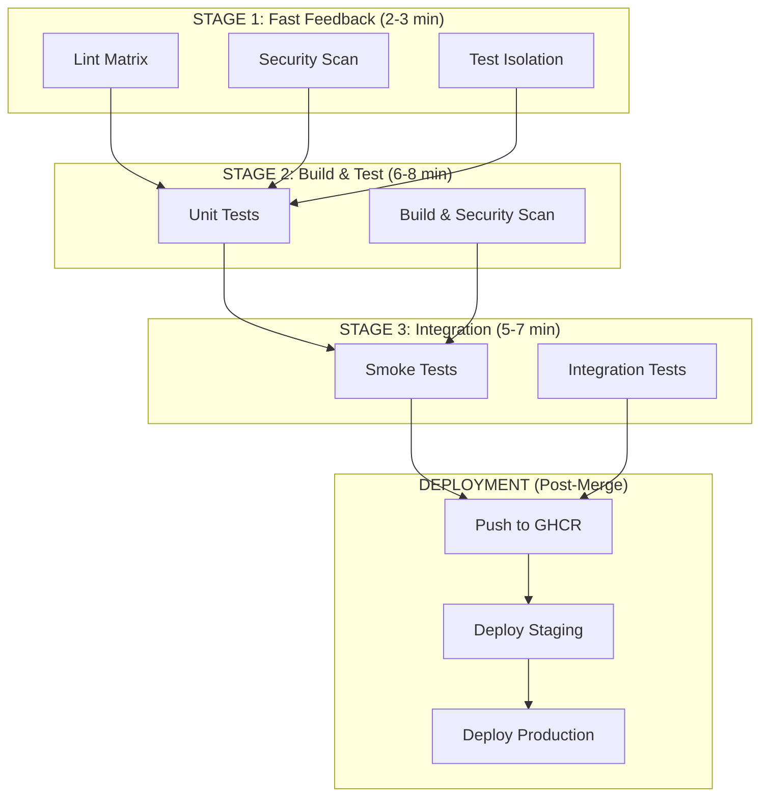

# CI/CD Pipeline Overview

!!! info "Current Status"
    **Phase 1 Implementation**: Lint Matrix & Workflow Optimization
    **Status**: 🔄 In Progress
    **Last Updated**: October 6, 2025

## Introduction

RAG Modulo's CI/CD pipeline ensures code quality, security, and reliability through automated testing, linting, security scanning, and deployment validation.

The pipeline is designed with these principles:

- **Build Once, Test Everywhere** - No duplicate builds
- **Fast Feedback First** - Cheap checks before expensive operations
- **Separation of Concerns** - One workflow, one purpose
- **Matrix for Visibility** - Parallel jobs show individual failures
- **Security-First** - Comprehensive scanning at every stage

---

## Architecture Overview



---

## Workflow Structure

```
.github/workflows/
├── 01-lint.yml                 # ✅ Matrix linting (Stage 1)
├── 02-test-unit.yml            # 🔄 Unit tests (Stage 2)
├── 03-build-secure.yml         # 🔄 Secure build (Stage 2)
├── 04-integration.yml          # 🔄 Integration tests (Stage 3)
├── 05-deploy.yml               # 🔄 Deployment (Post-merge)
└── specialized/
    ├── dev-environment-ci.yml  # ✅ Dev container validation
    ├── makefile-testing.yml    # ✅ Makefile validation
    ├── codespace-testing.yml   # ✅ Codespace validation
    ├── security.yml            # ✅ Secret scanning
    └── claude-review.yml       # ✅ AI code review
```

**Legend**:

- ✅ Implemented and operational
- 🔄 Planned/In Progress
- 📝 Future enhancement

---

## Current Workflows

### Stage 1: Fast Feedback

#### 01-lint.yml ✅ (New)

**Purpose**: Parallel linting with matrix strategy

**Benefits**:

- ✅ 10 linters run in parallel (~2-3 min total)
- ✅ Each linter visible in GitHub UI
- ✅ Fail-fast disabled (see all failures)
- ✅ Easy retry of individual linters

**Linters**:

| Category | Linters | Purpose |
|----------|---------|---------|
| **Config Files** | yamllint, jsonlint, toml-check | Configuration validation |
| **Python** | ruff check, ruff format, mypy, pylint, pydocstyle | Code quality & types |
| **Frontend** | eslint, prettier | JavaScript/TypeScript quality |

**Triggers**: All PRs to `main`, pushes to `main`

[Learn more →](lint-matrix.md)

#### security.yml ✅

**Purpose**: Secret scanning

**Tools**: Gitleaks, TruffleHog
**Frequency**: Every PR

#### test-isolation ✅

**Purpose**: Atomic tests without dependencies

**Frequency**: Every PR

---

### Stage 2: Build & Test

#### ci.yml ✅ (Current)

**Purpose**: Main CI/CD pipeline

**Jobs**:

- Lint (monolithic - being replaced by 01-lint.yml)
- Unit tests (Python 3.12, 60% coverage)
- Build Docker images
- Publish to GHCR (on merge to main)

**Next**: Will be split into 02-test-unit.yml and 03-build-secure.yml

#### 02-test-unit.yml 🔄 (Planned)

**Purpose**: Unit testing with coverage

- Python 3.12 only
- 80% coverage requirement
- Branch coverage measurement
- Coverage artifacts (XML + HTML)

[Learn more →](testing.md)

#### 03-build-secure.yml 🔄 (Planned)

**Purpose**: Secure Docker build pipeline

**Security Tools**:

1. **Hadolint** - Dockerfile linting → SARIF
2. **Dockle** - Container image security → SARIF
3. **Trivy** - CVE scanning (CRITICAL/HIGH) → SARIF
4. **Syft** - SBOM generation → Artifact
5. **Cosign** - Image signing (main branch only)

[Learn more →](security-pipeline.md)

---

### Stage 3: Integration

#### 04-integration.yml 🔄 (Planned)

**Purpose**: End-to-end validation

**Suites**:

- **Smoke Tests** (2-3 min): Health endpoints, critical APIs
- **Integration Tests** (5-7 min): Full stack validation

[Learn more →](integration-tests.md)

---

### Specialized Workflows

#### dev-environment-ci.yml ✅

**Purpose**: Dev container validation

**Triggers**: Only on `.devcontainer/`, `docker-compose.dev.yml`, `docker-compose.hotreload.yml` changes

**What It Tests**:

- Dev container JSON validation
- Docker compose configuration
- Development image builds

#### makefile-testing.yml ✅

**Purpose**: Makefile target validation

**Triggers**: Only on `Makefile` changes (✅ Fixed in Phase 1)

**Previously**: Ran on every backend/test change (wasteful)
**Now**: Only runs when Makefile changes

#### codespace-testing.yml ✅

**Purpose**: GitHub Codespaces validation

#### claude-review.yml ✅

**Purpose**: AI-powered code review

---

## Performance Metrics

### Before Optimization

| Metric | Value | Issue |
|--------|-------|-------|
| Workflows per PR | 9 | Some duplicate |
| CI Time | 17+ minutes | Slow feedback |
| Build Count | 2 per PR | Duplicate builds |
| Disk Failures | Common | No space left |
| Visibility | Poor | Monolithic lint |

### After Phase 1 (Target)

| Metric | Target | Improvement |
|--------|--------|-------------|
| Workflows per PR | 6-7 focused | Clearer purpose |
| CI Time | 10-12 minutes | ~40% faster |
| Build Count | 1 per PR | 50% reduction |
| Disk Failures | Rare | Cleanup + cache |
| Visibility | Excellent | Matrix strategy |

---

## Implementation Roadmap

### ✅ Phase 1: Foundation (Week 1)

**Goal**: Eliminate duplicate builds, improve visibility

**Tasks**:

- [x] Fix dev-environment-ci triggers (PR #323)
- [x] Add disk cleanup (PR #323)
- [x] Fix log file tracking (PR #326)
- [x] Create 01-lint.yml with matrix strategy
- [x] Fix makefile-testing.yml triggers
- [ ] Add BuildKit caching to ci.yml
- [ ] Track metrics on 5 PRs

**Status**: 🔄 In Progress

### 🔄 Phase 2: Security (Week 2)

**Goal**: Comprehensive security scanning

**Tasks**:

- [ ] Create 03-build-secure.yml
- [ ] Add Hadolint + Dockle
- [ ] Add Trivy CVE scanning
- [ ] Add Syft SBOM generation
- [ ] Configure SARIF uploads
- [ ] Add weekly CVE cron
- [ ] Increase coverage to 65%

### 📝 Phase 3: Testing (Week 3)

**Goal**: Comprehensive test coverage

**Tasks**:

- [ ] Create smoke test suite
- [ ] Create 04-integration.yml
- [ ] Basic integration tests
- [ ] Increase coverage to 70%

### 📝 Phase 4: Advanced (Week 4+)

**Goal**: Excellence and automation

**Tasks**:

- [ ] Increase coverage to 80%
- [ ] Full integration test matrix
- [ ] Cosign image signing
- [ ] E2E tests (optional)
- [ ] Deployment automation

---

## Quick Links

- [Lint Matrix Strategy](lint-matrix.md) - Matrix linting implementation
- [Security Pipeline](security-pipeline.md) - Comprehensive security scanning
- [Testing Strategy](testing.md) - Unit and integration testing
- [Integration Tests](integration-tests.md) - End-to-end validation
- [Troubleshooting](troubleshooting.md) - Common CI/CD issues

---

## Related Documentation

- [Development Workflow](../workflow.md) - Local development practices
- [Testing Guide](../../testing/index.md) - Testing strategy and practices
- [Deployment](../../deployment/index.md) - Production deployment
- [Contributing](../contributing.md) - How to contribute

---

## References

**Inspiration**: [IBM MCP Context Forge](https://github.com/IBM/mcp-context-forge) - Production-grade CI/CD with 2.6k⭐

**Key Learnings Applied**:

- ✅ Separate workflows by concern
- ✅ Matrix strategy for parallel execution
- ✅ Comprehensive security pipeline
- ✅ Build once, test everywhere
- ✅ Fail-fast: false for visibility

**Adaptations for RAG Modulo**:

- 🔧 Python 3.12 only (not 3.11+3.12 - we use 3.12-specific features)
- 🔧 Application-specific test strategy
- 🔧 3-stage pipeline optimized for our stack

---

!!! tip "Contributing to CI/CD"
    See [Issue #324](https://github.com/manavgup/rag_modulo/issues/324) for the complete implementation plan and progress tracking.

