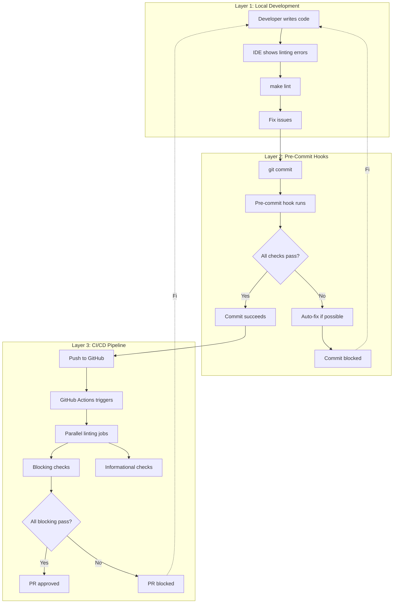

# Code Quality Standards

## Overview

RAG Modulo enforces consistent code quality through **centralized linting configuration** across all development environments. This ensures that code quality checks are identical whether you're developing locally, running pre-commit hooks, or in CI/CD pipelines.

## 🎯 Design Principle: Single Source of Truth

All linting configurations reference a **central configuration file** to maintain consistency:

```
┌─────────────────────────────────────────────────────────────┐
│                    SINGLE SOURCE OF TRUTH                   │
│                                                             │
│  Backend: backend/pyproject.toml                           │
│  Frontend: frontend/.eslintrc.json                         │
│            frontend/.prettierrc.json                       │
└─────────────────────────────────────────────────────────────┘
                              │
                              │ Referenced by
                              │
        ┌─────────────────────┼─────────────────────┐
        │                     │                     │
        ▼                     ▼                     ▼
  ┌──────────┐         ┌──────────┐         ┌──────────┐
  │  Local   │         │   Pre-   │         │  CI/CD   │
  │   Dev    │         │  Commit  │         │ Pipeline │
  └──────────┘         └──────────┘         └──────────┘
```

## 📊 Linting Tool Versions (Updated: 2025-10-08)

| Tool | Version | Purpose | Blocking |
|------|---------|---------|----------|
| **Ruff** | 0.14.0 | Python linting & formatting | ✅ Yes |
| **MyPy** | 1.15.0 | Python type checking | ⚠️ Informational |
| **Pylint** | 3.3.8+ | Python code quality | ⚠️ Informational |
| **Pydocstyle** | 6.3.0+ | Python docstring style | ⚠️ Informational |
| **ESLint** | (react-app) | TypeScript/JavaScript linting | ✅ Yes |
| **Prettier** | Latest | Code formatting | ✅ Yes |

## 🏗️ Architecture: Three Enforcement Layers



## 🔍 Backend Python Linting Rules

### Configuration Location
**Central Config**: `backend/pyproject.toml`

### Scope
All Python files in:
- ✅ `backend/rag_solution/` (main application)
- ✅ `backend/vectordbs/` (vector database abstractions)
- ✅ `backend/core/` (core utilities)
- ✅ `backend/auth/` (authentication)
- ✅ `backend/tests/` (test suite)

### Ruff Configuration

```toml
[tool.ruff]
target-version = "py312"
line-length = 120

[tool.ruff.lint]
select = [
    "E",    # pycodestyle errors
    "F",    # pyflakes
    "I",    # isort (import sorting)
    "W",    # pycodestyle warnings
    "B",    # flake8-bugbear
    "C4",   # flake8-comprehensions
    "UP",   # pyupgrade
    "N",    # pep8-naming
    "Q",    # flake8-quotes
    "SIM",  # flake8-simplify
    "ARG",  # flake8-unused-arguments
    "PIE",  # flake8-pie
    "TID",  # flake8-tidy-imports
    "RUF",  # Ruff-specific rules
]

[tool.ruff.lint.isort]
known-first-party = ["rag_solution", "core", "auth", "vectordbs"]
```

### Import Sorting Rules (isort via Ruff)

Imports are sorted in this order:

```python
"""Module docstring."""

# 1. Standard library
import json
import logging
from typing import Any

# 2. Third-party libraries
from fastapi import APIRouter, Depends
from pydantic import BaseModel
from sqlalchemy.orm import Session

# 3. First-party (our code)
from core.config import Settings
from rag_solution.services.my_service import MyService
```

### Type Checking (MyPy)

```toml
[tool.mypy]
python_version = "3.12"
warn_return_any = true
warn_unused_configs = true
disallow_untyped_defs = true
```

## 🎨 Frontend TypeScript/JavaScript Linting

### Configuration Location
- **ESLint**: `frontend/.eslintrc.json`
- **Prettier**: `frontend/.prettierrc.json` (if added)

### Scope
All TypeScript and JavaScript files in:
- ✅ `frontend/src/` (React application)
- ✅ `frontend/public/` (static assets)

### ESLint Rules

```json
{
  "extends": [
    "react-app",
    "react-app/jest"
  ],
  "rules": {
    "no-console": ["warn", { "allow": ["warn", "error"] }],
    "no-unused-vars": "warn",
    "@typescript-eslint/no-unused-vars": ["warn", {
      "argsIgnorePattern": "^_"
    }],
    "react-hooks/exhaustive-deps": "warn"
  }
}
```

## 🚀 Command Reference

### Local Development

```bash
# Backend linting
make lint                    # Run all backend linting
make lint-ruff              # Ruff only (fast)
make lint-mypy              # Type checking
make lint-pylint            # Code quality
make fix-all                # Auto-fix issues

# Frontend linting
cd frontend
npm run lint                # ESLint check
npm run format:check        # Prettier check
npm run format              # Auto-fix formatting
```

### Pre-Commit Hooks

```bash
# Install hooks (one-time setup)
pre-commit install

# Run manually
pre-commit run --all-files

# Run on specific files
pre-commit run --files backend/rag_solution/router/*.py

# Update hook versions
pre-commit autoupdate
```

### CI/CD Pipeline

Automatically runs on:
- All pull requests to `main`
- All pushes to `main`

Workflow: `.github/workflows/01-lint.yml`

## 📋 Linting Checklist Matrix

| Check | Layer 1: Local | Layer 2: Pre-commit | Layer 3: CI/CD | Blocking |
|-------|---------------|--------------------|--------------------|----------|
| **Backend** |
| Ruff (Lint + Format) | `make lint-ruff` | ✅ Auto-runs | ✅ Combined job | ✅ Yes |
| MyPy | `make lint-mypy` | ✅ On push only | ✅ Parallel job | ⚠️ No |
| Pylint | `make lint-pylint` | ❌ Manual | ✅ Parallel job | ⚠️ No |
| Pydocstyle | Manual | ❌ Manual | ✅ Parallel job | ⚠️ No |
| **Frontend** |
| ESLint | `npm run lint` | ✅ Auto-runs | ✅ Parallel job | ✅ Yes |
| Prettier | `npm run format:check` | ✅ Auto-runs | ✅ Parallel job | ✅ Yes |
| **Config Files** |
| YAML Lint | Manual | ✅ Auto-runs | ✅ Parallel job | ✅ Yes |
| JSON Lint | Manual | ✅ Auto-runs | ✅ Parallel job | ✅ Yes |
| TOML Lint | Manual | ✅ Auto-runs | ✅ Parallel job | ✅ Yes |

## 🔧 Configuration Files Reference

```
rag_modulo/
├── .pre-commit-config.yaml          # Pre-commit hook configuration
├── .github/workflows/
│   └── 01-lint.yml                  # CI/CD linting workflow
├── Makefile                          # Local development commands
├── backend/
│   └── pyproject.toml               # ⭐ Backend linting central config
└── frontend/
    ├── .eslintrc.json               # ⭐ Frontend ESLint config
    └── .prettierrc.json             # ⭐ Frontend Prettier config (TBD)
```

## 🎯 Blocking vs. Informational Checks

### Blocking Checks (Must Pass)
These **block PR merges** and **commits**:

- ✅ Ruff (linting + formatting combined)
- ✅ ESLint (TypeScript/JavaScript)
- ✅ Prettier (formatting)
- ✅ YAML/JSON/TOML syntax

### Informational Checks (Advisory)
These **show warnings** but **don't block**:

- ⚠️ MyPy (type checking - 150+ errors being addressed)
- ⚠️ Pylint (code quality suggestions)
- ⚠️ Pydocstyle (docstring completeness)

> **Why?** We're progressively improving type coverage and documentation. These checks provide guidance without blocking development.

## 🚨 Common Issues & Solutions

### Issue: Pre-commit hook fails but local lint passes

**Cause**: Different Ruff versions
**Solution**: Update pre-commit hooks
```bash
pre-commit autoupdate
pre-commit install --install-hooks
```

### Issue: Import order differs between local and CI

**Cause**: Missing `known-first-party` configuration
**Solution**: Ensure `backend/pyproject.toml` includes all first-party packages:
```toml
[tool.ruff.lint.isort]
known-first-party = ["rag_solution", "core", "auth", "vectordbs"]
```

### Issue: MyPy fails in CI but not locally

**Cause**: Missing type stubs or dependencies
**Solution**: Check `tool.poetry.group.dev.dependencies` includes all types-* packages

### Issue: Linting is too slow

**Solutions**:
1. Run only Ruff (fast): `make lint-ruff`
2. Skip MyPy locally: `SKIP_MYPY=1 make lint`
3. Use pre-commit on changed files only: `pre-commit run`

## 📚 Related Documentation

- [CI/CD Security](./ci-cd-security.md)
- [Development Workflow](./development-workflow.md)
- [Testing Standards](../testing/testing-standards.md)
- [Contributing Guidelines](../../CONTRIBUTING.md)

## 🔄 Version History

| Date | Version | Changes |
|------|---------|---------|
| 2025-10-08 | v2.0 | Centralized config, Ruff 0.14.0, all backend files |
| 2025-09-30 | v1.1 | Added frontend linting |
| 2025-09-01 | v1.0 | Initial linting standards |

## 🤝 Contributing

When adding new linting rules:

1. **Update central config** (`pyproject.toml` or `.eslintrc.json`)
2. **Update pre-commit hooks** (`.pre-commit-config.yaml`)
3. **Update CI/CD workflow** (`.github/workflows/01-lint.yml`)
4. **Update Makefile** (add new make targets)
5. **Update this documentation**
6. **Test all three layers** (local, pre-commit, CI/CD)

Remember: **One change, three updates!**
