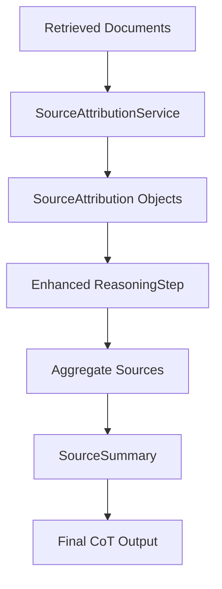

# Source Attribution in Chain of Thought

Source attribution is a critical component of the CoT system that tracks which documents and sources were used at each step of the reasoning process. This provides transparency and allows users to understand how the AI arrived at its conclusions.

## Overview

The source attribution system addresses the key question: **"How did the RAG search arrive at this answer?"**

Unlike traditional RAG systems that only show sources for the final answer, CoT source attribution provides:

- **Step-level attribution**: Which sources influenced each reasoning step
- **Relevance scoring**: How relevant each source was to each step
- **Source aggregation**: Combined view of all sources used across the reasoning chain
- **Primary source identification**: Most influential sources highlighted
- **Usage tracking**: Which steps used which sources

## Architecture

### Core Components

1. **SourceAttribution**: Individual source document metadata
2. **SourceSummary**: Aggregated source information across all steps
3. **SourceAttributionService**: Service for managing source tracking
4. **Enhanced ReasoningStep**: Reasoning steps with source attribution

### Data Flow



## Schemas

### SourceAttribution

Represents attribution for a single source document used in reasoning.

```python
class SourceAttribution(BaseModel):
    document_id: str = Field(..., description="Unique identifier for the source document")
    document_title: Optional[str] = Field(None, description="Title or name of the source document")
    relevance_score: float = Field(..., description="Relevance score for this source (0-1)")
    excerpt: Optional[str] = Field(None, description="Relevant excerpt from the source")
    chunk_index: Optional[int] = Field(None, description="Index of the chunk within the document")
    retrieval_rank: Optional[int] = Field(None, description="Rank in the retrieval results")
```

**Field Details:**

- **document_id**: Unique identifier (e.g., "doc_12345", "pdf_section_3")
- **document_title**: Human-readable title for display
- **relevance_score**: 0.0-1.0 score indicating source relevance to the reasoning step
- **excerpt**: First 200 characters of relevant content
- **chunk_index**: For chunked documents, which chunk was used
- **retrieval_rank**: Original ranking from vector search (1-based)

### SourceSummary

Aggregated view of all sources used across the entire reasoning chain.

```python
class SourceSummary(BaseModel):
    all_sources: List[SourceAttribution] = Field(default_factory=list, description="All unique sources used")
    primary_sources: List[SourceAttribution] = Field(default_factory=list, description="Most influential sources")
    source_usage_by_step: Dict[int, List[str]] = Field(default_factory=dict, description="Sources used by each step")
```

**Aggregation Logic:**

- **all_sources**: Deduplicated list of all sources, sorted by relevance
- **primary_sources**: Top 3 sources with relevance > 0.7, or top 3 overall
- **source_usage_by_step**: Maps step numbers to lists of document IDs used

### Enhanced ReasoningStep

Standard ReasoningStep enhanced with source attribution:

```python
class ReasoningStep(BaseModel):
    # ... existing fields ...
    source_attributions: List[SourceAttribution] = Field(default_factory=list, description="Structured source attributions")
    context_used: List[str] = Field(default_factory=list, description="Context documents used (legacy)")
```

## SourceAttributionService

### Key Methods

#### `create_source_attribution()`

Creates structured source attribution objects:

```python
def create_source_attribution(
    self,
    document_id: str,
    relevance_score: float,
    document_title: Optional[str] = None,
    excerpt: Optional[str] = None,
    chunk_index: Optional[int] = None,
    retrieval_rank: Optional[int] = None,
) -> SourceAttribution
```

**Example Usage:**
```python
attribution = service.create_source_attribution(
    document_id="ml_handbook_ch3",
    relevance_score=0.85,
    document_title="Machine Learning Handbook - Chapter 3",
    excerpt="Machine learning algorithms can be categorized into supervised...",
    chunk_index=2,
    retrieval_rank=1
)
```

#### `extract_sources_from_context()`

Extracts source attributions from context documents or search results:

```python
def extract_sources_from_context(
    self,
    context_documents: List[str],
    search_results: Optional[List[Dict[str, Any]]] = None,
) -> List[SourceAttribution]
```

**Two Modes of Operation:**

1. **Structured Search Results** (preferred):
```python
search_results = [
    {
        "document_id": "doc_123",
        "title": "Introduction to AI",
        "score": 0.92,
        "content": "Artificial intelligence involves...",
        "chunk_index": 0
    }
]
attributions = service.extract_sources_from_context([], search_results)
```

2. **Raw Context Strings** (fallback):
```python
context_docs = [
    "id:doc_123 Artificial intelligence involves creating systems...",
    "Machine learning is a subset of AI that..."
]
attributions = service.extract_sources_from_context(context_docs)
```

#### `aggregate_sources_across_steps()`

Combines source attributions from all reasoning steps:

```python
def aggregate_sources_across_steps(
    self, reasoning_steps: List[ReasoningStep]
) -> SourceSummary
```

**Aggregation Process:**

1. **Collect all sources** from each reasoning step
2. **Deduplicate sources** by document_id, keeping highest relevance score
3. **Identify primary sources** (relevance > 0.7 or top 3)
4. **Track step-by-step usage** for each source

#### `enhance_reasoning_step_with_sources()`

Adds source attributions to reasoning steps:

```python
def enhance_reasoning_step_with_sources(
    self,
    step: ReasoningStep,
    retrieved_documents: Optional[List[Dict[str, Any]]] = None,
) -> ReasoningStep
```

**Enhancement Process:**

1. Extract sources from retrieved documents or step context
2. Create SourceAttribution objects
3. Attach attributions to the reasoning step
4. Return enhanced step

### Caching and Deduplication

The service includes built-in caching to avoid duplicate processing:

```python
def __init__(self) -> None:
    self._source_cache: Dict[str, SourceAttribution] = {}

# Cache for deduplication
self._source_cache[document_id] = attribution
```

## Integration with CoT Pipeline

### During Reasoning Step Execution

```python
async def execute_reasoning_step(self, step_number: int, question: str, context: list[str], previous_answers: list[str]) -> ReasoningStep:
    # ... reasoning logic ...

    # Create basic reasoning step
    step = ReasoningStep(
        step_number=step_number,
        question=question,
        context_used=full_context[:5],
        intermediate_answer=intermediate_answer,
        confidence_score=confidence_score,
        reasoning_trace=f"Step {step_number}: Analyzing {question}",
        execution_time=time.time() - start_time
    )

    # Enhance with source attributions
    enhanced_step = self.source_attribution_service.enhance_reasoning_step_with_sources(
        step=step,
        retrieved_documents=None  # TODO: Pass actual retrieved documents
    )

    return enhanced_step
```

### During Final Synthesis

```python
async def execute_chain_of_thought(self, cot_input: ChainOfThoughtInput, context_documents: list[str] | None = None) -> ChainOfThoughtOutput:
    # ... execute reasoning steps ...

    # Generate source summary
    source_summary = self.source_attribution_service.aggregate_sources_across_steps(reasoning_steps)

    return ChainOfThoughtOutput(
        original_question=cot_input.question,
        final_answer=final_answer,
        reasoning_steps=reasoning_steps,
        source_summary=source_summary,  # Include aggregated sources
        # ... other fields ...
    )
```

## Display and User Interface

### Formatted Output for UI

The service provides UI-friendly formatting:

```python
def format_sources_for_display(
    self, source_summary: SourceSummary, include_excerpts: bool = True
) -> Dict[str, Any]:
    """Format sources for user-friendly display."""
    return {
        "total_sources": len(source_summary.all_sources),
        "primary_sources": [
            {
                "document_id": source.document_id,
                "title": source.document_title or source.document_id,
                "relevance": round(source.relevance_score, 2),
                "excerpt": source.excerpt if include_excerpts else None
            }
            for source in source_summary.primary_sources
        ],
        "step_breakdown": {
            f"step_{step_num}": {
                "step_number": step_num,
                "sources_used": len(doc_ids),
                "document_ids": doc_ids
            }
            for step_num, doc_ids in source_summary.source_usage_by_step.items()
        }
    }
```

### Example UI Output

```json
{
  "total_sources": 5,
  "primary_sources": [
    {
      "document_id": "ml_guide_ch1",
      "title": "Machine Learning Guide - Chapter 1",
      "relevance": 0.92,
      "excerpt": "Machine learning algorithms fall into three main categories..."
    },
    {
      "document_id": "dl_paper_2023",
      "title": "Deep Learning Advances 2023",
      "relevance": 0.87,
      "excerpt": "Recent advances in deep learning have shown significant improvements..."
    }
  ],
  "step_breakdown": {
    "step_1": {
      "step_number": 1,
      "sources_used": 3,
      "document_ids": ["ml_guide_ch1", "ai_intro", "algorithms_ref"]
    },
    "step_2": {
      "step_number": 2,
      "sources_used": 2,
      "document_ids": ["dl_paper_2023", "neural_networks"]
    }
  }
}
```

## Relevance Scoring

### Automatic Scoring

When structured search results aren't available, the system uses heuristic scoring:

```python
# Decreasing relevance by retrieval rank
relevance_score = max(0.3, 1.0 - (i * 0.1))
```

### Confidence-Based Scoring

Relevance can be adjusted based on reasoning step confidence:

```python
# Higher confidence steps get higher source relevance
adjusted_relevance = base_relevance * step.confidence_score
```

## Integration with RAG Search

### Traditional RAG vs CoT Source Attribution

**Traditional RAG:**
```python
# Shows final sources only
return SearchOutput(
    answer="Machine learning is...",
    sources=[doc1, doc2, doc3]  # Sources for final answer only
)
```

**CoT with Source Attribution:**
```python
# Shows step-by-step source usage
return SearchOutput(
    answer=cot_result.final_answer,
    sources=cot_result.source_summary.primary_sources,
    reasoning_trace=cot_result.reasoning_steps,  # Each step has its own sources
    source_breakdown=cot_result.source_summary.source_usage_by_step
)
```

### Enhanced Transparency

CoT source attribution provides:

1. **Which sources influenced which reasoning steps**
2. **How relevant each source was to each step**
3. **Which sources were most influential overall**
4. **Complete traceability from question to final answer**

## Future Enhancements

### Planned Improvements

1. **Citation Generation**: Automatic citation formatting for academic use
2. **Source Validation**: Cross-reference sources for consistency
3. **Interactive Source Exploration**: UI for drilling down into source usage
4. **Source Quality Scoring**: Evaluate source reliability and authority
5. **Conflict Detection**: Identify when sources contradict each other

### Integration Opportunities

1. **Document Versioning**: Track which version of a document was used
2. **Real-time Updates**: Update attributions when source documents change
3. **User Feedback**: Allow users to rate source relevance
4. **A/B Testing**: Compare source attribution strategies

## Testing and Validation

### Unit Tests

The source attribution system includes comprehensive tests:

```python
def test_source_extraction_from_context():
    service = SourceAttributionService()
    context_docs = ["id:doc_123 Machine learning content...", "Deep learning overview..."]

    attributions = service.extract_sources_from_context(context_docs)

    assert len(attributions) == 2
    assert attributions[0].document_id == "doc_123"
    assert attributions[0].relevance_score > 0.3
```

### Integration Tests

End-to-end tests validate the complete source attribution pipeline:

```python
async def test_cot_with_source_attribution():
    # Execute CoT with source tracking
    result = await cot_service.execute_chain_of_thought(cot_input, context_docs)

    # Verify source attribution
    assert result.source_summary is not None
    assert len(result.source_summary.all_sources) > 0
    assert len(result.source_summary.primary_sources) <= 3

    # Verify step-level attribution
    for step in result.reasoning_steps:
        assert len(step.source_attributions) > 0
```

This comprehensive source attribution system transforms CoT from a "black box" reasoning process into a transparent, traceable, and trustworthy system where users can understand exactly how the AI arrived at its conclusions.
