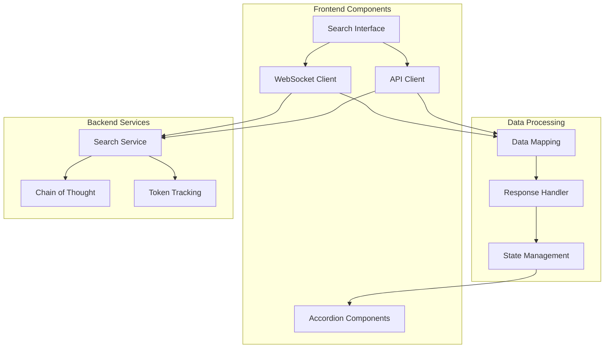

# 🎨 Frontend Interface

The RAG Modulo frontend provides an intuitive and powerful interface for interacting with your document collections through intelligent search and conversation.

## 🌟 Overview

The frontend interface is built with React and Tailwind CSS, offering a modern, responsive design that adapts to different screen sizes and provides an excellent user experience for document search and AI-powered conversations.

**Key Technologies:**
- **React 18** - Modern JavaScript framework
- **TypeScript** - Type-safe development
- **Tailwind CSS** - Utility-first CSS framework
- **Axios** - HTTP client for API communication
- **WebSocket** - Real-time communication support

---

## 🎯 Core Interface Features

### 💬 Enhanced Search Interface

The main search interface provides a chat-like experience with advanced visualizations and data presentation.

**Key Components:**
- **Interactive Chat Interface** - Conversation-style search interactions
- **Real-time Response Streaming** - Live updates as AI processes your query
- **Responsive Design** - Works seamlessly across desktop and mobile devices
- **Smart Input Handling** - Intelligent query processing and validation

### 📋 Interactive Accordions

The interface uses sophisticated accordion components to organize and display three types of critical information:

#### 🔍 Document Sources Accordion
Displays the source documents that contributed to each AI response:

**Features:**
- **Document Name Resolution** - Shows actual document names instead of IDs
- **Page Attribution** - Displays specific page numbers where information was found
- **Content Preview** - Shows relevant text chunks from each source
- **Visual Hierarchy** - Clear organization with document titles and content
- **Overflow Protection** - Proper text wrapping with CSS classes

**Technical Implementation:**
- Handles both `sources` and `query_results` API response formats
- Maps document IDs to human-readable names
- Displays up to 5 most relevant sources
- Uses Tailwind CSS for responsive design and text handling

#### 📊 Token Usage Tracking
Real-time display of token consumption and cost monitoring:

**Features:**
- **Current Usage** - Shows tokens used in the current request
- **Usage Limits** - Displays configured token limits
- **Percentage Indicators** - Visual representation of usage levels
- **Warning System** - Color-coded alerts for different usage levels
- **Cost Estimation** - Helps users understand the cost implications

**Warning Levels:**
- 🟢 **Info** (0-50%) - Normal usage levels
- 🟡 **Warning** (51-80%) - Approaching limits
- 🔴 **Critical** (81-100%) - Near or at token limits

#### 🧠 Chain of Thought Reasoning
Transparent display of AI reasoning processes:

**Features:**
- **Step-by-Step Breakdown** - Shows how the AI arrived at its answer
- **Reasoning Visualization** - Clear presentation of each thinking step
- **Source Attribution per Step** - Tracks which sources informed each step
- **Final Synthesis** - Shows how individual steps combine into the final answer
- **Expandable Details** - Users can dive deeper into the reasoning process

---

## 🔧 Technical Architecture

### 🌐 Communication Patterns

The frontend implements a robust communication strategy with multiple fallback mechanisms:

#### Primary: REST API
- **Search Endpoint** - `/api/search` for standard search requests
- **Collections API** - Full CRUD operations for document collections
- **User Management** - Authentication and user profile management
- **Admin Functions** - System configuration and monitoring

#### Fallback: WebSocket
- **Real-time Updates** - Live response streaming
- **Connection Status** - Real-time connection monitoring
- **Automatic Reconnection** - Handles network interruptions gracefully
- **Typing Indicators** - Shows when AI is processing requests

### 📡 Data Flow Architecture



### 🔄 Data Mapping Strategy

The frontend implements sophisticated data mapping to handle multiple API response formats:

**Source Data Handling:**
- **Primary Source**: `query_results` array with chunk-level data
- **Secondary Source**: `documents` array with document-level data
- **Fallback Strategy**: `sources` array for backward compatibility

**Document Name Resolution:**
```typescript
// Enhanced document name resolution
const docIdToNameMap = new Map<string, string>();
if (searchResponse.documents && searchResponse.documents.length > 0) {
  const uniqueDocIds = Array.from(new Set(
    searchResponse.query_results.map(r => r.chunk.document_id)
  ));
  uniqueDocIds.forEach((docId, index) => {
    if (searchResponse.documents && index < searchResponse.documents.length) {
      const doc = searchResponse.documents[index];
      if (doc && doc.document_name) {
        docIdToNameMap.set(docId, doc.document_name);
      }
    }
  });
}
```

---

## 🎨 User Experience Features

### 📱 Responsive Design

The interface adapts seamlessly to different screen sizes and devices:

**Desktop Experience:**
- **Full Layout** - Complete sidebar, main content, and accordions
- **Multi-column Layout** - Optimal use of screen real estate
- **Keyboard Shortcuts** - Enhanced productivity features
- **Detailed Visualizations** - Full token and reasoning displays

**Mobile Experience:**
- **Condensed Layout** - Optimized for touch interactions
- **Collapsible Sections** - Space-efficient accordion design
- **Touch-friendly Controls** - Properly sized buttons and input areas
- **Progressive Disclosure** - Information revealed as needed

### 🎯 Smart Data Display

The interface intelligently presents information based on context and user needs:

**Adaptive Content:**
- **Automatic Document Name Resolution** - Shows meaningful names instead of IDs
- **Page Number Attribution** - Precise source location tracking
- **Content Relevance Scoring** - Prioritizes most relevant information
- **Visual Hierarchy** - Clear information organization

**Text Handling:**
- **Overflow Protection** - `break-words` and `min-w-0` CSS classes
- **Proper Wrapping** - Text flows naturally within containers
- **Responsive Typography** - Scales appropriately across devices
- **Loading States** - Clear feedback during data processing

---

## 🔌 Integration Features

### 🔐 Authentication Integration

Seamless integration with the backend authentication system:

**Features:**
- **Token Management** - Automatic JWT token handling
- **Session Persistence** - Maintains login state across browser sessions
- **Automatic Refresh** - Handles token renewal transparently
- **Logout Handling** - Clean session termination

### 📊 Real-time Monitoring

Live updates and monitoring capabilities:

**Connection Status:**
- **Visual Indicators** - Clear connection state display
- **Automatic Reconnection** - Handles network interruptions
- **Error Recovery** - Graceful fallback to REST API
- **Performance Metrics** - Response time and success rate tracking

### 🚀 Performance Optimization

The frontend implements several optimization strategies:

**Loading Optimization:**
- **Lazy Loading** - Components load as needed
- **Data Caching** - Intelligent caching of API responses
- **Debounced Inputs** - Prevents excessive API calls
- **Progressive Enhancement** - Core functionality works without JavaScript

**Memory Management:**
- **Component Cleanup** - Proper event listener removal
- **State Optimization** - Minimal state updates
- **Resource Management** - Efficient handling of WebSocket connections
- **Error Boundaries** - Prevents cascading failures

---

## 🛠️ Development Features

### 🔧 Developer Experience

Built with developer productivity in mind:

**Type Safety:**
- **TypeScript Integration** - Full type checking across the application
- **Interface Definitions** - Clear API contract definitions
- **Runtime Validation** - Ensures data integrity
- **IDE Support** - Excellent autocomplete and error detection

**Debugging Support:**
- **Comprehensive Logging** - Detailed debug information
- **Component DevTools** - React DevTools integration
- **Network Inspection** - Clear API request/response logging
- **Error Tracking** - Detailed error reporting and stack traces

### 🧪 Testing Integration

Comprehensive testing support:

**Testing Capabilities:**
- **Component Testing** - Unit tests for React components
- **Integration Testing** - End-to-end user workflows
- **API Mocking** - Isolated testing without backend dependencies
- **Visual Regression** - Ensures UI consistency across changes

---

## 🚀 Getting Started

### Quick Setup

To explore the frontend interface features:

1. **Start the Development Environment:**
   ```bash
   cd rag-modulo
   make dev-up
   ```

2. **Access the Interface:**
   - Open http://localhost:3000 in your browser
   - Login with your credentials or use the demo mode

3. **Try the Features:**
   - Upload a document collection
   - Perform a search query
   - Explore the accordion displays
   - Monitor token usage in real-time

### Configuration

The frontend can be customized through environment variables:

```bash
# API Configuration
REACT_APP_BACKEND_URL=http://localhost:8000
REACT_APP_WS_URL=ws://localhost:8000/ws

# Feature Flags
REACT_APP_ENABLE_COT=true
REACT_APP_ENABLE_TOKEN_TRACKING=true
REACT_APP_ENABLE_WEBSOCKET=true
```

---

## 📚 Related Documentation

- **[🧠 Chain of Thought](chain-of-thought/index.md)** - AI reasoning features
- **[📊 Token Tracking](token-tracking.md)** - Usage monitoring
- **[🔍 Search & Retrieval](search-retrieval.md)** - Search capabilities
- **[🛠️ Development Guide](../development/index.md)** - Development setup
- **[📚 API Reference](../api/index.md)** - Backend API documentation

---

<div align="center">

**Experience the power of intelligent document search** 🚀

[🚀 Quick Start](../getting-started.md) • [🎯 Live Demo](http://localhost:3000) • [🛠️ Development](../development/index.md)

</div>
