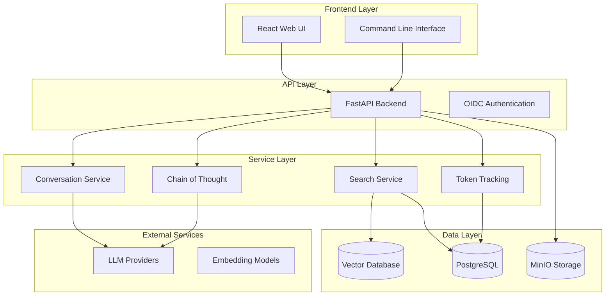

# Welcome to RAG Modulo

<div align="center">


**A robust, customizable Retrieval-Augmented Generation (RAG) solution with advanced AI capabilities**

[](https://opensource.org/licenses/MIT)
[](https://www.python.org/downloads/)
[](https://www.docker.com/)
[](https://fastapi.tiangolo.com/)

</div>

---

## 🎯 What is RAG Modulo?

RAG Modulo is a production-ready Retrieval-Augmented Generation platform that provides enterprise-grade document processing, intelligent search, and AI-powered question answering. Built with modern technologies and designed for scalability, it supports multiple vector databases, LLM providers, and document formats.

### ✨ Key Features

<div class="grid cards" markdown>

-   :material-brain:{ .lg .middle } **Advanced AI**

    ---

    Chain of Thought reasoning, token tracking, and multi-LLM provider support

    [:octicons-arrow-right-24: Learn more](features/index.md)

-   :material-magnify:{ .lg .middle } **Intelligent Search**

    ---

    Vector similarity search with hybrid strategies and source attribution

    [:octicons-arrow-right-24: Learn more](features/search-retrieval.md)

-   :material-monitor:{ .lg .middle } **Interactive Frontend**

    ---

    Modern React interface with accordion displays for sources, reasoning, and token tracking

    [:octicons-arrow-right-24: Learn more](features/frontend-interface.md)

-   :material-cog:{ .lg .middle } **Flexible Architecture**

    ---

    Service-based design with repository pattern and dependency injection

    [:octicons-arrow-right-24: Learn more](architecture/index.md)

-   :material-rocket-launch:{ .lg .middle } **Production Ready**

    ---

    Docker containerized with CI/CD pipeline and comprehensive testing

    [:octicons-arrow-right-24: Learn more](deployment/production.md)

</div>

---

## 🚀 Quick Start

Get up and running with RAG Modulo in minutes:

=== "Docker (Recommended)"

    ```bash
    # Clone the repository
    git clone https://github.com/manavgup/rag-modulo.git
    cd rag-modulo

    # Set up environment
    cp env.example .env
    # Edit .env with your API keys

    # Start with pre-built images
    make run-ghcr
    ```

=== "Local Development"

    ```bash
    # Initialize development environment
    make dev-init

    # Build and start development environment
    make dev-build
    make dev-up

    # Validate everything is working
    make dev-validate
    ```

=== "GitHub Codespaces"

    1. **Go to repository** → "Code" → "Codespaces"
    2. **Click "Create codespace"** on your branch
    3. **Start coding** in browser-based VS Code!

### 🌐 Access Points

| Service | URL | Description |
|:---:|:---:|:---:|
| **Frontend** | http://localhost:3000 | React web interface |
| **Backend API** | http://localhost:8000 | FastAPI backend |
| **MLFlow** | http://localhost:5001 | Experiment tracking |
| **MinIO Console** | http://localhost:9001 | Object storage |

---

## 📊 Current Status

<div align="center">

| Component | Status | Progress |
|:---:|:---:|:---:|
| **🏗️ Infrastructure** | ✅ Complete | 95% |
| **🧪 Testing** | ✅ Excellent | 92% (847/918 tests) |
| **🚀 Core Services** | ✅ Operational | 90% |
| **📚 Documentation** | ✅ Comprehensive | 90% |
| **🔧 Development** | ✅ Streamlined | 85% |

</div>

---

## 🏗️ Architecture Overview

RAG Modulo follows a modern, service-based architecture with clear separation of concerns:



---

## 🧪 Testing & Quality

### Test Results

| Category | Tests | Status | Coverage |
|:---:|:---:|:---:|:---:|
| **⚡ Atomic Tests** | 100+ | ✅ Excellent | 9% |
| **🏃 Unit Tests** | 83 | ✅ Good | 5% |
| **🔗 Integration Tests** | 43 | ✅ Complete | N/A |
| **🌐 E2E Tests** | 22 | 🔄 In Progress | N/A |
| **🔌 API Tests** | 21 | 🔄 In Progress | 48% |

### Quick Commands

```bash
# Run all tests
make test-all

# Quick quality checks
make quick-check

# Code quality
make lint

# Security scanning
make security-check
```

---

## 🛠️ Development Workflow

### Development Commands

| Command | Description |
|:---:|:---|
| `make dev-init` | Initialize development environment |
| `make dev-build` | Build local development images |
| `make dev-up` | Start development environment |
| `make dev-restart` | Rebuild and restart with latest changes |
| `make dev-down` | Stop development environment |
| `make dev-status` | Show development environment status |
| `make dev-validate` | Validate development environment health |

### Benefits

- ✅ **Local builds by default** - No more remote image confusion
- ✅ **Automatic environment setup** - Development variables configured
- ✅ **Fast iteration** - Changes visible immediately
- ✅ **Health validation** - Know when everything is working
- ✅ **Consistent workflow** - Same setup for all developers

---

## 📚 Documentation Structure

### 🚀 Getting Started
- [Quick Start](getting-started.md) - Get up and running quickly
- [Installation](installation.md) - Detailed installation guide
- [Configuration](configuration.md) - Environment setup and configuration
- [First Steps](first-steps.md) - Your first RAG query

### 🛠️ Development
- [Development Workflow](development/workflow.md) - Development best practices
- [Environment Setup](development/environment-setup.md) - Local development setup
- [GitHub Codespaces](development/codespaces.md) - Cloud development
- [Contributing](development/contributing.md) - How to contribute

### 🧪 Testing
- [Test Strategy](testing/strategy.md) - Testing approach and philosophy
- [Running Tests](testing/running.md) - How to run tests
- [Test Categories](testing/categories.md) - Understanding test types

### 🚀 Deployment
- [Production Deployment](deployment/production.md) - Production setup
- [Cloud Deployment](deployment/cloud.md) - Cloud deployment options
- [Kubernetes](deployment/kubernetes.md) - K8s deployment
- [Monitoring](deployment/monitoring.md) - Production monitoring

### 🖥️ CLI
- [CLI Overview](cli/index.md) - Command-line interface
- [Commands](cli/commands/index.md) - Available commands
- [Examples](cli/examples.md) - CLI usage examples

### 📚 API Reference
- [API Overview](api/index.md) - API documentation
- [Endpoints](api/endpoints.md) - Available endpoints
- [Schemas](api/schemas.md) - Data schemas
- [Examples](api/examples.md) - API usage examples

### 🏗️ Architecture
- [Architecture Overview](architecture/index.md) - System architecture
- [Components](architecture/components.md) - System components
- [Data Flow](architecture/data-flow.md) - Data flow diagrams
- [Security](architecture/security.md) - Security considerations

### 🧠 Features
- [Features Overview](features/index.md) - All features
- [Chain of Thought](features/chain-of-thought/index.md) - Reasoning capabilities
- [Token Tracking](features/token-tracking.md) - Usage monitoring
- [Search & Retrieval](features/search-retrieval.md) - Search capabilities

---

## 🤝 Contributing

We welcome contributions! Please see our [Contributing Guide](development/contributing.md) for details.

### Quick Contribution

1. **Fork and Clone** the repository
2. **Create Feature Branch** from main
3. **Make Changes** following our guidelines
4. **Run Tests** and ensure they pass
5. **Submit Pull Request** with clear description

---

## 📈 Roadmap

### ✅ Phase 1: Foundation (Completed)
- [x] Comprehensive test infrastructure (847 tests passing)
- [x] Core services operational
- [x] Development workflow streamlined
- [x] CI/CD pipeline automated

### 🔄 Phase 2: Optimization (Current)
- [ ] Fix remaining 71 test failures
- [ ] Performance optimization
- [ ] Code quality enhancement
- [ ] Documentation improvements

### 🚀 Phase 3: Production (Next)
- [ ] Production deployment guides
- [ ] Monitoring and observability
- [ ] Security hardening
- [ ] Performance tuning

### 🔮 Phase 4: Advanced Features (Future)
- [ ] Agentic AI enhancement
- [ ] Advanced reasoning capabilities
- [ ] Multi-modal support
- [ ] Enterprise features

---

## 🆘 Need Help?

### Getting Support

1. **📚 Documentation**: Check our comprehensive guides
2. **🐛 Issues**: [Report bugs](https://github.com/manavgup/rag_modulo/issues)
3. **💬 Discussions**: [Ask questions](https://github.com/manavgup/rag_modulo/discussions)
4. **🔧 Troubleshooting**: [Common issues](troubleshooting/common-issues.md)

---

## 📄 License

This project is licensed under the **MIT License** - see the [LICENSE](https://github.com/manavgup/rag_modulo/blob/main/LICENSE) file for details.

---

<div align="center">

**Made with ❤️ by the RAG Modulo Team**

[](https://github.com/manavgup/rag_modulo)
[](https://hub.docker.com/r/ragmodulo/backend)
[](https://www.python.org/)

</div>
