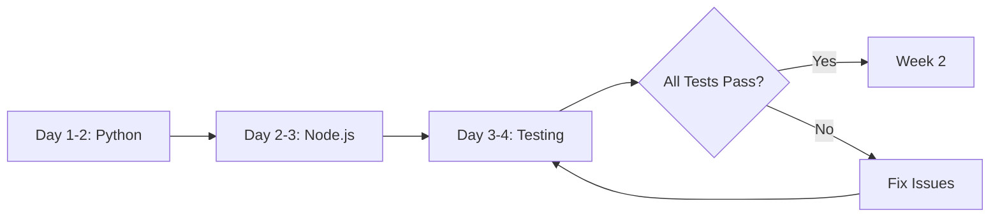
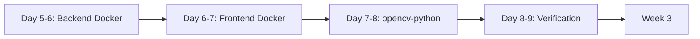
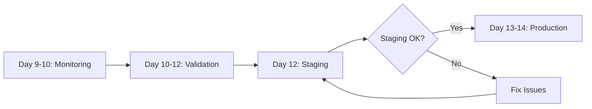

# Security Remediation Summary

**Repository:** <https://github.com/manavgup/rag_modulo>
**Status:** 🔴 HIGH RISK → 🟢 LOW RISK
**Timeline:** 2-3 weeks
**Last Updated:** 2025-11-25

---

## Quick Overview

### Current State

```
🔴 CRITICAL: 15 vulnerabilities
🟡 HIGH:     20+ vulnerabilities
🔵 MEDIUM:   45+ vulnerabilities
━━━━━━━━━━━━━━━━━━━━━━━━━━━━━━
   TOTAL:    80+ vulnerabilities
```

### Target State

```
🟢 CRITICAL: 0 vulnerabilities
🟢 HIGH:     0-2 vulnerabilities (mitigated)
🟢 MEDIUM:   <10 vulnerabilities (system libs)
━━━━━━━━━━━━━━━━━━━━━━━━━━━━━━
   TOTAL:    <12 vulnerabilities
```

---

## 10-Phase Remediation Plan

### 🚨 Phase 1-3: Critical Fixes (Week 1)

**Priority:** P0 - IMMEDIATE
**Duration:** 3-4 days

#### Phase 1: Python Backend (Day 1-2)

- Update `starlette` to ≥0.41.3 (fixes DoS)
- Update `authlib` to ≥1.3.3 (fixes auth bypass)
- **Impact:** Resolves 4 critical CVEs

#### Phase 2: Node.js Frontend (Day 2-3)

- Update `glob` to ≥10.3.10 (fixes command injection)
- Update `js-yaml` to ≥4.1.0 (fixes YAML parsing)
- Update `webpack-dev-server` to ≥5.0.4 (fixes info disclosure)
- **Impact:** Resolves 7 critical CVEs

#### Phase 3: Testing & Validation (Day 3-4)

- Run comprehensive test suites
- Validate authentication flows
- Security scanning
- **Impact:** Ensures no regressions

**Week 1 Result:** 🔴 15 Critical → 🟢 0 Critical

---

### 🔧 Phase 4-7: Infrastructure Updates (Week 2)

**Priority:** P1-P2 - HIGH/MEDIUM
**Duration:** 4-5 days

#### Phase 4: Backend Docker (Day 5-6)

- Update to `python:3.12-slim-bookworm`
- Upgrade system packages
- **Impact:** Resolves 20+ system library CVEs

#### Phase 5: Frontend Docker (Day 6-7)

- Update to `node:20-alpine3.19`
- Update to `nginx:alpine3.19`
- **Impact:** Resolves BusyBox, curl vulnerabilities

#### Phase 6: opencv-python Fix (Day 7-8)

- Replace with `opencv-python-headless`
- **Impact:** Resolves 7+ FFmpeg CVEs

#### Phase 7: System Libraries (Day 8-9)

- Verify all base image updates
- Document remaining vulnerabilities
- **Impact:** Addresses remaining low-severity issues

**Week 2 Result:** 🟡 20+ High → 🟢 0-2 High

---

### 🛡️ Phase 8-10: Monitoring & Deployment (Week 3)

**Priority:** P0-P1 - CRITICAL/HIGH
**Duration:** 4-6 days

#### Phase 8: Security Monitoring (Day 9-10)

- Enable Dependabot
- Add security scanning workflow
- Install pre-commit hooks
- **Impact:** Prevents future vulnerabilities

#### Phase 9: Validation (Day 10-12)

- Comprehensive testing
- Performance validation
- Security sign-off
- **Impact:** Ensures production readiness

#### Phase 10: Deployment (Day 12-14)

- Deploy to staging
- Validate and approve
- Deploy to production
- Monitor post-deployment
- **Impact:** Secure system in production

**Week 3 Result:** 🔵 45+ Medium → 🟢 <10 Medium

---

## Key Vulnerabilities Resolved

### Critical (P0)

| CVE | Component | Impact | Phase |
|-----|-----------|--------|-------|
| CVE-2025-62727 | Starlette | DoS | 1 |
| CVE-2025-59420 | Authlib | Auth Bypass | 1 |
| CVE-2025-61920 | Authlib | DoS | 1 |
| CVE-2025-62706 | Authlib | Security | 1 |
| CVE-2025-64756 | glob | Command Injection | 2 |
| CVE-2025-9951 | FFmpeg | Buffer Overflow | 6 |
| CVE-2023-49502 | FFmpeg | Code Execution | 6 |

### High (P1)

| CVE | Component | Impact | Phase |
|-----|-----------|--------|-------|
| CVE-2025-64718 | js-yaml | YAML Parsing | 2 |
| CVE-2025-30359 | webpack-dev-server | Info Disclosure | 2 |
| CVE-2024-58251 | BusyBox | Network Attack | 5 |
| CVE-2025-10966 | curl | Security | 5 |

---

## Execution Strategy

### Week 1: Critical Dependencies



### Week 2: Infrastructure



### Week 3: Deployment



---

## Quick Start

### For Immediate Action (Phase 1-2)

```bash
# 1. Run the automated fix script
chmod +x scripts/security/fix-critical-vulnerabilities.sh
./scripts/security/fix-critical-vulnerabilities.sh

# 2. Verify updates
poetry show starlette authlib
cd frontend && npm list glob js-yaml webpack-dev-server

# 3. Run tests
cd backend && poetry run pytest tests/ -v
cd frontend && npm test

# 4. Deploy to staging
# (Follow your deployment process)
```

### For Complete Remediation

See detailed instructions in:

- **[`SEQUENTIAL_REMEDIATION_PLAN.md`](./SEQUENTIAL_REMEDIATION_PLAN.md)** - Complete step-by-step guide
- **[`QUICK_START_REMEDIATION.md`](./QUICK_START_REMEDIATION.md)** - Quick start for Phase 1

---

## Resource Requirements

### Team

- 1 Senior Backend Developer (Python)
- 1 Senior Frontend Developer (Node.js)
- 1 DevOps Engineer (Docker/K8s)
- 1 QA Engineer (Testing)
- 1 Security Engineer (Review)

### Time Allocation

| Role | Week 1 | Week 2 | Week 3 | Total |
|------|--------|--------|--------|-------|
| Backend Dev | 16h | 12h | 8h | 36h |
| Frontend Dev | 12h | 12h | 8h | 32h |
| DevOps | 4h | 16h | 12h | 32h |
| QA | 8h | 8h | 16h | 32h |
| Security | 4h | 4h | 8h | 16h |
| **Total** | **44h** | **52h** | **52h** | **148h** |

---

## Risk Assessment

### Before Remediation

```
Risk Level: 🔴 HIGH
- 15 Critical vulnerabilities
- Active exploitation possible
- DoS attacks possible
- Command injection possible
- Authentication bypass possible
```

### After Remediation

```
Risk Level: 🟢 LOW
- 0 Critical vulnerabilities
- Automated monitoring active
- Regular updates scheduled
- Security best practices implemented
```

---

## Success Criteria

### Technical Metrics

- ✅ Zero critical vulnerabilities
- ✅ <5 high vulnerabilities (with mitigation)
- ✅ All tests passing (>95%)
- ✅ No performance regression
- ✅ Automated security scanning active

### Process Metrics

- ✅ Dependabot enabled
- ✅ Pre-commit hooks installed
- ✅ Security workflow in CI/CD
- ✅ Documentation complete
- ✅ Team trained

### Business Metrics

- ✅ Zero downtime deployment
- ✅ No customer impact
- ✅ Compliance requirements met
- ✅ Stakeholder approval obtained

---

## Monitoring & Maintenance

### Automated (Weekly)

- Dependabot PRs for dependency updates
- Security scans in CI/CD
- Vulnerability alerts

### Manual (Monthly)

- Review security scan results
- Update base Docker images
- Review and update documentation

### Quarterly

- Full security audit
- Penetration testing (if applicable)
- Team security training

---

## Emergency Contacts

### Escalation Path

1. **Development Team Lead** - First response
2. **Security Team Lead** - Security issues
3. **CTO/Engineering Director** - Critical decisions

### Support Channels

- **Security Issues:** <security@example.com>
- **Technical Issues:** <devops@example.com>
- **On-Call:** +1-XXX-XXX-XXXX

---

## Related Documents

### Planning & Analysis

- [`SECURITY_ALERT_ANALYSIS.md`](./SECURITY_ALERT_ANALYSIS.md) - Detailed vulnerability analysis
- [`SEQUENTIAL_REMEDIATION_PLAN.md`](./SEQUENTIAL_REMEDIATION_PLAN.md) - Complete remediation guide
- [`QUICK_START_REMEDIATION.md`](./QUICK_START_REMEDIATION.md) - Quick start guide

### Execution & Tracking

- [`VALIDATION_CHECKLIST.md`](./VALIDATION_CHECKLIST.md) - Progress tracking
- [`UPDATE_SCHEDULE.md`](./UPDATE_SCHEDULE.md) - Maintenance schedule
- [`REMAINING_VULNERABILITIES.md`](./REMAINING_VULNERABILITIES.md) - Post-remediation status

### Deployment

- [`STAGING_APPROVAL.md`](../deployment/STAGING_APPROVAL.md) - Staging checklist
- [`POST_DEPLOYMENT_REPORT.md`](../deployment/POST_DEPLOYMENT_REPORT.md) - Deployment report

---

## Frequently Asked Questions

### Q: Can we skip any phases?

**A:** No. Each phase builds on the previous one. Skipping phases may leave critical vulnerabilities unresolved.

### Q: What if tests fail after updates?

**A:** Each phase includes rollback procedures. Restore from backups and investigate the specific failure.

### Q: How long will this take?

**A:** 2-3 weeks with a dedicated team. Phase 1-2 (critical fixes) can be completed in 3-4 days.

### Q: Will there be downtime?

**A:** No. The deployment strategy uses rolling updates with zero downtime.

### Q: What about future vulnerabilities?

**A:** Phase 8 implements automated monitoring with Dependabot and security scanning to catch new vulnerabilities early.

---

**Document Version:** 1.0
**Last Updated:** 2025-11-25
**Next Review:** 2025-12-09
**Status:** 📋 Planning Complete - Ready for Execution
